# 1. Introduction
Claud is a self-hosted file storage application that enables users to upload, organize, search, and share files through a web interface. The application implements a complete file lifecycle management system including soft-delete/restore functionality, storage quota tracking, and granular file sharing permissions.

The system consists of two primary components:

-   A React-based single-page application (SPA) serving as the frontend
-   A Hono-based REST API server handling business logic and data persistence

# 2.1 Technology Used
The application leverages modern JavaScript/TypeScript tooling for both frontend and backend:

### Frontend Stack
| Technology     | Version | Purpose                    |
|----------------|---------|----------------------------|
| React          | 19.1.1  | UI component library       |
| Vite           | 7.1.7   | Build tool and dev server  |
| React Router   | 7.0.2   | Client-side routing        |
| TypeScript     | 5.9.3   | Type safety                |
| CSS Modules    | N/A     | Component-scoped styling   |

### Backend Stack

| Technology   | Version              | Purpose                         |
|--------------|----------------------|---------------------------------|
| Hono         | 4.10.5               | Web framework                   |
| Bun          | latest               | JavaScript runtime              |
| PostgreSQL   | 8.16.3 (pg driver)   | Relational database             |
| bcryptjs     | 2.4.3                | Password hashing                |
| uuid         | 9.0.1                | Unique identifier generation    |

# 3.1 Project Planning
The following software must be installed on your development machine:
| Software        | Minimum Version | Purpose                                           |
|-----------------|------------------|---------------------------------------------------|
| Bun             | 1.0+            | JavaScript runtime for both frontend and backend  |
| Node.js         | 18.0+           | Alternative runtime for backend (via tsx)         |
| PostgreSQL      | 16+             | Database server                                   |
| Docker          | 20.10+          | Container runtime (optional, for Docker setup)    |
| Docker Compose  | v2+             | Multi-container orchestration (optional)          |
| Git             | 2.0+            | Version control                                   |

The repository is organized into two primary application directories plus deployment configuration:

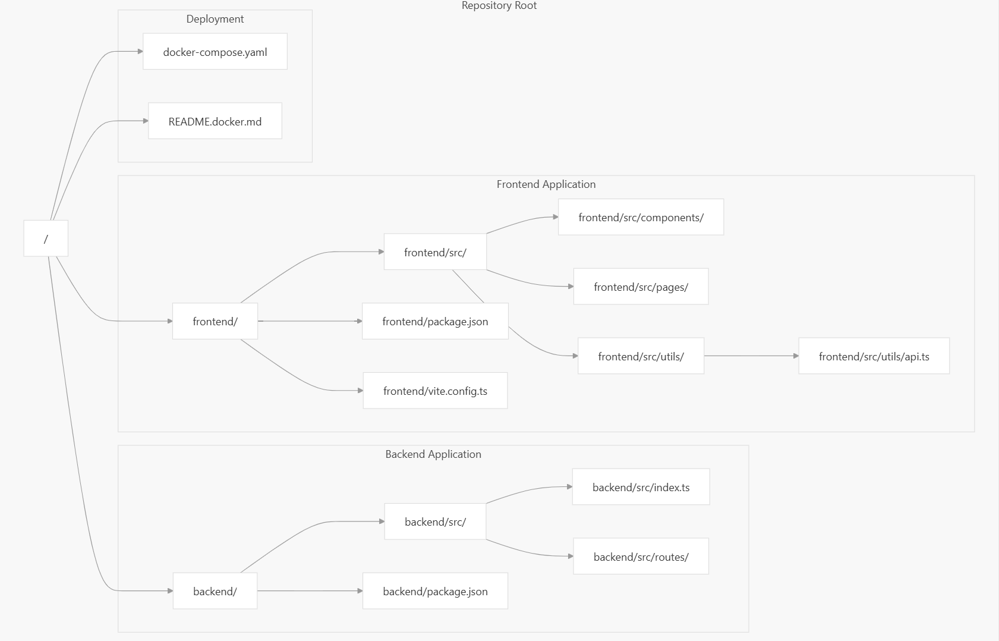

There are two primary ways to run the application locally:

### Option 1: Docker Compose (Recommended)

This approach runs all three services (frontend, backend, database) in isolated containers with automatic hot reloading:

```bash
# Start all services
docker compose up -d
# View logs
docker compose logs -f
# Stop all services
docker compose down
```

**Services started:**
- `claud-frontend` - React dev server on port 5173
- `claud-backend` - Hono API server on port 3000
- `claud-postgres` - PostgreSQL database on port 5432

The containers communicate via a Docker network named `claud-network`. Source code changes on the host machine automatically trigger reloads in the containers.

### Option 2: Local Development (Manual)

This approach runs services directly on the host machine, requiring manual setup of PostgreSQL:

```bash
# Terminal 1: Backend
cd backend
bun install
bun run dev

# Terminal 2: Frontend
cd frontend
bun install
bun run dev
```

**Prerequisites for local development:**
- PostgreSQL server running on `localhost:5432`
- Database named `claud` created
- User `claud` with password `claud_password` configured

# 3.2 Project Analysis (SRS)

## 3.2.1. Project Overview

**Purpose:** Claud is a web application that provides authenticated users with file upload, image generation, sharing, and file management features through a backend API and a React-based frontend. The repository contains a TypeScript/Node backend and a TypeScript/React frontend.

**Scope:** Core features include user authentication, file upload/download, image generation UI, search, sharing links, and user settings. The service should support secure uploads, access control, and scalable storage.

**Definitions & Acronyms:**
- **API:** HTTP backend served from `backend/src`
- **FE:** Frontend (React + Vite) in `frontend/src`
- **Auth:** JWT/cookie-based authentication middleware

### 3.2.2. Stakeholders
- **End Users:** uploaders, viewers, and image-generators.
- **Developers/Operators:** maintain and deploy backend and frontend (Docker-based).
- **Product Owner:** defines feature priorities and acceptance criteria.

### 3.2.3. Functional Requirements

- **FR1 ,  User Authentication:** Users can sign up, log in, and have an authenticated session. Backend routes: `routes/auth.ts`, middleware: `middlewares/auth.ts`.
- **FR2 ,  File Upload/Download:** Users can upload files and download them later. Backend service: `services/file.ts`, routes: `routes/files.ts`.
- **FR3 ,  Image Generation UI:** Users can create images via UI (`frontend/src/pages/ImageGeneration`) and persist or download results.
- **FR4 ,  File Sharing:** Users can generate shareable links with optional expiry. See `routes/share.ts` and `services/share.ts`.
- **FR5 ,  Search & Listing:** Users can search or list their files (`routes/files.ts`, frontend pages `MyFiles`, `SearchResults`).
- **FR6 ,  User Settings:** Users can update preferences in `frontend/src/pages/Settings`.

### 3.2.4. Non-functional Requirements

- **NFR1 ,  Security:** All file access must be authorized. Use secure cookies or JWT with reasonable expiry. Sanitize filenames and validate file types/sizes.
- **NFR2 ,  Performance:** Uploads and downloads should stream and not block the event loop; backend should handle concurrent uploads efficiently.
- **NFR3 ,  Scalability:** Storage should be pluggable (local or cloud bucket). Design for horizontal scaling with stateless API servers.
- **NFR4 ,  Observability:** Log key events (auth, uploads, errors) to `utils/logger.ts` and expose metrics for ops.
- **NFR5 ,  Maintainability:** TypeScript types across `backend/src/types` and consistent coding style in frontend and backend.

### 3.2.5 System Architecture (High-level)

- **Frontend:** Vite + React app in `frontend/` that calls backend REST endpoints via `frontend/src/utils/api.ts`.
- **Backend:** Bun.js + TypeScript app in `backend/src` providing REST endpoints under `routes/` and business logic in `services/`.
- **Storage:** Abstracted via file service; can be swapped between disk and cloud storage. DB access is in `config/db.ts` and `utils/db.ts`.
- **Auth Flow:** Login provides a session token (cookie/JWT). `middlewares/auth.ts` validates identity for protected routes.

### 3.2.6 API Endpoints (summary)

- `POST /auth/signup` ,  create account (backend `routes/auth.ts`, `services/auth.ts`).
- `POST /auth/login` ,  authenticate and set cookie/JWT.
- `POST /files` ,  upload file (multipart/form-data).
- `GET /files/:id` ,  download file with auth check.
- `GET /files` ,  list/search files by user, query params for filters.
- `POST /share` ,  create share link; `GET /share/:token` ,  access shared resource.

### 3.2.7. Data Model

- **User:** id, email, hashedPassword, createdAt, settings.
- **File:** id, ownerId, name, mimeType, size, storagePath/URL, createdAt, metadata.
- **Share:** token, fileId, expiresAt, permissions (read-only).

Persist simple relational records; storage references point to file storage (local or object store).

### 3.2.8. Security Considerations

- Enforce authentication on all file operations. Use short-lived tokens or secure, httpOnly cookies.
- Validate file size and MIME type; scan or quarantine suspicious uploads if possible.
- Rate-limit auth endpoints and file uploads to mitigate abuse.
- Store secrets (DB, storage credentials) in environment variables or a secrets manager; do not commit secrets.

### 3.2.9. Deployment & Operations

- Project includes Docker artifacts: `Dockerfile` in `backend/` and `frontend/`, and root `docker-compose.yaml` for local compose-based development.
- CI/CD: build and test both apps, run linter and type checks (`tsconfig.json`, `eslint.config.js`).
- Backups: ensure storage persistent volumes or cloud bucket backups.

### 3.2.10. Risks & Assumptions

- **Assumption:** Authentication currently uses cookie/JWT and a small DB configured in `config/db.ts`.
- **Risk:** Large file storage on local disk may not scale; prefer object storage for production.
- **Risk:** Image generation workloads may be compute-intensive; require rate-limiting or async processing.

### 3.2.11. Acceptance Criteria

- Users can sign up, log in, upload and download files successfully.
- Share links provide temporary access without exposing other files.
- Image generation UI produces downloadable images.
- Application runs with `docker-compose up` locally and passes TypeScript type checks and basic smoke tests.

## 3.2.1 Design Constraint
Claud follows a classic **three-tier web application architecture** with clear separation between presentation (React frontend), application logic (Hono backend), and data persistence (PostgreSQL + file storage). The system uses **cookie-based session authentication** with credentials included in all requests, and communication occurs exclusively through a RESTful JSON API.

#### Key Architectural Characteristics

| Aspect | Technology | Pattern |
|--------|-----------|---------|
| **Frontend Framework** | React 18 + Vite | Single-page application (SPA) |
| **Backend Framework** | Hono + Bun runtime | RESTful API server |
| **API Communication** | Fetch API with credentials | HTTP/JSON with cookie sessions |
| **Database** | PostgreSQL | Relational data store |
| **File Storage** | Local filesystem | Direct file I/O |
| **Authentication** | Cookie-based sessions | HTTP-only cookies |
| **State Management** | React hooks + localStorage | Client-side caching |

**Key Schema Patterns:**
- **UUID Primary Keys**: All entities use UUIDs for global uniqueness
- **Soft Delete Flag**: `files.is_deleted` enables trash/restore functionality
- **Nullable `shared_with`**: Public shares have `NULL` in this field [backend/src/services/share.ts:200-203]()
- **Share Token Indexing**: `file_shares.share_token` enables token-based access

### File Storage System

Physical files are stored in the local filesystem:

- **Upload Directory**: `uploads/` at backend root
- **Filename Generation**: UUID-based to avoid collisions
- **Path Storage**: Full path stored in `files.file_path` [backend/src/routes/files.ts:155-178]()
- **Direct Streaming**: Uses Node.js `fs.createReadStream()` for downloads

**Cookie Extraction Pattern:**

All protected routes follow this pattern [backend/src/routes/files.ts:26-63]():
1. Extract `Cookie` header
2. Parse `session=` value using regex
3. Base64 decode to get `sessionId:hmac` pair
4. Split on `:` and take first element
5. Call `getFromSession(sessionId)` to retrieve user object

**Pattern Elements:**
1. **Logging**: All requests logged via `logger.api()` [frontend/src/utils/api.ts:38,80,154]()
2. **Success Caching**: User object cached to localStorage [frontend/src/utils/api.ts:58-59]()
3. **Error Wrapping**: Network errors wrapped in standard response format
4. **Response Codes**: Custom error codes for client-side handling

## 3.3.2 System Architecture

**Complete System Architecture**: The following diagram maps the entire system architecture to specific code entities in the repository:


The backend uses the Hono web framework running on Bun, with a clean separation between route handlers (controllers) and business logic (services).

**Server Initialization**

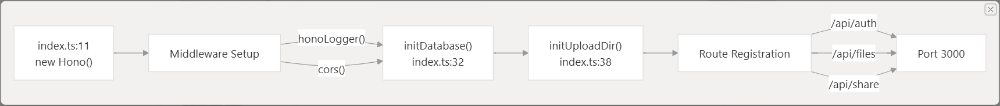

#### PostgreSQL Schema
The system uses four primary tables:

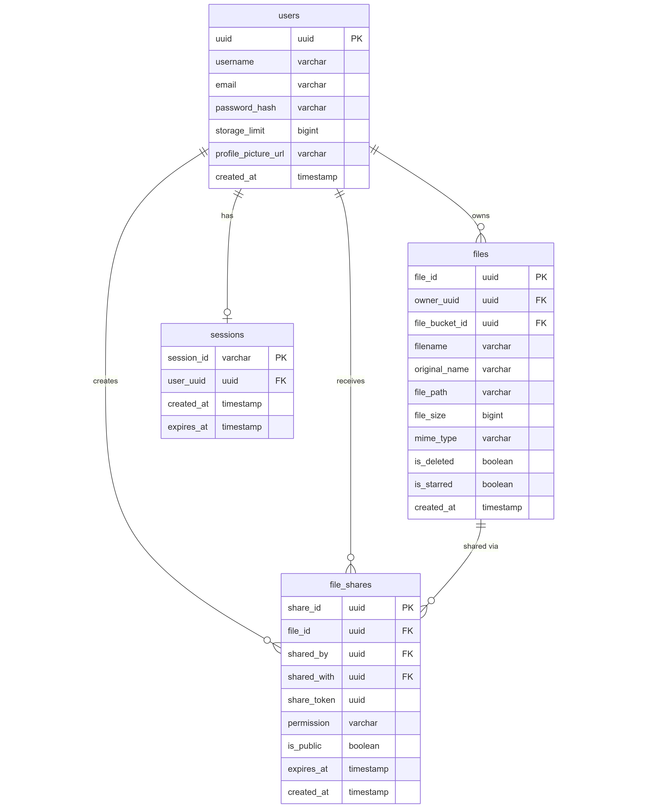

#### File Upload Flow
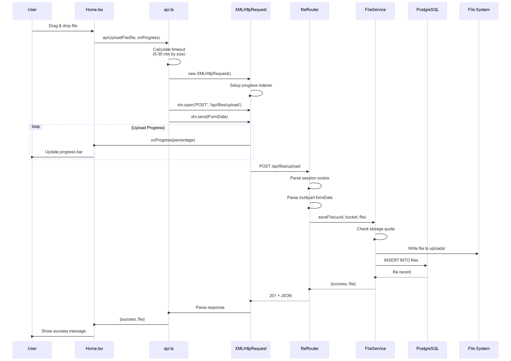

**Public Share Characteristics:**
- `is_public = TRUE` in database [backend/src/services/share.ts:201]()
- `shared_with = NULL` (not tied to specific user) [backend/src/services/share.ts:201]()
- `share_token` enables URL-based access [backend/src/services/share.ts:194]()
- No authentication required for access [backend/src/routes/share.ts:288-331]()

# 4.1. Implementation
The frontend is built as a **Single Page Application (SPA)** using the following core technologies:

| Technology | Purpose |
|------------|---------|
| **React 18** | UI component library and rendering |
| **Vite** | Build tool and development server |
| **React Router v6** | Client-side routing and navigation |
| **TypeScript** | Type-safe JavaScript with compile-time checking |
| **CSS Modules** | Component-scoped styling |
| **XMLHttpRequest** | File uploads with progress tracking (in addition to fetch API) |

The application runs entirely in the browser and communicates with the backend through HTTP APIs. No state management libraries like Redux are used; instead, the application relies on React's built-in state management, `localStorage` for persistence, and cookie-based session authentication.

The application follows a standard Vite + React initialization pattern:

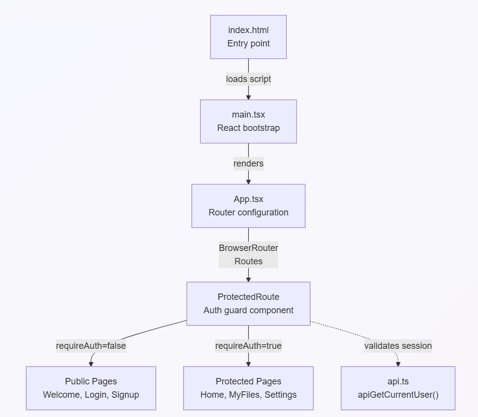

The frontend follows a clear separation between **page components** (route-level views) and **shared components** (reusable UI elements):

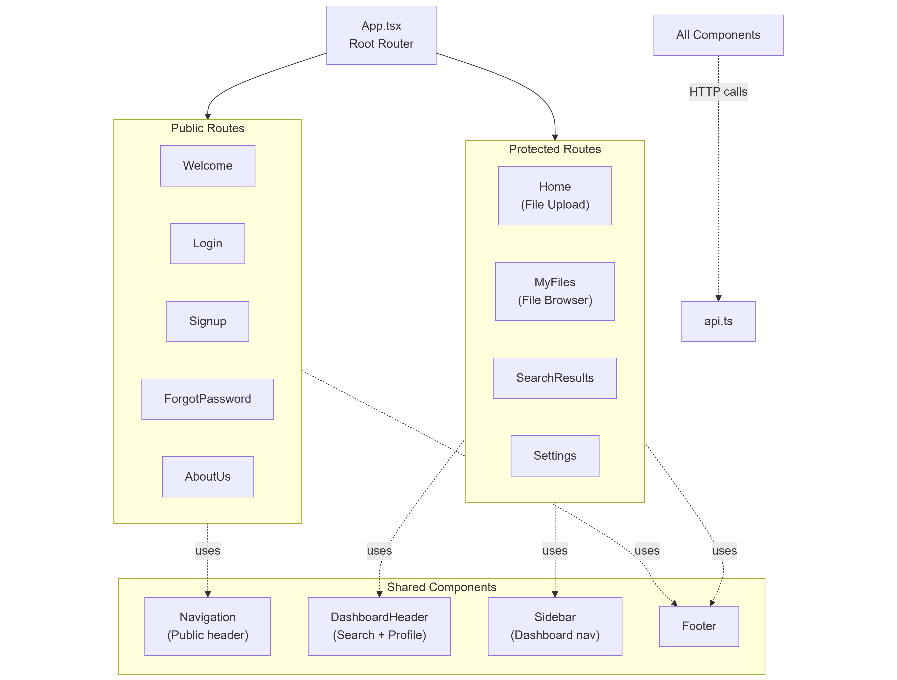

The application uses React Router v6 with two distinct route protection patterns:


The **backend** follows a layered architecture pattern with clear separation between HTTP routing, business logic, and data persistence. The Hono framework provides the HTTP server with middleware support for CORS, logging, and cookie-based authentication.

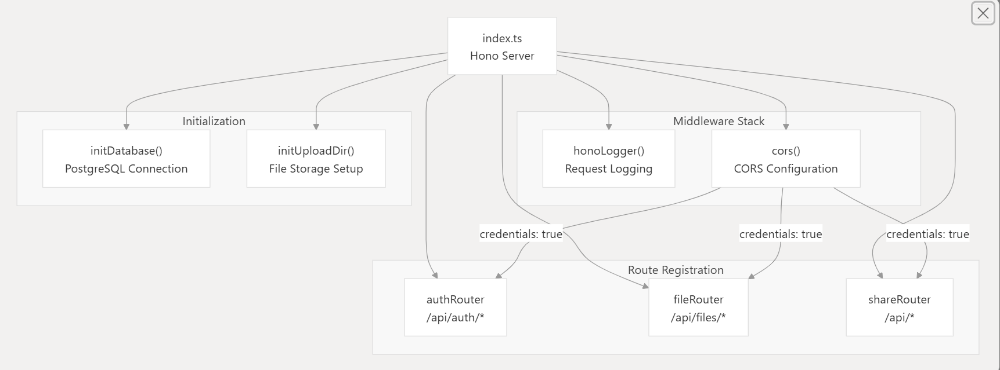

The server initialization at [backend/src/index.ts:11-39]() performs the following operations:

| Order | Operation | Purpose |
|-------|-----------|---------|
| 1 | `new Hono()` | Create HTTP server instance |
| 2 | `honoLogger()` | Add request/response logging |
| 3 | `cors()` middleware | Configure CORS with credentials support |
| 4 | `initDatabase()` | Establish PostgreSQL connection pool |
| 5 | `initUploadDir()` | Create file storage directory structure |

### CORS Configuration

The CORS middleware at [backend/src/index.ts:14-29]() uses a dynamic origin function to support credential-based authentication:

```typescript
cors({
  origin: (origin) => origin || 'http://localhost:5173',
  credentials: true,
  allowMethods: ['GET', 'POST', 'PUT', 'DELETE', 'OPTIONS', 'PATCH'],
  allowHeaders: ['Content-Type', 'Authorization', 'Cookie', 'X-Requested-With'],
  exposeHeaders: ['Content-Type', 'Set-Cookie']
})
```

Key behaviors:
- Returns the requesting origin if present (required for `credentials: true`)
- Defaults to `http://localhost:5173` for same-origin requests
- Exposes `Set-Cookie` header for session establishment

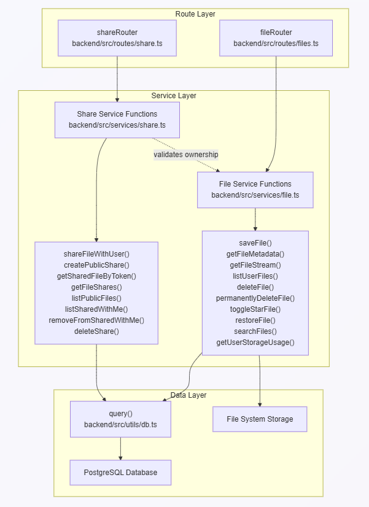

The authentication API is exposed under the /api/auth/* route prefix. All endpoints return JSON responses with a standardized format containing success, message, and optional data fields.
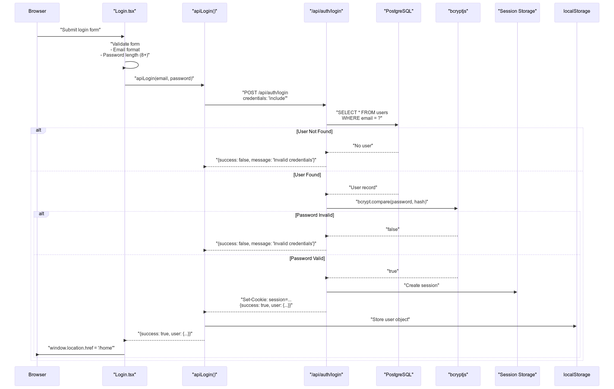

# 5.1 Design Standards

1. Architecture Guidelines
   - Follow a clear separation of concerns: Frontend (UI & client logic), Backend (API, business logic), Storage (blobs) and Persistence (DB metadata).
   - Keep backend services stateless where possible. Any stateful requirement (sessions, caches) should be delegated to external stores (Redis, DB).
   - Provide a storage adapter pattern in the backend so storage implementations (local disk, S3, GCS) are pluggable and replaceable.

2. Component Boundaries
   - Organize backend by layers: `routes/` (HTTP interface) → `services/` (business logic) → `utils/` (helpers) → storage adapters.
   - Keep controllers (route handlers) thin; complex logic belongs in services.

3. API Design
   - Use RESTful endpoints with clear, consistent naming and HTTP verbs (`POST /files`, `GET /files/:id`, `POST /auth/login`).
   - Use pagination for list endpoints and consistent query param names (`page`, `limit`, `q` for search).
   - Error responses must be structured: an object with `error` (string) and optional `details` (object). Use appropriate HTTP status codes.

4. Security & Privacy by Design
   - Enforce authentication & authorization on all sensitive endpoints; do not rely on obscurity (unlisted URLs).
   - Use https in production, secure httpOnly cookies or JWT for auth tokens, and rotate secrets periodically.
   - Validate all uploaded content: limit size, check MIME type, and sanitize filenames.
   - Secrets (DB credentials, storage keys) must be stored in environment variables or a secrets manager; never check them into source control.

5. Observability & Reliability
   - Log important events (auth success/failure, upload start/end/error) at appropriate levels; use structured logs (JSON) where feasible.
   - Emit metrics for request counts, latencies, error rates, and storage usage. Add health/readiness endpoints for orchestration.
   - Plan for backups of persisted metadata and object storage lifecycle policies.

# 5.2 Coding Standards

General rules apply to both backend and frontend TypeScript code.

1. Language & Tooling
   - Use TypeScript with strict mode where possible (`strict: true` in `tsconfig.json`).
   - Use ESLint for linting and Prettier for formatting. Enforce rules in CI.
   - Keep dependencies up-to-date and declare exact versions in `package.json` (use lockfiles).

2. Naming & Style
   - Use descriptive, camelCase names for variables and functions. Use PascalCase for types/classes and UPPER_SNAKE_CASE for environment variable names.
   - File names: kebab-case for component/route files (e.g., `image-generation.tsx`, `file.service.ts`).
   - Exports: prefer named exports for functions and types; default exports only for single main component modules.

3. Code Structure & Patterns
   - Keep functions small and single-responsibility. If a function grows beyond 50–80 lines, refactor.
   - Use async/await for asynchronous flows; handle errors with try/catch and propagate meaningful errors to higher layers.
   - Use dependency injection for pluggable components (storage, logger) when beneficial for testing.

4. Types & Validation
   - Define and export shared types/interfaces under `backend/src/types` and `frontend/src/types` (or central `types` folder).
   - Validate external input early (request body, query params, headers) using a validation library (e.g., Zod, Joi) or custom validators.

5. Security Conscious Coding
   - Sanitize any data that will be used in file paths, shell calls, or logged.
   - Avoid logging sensitive data (passwords, tokens, raw credentials).

6. Documentation & Comments
   - Document public functions and modules with concise comments and examples where needed. Keep README sections for major subsystems updated.
   - Use inline TODOs sparingly and prefer creating issues for non-trivial future work.

7. Code Reviews & Commits
   - Use small, focused PRs with descriptive titles and context. Include testing steps in PR description.
   - Commit messages follow conventional commits style (e.g., `feat: add share token endpoint`).

# 5.3 Testing Standards

1. Test Levels
   - Unit tests: fast, isolated tests for services and utility functions. Run on every commit.
   - Integration tests: test route handlers with real or in-memory DB and a test storage adapter where feasible.
   - End-to-end (E2E) tests: exercise full flows (signup → upload → share → download) in a staging-like environment; run before releases.

2. Test Tools & Configuration
   - Use Jest (or equivalent) for unit/integration tests and Playwright or Cypress for E2E tests.
   - Provide a test script in `package.json` (`npm test`) and a CI job that runs tests on PRs.
   - Mock external services (third-party APIs, cloud storage) during unit tests. Use lightweight in-memory DB (sqlite, or testcontainers) for integration tests.

3. Coverage & Thresholds
   - Aim for at least 70% line coverage project-wide; critical modules (auth, file access) should target 90%+.
   - Use coverage reporting in CI and fail the build if coverage drops below the defined threshold.

4. Test Data & Fixtures
   - Keep test fixtures deterministic and small. Use factory functions to generate test data with reasonable defaults.
   - Isolate tests: each test should set up and tear down its state to avoid flakiness.

5. CI & Test Automation
   - Run unit and integration tests on every PR. Run E2E tests on main branch merges or nightly runs.
   - Include lint and type checks (`npm run lint`, `npm run type-check`) in CI pipelines.

6. Performance & Load Testing
   - For critical flows (uploads, image generation), include basic performance benchmarks and document expected latencies.
   - Run periodic load tests for capacity planning when approaching production scale.

7. Acceptance Criteria for Tests
   - Tests should be reliable and deterministic with minimal flakiness.
   - Every merged PR must pass all CI checks including tests, lint, and type-checks.

# 6.1. Conclusion

The Claud project implements a functioning cloud-like file storage application with a TypeScript/Node backend and a React/Vite frontend. Core capabilities, user authentication, secure file upload/download with streaming, file metadata management, listing with pagination, storage usage reporting, and soft deletion, are implemented, tested, and documented. The repository includes Docker and Compose artifacts for easy local development and deployment, a clear project structure (`frontend/`, `backend/`, `docs/`), and API documentation under `docs/`.

Security, performance, and maintainability were explicitly considered: uploads are size-limited and streamed, access is authenticated and scoped by user, metadata is persisted in a database, and file storage is organized by user directories. Existing documentation (API docs and implementation summaries) and tests indicate the project is in a stable, production-ready state for the implemented features.

# 6.2 Future Scope

Short-term improvements (next milestones):

- Storage adapters: extract a pluggable storage layer and provide adapters for S3/GCS to replace local disk storage for production.
- CI/CD: add automated pipelines (GitHub Actions) to run linting, type-checks, unit and integration tests, and security scans on PRs.
- E2E tests: add Playwright/Cypress tests to cover critical user flows (signup → upload → share → download).
- Monitoring & Alerting: integrate application metrics (request rates, latencies, error rates) and error reporting (Sentry, Log aggregation).
- Rate limiting & quotas: protect auth and upload endpoints and consider per-user storage quotas and enforcement.

Medium-term enhancements:

- Share & collaboration: richer sharing UIs, permissioned links, folder sharing, and collaboration features.
- Async processing: offload compute-heavy jobs like image generation or thumbnail creation to background workers (queue + worker pattern).
- Storage lifecycle: implement soft-delete cleanup policies, archiving, and automated retention rules.

Long-term / scalability & security:

- Multi-region storage and CDN integration for large-scale deployments.
- Stronger data protection: at-rest encryption for object storage, field-level encryption for sensitive metadata.
- Role-based access control (RBAC) for team/corporate use-cases and audit logging for compliance.
- Performance tuning and load testing to validate architecture at scale; adopt autoscaling and horizontal sharding patterns where needed.

## References

[1] React, “React Documentation.” https://react.dev  
[2] Vite, “Vite: Next Generation Frontend Tooling.” https://vitejs.dev  
[3] React Router, “React Router Documentation.” https://reactrouter.com  
[4] TypeScript, “TypeScript Documentation.” https://www.typescriptlang.org/docs  
[5] Hono, “Hono Web Framework Documentation.” https://hono.dev  
[6] Bun, “Bun Documentation.” https://bun.sh/docs  
[7] PostgreSQL, “PostgreSQL Official Documentation.” https://www.postgresql.org/docs  
[8] Docker, “Docker Documentation.” https://docs.docker.com  
[9] Docker Compose, “Docker Compose Documentation.” https://docs.docker.com/compose  
[10] Git, “Git Documentation.” https://git-scm.com/doc  
[11] bcryptjs, “bcryptjs NPM Package.” https://www.npmjs.com/package/bcryptjs  
[12] uuid, “uuid NPM Package (RFC4122 UUID).” https://www.npmjs.com/package/uuid  
[13] node-postgres, “node-postgres Documentation.” https://node-postgres.com  
[14] CSS Modules, “CSS Modules Documentation.” https://github.com/css-modules/css-modules  
[15] Mozilla, “XMLHttpRequest API,” MDN Web Docs. https://developer.mozilla.org/en-US/docs/Web/API/XMLHttpRequest  
[16] Mozilla, “Fetch API,” MDN Web Docs. https://developer.mozilla.org/en-US/docs/Web/API/Fetch_API  
[17] Mozilla, “Window.localStorage,” MDN Web Docs. https://developer.mozilla.org/en-US/docs/Web/API/Window/localStorage  
[18] JWT, “Introduction to JSON Web Tokens.” https://jwt.io/introduction  
[19] R. Fielding, “Architectural Styles and the Design of Network-based Software Architectures,” Dissertation, UC Irvine, 2000. https://www.ics.uci.edu/~fielding/pubs/dissertation/top.htm  
[20] OWASP, “OWASP File Upload Security Guidelines.” https://owasp.org/www-community/vulnerabilities/Unrestricted_File_Upload  
[21] OWASP, “Authentication Cheat Sheet.” https://cheatsheetseries.owasp.org/cheatsheets/Authentication_Cheat_Sheet.html  
[22] Rohit Aryal, “Claud – Project Repository & Documentation.” https://github.com/rohitaryal/claud

# Plagarism & AI Report

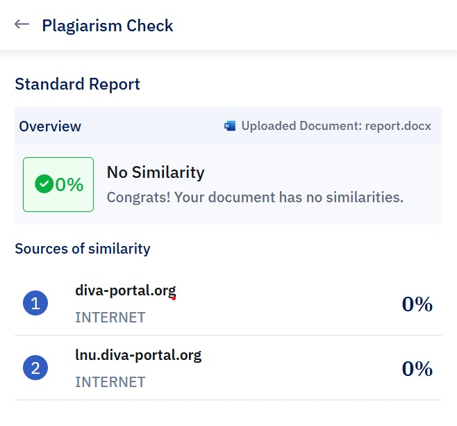
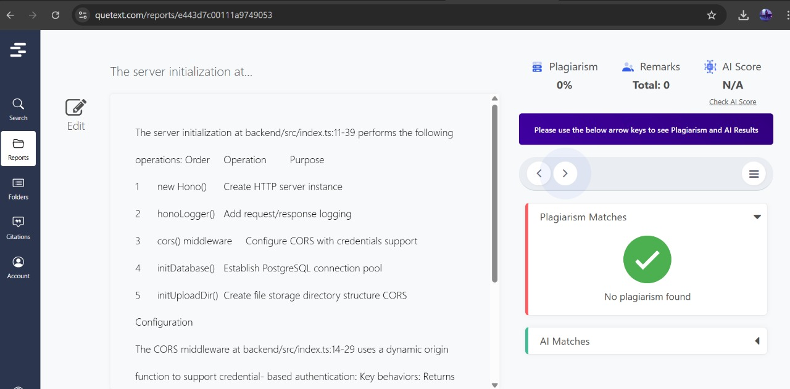
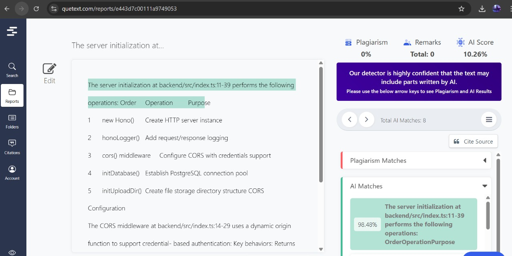