<details>
<summary>Relevant source files</summary>

The following files were used as context for generating this wiki page:

- [backend/package-lock.json](backend/package-lock.json)
- [backend/package.json](backend/package.json)
- [backend/src/index.ts](backend/src/index.ts)
- [backend/tsconfig.json](backend/tsconfig.json)
- [frontend/package-lock.json](frontend/package-lock.json)
- [frontend/src/App.tsx](frontend/src/App.tsx)

</details>


This document provides a high-level introduction to the **Claud** application, a full-stack file storage and sharing platform. It covers the system's purpose, architecture, core subsystems, and key features. For detailed information about specific subsystems, refer to the linked sections throughout this document.

**Scope**: This page describes the overall structure and capabilities of Claud at an architectural level. For setup instructions, see [Getting Started](#2). For detailed implementation of specific features, refer to [Frontend Application](#4) and [Backend API](#5).

## What is Claud?

Claud is a self-hosted file storage application that enables users to upload, organize, search, and share files through a web interface. The application implements a complete file lifecycle management system including soft-delete/restore functionality, storage quota tracking, and granular file sharing permissions.

The system consists of two primary components:
- A React-based single-page application (SPA) serving as the frontend
- A Hono-based REST API server handling business logic and data persistence

**Sources**: [frontend/src/App.tsx:1-82](), [backend/src/index.ts:1-73]()

## System Architecture

Claud implements a three-tier architecture with clear separation between presentation, application logic, and data persistence layers.

### High-Level Component Structure

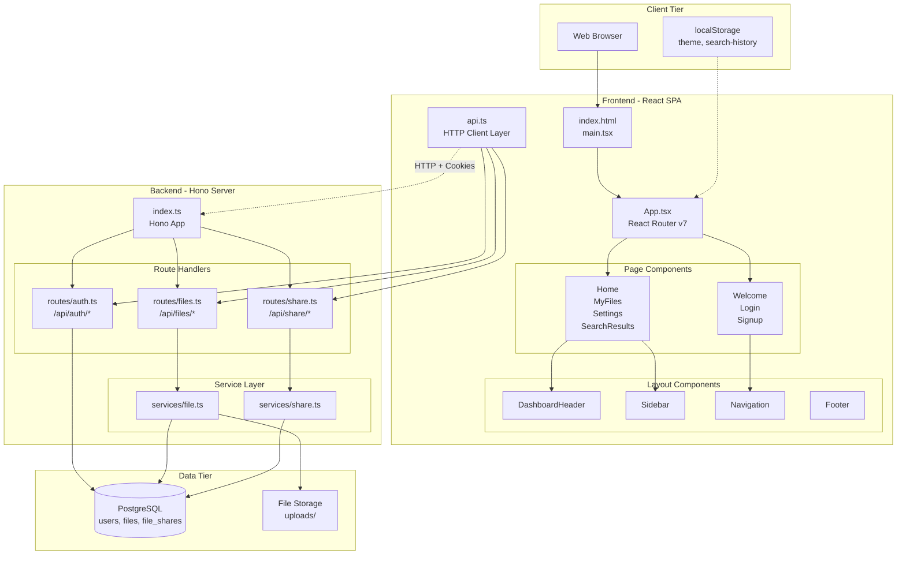

**Sources**: [frontend/src/App.tsx:1-82](), [backend/src/index.ts:1-73](), [frontend/src/api.ts](), [backend/src/routes/auth.ts](), [backend/src/routes/files.ts](), [backend/src/routes/share.ts]()

### Request Flow Mapping

The following diagram illustrates how a typical authenticated file upload request flows through the codebase, mapping user actions to specific code entities:

```mermaid
sequenceDiagram
    participant User
    participant HomePage["Home Component<br/>pages/Home/Home.tsx"]
    participant APIClient["api.ts<br/>apiUploadFile()"]
    participant HonoServer["index.ts<br/>Hono App"]
    participant FileRouter["routes/files.ts<br/>POST /upload"]
    participant FileService["services/file.ts<br/>saveFile()"]
    participant DB["PostgreSQL<br/>files table"]
    participant Storage["uploads/<br/>File System"]
    
    User->>HomePage: "Drop file or click upload"
    HomePage->>APIClient: "apiUploadFile(file, onProgress)"
    
    Note over APIClient: "XMLHttpRequest for<br/>progress tracking"
    
    APIClient->>HonoServer: "POST /api/files/upload<br/>Cookie: session=..."
    HonoServer->>FileRouter: "Route to upload handler"
    
    Note over FileRouter: "decodeCookie()<br/>Validate session"
    
    FileRouter->>FileService: "saveFile(userId, file)"
    FileService->>Storage: "Write file to uploads/"
    Storage-->>FileService: "File path"
    FileService->>DB: "INSERT INTO files<br/>(owner_uuid, file_path, ...)"
    DB-->>FileService: "file metadata"
    FileService-->>FileRouter: "file record"
    FileRouter-->>HonoServer: "JSON response"
    HonoServer-->>APIClient: "200 OK + file data"
    
    Note over APIClient: "Progress callbacks<br/>update UI"
    
    APIClient-->>HomePage: "Upload complete"
    HomePage->>User: "Show success message"
```

**Sources**: [frontend/src/pages/Home/Home.tsx](), [frontend/src/api.ts](), [backend/src/index.ts:1-73](), [backend/src/routes/files.ts](), [backend/src/services/file.ts]()

## Core Subsystems

Claud is organized into several major subsystems, each handling a specific aspect of functionality:

| Subsystem | Primary Location | Description | Wiki Reference |
|-----------|-----------------|-------------|----------------|
| **Authentication & Sessions** | `backend/src/routes/auth.ts` | Cookie-based authentication with bcrypt password hashing, session management | [Authentication & Session Management](#3.1) |
| **File Storage** | `backend/src/services/file.ts` | File upload/download, metadata management, soft-delete lifecycle | [File Storage & Lifecycle](#3.2) |
| **Sharing System** | `backend/src/services/share.ts`<br/>`backend/src/routes/share.ts` | Private user-to-user sharing and public link sharing with permissions | [File Sharing System](#5.4) |
| **Frontend Routing** | `frontend/src/App.tsx` | React Router configuration with protected route guards | [Application Entry Point & Routing](#4.1) |
| **API Client** | `frontend/src/api.ts` | Centralized HTTP client with XMLHttpRequest for uploads | [API Client Layer](#4.2) |
| **Theming** | `frontend/src/index.css`<br/>`frontend/src/contexts/ThemeContext.tsx` | CSS variables and React context for dark/light mode | [Styling & Theming System](#4.3) |

**Sources**: [frontend/src/App.tsx:1-82](), [backend/src/index.ts:1-73](), [frontend/src/api.ts](), [backend/src/routes/auth.ts](), [backend/src/services/file.ts](), [backend/src/services/share.ts]()

## Key Features

### File Management
- **Upload**: Drag-and-drop interface with progress tracking for large files (timeout scales with file size: 15min per 100MB)
- **Download**: Streaming file downloads with MIME type preservation
- **Organization**: File starring, search functionality with query history persistence
- **Lifecycle**: Soft-delete to trash, restore from trash, permanent deletion
- **Storage Quotas**: Per-user storage limits with usage tracking

For detailed implementation, see [Home & File Upload](#4.4.1) and [File Browser (MyFiles)](#4.4.2).

**Sources**: [frontend/src/pages/Home/Home.tsx](), [frontend/src/pages/MyFiles/MyFiles.tsx](), [backend/src/routes/files.ts]()

### Sharing Capabilities
The sharing system supports two distinct models:

1. **Private Sharing**: Files shared with specific users by UUID
   - Configurable permissions: `read`, `write`, `admin`
   - Appears in recipient's "Shared With Me" view
   - Recipients can remove shares from their view

2. **Public Sharing**: Token-based URLs for open access
   - Generates unique `share_token` for each public share
   - Listed in "Public Pool" view
   - Optional expiration dates

For detailed implementation, see [File Sharing System](#5.4).

**Sources**: [backend/src/services/share.ts](), [backend/src/routes/share.ts]()

### User Account Management
- User registration and login with email/password
- Profile customization: username, email, profile picture
- Password change with current password verification
- Theme preferences (light/dark mode, color schemes)
- Storage limit configuration
- Two-step account deletion with confirmation

For detailed implementation, see [Settings & User Profile](#4.4.3) and [Authentication API](#5.2).

**Sources**: [frontend/src/pages/Settings/Settings.tsx](), [backend/src/routes/auth.ts]()

## Technology Stack Summary

The application leverages modern JavaScript/TypeScript tooling for both frontend and backend:

### Frontend Stack
| Technology | Version | Purpose |
|------------|---------|---------|
| **React** | 19.1.1 | UI component library |
| **Vite** | 7.1.7 | Build tool and dev server |
| **React Router** | 7.0.2 | Client-side routing |
| **TypeScript** | 5.9.3 | Type safety |
| **CSS Modules** | N/A | Component-scoped styling |

**Sources**: [frontend/package.json](), [frontend/package-lock.json:1-30]()

### Backend Stack
| Technology | Version | Purpose |
|------------|---------|---------|
| **Hono** | 4.10.5 | Web framework |
| **Bun** | latest | JavaScript runtime |
| **PostgreSQL** | 8.16.3 (pg driver) | Relational database |
| **bcryptjs** | 2.4.3 | Password hashing |
| **uuid** | 9.0.1 | Unique identifier generation |

**Sources**: [backend/package.json:1-23](), [backend/package-lock.json:1-50]()

### Development Configuration
- **Frontend**: ESLint with React plugins, TypeScript strict mode, Vite HMR
- **Backend**: Bun hot reload (`--hot` flag), TypeScript with ESNext module resolution

For complete setup instructions, see [Local Development Setup](#2.2).

**Sources**: [backend/tsconfig.json:1-14](), [frontend/tsconfig.json]()

## Authentication Architecture

Claud uses a cookie-based session system with the following flow:

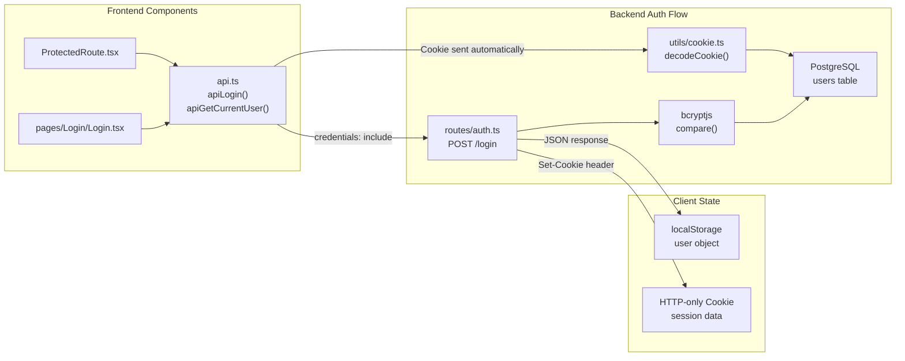

**Key Authentication Files**:
- Session creation: `backend/src/routes/auth.ts` (login/register handlers)
- Session validation: `backend/src/utils/cookie.ts` (`decodeCookie()`, `encodeCookie()`)
- Protected routes: `frontend/src/components/ProtectedRoute/ProtectedRoute.tsx`
- Client-side auth: `frontend/src/api.ts` (`apiLogin()`, `apiLogout()`, `apiGetCurrentUser()`)

For detailed authentication flows, see [Authentication & Session Management](#3.1).

**Sources**: [backend/src/routes/auth.ts](), [backend/src/utils/cookie.ts](), [frontend/src/components/ProtectedRoute/ProtectedRoute.tsx](), [frontend/src/api.ts]()

## API Endpoint Summary

The backend exposes three primary API domains:

### Authentication Endpoints (`/api/auth/*`)
- `POST /api/auth/register` - User registration
- `POST /api/auth/login` - User login (sets session cookie)
- `POST /api/auth/logout` - Session termination
- `GET /api/auth/me` - Current user info
- `POST /api/auth/change-password` - Password update
- `PUT /api/auth/update-username` - Username change
- `PUT /api/auth/update-email` - Email change
- `POST /api/auth/upload-profile-picture` - Profile picture upload
- `DELETE /api/auth/delete-account` - Account deletion

### File Management Endpoints (`/api/files/*`)
- `POST /api/files/upload` - File upload with multipart/form-data
- `GET /api/files/:id/download` - File download (streaming)
- `GET /api/files` - List user's files
- `GET /api/files/search` - Search files by name
- `PUT /api/files/:id` - Update file metadata
- `DELETE /api/files/:id` - Soft delete (move to trash)
- `POST /api/files/:id/restore` - Restore from trash
- `DELETE /api/files/:id/permanent` - Permanent deletion
- `POST /api/files/:id/star` - Toggle starred status
- `GET /api/files/storage/usage` - Storage quota information

### Sharing Endpoints (`/api/share/*`)
- `POST /api/share/files/:id/share` - Share file with specific user
- `POST /api/share/files/:id/share/public` - Create public share link
- `GET /api/share/share/:token` - Access shared file by token
- `GET /api/share/share/:token/download` - Download shared file
- `GET /api/share/share/public` - List public files
- `GET /api/share/share/with-me` - List files shared with current user
- `DELETE /api/share/share/:id` - Remove share

**Sources**: [backend/src/index.ts:47-54](), [backend/src/routes/auth.ts](), [backend/src/routes/files.ts](), [backend/src/routes/share.ts]()

## Database Schema Overview

The application uses PostgreSQL with three primary tables:

| Table | Key Columns | Purpose |
|-------|-------------|---------|
| `users` | `uuid`, `username`, `email`, `password_hash`, `storage_limit`, `profile_picture_url` | User account data |
| `files` | `file_id`, `owner_uuid`, `file_path`, `original_name`, `file_size`, `mime_type`, `is_deleted`, `is_starred` | File metadata with soft-delete flag |
| `file_shares` | `share_id`, `file_id`, `shared_by`, `shared_with`, `share_token`, `is_public`, `permission`, `expires_at` | Sharing relationships and permissions |

**Key Design Decisions**:
- UUID-based user identification for security
- Soft-delete pattern (`is_deleted` flag) enables trash/restore functionality
- `share_token` supports URL-based public access
- `shared_with` can be NULL for public shares
- `permission` enum: `read`, `write`, `admin`

Database initialization occurs in `backend/src/utils/db.ts` with table creation on first startup.

**Sources**: [backend/src/utils/db.ts]()

## Frontend Component Hierarchy

The React application organizes components into distinct categories:

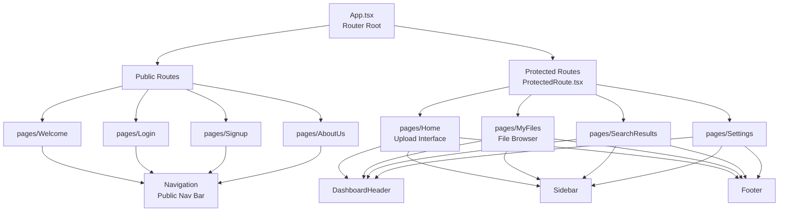

**Component Responsibilities**:
- **App.tsx**: Configures React Router with route definitions
- **ProtectedRoute.tsx**: Authentication guard, redirects unauthenticated users
- **DashboardHeader**: Global search bar, user profile menu, logout
- **Sidebar**: Navigation menu for authenticated views
- **Navigation**: Public site navigation bar
- **Footer**: Site-wide footer with branding and links

For detailed component documentation, see [Core Pages](#4.4) and [Shared Components](#4.5).

**Sources**: [frontend/src/App.tsx:1-82](), [frontend/src/components/ProtectedRoute/ProtectedRoute.tsx](), [frontend/src/components/DashboardHeader/DashboardHeader.tsx](), [frontend/src/components/Sidebar/Sidebar.tsx]()

## Deployment Architecture

Claud is designed for Docker-based deployment with multi-container orchestration:

- **Frontend Container**: Nginx serving static build artifacts
- **Backend Container**: Bun runtime executing Hono server
- **Database Container**: PostgreSQL with persistent volume

The deployment configuration uses Docker Compose for service orchestration. For complete deployment instructions, see [Deployment](#6).

**Sources**: [docker-compose.yml](), [frontend/Dockerfile](), [backend/Dockerfile]()15:T2cec,# Getting Started

<details>
<summary>Relevant source files</summary>

The following files were used as context for generating this wiki page:

- [README.docker.md](README.docker.md)
- [backend/package-lock.json](backend/package-lock.json)
- [backend/package.json](backend/package.json)
- [frontend/package-lock.json](frontend/package-lock.json)
- [frontend/src/components/Footer/Footer.module.css](frontend/src/components/Footer/Footer.module.css)
- [frontend/src/components/Footer/Footer.tsx](frontend/src/components/Footer/Footer.tsx)

</details>


This document provides an introduction to the Claud file storage application codebase and guides developers through setting up a local development environment. It covers system prerequisites, project structure, and basic setup instructions to run the application locally.

For detailed information about the technology stack and dependencies, see [Technology Stack](#2.1). For comprehensive step-by-step setup instructions and troubleshooting, see [Local Development Setup](#2.2).

---

## System Overview

Claud is a three-tier web application for file storage and sharing. The system consists of:

- **Frontend**: React 19 single-page application built with Vite
- **Backend**: Hono server running on Bun runtime
- **Database**: PostgreSQL 16 for structured data and file system for uploaded files

The application uses cookie-based session authentication and supports file uploads, downloads, sharing, and soft-delete operations.

**Sources:** [README.docker.md:3-6]()

---

## Prerequisites

The following software must be installed on your development machine:

| Software | Minimum Version | Purpose |
|----------|----------------|---------|
| **Bun** | 1.0+ | JavaScript runtime for both frontend and backend |
| **Node.js** | 18.0+ | Alternative runtime for backend (via tsx) |
| **PostgreSQL** | 16+ | Database server |
| **Docker** | 20.10+ | Container runtime (optional, for Docker setup) |
| **Docker Compose** | v2+ | Multi-container orchestration (optional) |
| **Git** | 2.0+ | Version control |

**Note**: Either Bun or Node.js with tsx can run the backend, but Bun is the primary development runtime.

**Sources:** [README.docker.md:20-23](), [backend/package.json:4-6]()

---

## Repository Structure

The repository is organized into two primary application directories plus deployment configuration:

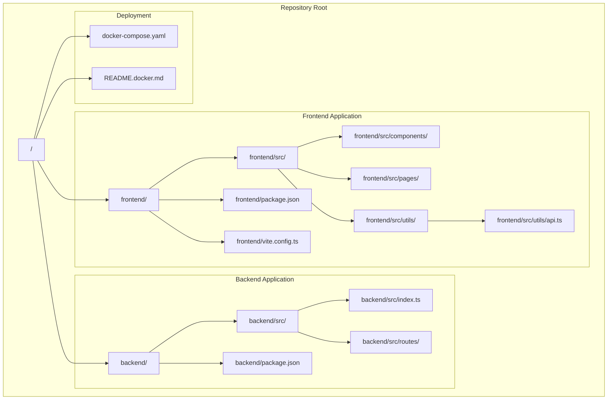

### Key Entry Points

| File Path | Purpose |
|-----------|---------|
| `frontend/src/main.tsx` | Frontend application bootstrap |
| `frontend/src/App.tsx` | React Router configuration |
| `frontend/src/utils/api.ts` | API client layer |
| `backend/src/index.ts` | Backend server entry point |
| `docker-compose.yaml` | Multi-container orchestration |

**Sources:** [README.docker.md:1-18]()

---

## Development Setup Options

There are two primary ways to run the application locally:

### Option 1: Docker Compose (Recommended)

This approach runs all three services (frontend, backend, database) in isolated containers with automatic hot reloading:

```bash
# Start all services
docker compose up -d

# View logs
docker compose logs -f

# Stop all services
docker compose down
```

**Services started:**
- `claud-frontend` - React dev server on port 5173
- `claud-backend` - Hono API server on port 3000
- `claud-postgres` - PostgreSQL database on port 5432

The containers communicate via a Docker network named `claud-network`. Source code changes on the host machine automatically trigger reloads in the containers.

**Sources:** [README.docker.md:27-62]()

### Option 2: Local Development (Manual)

This approach runs services directly on the host machine, requiring manual setup of PostgreSQL:

```bash
# Terminal 1: Backend
cd backend
bun install
bun run dev

# Terminal 2: Frontend
cd frontend
bun install
bun run dev
```

**Prerequisites for local development:**
- PostgreSQL server running on `localhost:5432`
- Database named `claud` created
- User `claud` with password `claud_password` configured

**Sources:** [backend/package.json:3-6](), [frontend/package-lock.json:2-14]()

---

## Service Architecture

The following diagram illustrates how the three services communicate:

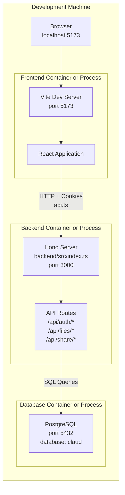

### Port Mapping

| Service | Port | Access URL |
|---------|------|------------|
| Frontend | 5173 | http://localhost:5173 |
| Backend API | 3000 | http://localhost:3000 |
| Backend Health | 3000 | http://localhost:3000/api/health |
| PostgreSQL | 5432 | localhost:5432 |

**Sources:** [README.docker.md:48-52](), [README.docker.md:10-18]()

---

## Verification Steps

After starting the services, verify each component is running correctly:

### 1. Backend Health Check

```bash
curl http://localhost:3000/api/health
```

**Expected response:** JSON indicating server is healthy

### 2. Frontend Access

Navigate to http://localhost:5173 in a browser. You should see the Claud welcome page.

### 3. Database Connection

If using Docker:
```bash
docker compose ps postgres
```

**Expected output:** Container status shows "healthy"

If using local PostgreSQL:
```bash
psql -h localhost -U claud -d claud -c "SELECT version();"
```

**Expected output:** PostgreSQL version information

### 4. Full Stack Test

1. Navigate to http://localhost:5173
2. Click "Sign Up" to create an account
3. Complete registration form
4. Verify redirect to `/home` after successful signup

This confirms frontend → backend → database communication is working.

**Sources:** [README.docker.md:48-52](), [README.docker.md:159-167]()

---

## Environment Variables

The system uses the following environment variables:

### Backend Environment

| Variable | Default | Description |
|----------|---------|-------------|
| `PORT` | 3000 | Server port |
| `DB_HOST` | postgres | PostgreSQL host |
| `DB_NAME` | claud | Database name |
| `DB_USER` | claud | Database user |
| `DB_PASSWORD` | claud_password | Database password |
| `DB_PORT` | 5432 | Database port |

### Frontend Environment

| Variable | Default | Description |
|----------|---------|-------------|
| `VITE_API_URL` | http://backend:3000 | Backend API base URL |

**Note**: When running locally (not in Docker), set `VITE_API_URL=http://localhost:3000` to ensure the frontend can reach the backend.

**Sources:** [README.docker.md:73-89]()

---

## Dependency Installation

### Frontend Dependencies

The frontend uses the following core packages:

| Package | Version | Purpose |
|---------|---------|---------|
| `react` | 19.1.1 | UI framework |
| `react-dom` | 19.1.1 | React renderer |
| `react-router-dom` | 7.0.2 | Client-side routing |
| `react-icons` | 5.5.0 | Icon library |
| `vite` | 7.1.7 | Build tool and dev server |

**Install command:**
```bash
cd frontend
bun install
```

**Sources:** [frontend/package-lock.json:10-14]()

### Backend Dependencies

The backend uses the following core packages:

| Package | Version | Purpose |
|---------|---------|---------|
| `hono` | 4.10.3 | Web framework |
| `pg` | 8.16.3 | PostgreSQL client |
| `bcryptjs` | 2.4.3 | Password hashing |
| `uuid` | 9.0.0 | UUID generation |
| `tsx` | 4.20.6 | TypeScript execution (dev) |

**Install command:**
```bash
cd backend
bun install
```

**Sources:** [backend/package.json:8-14]()

---

## Hot Reloading

Both development environments support automatic code reloading:

### Frontend Hot Reload
- **Mechanism**: Vite HMR (Hot Module Replacement)
- **Trigger**: Any file change in `frontend/src/`
- **Behavior**: Browser updates without full page refresh

### Backend Hot Reload
- **Mechanism**: Bun `--hot` flag
- **Trigger**: Any file change in `backend/src/`
- **Behavior**: Server process restarts automatically

When using Docker Compose, source directories are mounted as volumes, so changes on the host machine trigger reloads in the containers.

**Sources:** [README.docker.md:64-71](), [backend/package.json:4]()

---

## Common Development Tasks

### View Application Logs

**Docker:**
```bash
# All services
docker compose logs -f

# Specific service
docker compose logs -f backend
```

**Local:**
Logs appear directly in the terminal where each service is running.

### Reset Database

**Docker:**
```bash
docker compose down -v
docker compose up -d
```

**Local:**
```bash
psql -h localhost -U claud -d claud -c "DROP SCHEMA public CASCADE; CREATE SCHEMA public;"
```

### Rebuild Containers

```bash
docker compose down
docker compose build --no-cache
docker compose up -d
```

**Sources:** [README.docker.md:138-180]()

---

## Next Steps

After successfully running the application, explore these topics:

- **[Technology Stack](#2.1)** - Detailed breakdown of all dependencies and their roles
- **[Local Development Setup](#2.2)** - Comprehensive setup guide with troubleshooting
- **[System Architecture](#3)** - Overview of the three-tier architecture and data flow
- **[Frontend Application](#4)** - React component structure and routing
- **[Backend API](#5)** - Server architecture and API endpoints
- **[Deployment](#6)** - Production deployment guide

For understanding specific subsystems:
- Authentication flow: [Authentication & Session Management](#3.1)
- File operations: [File Storage & Lifecycle](#3.2)
- API integration: [API Client Layer](#4.2)

**Sources:** Table of contents structure16:T31df,# Technology Stack

<details>
<summary>Relevant source files</summary>

The following files were used as context for generating this wiki page:

- [backend/package-lock.json](backend/package-lock.json)
- [backend/package.json](backend/package.json)
- [backend/src/index.ts](backend/src/index.ts)
- [backend/tsconfig.json](backend/tsconfig.json)
- [frontend/package-lock.json](frontend/package-lock.json)

</details>


## Purpose and Scope

This document provides a comprehensive breakdown of the technologies, frameworks, libraries, and tools used in the Claud file storage application. It covers both frontend and backend technology choices, their versions, and the rationale behind their selection. For instructions on setting up these technologies locally, see [Local Development Setup](#2.2). For architectural patterns and how these technologies integrate, see [System Architecture](#3).

---

## Technology Stack Overview

The Claud application employs a modern JavaScript/TypeScript stack with clear separation between client and server concerns. The frontend is a React single-page application built with Vite, while the backend uses Bun runtime with the Hono web framework, communicating with a PostgreSQL database.

### Stack Architecture Diagram

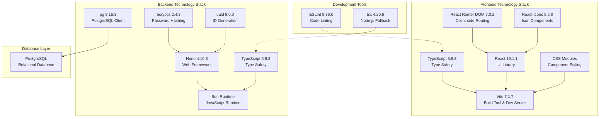

**Sources:** [frontend/package.json:1-31](), [backend/package.json:1-23](), [frontend/package-lock.json:1-30](), [backend/package-lock.json:1-23]()

---

## Frontend Technology Stack

### Core Framework: React 19.1.1

The frontend uses React 19.1.1, the latest major version of the React library. React provides the component-based architecture and virtual DOM for efficient UI rendering.

**Key Dependencies:**
| Package | Version | Purpose |
|---------|---------|---------|
| `react` | 19.1.1 | Core React library |
| `react-dom` | 19.1.1 | React DOM bindings |
| `react-router-dom` | 7.0.2 | Client-side routing |
| `react-icons` | 5.5.0 | Icon component library |

**Sources:** [frontend/package-lock.json:10-14]()

### Build System: Vite 7.1.7

Vite serves as the build tool and development server, providing fast Hot Module Replacement (HMR) and optimized production builds. The `@vitejs/plugin-react` plugin enables React Fast Refresh during development.

**Configuration:**
- Plugin: `@vitejs/plugin-react` version 5.0.4
- Build output optimized with ES modules
- Development server with instant HMR

**Sources:** [frontend/package-lock.json:22-29]()

### Type System: TypeScript 5.9.3

Both frontend and backend use TypeScript 5.9.3 with strict mode enabled for compile-time type checking and enhanced developer experience.

**Frontend TypeScript Configuration:**
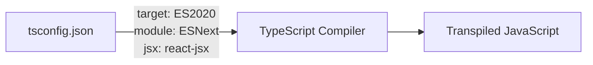

**Type Declaration Packages:**
| Package | Version | Purpose |
|---------|---------|---------|
| `@types/react` | 19.1.16 | React type definitions |
| `@types/react-dom` | 19.1.9 | React DOM type definitions |
| `@types/node` | 24.6.0 | Node.js type definitions |

**Sources:** [frontend/package-lock.json:18-21]()

### Development Tools

**ESLint 9.36.0:** Code quality and consistency enforcement with React-specific rules:
- `eslint-plugin-react-hooks` (5.2.0) - Enforces Rules of Hooks
- `eslint-plugin-react-refresh` (0.4.22) - Validates Fast Refresh compatibility
- `@eslint/js` (9.36.0) - Core ESLint JavaScript rules

**TypeScript ESLint:** Integration between TypeScript and ESLint via `typescript-eslint` version 8.45.0.

**Sources:** [frontend/package-lock.json:17-29](), [backend/src/index.ts:1-73]()

### Styling System

The application uses **CSS Modules** for component-scoped styling, preventing style conflicts through automatic class name hashing. Global styles and CSS variables are defined in `index.css` for theme consistency.

**Sources:** Inferred from project structure and typical Vite + React patterns

---

## Backend Technology Stack

### Runtime: Bun

Bun serves as the primary JavaScript runtime for the backend, providing native TypeScript support, fast startup times, and a built-in package manager. The application also supports Node.js via the `tsx` package as a fallback.

**Runtime Scripts:**
```json
{
  "dev": "bun run --hot src/index.ts",
  "start": "tsx src/index.ts",
  "test": "tsx src/index.ts"
}
```

- `bun run --hot` enables hot reloading during development
- `tsx` provides Node.js compatibility when Bun is unavailable

**Sources:** [backend/package.json:3-7]()

### Web Framework: Hono 4.10.3

Hono is a lightweight, fast web framework designed for edge computing but works excellently with any JavaScript runtime. It provides Express-like routing with better performance and TypeScript support.

**Framework Features Used:**
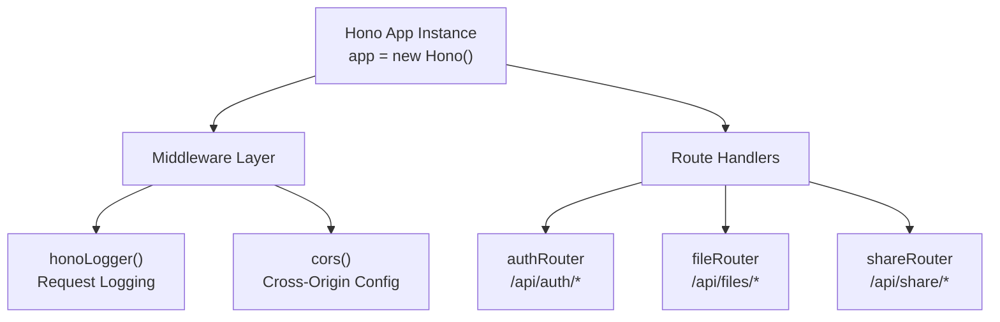

**CORS Configuration:**
- Dynamic origin handling for development
- Credentials support for cookie-based auth
- Allowed methods: GET, POST, PUT, DELETE, OPTIONS, PATCH

**Middleware:**
| Middleware | Import Path | Purpose |
|------------|-------------|---------|
| `logger` | `hono/logger` | HTTP request/response logging |
| `cors` | `hono/cors` | Cross-origin resource sharing |

**Sources:** [backend/src/index.ts:1-29](), [backend/package.json:12-14]()

### Backend Dependencies

**Core Dependencies:**

| Package | Version | Purpose |
|---------|---------|---------|
| `hono` | 4.10.3 | Web framework |
| `pg` | 8.16.3 | PostgreSQL client driver |
| `bcryptjs` | 2.4.3 | Password hashing with bcrypt algorithm |
| `uuid` | 9.0.0 | UUID v4 generation for unique identifiers |

**Type Definitions:**

| Package | Version | Purpose |
|---------|---------|---------|
| `@types/pg` | 8.15.6 | PostgreSQL client types |
| `@types/bcryptjs` | 2.4.6 | Bcryptjs types |
| `@types/uuid` | 10.0.0 | UUID types |
| `@types/bun` | latest | Bun runtime types |

**Sources:** [backend/package.json:8-21]()

### TypeScript Configuration

The backend TypeScript configuration targets ES2020 with strict type checking:

**Key Configuration Options:**
```typescript
{
  "compilerOptions": {
    "strict": true,              // Enable all strict type checks
    "target": "ES2020",          // Output ES2020 JavaScript
    "module": "ESNext",          // Use ESNext module system
    "moduleResolution": "bundler", // Bundler-style resolution
    "jsx": "react-jsx",          // JSX transform for Hono JSX
    "jsxImportSource": "hono/jsx", // Hono's JSX runtime
    "esModuleInterop": true,     // CommonJS/ES module interop
    "skipLibCheck": true         // Skip type checking of declaration files
  }
}
```

**Sources:** [backend/tsconfig.json:1-14]()

---

## Database Layer

### PostgreSQL

The application uses PostgreSQL as its relational database management system. The `pg` package (version 8.16.3) provides the database client with connection pooling and query execution.

**Database Client Architecture:**

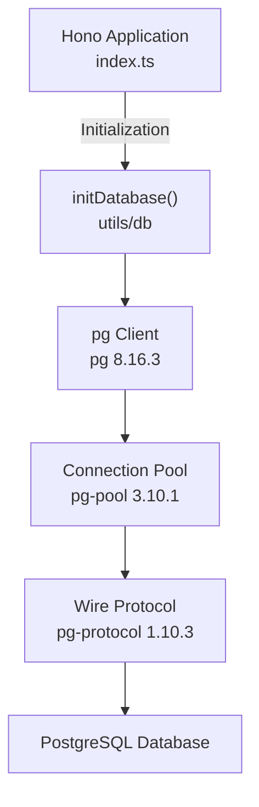

**Related pg Packages:**
| Package | Version | Purpose |
|---------|---------|---------|
| `pg` | 8.16.3 | Main PostgreSQL client |
| `pg-pool` | 3.10.1 | Connection pooling |
| `pg-protocol` | 1.10.3 | PostgreSQL wire protocol |
| `pg-types` | 2.2.0 | Type parsing for PostgreSQL data types |
| `pg-connection-string` | 2.9.1 | Connection string parsing |

**Initialization:** The database is initialized at server startup via `initDatabase()` called from [backend/src/index.ts:32-35]().

**Sources:** [backend/package.json:13-15](), [backend/package-lock.json:625-705](), [backend/src/index.ts:4-35]()

---

## Security Dependencies

### Password Hashing: bcryptjs 2.4.3

The `bcryptjs` library provides pure JavaScript implementation of the bcrypt password hashing algorithm, ensuring secure password storage without native dependencies.

**Features:**
- Adaptive hashing function (configurable work factor)
- Salt generation and management
- Secure password comparison
- No native dependencies (pure JavaScript)

**Sources:** [backend/package.json:11-12](), [backend/package-lock.json:520-525]()

### UUID Generation: uuid 9.0.0

The `uuid` package generates RFC4122-compliant universally unique identifiers (UUIDs), primarily used for:
- User identification (`user_uuid`)
- File identification (`file_id`)
- Share token generation (`share_token`)

**Sources:** [backend/package.json:14-15](), [backend/package-lock.json:799-811]()

---

## Development Tooling

### Package Managers

**Frontend:** Uses npm/pnpm as indicated by `package-lock.json` lockfile version 3.

**Backend:** Primarily uses Bun's built-in package manager, with npm compatibility via `package-lock.json`.

**Sources:** [frontend/package-lock.json:4-5](), [backend/package-lock.json:2-4]()

### Build and Execution Tools

**Frontend Build Pipeline:**
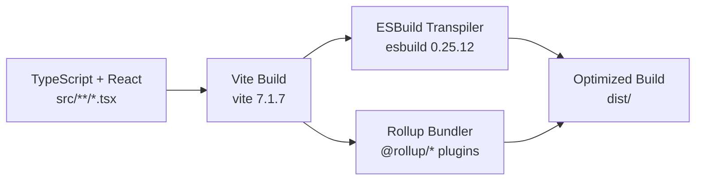

**Backend Execution:**
- **Development:** `bun run --hot` with hot reloading
- **Production/Fallback:** `tsx` (version 4.20.6) for Node.js environments
- **TypeScript:** Native execution without build step in both runtimes

**Key Tool Versions:**
| Tool | Version | Purpose |
|------|---------|---------|
| `vite` | 7.1.7 | Frontend dev server & bundler |
| `esbuild` | 0.25.12 | Fast TypeScript/JavaScript transpiler |
| `tsx` | 4.20.6 | TypeScript execution for Node.js |
| `@rollup/*` | 4.53.2 | Production bundling (used by Vite) |

**Sources:** [frontend/package-lock.json:1054-1088](), [backend/package.json:3-7](), [backend/package-lock.json:546-587](), [backend/package-lock.json:773-792]()

---

## Dependency Version Summary

### Frontend Core Dependencies
```
react@19.1.1
react-dom@19.1.1
react-router-dom@7.0.2
react-icons@5.5.0
```

### Frontend Dev Dependencies
```
vite@7.1.7
typescript@5.9.3
eslint@9.36.0
@vitejs/plugin-react@5.0.4
@types/react@19.1.16
@types/react-dom@19.1.9
@types/node@24.6.0
```

### Backend Core Dependencies
```
hono@4.10.3
pg@8.16.3
bcryptjs@2.4.3
uuid@9.0.0
@types/node@24.10.1
@types/pg@8.15.6
```

### Backend Dev Dependencies
```
@types/bun@latest
@types/bcryptjs@2.4.6
@types/uuid@10.0.0
tsx@4.20.6
```

**Sources:** [frontend/package.json:1-31](), [backend/package.json:1-23]()17:T417b,# Local Development Setup

<details>
<summary>Relevant source files</summary>

The following files were used as context for generating this wiki page:

- [README.docker.md](README.docker.md)
- [backend/package-lock.json](backend/package-lock.json)
- [backend/package.json](backend/package.json)
- [backend/src/index.ts](backend/src/index.ts)
- [backend/tsconfig.json](backend/tsconfig.json)
- [frontend/package-lock.json](frontend/package-lock.json)
- [frontend/src/components/Footer/Footer.module.css](frontend/src/components/Footer/Footer.module.css)
- [frontend/src/components/Footer/Footer.tsx](frontend/src/components/Footer/Footer.tsx)

</details>


## Purpose and Scope

This document provides step-by-step instructions for setting up the Claud application for local development on your machine. It covers prerequisites, dependency installation, database initialization, and running both frontend and backend servers. For information about the technology choices and dependencies, see [Technology Stack](#2.1). For Docker-based deployment, see [Deployment](#6).

---

## Prerequisites

Before beginning local development setup, ensure the following tools are installed on your system:

| Tool | Minimum Version | Purpose | Verification Command |
|------|----------------|---------|---------------------|
| **Bun** | 1.0+ | JavaScript runtime and package manager for both frontend and backend | `bun --version` |
| **PostgreSQL** | 14+ | Database server | `psql --version` |
| **Git** | 2.0+ | Version control | `git --version` |
| **Node.js** (optional) | 18+ | Alternative runtime for backend using tsx | `node --version` |

The application is designed to run with Bun as the primary runtime. The backend can alternatively run with Node.js using the `tsx` transpiler, but Bun provides better performance and hot-reloading capabilities during development.

**Sources:** [README.docker.md:20-24](), [backend/package.json:1-22]()

---

## Project Structure Overview

The repository uses a monorepo structure with separate directories for frontend and backend:

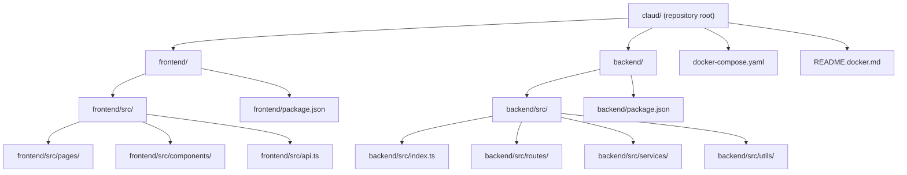

**Sources:** [backend/src/index.ts:1-73](), [README.docker.md:1-200]()

---

## Backend Setup

### Step 1: Navigate to Backend Directory

```bash
cd backend
```

### Step 2: Install Dependencies

Using Bun (recommended):
```bash
bun install
```

Using npm (alternative):
```bash
npm install
```

The backend dependencies are defined in `package.json` and include:

| Package | Version | Purpose |
|---------|---------|---------|
| `hono` | ^4.10.3 | Web framework for building the API |
| `pg` | ^8.16.3 | PostgreSQL client for database operations |
| `bcryptjs` | ^2.4.3 | Password hashing for authentication |
| `uuid` | ^9.0.0 | UUID generation for unique identifiers |
| `@types/pg` | ^8.15.6 | TypeScript definitions for pg |
| `@types/bcryptjs` | ^2.4.6 | TypeScript definitions for bcryptjs |
| `@types/uuid` | ^10.0.0 | TypeScript definitions for uuid |

**Sources:** [backend/package.json:8-15](), [backend/package-lock.json:1-727]()

### Step 3: Configure Database Connection

The backend reads database configuration from environment variables. Create a `.env` file in the `backend/` directory:

```bash
# backend/.env
DB_HOST=localhost
DB_NAME=claud
DB_USER=claud
DB_PASSWORD=claud_password
DB_PORT=5432
PORT=3000
```

These environment variables are used by the database initialization utility:

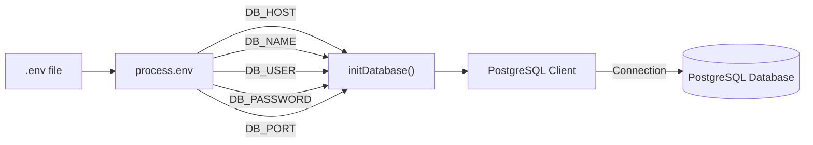

**Sources:** [backend/src/index.ts:4](), [README.docker.md:75-82]()

### Step 4: Initialize PostgreSQL Database

Before running the backend, you must have a PostgreSQL database running. Create the database:

```bash
# Connect to PostgreSQL
psql -U postgres

# Create database and user
CREATE DATABASE claud;
CREATE USER claud WITH PASSWORD 'claud_password';
GRANT ALL PRIVILEGES ON DATABASE claud TO claud;
\q
```

The backend automatically initializes database tables on first run through the `initDatabase()` function, which:
1. Creates the `users` table for authentication
2. Creates the `files` table for file metadata
3. Creates the `file_shares` table for sharing functionality
4. Sets up necessary indexes and constraints

**Sources:** [backend/src/index.ts:32-35]()

### Step 5: Initialize Upload Directory

The backend automatically creates the upload directory for storing files when the server starts. The `initUploadDir()` function is called during server initialization:

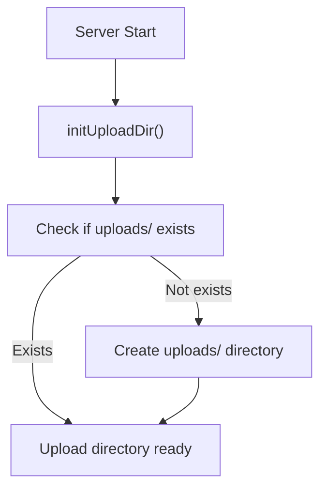

**Sources:** [backend/src/index.ts:37-39](), [backend/src/index.ts:5]()

### Step 6: Run the Backend Server

Using Bun with hot-reloading (recommended for development):
```bash
bun run dev
```

Using tsx with Node.js (alternative):
```bash
npm run start
```

The `dev` script uses Bun's `--hot` flag which automatically reloads the server when source files change.

**Backend Server Initialization Sequence:**

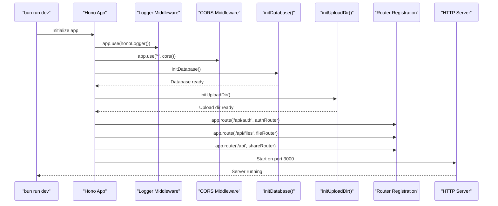

The server logs will indicate successful initialization:

```
Upload directory initialized
Server is running on port 3000
API endpoints registered { auth: '/api/auth', files: '/api/files', shares: '/api/share' }
```

**Sources:** [backend/src/index.ts:1-73](), [backend/package.json:4-5]()

### Backend API Endpoints

Once running, the backend exposes the following endpoint groups:

| Endpoint Base | Router | Description |
|--------------|--------|-------------|
| `/api/health` | N/A | Health check endpoint |
| `/api/auth` | `authRouter` | Authentication endpoints (register, login, logout, etc.) |
| `/api/files` | `fileRouter` | File management endpoints (upload, download, delete, etc.) |
| `/api/share` | `shareRouter` | File sharing endpoints (create shares, list shares, etc.) |

**Sources:** [backend/src/index.ts:42-54](), [backend/src/index.ts:7-9]()

---

## Frontend Setup

### Step 1: Navigate to Frontend Directory

```bash
cd frontend
```

### Step 2: Install Dependencies

Using Bun (recommended):
```bash
bun install
```

Using npm (alternative):
```bash
npm install
```

The frontend dependencies include:

| Package | Version | Purpose |
|---------|---------|---------|
| `react` | ^19.1.1 | UI framework |
| `react-dom` | ^19.1.1 | React DOM renderer |
| `react-router-dom` | ^7.0.2 | Client-side routing |
| `react-icons` | ^5.5.0 | Icon library |
| `vite` | ^7.1.7 | Build tool and dev server |
| `@vitejs/plugin-react` | ^5.0.4 | Vite plugin for React |
| `typescript` | ~5.9.3 | TypeScript compiler |

**Sources:** [frontend/package-lock.json:10-29]()

### Step 3: Configure API Endpoint

The frontend communicates with the backend through the API client defined in `api.ts`. By default, it connects to `http://localhost:3000`. If your backend runs on a different port or host, configure it via environment variable:

Create `frontend/.env`:
```bash
VITE_API_URL=http://localhost:3000
```

The API client uses this configuration to construct request URLs. The `credentials: 'include'` option ensures cookies are sent with each request for session-based authentication.

**Frontend-to-Backend Communication Flow:**

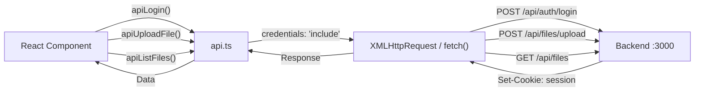

**Sources:** [README.docker.md:84]()

### Step 4: Run the Frontend Development Server

Using Bun (recommended):
```bash
bun run dev
```

Using npm (alternative):
```bash
npm run dev
```

The Vite dev server will start and display:

```
VITE v7.1.7  ready in [time] ms

➜  Local:   http://localhost:5173/
➜  Network: use --host to expose
```

The frontend dev server features:
- **Hot Module Replacement (HMR)**: Changes to source files automatically update in the browser without full page reload
- **TypeScript compilation**: On-the-fly TypeScript to JavaScript compilation
- **CSS Modules processing**: Scoped CSS with automatic class name generation
- **Asset optimization**: Automatic optimization for images and other assets

**Sources:** [README.docker.md:68]()

---

## Verification

### Backend Verification

1. **Check server is running:**
   ```bash
   curl http://localhost:3000/api/health
   ```
   Expected response:
   ```json
   {"status":"healthy","timestamp":"2025-01-XX..."}
   ```

2. **Verify database connection:**
   The server logs should show successful database initialization without errors.

3. **Check CORS configuration:**
   The backend uses a permissive CORS configuration for development that allows credentials from any origin.

**Backend Health Check Flow:**

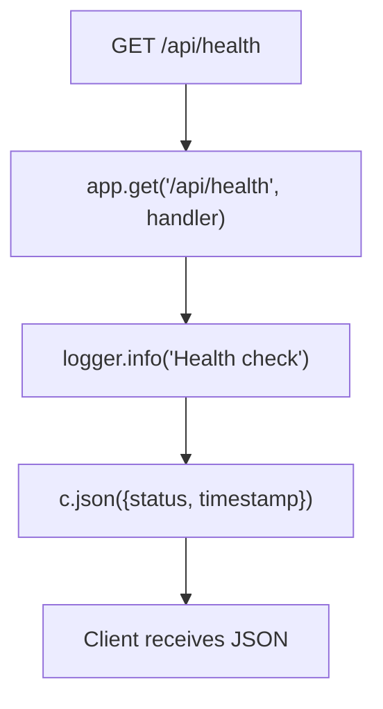

**Sources:** [backend/src/index.ts:42-45](), [backend/src/index.ts:14-29]()

### Frontend Verification

1. **Access the application:**
   Open http://localhost:5173 in your browser

2. **Verify routing:**
   - Navigate to `/` - Should display the Welcome page
   - Navigate to `/login` - Should display the Login page
   - Navigate to `/signup` - Should display the Signup page

3. **Check console for errors:**
   Open browser DevTools (F12) and check the Console tab for any errors

4. **Verify API connectivity:**
   Attempt to register a new user. The frontend should successfully communicate with the backend.

**Sources:** [README.docker.md:48-52]()

---

## Development Workflow

### File Watch and Hot Reload

Both frontend and backend support automatic reloading during development:

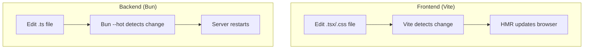

### TypeScript Configuration

The backend uses a TypeScript configuration optimized for Bun:

- **Target:** ES2020
- **Module:** ESNext
- **Module Resolution:** bundler
- **JSX:** react-jsx (for Hono JSX support)
- **Strict mode:** enabled

**Sources:** [backend/tsconfig.json:1-14]()

---

## Common Issues and Solutions

### Issue: Port Already in Use

**Symptom:** `Error: listen EADDRINUSE: address already in use :::3000`

**Solution:**
```bash
# Find process using port 3000
lsof -i :3000
# or
netstat -tulpn | grep :3000

# Kill the process
kill -9 <PID>
```

Alternatively, change the port in your `.env` file:
```bash
PORT=3001
```

**Sources:** [backend/src/index.ts:61]()

### Issue: Database Connection Failed

**Symptom:** `Failed to initialize database` in server logs

**Solution:**
1. Verify PostgreSQL is running: `pg_isready`
2. Check credentials in `.env` file
3. Ensure database exists: `psql -U postgres -l`
4. Verify user has permissions: `GRANT ALL PRIVILEGES ON DATABASE claud TO claud;`

**Sources:** [backend/src/index.ts:32-35]()

### Issue: Frontend Cannot Connect to Backend

**Symptom:** Network errors in browser console, API calls failing

**Solution:**
1. Verify backend is running and accessible at http://localhost:3000/api/health
2. Check CORS configuration allows requests from `http://localhost:5173`
3. Ensure `credentials: 'include'` is set in API client for cookie-based auth
4. Clear browser cookies and try again

**Sources:** [backend/src/index.ts:14-29]()

### Issue: Module Not Found Errors

**Symptom:** `Cannot find module` errors during startup

**Solution:**
```bash
# Remove node_modules and lock files
rm -rf node_modules
rm package-lock.json  # or bun.lockb

# Reinstall dependencies
bun install
```

### Issue: Upload Directory Permissions

**Symptom:** File upload fails with permission errors

**Solution:**
```bash
# Ensure uploads directory has write permissions
chmod 755 backend/uploads
```

The `initUploadDir()` function creates the directory if it doesn't exist, but manual permission adjustment may be needed on some systems.

**Sources:** [backend/src/index.ts:37-39]()

---

## Running Both Services Simultaneously

For active development, you'll typically want both frontend and backend running. Open two terminal windows:

**Terminal 1 (Backend):**
```bash
cd backend
bun run dev
```

**Terminal 2 (Frontend):**
```bash
cd frontend
bun run dev
```

**Complete Development Stack:**

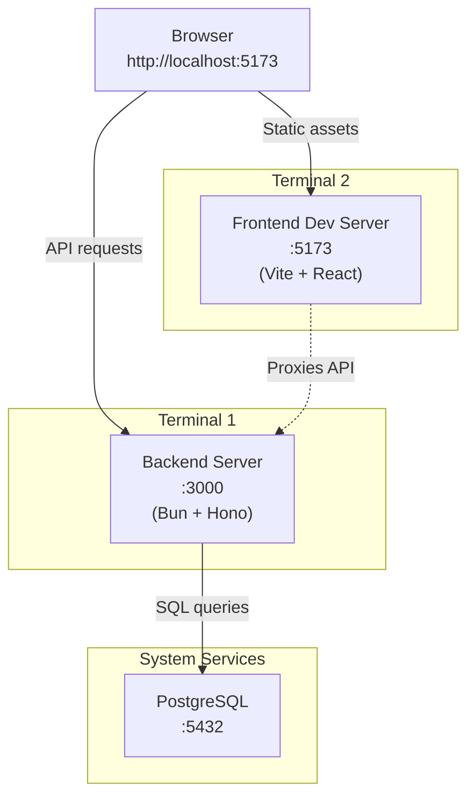

The browser loads the frontend from port 5173, which makes API requests to the backend on port 3000. The backend connects to PostgreSQL on port 5432.

**Sources:** [backend/src/index.ts:61](), [README.docker.md:48-52]()

---

## Next Steps

After successfully setting up the local development environment:

1. **Explore the codebase:** Review [System Architecture](#3) for understanding the overall structure
2. **Review API endpoints:** See [Authentication API](#5.2), [File Management API](#5.3), and [File Sharing System](#5.4)
3. **Understand the frontend:** Review [Application Entry Point & Routing](#4.1) and [API Client Layer](#4.2)
4. **Set up Docker (optional):** For containerized development, see [Deployment](#6)

**Sources:** [README.docker.md:1-200]()18:T5113,# System Architecture

<details>
<summary>Relevant source files</summary>

The following files were used as context for generating this wiki page:

- [backend/src/index.ts](backend/src/index.ts)
- [backend/src/routes/files.ts](backend/src/routes/files.ts)
- [backend/src/routes/share.ts](backend/src/routes/share.ts)
- [backend/src/services/share.ts](backend/src/services/share.ts)
- [backend/tsconfig.json](backend/tsconfig.json)
- [frontend/src/utils/api.ts](frontend/src/utils/api.ts)

</details>


## Purpose and Scope

This document provides a comprehensive overview of Claud's three-tier system architecture, including the separation of concerns between frontend, backend, and data layers, as well as the communication patterns and data flow between components. 

For specific implementation details of subsystems, see:
- Authentication mechanisms: [Authentication & Session Management](#3.1)
- File storage implementation: [File Storage & Lifecycle](#3.2)
- Frontend structure: [Frontend Application](#4)
- Backend API details: [Backend API](#5)

---

## Architectural Overview

Claud follows a classic **three-tier web application architecture** with clear separation between presentation (React frontend), application logic (Hono backend), and data persistence (PostgreSQL + file storage). The system uses **cookie-based session authentication** with credentials included in all requests, and communication occurs exclusively through a RESTful JSON API.

### Key Architectural Characteristics

| Aspect | Technology | Pattern |
|--------|-----------|---------|
| **Frontend Framework** | React 18 + Vite | Single-page application (SPA) |
| **Backend Framework** | Hono + Bun runtime | RESTful API server |
| **API Communication** | Fetch API with credentials | HTTP/JSON with cookie sessions |
| **Database** | PostgreSQL | Relational data store |
| **File Storage** | Local filesystem | Direct file I/O |
| **Authentication** | Cookie-based sessions | HTTP-only cookies |
| **State Management** | React hooks + localStorage | Client-side caching |

---

## Complete System Architecture

The following diagram maps the entire system architecture to specific code entities in the repository:

```mermaid
graph TB
    subgraph "Client Browser"
        Browser["Web Browser"]
        LocalStorage["localStorage<br/>theme, user cache"]
    end
    
    subgraph "Frontend - React Application"
        EntryPoint["index.html<br/>frontend/index.html"]
        MainTSX["main.tsx<br/>frontend/src/main.tsx"]
        AppRouter["App.tsx<br/>frontend/src/App.tsx"]
        
        subgraph "API Client Layer"
            APIClient["api.ts<br/>frontend/src/utils/api.ts<br/>★ 21.57 importance"]
        end
        
        subgraph "Page Components"
            HomePage["Home.tsx"]
            MyFilesPage["MyFiles.tsx"]
            LoginPage["Login.tsx"]
            SettingsPage["Settings.tsx"]
        end
        
        subgraph "Utilities"
            Logger["logger.ts"]
            Dialog["dialog.ts"]
        end
    end
    
    subgraph "Backend - Hono Server"
        ServerEntry["index.ts<br/>backend/src/index.ts<br/>Hono app instance"]
        
        subgraph "Route Handlers"
            AuthRouter["authRouter<br/>backend/src/routes/auth.ts"]
            FileRouter["fileRouter<br/>backend/src/routes/files.ts<br/>★ 10.66"]
            ShareRouter["shareRouter<br/>backend/src/routes/share.ts<br/>★ 8.14"]
        end
        
        subgraph "Service Layer"
            FileService["file.ts<br/>backend/src/services/file.ts"]
            ShareService["share.ts<br/>backend/src/services/share.ts<br/>★ 12.14"]
            AuthService["auth service functions"]
        end
        
        subgraph "Database Layer"
            DBUtils["db.ts<br/>backend/src/utils/db.ts<br/>query(), getFromSession()"]
        end
    end
    
    subgraph "Data Persistence"
        PostgreSQL[("PostgreSQL Database<br/>users, files,<br/>file_shares, sessions")]
        FileSystem["File Storage<br/>uploads/ directory"]
    end
    
    Browser --> EntryPoint
    EntryPoint --> MainTSX
    MainTSX --> AppRouter
    AppRouter --> HomePage & MyFilesPage & LoginPage & SettingsPage
    
    HomePage & MyFilesPage & SettingsPage --> APIClient
    LoginPage --> APIClient
    APIClient --> Logger & Dialog
    
    APIClient -->|"HTTP + credentials: include"| ServerEntry
    Browser -->|"Set-Cookie: session"| APIClient
    
    ServerEntry --> AuthRouter & FileRouter & ShareRouter
    
    AuthRouter --> AuthService
    FileRouter --> FileService
    ShareRouter --> ShareService
    
    AuthService & FileService & ShareService --> DBUtils
    DBUtils --> PostgreSQL
    
    FileService --> FileSystem
    ShareService --> FileSystem
    
    LocalStorage -.->|"Cache user object"| APIClient
    
    style APIClient fill:#f9f,stroke:#333,stroke-width:2px
    style ServerEntry fill:#9f9,stroke:#333,stroke-width:2px
    style PostgreSQL fill:#99f,stroke:#333,stroke-width:2px
```

**Sources:** [frontend/src/utils/api.ts:1-919](), [backend/src/index.ts:1-73](), [backend/src/routes/files.ts:1-896](), [backend/src/routes/share.ts:1-550](), [backend/src/services/share.ts:1-455]()

---

## Frontend Layer Architecture

The frontend is a **React single-page application** built with Vite, using React Router for client-side routing and a centralized API client for all backend communication.

### API Client Layer (`api.ts`)

The `api.ts` module at [frontend/src/utils/api.ts]() serves as the **single source of truth** for all HTTP communication with the backend. With an importance score of **21.57**, it is the most critical frontend module.

**Key Characteristics:**
- **Base URL Configuration**: Reads from `VITE_API_URL` environment variable or defaults to `http://localhost:3000` [frontend/src/utils/api.ts:5]()
- **Credential Inclusion**: All requests include `credentials: 'include'` to send session cookies [frontend/src/utils/api.ts:44,86,157,304]()
- **localStorage Integration**: Caches user object locally after authentication success [frontend/src/utils/api.ts:58-59,99-100,738-739]()
- **Progress Tracking**: File uploads use XMLHttpRequest instead of fetch to support progress events [frontend/src/utils/api.ts:244-306]()
- **Dynamic Timeouts**: Upload timeout scales with file size (5-30 minutes) [frontend/src/utils/api.ts:248-252]()

### API Function Categories

The API client provides 30+ functions organized by domain:

| Domain | Functions | Example Operations |
|--------|-----------|-------------------|
| **Authentication** | 9 functions | `apiRegister()`, `apiLogin()`, `apiLogout()`, `apiGetCurrentUser()` |
| **File Management** | 11 functions | `apiUploadFile()`, `apiListFiles()`, `apiDeleteFile()`, `apiDownloadFile()` |
| **File Sharing** | 5 functions | `apiShareFilePublic()`, `apiShareFileWithUser()`, `apiListSharedWithMe()` |
| **User Profile** | 6 functions | `apiUpdateUsername()`, `apiChangePassword()`, `apiUploadProfilePicture()` |

**Sources:** [frontend/src/utils/api.ts:1-919]()

---

## Backend Layer Architecture

The backend uses the **Hono web framework** running on Bun, with a clean separation between route handlers (controllers) and business logic (services).

### Server Initialization

```mermaid
graph LR
    ServerStart["index.ts:11<br/>new Hono()"]
    Middleware["Middleware Setup"]
    DBInit["initDatabase()<br/>index.ts:32"]
    UploadInit["initUploadDir()<br/>index.ts:38"]
    RouteReg["Route Registration"]
    Listen["Port 3000"]
    
    ServerStart --> Middleware
    Middleware --> |"honoLogger()"| DBInit
    Middleware --> |"cors()"| DBInit
    DBInit --> UploadInit
    UploadInit --> RouteReg
    RouteReg --> |"/api/auth"| Listen
    RouteReg --> |"/api/files"| Listen
    RouteReg --> |"/api/share"| Listen
```

**Middleware Stack:**
1. **Request Logger**: Hono's built-in logger [backend/src/index.ts:13]()
2. **CORS Configuration**: Allows credentials, returns origin dynamically [backend/src/index.ts:14-29]()

**Sources:** [backend/src/index.ts:1-73]()

### Route Domain Structure

The backend exposes three primary route domains, each implemented as a separate Hono router:

```mermaid
graph TB
    Server["Hono App<br/>backend/src/index.ts"]
    
    AuthRouter["authRouter<br/>/api/auth/*"]
    FileRouter["fileRouter<br/>/api/files/*"]
    ShareRouter["shareRouter<br/>/api/share/*<br/>/api/files/:id/share/*"]
    
    Server --> AuthRouter
    Server --> FileRouter
    Server --> ShareRouter
    
    subgraph "Auth Endpoints"
        A1["POST /register"]
        A2["POST /login"]
        A3["POST /logout"]
        A4["GET /me"]
        A5["POST /change-password"]
        A6["PUT /update-username"]
        A7["DELETE /delete-account"]
    end
    
    subgraph "File Endpoints"
        F1["POST /upload"]
        F2["GET /:id/download"]
        F3["GET /"]
        F4["GET /search"]
        F5["DELETE /:id"]
        F6["DELETE /:id/permanent"]
        F7["POST /:id/star"]
        F8["POST /:id/restore"]
    end
    
    subgraph "Share Endpoints"
        S1["POST /files/:id/share"]
        S2["POST /files/:id/share/public"]
        S3["GET /share/public"]
        S4["GET /share/with-me"]
        S5["GET /share/:token"]
        S6["GET /share/:token/download"]
        S7["DELETE /share/:id"]
    end
    
    AuthRouter --> A1 & A2 & A3 & A4 & A5 & A6 & A7
    FileRouter --> F1 & F2 & F3 & F4 & F5 & F6 & F7 & F8
    ShareRouter --> S1 & S2 & S3 & S4 & S5 & S6 & S7
```

**Sources:** [backend/src/index.ts:47-54](), [backend/src/routes/files.ts:1-896](), [backend/src/routes/share.ts:1-550]()

### Service Layer Pattern

Backend routes delegate business logic to service modules, which handle data validation, database operations, and file I/O:

**File Service (`backend/src/services/file.ts`):**
- `saveFile()`: Handles multipart upload, storage quota validation, file system write
- `getFileMetadata()`: Retrieves file record with ownership verification
- `deleteFile()`: Soft delete (sets `is_deleted=true`)
- `permanentlyDeleteFile()`: Hard delete (removes DB record and file)
- `getUserStorageUsage()`: Aggregates file sizes per user

**Share Service (`backend/src/services/share.ts`):**
- `shareFileWithUser()`: Creates private share with specific user [backend/src/services/share.ts:27-144]()
- `createPublicShare()`: Generates public share token [backend/src/services/share.ts:149-220]()
- `getSharedFileByToken()`: Token-based access with permission validation [backend/src/services/share.ts:225-304]()
- `listPublicFiles()`: Query public pool [backend/src/services/share.ts:372-391]()
- `listSharedWithMe()`: Query files shared with user [backend/src/services/share.ts:396-413]()

**Sources:** [backend/src/services/share.ts:1-455]()

---

## Data Layer Architecture

### PostgreSQL Schema

The system uses four primary tables:

```mermaid
erDiagram
    users ||--o{ files : "owns"
    users ||--o{ file_shares : "creates"
    users ||--o{ file_shares : "receives"
    files ||--o{ file_shares : "shared via"
    users ||--o| sessions : "has"
    
    users {
        uuid uuid PK
        username varchar
        email varchar
        password_hash varchar
        storage_limit bigint
        profile_picture_url varchar
        created_at timestamp
    }
    
    files {
        file_id uuid PK
        owner_uuid uuid FK
        file_bucket_id uuid FK
        filename varchar
        original_name varchar
        file_path varchar
        file_size bigint
        mime_type varchar
        is_deleted boolean
        is_starred boolean
        created_at timestamp
    }
    
    file_shares {
        share_id uuid PK
        file_id uuid FK
        shared_by uuid FK
        shared_with uuid FK
        share_token uuid
        permission varchar
        is_public boolean
        expires_at timestamp
        created_at timestamp
    }
    
    sessions {
        session_id varchar PK
        user_uuid uuid FK
        created_at timestamp
        expires_at timestamp
    }
```

**Key Schema Patterns:**
- **UUID Primary Keys**: All entities use UUIDs for global uniqueness
- **Soft Delete Flag**: `files.is_deleted` enables trash/restore functionality
- **Nullable `shared_with`**: Public shares have `NULL` in this field [backend/src/services/share.ts:200-203]()
- **Share Token Indexing**: `file_shares.share_token` enables token-based access

**Sources:** Referenced throughout [backend/src/services/share.ts]() and [backend/src/routes/files.ts]()

### File Storage System

Physical files are stored in the local filesystem:

- **Upload Directory**: `uploads/` at backend root
- **Filename Generation**: UUID-based to avoid collisions
- **Path Storage**: Full path stored in `files.file_path` [backend/src/routes/files.ts:155-178]()
- **Direct Streaming**: Uses Node.js `fs.createReadStream()` for downloads

---

## Session-Based Authentication Flow

The system uses **HTTP-only cookies** for session management, with dual-state persistence (backend session store + frontend localStorage cache).

### Authentication Sequence

```mermaid
sequenceDiagram
    participant B as Browser
    participant F as api.ts
    participant S as Server (index.ts)
    participant R as authRouter
    participant DB as PostgreSQL
    participant SS as Session Store
    
    Note over B,SS: Login Flow
    B->>F: apiLogin(email, password)
    F->>S: POST /api/auth/login<br/>credentials: include
    S->>R: Route to authRouter
    R->>DB: SELECT user WHERE email
    R->>R: bcrypt.compare()
    R->>SS: CREATE session
    SS-->>R: session_id
    R->>S: Set-Cookie: session=base64(id:hmac)
    S-->>F: 200 + Set-Cookie header
    F->>LocalStorage: setItem('user', JSON.stringify(user))
    F-->>B: {success: true, user}
    
    Note over B,SS: Protected Request Flow
    B->>F: apiListFiles()
    F->>S: GET /api/files<br/>Cookie: session=...
    S->>R: Route to fileRouter
    R->>R: Extract cookie header
    R->>R: Base64 decode + parse session_id
    R->>SS: getFromSession(session_id)
    SS-->>R: user object
    R->>DB: SELECT files WHERE owner_uuid
    DB-->>R: files[]
    R-->>S: {success: true, files}
    S-->>F: 200 + JSON
    F-->>B: files[]
```

**Cookie Extraction Pattern:**

All protected routes follow this pattern [backend/src/routes/files.ts:26-63]():
1. Extract `Cookie` header
2. Parse `session=` value using regex
3. Base64 decode to get `sessionId:hmac` pair
4. Split on `:` and take first element
5. Call `getFromSession(sessionId)` to retrieve user object

**Sources:** [frontend/src/utils/api.ts:44,86,157,304](), [backend/src/routes/files.ts:24-63](), [backend/src/routes/share.ts:22-61]()

---

## Request/Response Data Flow

### File Upload Flow

```mermaid
sequenceDiagram
    participant U as User
    participant H as Home.tsx
    participant A as api.ts
    participant X as XMLHttpRequest
    participant FR as fileRouter
    participant FS as FileService
    participant DB as PostgreSQL
    participant Disk as File System
    
    U->>H: Drag & drop file
    H->>A: apiUploadFile(file, onProgress)
    A->>A: Calculate timeout<br/>(5-30 min by size)
    A->>X: new XMLHttpRequest()
    X->>X: Setup progress listener
    A->>X: xhr.open('POST', '/api/files/upload')
    A->>X: xhr.send(FormData)
    
    loop Upload Progress
        X->>H: onProgress(percentage)
        H->>U: Update progress bar
    end
    
    X->>FR: POST /api/files/upload
    FR->>FR: Parse session cookie
    FR->>FR: Parse multipart formData
    FR->>FS: saveFile(uuid, bucket, file)
    FS->>FS: Check storage quota
    FS->>Disk: Write file to uploads/
    FS->>DB: INSERT INTO files
    DB-->>FS: file record
    FS-->>FR: {success, file}
    FR-->>X: 201 + JSON
    X->>A: Parse response
    A->>H: {success, file}
    H->>U: Show success message
```

**Why XMLHttpRequest Instead of Fetch:**
The `apiUploadFile` function uses `XMLHttpRequest` specifically because the Fetch API does not support upload progress events [frontend/src/utils/api.ts:244-306](). The `xhr.upload.addEventListener('progress')` enables real-time progress tracking.

**Sources:** [frontend/src/utils/api.ts:234-315](), [backend/src/routes/files.ts:24-105]()

### File Sharing Flow (Public)

```mermaid
sequenceDiagram
    participant O as Owner (MyFiles)
    participant API as api.ts
    participant SR as shareRouter
    participant SS as ShareService
    participant DB as PostgreSQL
    participant R as Recipient (anyone)
    
    O->>API: apiShareFilePublic(fileId)
    API->>SR: POST /api/files/:id/share/public
    SR->>SS: createPublicShare(params)
    SS->>SS: Generate UUID token
    SS->>DB: INSERT file_shares<br/>(is_public=TRUE, shared_with=NULL)
    DB-->>SS: share record
    SS-->>SR: {shareToken, shareUrl}
    SR-->>API: {success, shareToken, shareUrl}
    API-->>O: Display share link
    
    Note over R: Recipient accesses link
    R->>SR: GET /share/:token
    SR->>SS: getSharedFileByToken(token)
    SS->>DB: SELECT file_shares<br/>JOIN files<br/>WHERE share_token
    DB-->>SS: file + share metadata
    SS->>SS: Validate is_public=TRUE
    SS->>SS: Check expires_at
    SS-->>SR: {file, share}
    SR-->>R: Display file info + download button
    
    R->>SR: GET /share/:token/download
    SR->>SS: getSharedFileByToken(token)
    SS-->>SR: file metadata
    SR->>SR: getSharedFileStream(file_path)
    SR-->>R: Stream file with headers
```

**Public Share Characteristics:**
- `is_public = TRUE` in database [backend/src/services/share.ts:201]()
- `shared_with = NULL` (not tied to specific user) [backend/src/services/share.ts:201]()
- `share_token` enables URL-based access [backend/src/services/share.ts:194]()
- No authentication required for access [backend/src/routes/share.ts:288-331]()

**Sources:** [frontend/src/utils/api.ts:542-569](), [backend/src/routes/share.ts:110-185](), [backend/src/services/share.ts:149-220]()

---

## Cross-Cutting Concerns

### Error Handling Pattern

All API functions follow a consistent error handling pattern:

```typescript
// Example from api.ts
try {
  logger.api('POST /api/auth/login', { email })
  const response = await fetch(`${API_BASE}/api/auth/login`, {
    method: 'POST',
    headers: { 'Content-Type': 'application/json' },
    credentials: 'include',
    body: JSON.stringify({ email, password })
  })
  
  const data = await response.json()
  
  if (response.ok) {
    logger.success('Login successful', data.user)
    // Cache user in localStorage
    if (data.user) {
      localStorage.setItem('user', JSON.stringify(data.user))
    }
  } else {
    logger.error('Login failed', data)
  }
  
  return data
} catch (error) {
  logger.error('Login error', error)
  return {
    success: false,
    message: 'Network error. Please try again.',
    code: 'NETWORK_ERROR'
  }
}
```

**Pattern Elements:**
1. **Logging**: All requests logged via `logger.api()` [frontend/src/utils/api.ts:38,80,154]()
2. **Success Caching**: User object cached to localStorage [frontend/src/utils/api.ts:58-59]()
3. **Error Wrapping**: Network errors wrapped in standard response format
4. **Response Codes**: Custom error codes for client-side handling

**Sources:** [frontend/src/utils/api.ts:32-73,78-114]()

### CORS Configuration

The backend CORS setup enables credentialed requests from any origin in development:

```typescript
cors({
  origin: (origin) => {
    // Return the requesting origin to allow credentials
    if (origin) return origin
    // Fallback for same-origin requests
    return 'http://localhost:5173'
  },
  credentials: true,  // Critical for cookies
  allowMethods: ['GET', 'POST', 'PUT', 'DELETE', 'OPTIONS', 'PATCH'],
  allowHeaders: ['Content-Type', 'Authorization', 'Cookie', 'X-Requested-With'],
  exposeHeaders: ['Content-Type', 'Set-Cookie'],
})
```

**Why Dynamic Origin:** When `credentials: true`, CORS requires a specific origin (not `*`). The server returns the requesting origin dynamically [backend/src/index.ts:15-23]().

**Sources:** [backend/src/index.ts:14-29]()

---

## Technology Stack Rationale

| Technology | Rationale |
|------------|-----------|
| **React 18** | Modern hooks API, excellent ecosystem, fast with Vite |
| **Vite** | Instant HMR, optimized builds, ESM-native |
| **Hono** | Lightweight, fast routing, Bun-compatible |
| **Bun** | Native TypeScript, fast startup, built-in fetch |
| **PostgreSQL** | ACID compliance, powerful queries, proven reliability |
| **Cookie Sessions** | XSS-resistant (HTTP-only), works across subdomains |
| **TypeScript** | Type safety, better IDE support, self-documenting |
| **CSS Modules** | Scoped styles, no naming conflicts, tree-shakeable |

**Sources:** [backend/tsconfig.json:1-14](), [backend/src/index.ts:1-73](), [frontend/src/utils/api.ts:1-919]()19:T61c5,# Authentication & Session Management

<details>
<summary>Relevant source files</summary>

The following files were used as context for generating this wiki page:

- [backend/src/utils/cookie.ts](backend/src/utils/cookie.ts)
- [frontend/src/App.tsx](frontend/src/App.tsx)
- [frontend/src/pages/ForgotPassword/ForgotPassword.tsx](frontend/src/pages/ForgotPassword/ForgotPassword.tsx)
- [frontend/src/pages/Login/Login.tsx](frontend/src/pages/Login/Login.tsx)
- [frontend/src/pages/Signup/Signup.module.css](frontend/src/pages/Signup/Signup.module.css)
- [frontend/src/pages/Signup/Signup.tsx](frontend/src/pages/Signup/Signup.tsx)
- [frontend/src/utils/api.ts](frontend/src/utils/api.ts)

</details>


## Purpose and Scope

This document describes the authentication and session management system in Claud, covering cookie-based session handling, user registration and login flows, session validation, and route protection mechanisms. The system uses HTTP-only cookies for security combined with localStorage for UI state management.

For information about user profile updates and password changes in the Settings interface, see [Settings & User Profile](#4.4.3). For details about the API client layer that facilitates authentication requests, see [API Client Layer](#4.2). For backend authentication endpoint implementation, see [Authentication API](#5.2).

---

## Authentication Architecture

The Claud application implements a cookie-based authentication system with dual-state persistence. The backend generates session cookies after successful authentication, while the frontend maintains a cached copy of user data in `localStorage` for immediate UI access.

**Architecture Diagram: Authentication System Components**

```mermaid
graph TB
    subgraph "Frontend Layer"
        LoginPage["Login Page<br/>Login.tsx"]
        SignupPage["Signup Page<br/>Signup.tsx"]
        ProtectedRoute["ProtectedRoute<br/>Component"]
        APIClient["api.ts<br/>API Client"]
        LocalStorage["localStorage<br/>user object"]
    end
    
    subgraph "API Client Functions"
        apiRegister["apiRegister()"]
        apiLogin["apiLogin()"]
        apiLogout["apiLogout()"]
        apiGetCurrentUser["apiGetCurrentUser()"]
        apiForgotPassword["apiForgotPassword()"]
        apiChangePassword["apiChangePassword()"]
    end
    
    subgraph "Backend Layer"
        AuthRouter["Auth Router<br/>/api/auth/*"]
        SessionStore["Session Store<br/>in-memory"]
        CookieUtils["cookie.ts<br/>deocdeCookie()"]
    end
    
    subgraph "HTTP Communication"
        Cookies["HTTP Cookies<br/>session cookie"]
        CredentialsInclude["credentials: 'include'"]
    end
    
    LoginPage --> apiLogin
    SignupPage --> apiRegister
    ProtectedRoute --> apiGetCurrentUser
    
    apiRegister --> LocalStorage
    apiLogin --> LocalStorage
    apiLogout --> LocalStorage
    
    APIClient --> apiRegister & apiLogin & apiLogout & apiGetCurrentUser
    APIClient --> CredentialsInclude
    
    CredentialsInclude --> Cookies
    Cookies --> AuthRouter
    
    AuthRouter --> SessionStore
    AuthRouter --> CookieUtils
    
    CookieUtils --> SessionStore
    
    apiRegister -.->|"POST /api/auth/register"| AuthRouter
    apiLogin -.->|"POST /api/auth/login"| AuthRouter
    apiLogout -.->|"POST /api/auth/logout"| AuthRouter
    apiGetCurrentUser -.->|"GET /api/auth/me"| AuthRouter
```

**Sources:** [frontend/src/utils/api.ts:1-919](), [backend/src/utils/cookie.ts:1-42](), [frontend/src/App.tsx:1-82]()

---

## Session Cookie Structure

Session cookies in Claud use a custom encoding scheme that packs session data into a single cookie value. The cookie contains three components separated by colons, then base64-encoded.

**Cookie Format**

| Component | Description | Example |
|-----------|-------------|---------|
| `session` | Unique session identifier | `sess_abc123xyz` |
| `username` | User's username | `john_doe` |
| `trackingID` | Session tracking identifier | `track_456def` |

**Encoding Process**
1. Concatenate components with colons: `session:username:trackingID`
2. Base64 encode the string
3. Set as cookie value: `session={base64String}`

**Decoding Implementation**

The `deocdeCookie()` function in [backend/src/utils/cookie.ts:9-41]() handles cookie decoding:

```typescript
// Pseudo-code representation
1. Extract session cookie from Cookie header using regex: /session=([^;]+)/
2. Base64 decode the cookie value
3. Split decoded string by colon delimiter
4. Validate three components exist
5. Return UserCookie object with session, username, trackingID
```

**UserCookie Interface**

```typescript
interface UserCookie {
  session: string
  username: string
  trackingID: string
}
```

**Sources:** [backend/src/utils/cookie.ts:1-42]()

---

## Registration Flow

**Registration Sequence Diagram**

```mermaid
sequenceDiagram
    participant User
    participant SignupPage["Signup.tsx"]
    participant apiRegister["apiRegister()"]
    participant Backend["/api/auth/register"]
    participant Database
    participant SessionStore
    
    User->>SignupPage: "Fill signup form"
    User->>SignupPage: "Submit form"
    SignupPage->>SignupPage: "validateForm()"
    
    alt "Validation fails"
        SignupPage->>User: "Show validation errors"
    end
    
    SignupPage->>apiRegister: "apiRegister(username, email, password)"
    apiRegister->>Backend: "POST /api/auth/register<br/>{username, email, password}<br/>credentials: 'include'"
    
    Backend->>Database: "INSERT INTO users<br/>(bcrypt hashed password)"
    Database-->>Backend: "User record created"
    
    Backend->>SessionStore: "Create session entry"
    Backend->>Backend: "Generate session cookie"
    Backend-->>apiRegister: "Set-Cookie: session=...<br/>{success, user}"
    
    apiRegister->>localStorage: "setItem('user', JSON.stringify(user))"
    apiRegister-->>SignupPage: "{success: true, user}"
    
    SignupPage->>SignupPage: "window.location.href = '/home'"
    SignupPage-->>User: "Redirect to home page"
```

**Key Implementation Details**

1. **Client-Side Validation** [frontend/src/pages/Signup/Signup.tsx:58-117]()
   - First name, last name, username, email, password validation
   - Username must be 3+ characters, alphanumeric with underscores/hyphens
   - Password must be 8+ characters
   - Password confirmation matching
   - Terms & Conditions acceptance required

2. **API Call** [frontend/src/utils/api.ts:32-73]()
   - Uses `credentials: 'include'` to enable cookie handling
   - Stores user object in localStorage on success
   - Returns `AuthResponse` with user data

3. **Post-Registration Redirect** [frontend/src/pages/Signup/Signup.tsx:131-132]()
   - Uses `window.location.href = '/home'` for full page reload
   - Ensures all components re-check authentication state
   - Avoids stale state issues from React Router navigation

**Sources:** [frontend/src/pages/Signup/Signup.tsx:1-289](), [frontend/src/utils/api.ts:32-73]()

---

## Login Flow

**Login Sequence Diagram**

```mermaid
sequenceDiagram
    participant User
    participant LoginPage["Login.tsx"]
    participant apiLogin["apiLogin()"]
    participant Backend["/api/auth/login"]
    participant Database
    participant SessionStore
    
    User->>LoginPage: "Enter email & password"
    User->>LoginPage: "Submit form"
    LoginPage->>LoginPage: "validateForm()"
    
    alt "Validation fails"
        LoginPage->>User: "Show errors"
    end
    
    LoginPage->>apiLogin: "apiLogin(email, password)"
    apiLogin->>Backend: "POST /api/auth/login<br/>{email, password}<br/>credentials: 'include'"
    
    Backend->>Database: "SELECT user WHERE email"
    Database-->>Backend: "User record"
    
    Backend->>Backend: "bcrypt.compare(password, hash)"
    
    alt "Invalid credentials"
        Backend-->>apiLogin: "{success: false, message}"
        apiLogin-->>LoginPage: "Authentication failed"
        LoginPage->>User: "Show error message"
    end
    
    Backend->>SessionStore: "Create session entry"
    Backend->>Backend: "Generate session cookie"
    Backend-->>apiLogin: "Set-Cookie: session=...<br/>{success: true, user}"
    
    apiLogin->>localStorage: "setItem('user', JSON.stringify(user))"
    apiLogin-->>LoginPage: "{success: true, user}"
    
    LoginPage->>LoginPage: "window.location.href = '/home'"
    LoginPage-->>User: "Redirect to home page"
```

**Key Implementation Details**

1. **Form Validation** [frontend/src/pages/Login/Login.tsx:19-36]()
   - Email format validation
   - Password length check (minimum 8 characters)
   - Real-time error display

2. **Password Visibility Toggle** [frontend/src/pages/Login/Login.tsx:84-101]()
   - Eye icon toggle between text/password input types
   - State managed via `showPassword` boolean
   - Improves UX for password entry

3. **API Call** [frontend/src/utils/api.ts:78-114]()
   - Sends credentials to `/api/auth/login`
   - Receives session cookie via `Set-Cookie` header
   - Stores user object in localStorage for quick access

4. **Full Page Reload** [frontend/src/pages/Login/Login.tsx:48-49]()
   - Same pattern as registration: `window.location.href = '/home'`
   - Ensures all protected routes re-validate authentication

**Sources:** [frontend/src/pages/Login/Login.tsx:1-135](), [frontend/src/utils/api.ts:78-114]()

---

## Logout Flow

**Logout Sequence Diagram**

```mermaid
sequenceDiagram
    participant User
    participant Component["Any Authenticated Component"]
    participant apiLogout["apiLogout()"]
    participant Backend["/api/auth/logout"]
    participant SessionStore
    
    User->>Component: "Click logout button"
    Component->>apiLogout: "apiLogout()"
    
    apiLogout->>Backend: "POST /api/auth/logout<br/>credentials: 'include'"
    
    Backend->>SessionStore: "Delete session entry"
    Backend->>Backend: "Clear session cookie"
    Backend-->>apiLogout: "Clear-Cookie: session<br/>{success: true}"
    
    apiLogout->>localStorage: "removeItem('user')"
    apiLogout-->>Component: "{success: true}"
    
    Component->>Component: "Redirect to '/'"
    Component-->>User: "Show welcome page"
```

**Implementation**

The logout function [frontend/src/utils/api.ts:178-203]() performs three critical operations:

1. **Backend Session Termination**
   - Sends POST request to `/api/auth/logout`
   - Backend deletes session from SessionStore
   - Backend clears session cookie via `Clear-Cookie` header

2. **Client-Side Cleanup**
   - Removes user object from localStorage: `localStorage.removeItem('user')`
   - Ensures no cached authentication data remains

3. **Navigation**
   - Component redirects to welcome/login page
   - User must re-authenticate to access protected routes

**Sources:** [frontend/src/utils/api.ts:178-203]()

---

## Protected Routes Implementation

The application uses a `ProtectedRoute` wrapper component to enforce authentication requirements on specific routes. This component checks authentication status and redirects unauthenticated users to the login page.

**Protected Route Configuration**

Routes in [frontend/src/App.tsx:16-76]() are wrapped based on authentication requirements:

| Route Pattern | Authentication | Redirect Behavior |
|---------------|----------------|-------------------|
| `/login`, `/signup` | `requireAuth={false}` | Redirect authenticated users to `/home` |
| `/home` | `requireAuth={true}` | Redirect unauthenticated users to `/login` |
| `/files` | `requireAuth={true}` | Redirect unauthenticated users to `/login` |
| `/search` | `requireAuth={true}` | Redirect unauthenticated users to `/login` |
| `/settings` | `requireAuth={true}` | Redirect unauthenticated users to `/login` |
| `/` (Welcome) | No wrapper | Public access |
| `/about-us` | No wrapper | Public access |

**Example Protected Route Usage**

```typescript
<Route 
    path="/home" 
    element={
        <ProtectedRoute requireAuth={true}>
            <Home />
        </ProtectedRoute>
    } 
/>
```

**Authentication Check Flow**

```mermaid
sequenceDiagram
    participant User
    participant Router["React Router"]
    participant ProtectedRoute["ProtectedRoute"]
    participant apiGetCurrentUser["apiGetCurrentUser()"]
    participant Backend["/api/auth/me"]
    
    User->>Router: "Navigate to /files"
    Router->>ProtectedRoute: "Render protected route"
    
    ProtectedRoute->>apiGetCurrentUser: "apiGetCurrentUser()"
    apiGetCurrentUser->>Backend: "GET /api/auth/me<br/>credentials: 'include'"
    
    Backend->>Backend: "deocdeCookie(request.cookie)"
    Backend->>Backend: "Validate session"
    
    alt "Valid session"
        Backend-->>apiGetCurrentUser: "{success: true, user}"
        apiGetCurrentUser-->>ProtectedRoute: "User authenticated"
        ProtectedRoute->>User: "Render <MyFiles />"
    else "Invalid/missing session"
        Backend-->>apiGetCurrentUser: "{success: false}"
        apiGetCurrentUser-->>ProtectedRoute: "Not authenticated"
        ProtectedRoute->>Router: "Navigate('/login')"
        Router->>User: "Show login page"
    end
```

**Session Validation with apiGetCurrentUser()**

The `apiGetCurrentUser()` function [frontend/src/utils/api.ts:152-173]() serves as the authentication verification mechanism:

1. Sends GET request to `/api/auth/me` with `credentials: 'include'`
2. Backend validates session cookie using `deocdeCookie()`
3. Returns user object if valid, or error if invalid/missing
4. ProtectedRoute uses response to determine routing

**Sources:** [frontend/src/App.tsx:1-82](), [frontend/src/utils/api.ts:152-173]()

---

## Dual-State Persistence Strategy

Claud implements a dual-state authentication persistence strategy combining HTTP cookies for security with localStorage for UI performance.

**State Storage Comparison**

| Storage | Purpose | Data Stored | Security | Access |
|---------|---------|-------------|----------|--------|
| **HTTP Cookies** | Authoritative authentication | Session token (base64 encoded) | HTTP-only, secure | Sent automatically with requests |
| **localStorage** | UI state cache | User object (JSON) | Client-accessible | Manual read/write |

**localStorage User Object Structure**

```typescript
interface AuthUser {
  uuid: string
  username: string
  email: string
  profile_picture_url?: string
}
```

**Storage Operations**

1. **After Registration/Login** [frontend/src/utils/api.ts:57-59](), [frontend/src/utils/api.ts:98-100]()
   ```typescript
   if (data.user) {
     localStorage.setItem('user', JSON.stringify(data.user))
   }
   ```

2. **After Logout** [frontend/src/utils/api.ts:190]()
   ```typescript
   localStorage.removeItem('user')
   ```

3. **After Profile Updates** [frontend/src/utils/api.ts:737-739](), [frontend/src/utils/api.ts:771-773]()
   ```typescript
   if (data.user) {
     localStorage.setItem('user', JSON.stringify(data.user))
   }
   ```

**Why Both Storage Mechanisms?**

| Mechanism | Benefits | Limitations |
|-----------|----------|-------------|
| **Cookies** | • Automatic transmission with requests<br/>• HTTP-only flag prevents XSS attacks<br/>• Can set expiration/domain/path<br/>• Authoritative authentication | • Size limit (~4KB)<br/>• Network overhead on every request<br/>• Requires parsing on client |
| **localStorage** | • Fast synchronous access for UI<br/>• No network overhead<br/>• Larger storage capacity<br/>• Simple JSON serialization | • Vulnerable to XSS if not sanitized<br/>• Requires manual synchronization<br/>• Not sent with requests |

**Security Model**

The system prioritizes security by using cookies as the source of truth for authentication:

1. **Authentication Decision**: Backend validates session cookie on every protected request
2. **UI Optimization**: localStorage provides immediate access to user data for UI rendering
3. **Inconsistency Resolution**: If localStorage has user data but cookie is invalid/expired, backend returns authentication error and frontend clears localStorage

**Sources:** [frontend/src/utils/api.ts:32-919](), [backend/src/utils/cookie.ts:1-42]()

---

## Authentication API Endpoints

All authentication endpoints are namespaced under `/api/auth/*` and require the `credentials: 'include'` flag on fetch requests to handle cookies.

**Endpoint Reference Table**

| Endpoint | Method | Purpose | Request Body | Response | Cookie Action |
|----------|--------|---------|--------------|----------|---------------|
| `/api/auth/register` | POST | Create new user account | `{username, email, password}` | `{success, user, message}` | Set session cookie |
| `/api/auth/login` | POST | Authenticate user | `{email, password}` | `{success, user, message}` | Set session cookie |
| `/api/auth/logout` | POST | End user session | None | `{success, message}` | Clear session cookie |
| `/api/auth/me` | GET | Get current user | None | `{success, user}` | Read session cookie |
| `/api/auth/forgot-password` | POST | Request password reset | `{email}` | `{success, message}` | None |
| `/api/auth/change-password` | POST | Update password | `{currentPassword, newPassword}` | `{success, message}` | None |
| `/api/auth/update-username` | PUT | Update username | `{username}` | `{success, user, message}` | Read session cookie |
| `/api/auth/update-email` | PUT | Update email | `{email}` | `{success, user, message}` | Read session cookie |
| `/api/auth/update-storage-limit` | PUT | Update storage quota | `{storageLimitGB}` | `{success, user, message}` | Read session cookie |
| `/api/auth/delete-account` | DELETE | Delete user account | None | `{success, message}` | Clear session cookie |
| `/api/auth/upload-profile-picture` | POST | Upload profile picture | FormData with file | `{success, profile_picture_url, user}` | Read session cookie |

**API Client Function Mapping**

| API Function | Endpoint | Code Reference |
|--------------|----------|----------------|
| `apiRegister()` | POST `/api/auth/register` | [frontend/src/utils/api.ts:32-73]() |
| `apiLogin()` | POST `/api/auth/login` | [frontend/src/utils/api.ts:78-114]() |
| `apiForgotPassword()` | POST `/api/auth/forgot-password` | [frontend/src/utils/api.ts:119-147]() |
| `apiGetCurrentUser()` | GET `/api/auth/me` | [frontend/src/utils/api.ts:152-173]() |
| `apiLogout()` | POST `/api/auth/logout` | [frontend/src/utils/api.ts:178-203]() |
| `apiChangePassword()` | POST `/api/auth/change-password` | [frontend/src/utils/api.ts:684-717]() |
| `apiUpdateUsername()` | PUT `/api/auth/update-username` | [frontend/src/utils/api.ts:722-751]() |
| `apiUpdateEmail()` | PUT `/api/auth/update-email` | [frontend/src/utils/api.ts:756-785]() |
| `apiUpdateStorageLimit()` | PUT `/api/auth/update-storage-limit` | [frontend/src/utils/api.ts:790-819]() |
| `apiDeleteAccount()` | DELETE `/api/auth/delete-account` | [frontend/src/utils/api.ts:824-847]() |
| `apiUploadProfilePicture()` | POST `/api/auth/upload-profile-picture` | [frontend/src/utils/api.ts:852-919]() |

**Credentials Inclusion**

All API functions include `credentials: 'include'` in fetch options to enable cookie transmission:

```typescript
const response = await fetch(`${API_BASE}/api/auth/login`, {
  method: 'POST',
  headers: { 'Content-Type': 'application/json' },
  credentials: 'include',  // Critical for cookie handling
  body: JSON.stringify({ email, password })
})
```

**Sources:** [frontend/src/utils/api.ts:1-919]()

---

## Password Reset Flow

The forgot password functionality allows users to request a password reset link via email.

**Password Reset Request Sequence**

```mermaid
sequenceDiagram
    participant User
    participant ForgotPasswordPage["ForgotPassword.tsx"]
    participant apiForgotPassword["apiForgotPassword()"]
    participant Backend["/api/auth/forgot-password"]
    participant Email["Email Service"]
    
    User->>ForgotPasswordPage: "Enter email"
    User->>ForgotPasswordPage: "Submit form"
    ForgotPasswordPage->>ForgotPasswordPage: "validateForm()"
    
    ForgotPasswordPage->>apiForgotPassword: "apiForgotPassword(email)"
    apiForgotPassword->>Backend: "POST /api/auth/forgot-password<br/>{email}"
    
    Backend->>Backend: "Generate reset token"
    Backend->>Backend: "Store token with expiration"
    Backend->>Email: "Send reset link email"
    
    Backend-->>apiForgotPassword: "{success: true}"
    apiForgotPassword-->>ForgotPasswordPage: "Success response"
    
    ForgotPasswordPage->>ForgotPasswordPage: "setSubmitted(true)"
    ForgotPasswordPage->>User: "Show 'Check your email' message"
```

**Implementation Details**

1. **Email Validation** [frontend/src/pages/ForgotPassword/ForgotPassword.tsx:15-26]()
   - Validates email format before submission
   - Shows inline error for invalid email

2. **API Request** [frontend/src/utils/api.ts:119-147]()
   - Does NOT require authentication (no session cookie)
   - Does NOT include `credentials: 'include'` for this endpoint
   - Returns success/failure status

3. **Success State** [frontend/src/pages/ForgotPassword/ForgotPassword.tsx:50-73]()
   - Shows confirmation message with submitted email
   - Provides "Back to Login" button
   - No automatic redirect (allows user to read message)

**Sources:** [frontend/src/pages/ForgotPassword/ForgotPassword.tsx:1-111](), [frontend/src/utils/api.ts:119-147]()

---

## Security Considerations

The authentication system implements several security measures to protect user accounts and sessions.

**Security Mechanisms**

| Mechanism | Implementation | Purpose |
|-----------|----------------|---------|
| **Password Hashing** | bcrypt | Prevents password exposure in database breach |
| **HTTP-Only Cookies** | `Set-Cookie: HttpOnly` | Prevents JavaScript access to session tokens (XSS mitigation) |
| **Secure Cookies** | `Set-Cookie: Secure` (production) | Ensures cookies only sent over HTTPS |
| **Credentials Include** | `credentials: 'include'` | Explicit opt-in for cookie transmission |
| **Session Validation** | `deocdeCookie()` on every request | Validates session token on backend |
| **Base64 Encoding** | Cookie value encoding | Obfuscates session data in transit |

**Password Security**

1. **Client-Side Requirements**
   - Minimum 8 characters [frontend/src/pages/Login/Login.tsx:30-32]()
   - Validation before submission
   - Password confirmation on signup [frontend/src/pages/Signup/Signup.tsx:89-93]()

2. **Backend Hashing**
   - Uses bcrypt for password hashing (referenced in diagrams)
   - Salt generated per password
   - One-way hash prevents password recovery

**Cookie Security**

The session cookie structure [backend/src/utils/cookie.ts:1-42]() includes:
- Base64 encoding to prevent special character issues
- Three-part structure for session tracking
- Parsing validation to prevent malformed cookies

**XSS Mitigation**

- HTTP-only cookies prevent JavaScript access to session tokens
- Even if XSS vulnerability exists, attacker cannot steal session cookie
- localStorage user data is non-sensitive (no tokens/passwords)

**CSRF Considerations**

The `credentials: 'include'` flag [frontend/src/utils/api.ts:44](), [frontend/src/utils/api.ts:86]() enables cookie transmission but requires:
- CORS configuration on backend to whitelist frontend origin
- SameSite cookie attribute (should be implemented in production)

**Session Expiration**

While not explicitly shown in the provided code, the cookie structure includes a tracking ID that can be used for:
- Session rotation
- Activity-based expiration
- Multi-device session management

**Sources:** [frontend/src/utils/api.ts:1-919](), [backend/src/utils/cookie.ts:1-42](), [frontend/src/pages/Login/Login.tsx:1-135](), [frontend/src/pages/Signup/Signup.tsx:1-289]()

---

## AuthResponse and AuthUser Type Definitions

The API client defines TypeScript interfaces for type-safe authentication responses.

**AuthResponse Interface**

```typescript
interface AuthResponse {
  success: boolean
  message: string
  user?: AuthUser
  session?: string
  code?: string
}
```

**Fields:**
- `success`: Boolean indicating operation success
- `message`: Human-readable status message
- `user`: Optional user object (present on successful auth)
- `session`: Optional session identifier (may be unused in cookie-based system)
- `code`: Optional error code for programmatic handling

**AuthUser Interface**

```typescript
interface AuthUser {
  uuid: string
  username: string
  email: string
  profile_picture_url?: string
}
```

**Fields:**
- `uuid`: Unique user identifier (primary key)
- `username`: Display name
- `email`: User email address
- `profile_picture_url`: Optional profile picture URL

**Usage Pattern**

```typescript
const response: AuthResponse = await apiLogin(email, password)

if (response.success && response.user) {
  // Store user in localStorage
  localStorage.setItem('user', JSON.stringify(response.user))
  // Redirect to protected route
  window.location.href = '/home'
} else {
  // Show error message
  setErrors({ email: response.message })
}
```

**Sources:** [frontend/src/utils/api.ts:7-27]()1a:T3703,# File Storage & Lifecycle

<details>
<summary>Relevant source files</summary>

The following files were used as context for generating this wiki page:

- [backend/src/routes/files.ts](backend/src/routes/files.ts)
- [backend/src/routes/share.ts](backend/src/routes/share.ts)
- [backend/src/services/share.ts](backend/src/services/share.ts)
- [frontend/src/utils/api.ts](frontend/src/utils/api.ts)

</details>


## Purpose and Scope

This document describes the file storage system's architecture, the lifecycle states of files, and the mechanisms for managing file data and metadata. It covers physical storage strategies, database schema, soft-delete patterns, storage quotas, and the implementation of file operations like upload, download, and search.

For information about file sharing mechanisms, see [File Sharing System](#5.4). For details about the file management UI, see [File Browser (MyFiles)](#4.4.2).

---

## Storage Architecture

The Claud application uses a **dual-storage architecture** that separates file metadata from file content:

| Storage Layer | Technology | Purpose | Managed By |
|---------------|------------|---------|------------|
| **Metadata Store** | PostgreSQL | File attributes, ownership, state flags | `files` table |
| **Physical Storage** | Local Filesystem | Actual file content (binary data) | File service |

### Database Schema: `files` Table

The `files` table stores all file metadata:

| Column | Type | Purpose |
|--------|------|---------|
| `file_id` | UUID | Primary key |
| `owner_uuid` | UUID | References `users.uuid` |
| `file_bucket_id` | UUID | User's storage bucket identifier |
| `file_path` | TEXT | Physical path on filesystem |
| `original_name` | TEXT | User-facing filename |
| `filename` | TEXT | System-generated unique filename |
| `file_size` | BIGINT | Size in bytes |
| `mime_type` | TEXT | Content type (e.g., `image/png`) |
| `is_deleted` | BOOLEAN | Soft-delete flag (default: `FALSE`) |
| `is_starred` | BOOLEAN | User favorite flag (default: `FALSE`) |
| `parent_folder_id` | UUID | For hierarchical organization (nullable) |
| `created_at` | TIMESTAMP | Upload timestamp |
| `updated_at` | TIMESTAMP | Last modification timestamp |

**Sources:** [backend/src/routes/files.ts:1-895](), [backend/src/services/share.ts:1-455]()

---

## File Lifecycle

Files in Claud progress through multiple states from creation to deletion. The lifecycle supports a **soft-delete pattern** that allows file recovery.

### Lifecycle State Diagram

```mermaid
stateDiagram-v2
    [*] --> Uploaded: "apiUploadFile()"
    Uploaded --> Active: "saveFile() success"
    Active --> Trash: "apiDeleteFile()<br/>DELETE /api/files/:fileId"
    Trash --> Active: "apiRestoreFile()<br/>POST /api/files/:fileId/restore"
    Trash --> Deleted: "apiPermanentDeleteFile()<br/>DELETE /api/files/:fileId/permanent"
    Deleted --> [*]
    
    note right of Active
        is_deleted = FALSE
        Visible in file browser
        Searchable
    end note
    
    note right of Trash
        is_deleted = TRUE
        Hidden from normal views
        Can be restored
        Still counts toward quota
    end note
    
    note right of Deleted
        Database record removed
        Physical file deleted
        Storage quota freed
    end note
```

### State Descriptions

| State | `is_deleted` | Visibility | Storage Impact | Operations Allowed |
|-------|--------------|------------|----------------|-------------------|
| **Active** | `FALSE` | Normal file browser, search | Counts toward quota | Download, rename, share, delete, star |
| **Trash** | `TRUE` | Only in trash view (`includeDeleted=true`) | Counts toward quota | Restore, permanent delete |
| **Deleted** | N/A (removed) | None | Freed | None |

**Sources:** [backend/src/routes/files.ts:587-662](), [backend/src/routes/files.ts:741-816](), [backend/src/routes/files.ts:818-893](), [frontend/src/utils/api.ts:371-395](), [frontend/src/utils/api.ts:459-484](), [frontend/src/utils/api.ts:513-538]()

---

## File Upload System

### Upload Flow Diagram

```mermaid
sequenceDiagram
    participant Client as "Browser<br/>(Home Page)"
    participant APIClient as "apiUploadFile()<br/>api.ts"
    participant XHR as "XMLHttpRequest"
    participant Route as "POST /api/files/upload"
    participant Service as "saveFile()"
    participant DB as "PostgreSQL<br/>files table"
    participant FS as "File System"
    
    Client->>APIClient: "Upload file with progress callback"
    APIClient->>APIClient: "Calculate timeout<br/>min 5min, max 30min<br/>15min per 100MB"
    APIClient->>XHR: "Create FormData"
    XHR->>XHR: "Setup progress listener"
    
    loop "During upload"
        XHR-->>APIClient: "Progress events"
        APIClient-->>Client: "onProgress(percent)"
    end
    
    XHR->>Route: "POST with file data"
    Route->>Route: "Validate session cookie"
    Route->>Route: "Parse multipart form"
    Route->>Service: "saveFile(userUuid, bucketId, file)"
    Service->>Service: "Check storage quota"
    Service->>Service: "Generate unique filename"
    Service->>FS: "Write file to disk"
    FS-->>Service: "File saved"
    Service->>DB: "INSERT file metadata"
    DB-->>Service: "Record created"
    Service-->>Route: "{success, file}"
    Route-->>XHR: "201 Created"
    XHR-->>APIClient: "Parse JSON response"
    APIClient-->>Client: "{success, file}"
```

### Upload Implementation Details

The upload system uses **XMLHttpRequest** instead of the Fetch API specifically to enable progress tracking for large files:

```typescript
// Dynamic timeout calculation based on file size
const fileSizeMB = file.size / (1024 * 1024)
const timeoutMs = Math.max(
  5 * 60 * 1000,  // Minimum: 5 minutes
  Math.min(
    30 * 60 * 1000,  // Maximum: 30 minutes
    (fileSizeMB / 100) * 15 * 60 * 1000  // 15 minutes per 100MB
  )
)
```

The `xhr.upload.addEventListener('progress')` API provides real-time upload progress that the Fetch API cannot expose.

**Sources:** [frontend/src/utils/api.ts:233-315](), [backend/src/routes/files.ts:24-105]()

---

## Storage Quotas

### Quota Enforcement Architecture

```mermaid
graph TB
    subgraph "User Record"
        User["users table"]
        StorageLimit["storage_limit<br/>(bytes)"]
    end
    
    subgraph "File Metadata"
        Files["files table"]
        FileSizes["file_size fields"]
    end
    
    subgraph "Quota Calculation"
        GetUsage["getUserStorageUsage()"]
        SumQuery["SUM(file_size) WHERE<br/>owner_uuid = ?<br/>AND is_deleted = FALSE"]
    end
    
    subgraph "Enforcement Points"
        Upload["saveFile()"]
        QuotaCheck["Check: used + new > limit"]
        Reject["Reject upload"]
    end
    
    User --> StorageLimit
    Files --> FileSizes
    FileSizes --> SumQuery
    SumQuery --> GetUsage
    
    Upload --> QuotaCheck
    GetUsage --> QuotaCheck
    StorageLimit --> QuotaCheck
    QuotaCheck -->|"Exceeds"| Reject
```

### Quota Tracking

- **Default Limit**: 4 GB per user (configurable via `storage_limit` column)
- **Calculation**: Sum of all `file_size` values where `is_deleted = FALSE`
- **Deleted Files**: Files in trash (`is_deleted = TRUE`) still count toward quota
- **Freed Space**: Only permanent deletion (`DELETE FROM files`) frees storage

The storage usage endpoint returns both raw and formatted values:

```json
{
  "success": true,
  "storage": {
    "used": 1073741824,
    "max": 4294967296,
    "usedFormatted": "1024.00 MB",
    "maxFormatted": "4.00 GB"
  }
}
```

**Sources:** [backend/src/routes/files.ts:276-343](), [frontend/src/utils/api.ts:205-229]()

---

## File Metadata Management

### Metadata Operations

| Operation | API Endpoint | Frontend Function | Effect |
|-----------|--------------|------------------|--------|
| **Rename** | `PUT /api/files/:fileId` | `apiUpdateFile()` | Updates `original_name` field |
| **Star/Unstar** | `POST /api/files/:fileId/star` | `apiToggleStarFile()` | Toggles `is_starred` flag |
| **Search** | `GET /api/files/search?q=` | `apiSearchFiles()` | Query `original_name` with ILIKE |
| **List** | `GET /api/files?limit=&offset=` | `apiListFiles()` | Paginated query with filters |

### File Metadata Structure in Responses

```typescript
interface FileMetadata {
  file_id: string          // UUID
  owner_uuid: string       // Owner's UUID
  original_name: string    // User-visible name
  file_path: string        // Filesystem path
  file_size: number        // Size in bytes
  mime_type: string        // Content type
  is_deleted: boolean      // Trash status
  is_starred: boolean      // Favorite status
  created_at: string       // ISO timestamp
  updated_at: string       // ISO timestamp
}
```

**Sources:** [backend/src/routes/files.ts:426-497](), [backend/src/routes/files.ts:500-585](), [backend/src/routes/files.ts:665-739](), [backend/src/routes/files.ts:345-420](), [frontend/src/utils/api.ts:428-457](), [frontend/src/utils/api.ts:486-511](), [frontend/src/utils/api.ts:344-368]()

---

## File Download System

### Download Flow

```mermaid
sequenceDiagram
    participant Client as "Browser"
    participant API as "apiDownloadFile()"
    participant Route as "GET /api/files/:fileId/download"
    participant Meta as "getFileMetadata()"
    participant Stream as "getFileStream()"
    participant FS as "File System"
    
    Client->>API: "Download file"
    API->>Route: "GET with credentials"
    Route->>Route: "Verify session"
    Route->>Meta: "getFileMetadata(fileId, userUuid)"
    Meta-->>Route: "File metadata + path"
    Route->>Stream: "getFileStream(file_path)"
    Stream->>FS: "Open file stream"
    FS-->>Stream: "ReadableStream"
    Stream-->>Route: "Stream"
    Route->>Route: "Set headers:<br/>Content-Type<br/>Content-Disposition<br/>Content-Length"
    Route-->>API: "Stream file content"
    API->>API: "Create blob URL"
    API->>Client: "Trigger browser download"
    API->>API: "Revoke blob URL"
```

### Download Headers

The download endpoint sets critical HTTP headers:

- **`Content-Type`**: The `mime_type` from metadata or `application/octet-stream`
- **`Content-Disposition`**: `attachment; filename="<original_name>"` forces download
- **`Content-Length`**: File size for download progress indication

**Sources:** [backend/src/routes/files.ts:107-198](), [frontend/src/utils/api.ts:397-426]()

---

## File Search System

Search operates exclusively on the `original_name` field using case-insensitive pattern matching:

```sql
SELECT * FROM files 
WHERE owner_uuid = $1 
  AND original_name ILIKE $2
  AND is_deleted = FALSE
ORDER BY created_at DESC
LIMIT $3
```

The search query is wrapped with `%` wildcards server-side for substring matching. Empty or whitespace-only queries return zero results without hitting the database.

**Sources:** [backend/src/routes/files.ts:345-420](), [frontend/src/utils/api.ts:344-368]()

---

## Code Entity Reference

### Frontend API Layer

Located in [frontend/src/utils/api.ts:1-919]():

| Function | Purpose | Lines |
|----------|---------|-------|
| `apiUploadFile()` | Upload with progress tracking via XHR | 233-315 |
| `apiListFiles()` | List files with pagination and trash filter | 317-342 |
| `apiSearchFiles()` | Search by filename | 344-368 |
| `apiDeleteFile()` | Soft delete (move to trash) | 371-395 |
| `apiRestoreFile()` | Restore from trash | 513-538 |
| `apiPermanentDeleteFile()` | Permanently delete | 459-484 |
| `apiToggleStarFile()` | Star/unstar toggle | 486-511 |
| `apiUpdateFile()` | Rename file | 428-457 |
| `apiDownloadFile()` | Download via blob URL | 397-426 |
| `getUserStorageUsage()` | Get storage quota status | 205-229 |

### Backend File Router

Located in [backend/src/routes/files.ts:1-895]():

| Route | Method | Handler | Lines |
|-------|--------|---------|-------|
| `/upload` | POST | Upload file | 24-105 |
| `/:fileId/download` | GET | Stream file download | 107-198 |
| `/` | GET | List user files | 200-270 |
| `/storage/usage` | GET | Storage quota info | 276-343 |
| `/search` | GET | Search files | 345-420 |
| `/:fileId` | GET | Get file metadata | 426-497 |
| `/:fileId` | PUT | Update metadata | 500-585 |
| `/:fileId` | DELETE | Soft delete | 587-662 |
| `/:fileId/star` | POST | Toggle star | 665-739 |
| `/:fileId/restore` | POST | Restore from trash | 741-816 |
| `/:fileId/permanent` | DELETE | Permanent delete | 818-893 |

### Service Layer Functions

Referenced but implemented in separate service files (not provided in full):

- `saveFile()` - Writes file to disk and creates database record
- `getFileMetadata()` - Retrieves file record with ownership verification
- `getFileStream()` - Opens file stream for reading
- `deleteFile()` - Sets `is_deleted = TRUE`
- `permanentlyDeleteFile()` - Removes record and physical file
- `restoreFile()` - Sets `is_deleted = FALSE`
- `toggleStarFile()` - Toggles `is_starred`
- `updateFileMetadata()` - Updates `original_name` or folder
- `searchFiles()` - ILIKE query on `original_name`
- `listUserFiles()` - Paginated file listing
- `getUserStorageUsage()` - SUM of file sizes

**Sources:** [backend/src/routes/files.ts:1-895]()

---

## Key Design Decisions

1. **Soft Delete Pattern**: Files are marked as deleted rather than immediately removed, allowing recovery and preventing accidental data loss.

2. **XMLHttpRequest for Uploads**: The Fetch API cannot expose upload progress, so XHR is used specifically for file uploads despite being an older API.

3. **Dynamic Upload Timeouts**: Timeout scales with file size (15 minutes per 100MB) to accommodate large files on slow connections.

4. **Separate Metadata Storage**: PostgreSQL stores searchable, queryable metadata while the filesystem handles binary content for performance.

5. **Quota Includes Trash**: Deleted files count toward storage limits to prevent abuse of the trash system for free storage.

6. **Ownership Validation**: Every file operation verifies `owner_uuid` matches the authenticated user to enforce access control.

**Sources:** [frontend/src/utils/api.ts:233-315](), [backend/src/routes/files.ts:1-895]()1b:T4973,# Frontend Application

<details>
<summary>Relevant source files</summary>

The following files were used as context for generating this wiki page:

- [frontend/index.html](frontend/index.html)
- [frontend/src/App.tsx](frontend/src/App.tsx)
- [frontend/src/utils/api.ts](frontend/src/utils/api.ts)

</details>


## Purpose and Scope

This document provides an architectural overview of the React-based frontend application, including its component structure, routing configuration, and state management patterns. It covers the high-level organization of the frontend codebase and how the various parts work together to create the user interface.

For detailed information about specific subsystems:
- Application bootstrap and React Router configuration: see [Application Entry Point & Routing](#4.1)
- HTTP communication with the backend: see [API Client Layer](#4.2)
- CSS architecture and theming: see [Styling & Theming System](#4.3)
- Individual page implementations: see [Core Pages](#4.4)
- Reusable UI components: see [Shared Components](#4.5)

Backend API implementation details are covered in [Backend API](#5).

**Sources:** [frontend/src/App.tsx:1-82](), [frontend/index.html:1-17](), [frontend/src/utils/api.ts:1-50]()

---

## Technology Stack

The frontend is built as a **Single Page Application (SPA)** using the following core technologies:

| Technology | Purpose |
|------------|---------|
| **React 18** | UI component library and rendering |
| **Vite** | Build tool and development server |
| **React Router v6** | Client-side routing and navigation |
| **TypeScript** | Type-safe JavaScript with compile-time checking |
| **CSS Modules** | Component-scoped styling |
| **XMLHttpRequest** | File uploads with progress tracking (in addition to fetch API) |

The application runs entirely in the browser and communicates with the backend through HTTP APIs. No state management libraries like Redux are used; instead, the application relies on React's built-in state management, `localStorage` for persistence, and cookie-based session authentication.

**Sources:** [frontend/src/App.tsx:1-4](), [frontend/src/utils/api.ts:1-5](), [frontend/index.html:1-17]()

---

## Application Bootstrap Flow

The application follows a standard Vite + React initialization pattern:

```mermaid
graph TB
    HTML["index.html<br/>Entry point"]
    MainTSX["main.tsx<br/>React bootstrap"]
    AppTSX["App.tsx<br/>Router configuration"]
    ProtectedRoute["ProtectedRoute<br/>Auth guard component"]
    
    PublicPages["Public Pages<br/>Welcome, Login, Signup"]
    ProtectedPages["Protected Pages<br/>Home, MyFiles, Settings"]
    
    HTML -->|"loads script"| MainTSX
    MainTSX -->|"renders"| AppTSX
    AppTSX -->|"BrowserRouter<br/>Routes"| ProtectedRoute
    
    ProtectedRoute -->|"requireAuth=false"| PublicPages
    ProtectedRoute -->|"requireAuth=true"| ProtectedPages
    
    ProtectedRoute -.->|"validates session"| APIClient["api.ts<br/>apiGetCurrentUser()"]
```

**Bootstrap Sequence:**

1. **[index.html:12-14]()** - The HTML entry point loads the React application through a `<script type="module">` tag pointing to `/src/main.tsx`
2. **main.tsx** - Initializes the React root and renders the `App` component into the `#root` div
3. **[App.tsx:14-78]()** - Configures `BrowserRouter` and defines all application routes
4. **ProtectedRoute** - Wraps routes to enforce authentication requirements before rendering page components

**Sources:** [frontend/index.html:12-14](), [frontend/src/App.tsx:1-82]()

---

## Component Architecture

### Component Hierarchy

The frontend follows a clear separation between **page components** (route-level views) and **shared components** (reusable UI elements):

```mermaid
graph TB
    App["App.tsx<br/>Root Router"]
    
    subgraph PublicRoutes["Public Routes"]
        Welcome["Welcome"]
        Login["Login"]
        Signup["Signup"]
        ForgotPassword["ForgotPassword"]
        AboutUs["AboutUs"]
    end
    
    subgraph ProtectedRoutes["Protected Routes"]
        Home["Home<br/>(File Upload)"]
        MyFiles["MyFiles<br/>(File Browser)"]
        SearchResults["SearchResults"]
        Settings["Settings"]
    end
    
    subgraph SharedComponents["Shared Components"]
        Navigation["Navigation<br/>(Public header)"]
        DashboardHeader["DashboardHeader<br/>(Search + Profile)"]
        Sidebar["Sidebar<br/>(Dashboard nav)"]
        Footer["Footer"]
    end
    
    App --> PublicRoutes
    App --> ProtectedRoutes
    
    PublicRoutes -.->|"uses"| Navigation
    PublicRoutes -.->|"uses"| Footer
    
    ProtectedRoutes -.->|"uses"| DashboardHeader
    ProtectedRoutes -.->|"uses"| Sidebar
    ProtectedRoutes -.->|"uses"| Footer
    
    AllComponents["All Components"] -.->|"HTTP calls"| APIClient["api.ts"]
```

**Page Components** are mounted based on the current route and handle specific user workflows:
- **Public pages** ([App.tsx:17-41]()) - Accessible without authentication: `Welcome`, `Login`, `Signup`, `ForgotPassword`, `AboutUs`
- **Protected pages** ([App.tsx:42-73]()) - Require authentication: `Home`, `MyFiles`, `SearchResults`, `Settings`

**Shared Components** are imported and reused across multiple pages:
- **Navigation** - Header for unauthenticated pages
- **DashboardHeader** - Header for authenticated pages with search and profile menu
- **Sidebar** - Navigation menu for authenticated pages
- **Footer** - Application footer used on all pages

All components communicate with the backend through the centralized **[api.ts]()** module, which provides typed functions for every API endpoint.

**Sources:** [frontend/src/App.tsx:1-82]()

---

## Routing and Navigation

### Route Configuration

The application uses **React Router v6** with two distinct route protection patterns:

```mermaid
graph LR
    User["User Navigation"]
    
    ProtectedRoute["ProtectedRoute<br/>component"]
    
    CheckAuth{"Check Auth<br/>Status"}
    
    PublicPage["Render Public Page<br/>(requireAuth=false)"]
    PrivatePage["Render Protected Page<br/>(requireAuth=true)"]
    
    RedirectLogin["Redirect to /login"]
    RedirectHome["Redirect to /home"]
    
    User --> ProtectedRoute
    ProtectedRoute --> CheckAuth
    
    CheckAuth -->|"requireAuth=false<br/>& authenticated"| RedirectHome
    CheckAuth -->|"requireAuth=false<br/>& not authenticated"| PublicPage
    
    CheckAuth -->|"requireAuth=true<br/>& authenticated"| PrivatePage
    CheckAuth -->|"requireAuth=true<br/>& not authenticated"| RedirectLogin
```

**Route Protection Logic:**

1. **Public routes** with `requireAuth={false}` ([App.tsx:21-23]()) prevent authenticated users from accessing login/signup pages, redirecting them to `/home` instead
2. **Protected routes** with `requireAuth={true}` ([App.tsx:45-47]()) require authentication and redirect unauthenticated users to `/login`
3. **Catch-all route** ([App.tsx:75]()) redirects any unmatched paths to the welcome page

### Route Definitions

| Route Path | Component | Protection | Purpose |
|------------|-----------|------------|---------|
| `/` | `Welcome` | None | Landing page |
| `/login` | `Login` | Public only | User login form |
| `/signup` | `Signup` | Public only | User registration form |
| `/forgot-password` | `ForgotPassword` | Public only | Password recovery |
| `/about-us` | `AboutUs` | None | About page |
| `/home` | `Home` | Auth required | File upload interface |
| `/files` | `MyFiles` | Auth required | File browser |
| `/search` | `SearchResults` | Auth required | Search results view |
| `/settings` | `Settings` | Auth required | User settings |

**Sources:** [frontend/src/App.tsx:16-76]()

---

## State Management Patterns

The frontend uses a **hybrid state management approach** without Redux or similar libraries:

### State Management Strategy

```mermaid
graph TB
    subgraph ClientSide["Client-Side State"]
        ReactState["React Component State<br/>(useState, useEffect)"]
        LocalStorage["localStorage<br/>- user object<br/>- theme preferences<br/>- search history"]
    end
    
    subgraph ServerSide["Server-Side State"]
        Cookies["HTTP-only Cookies<br/>- session token<br/>(managed by backend)"]
        Database["PostgreSQL<br/>- user data<br/>- files<br/>- shares"]
    end
    
    subgraph APILayer["API Communication Layer"]
        APIClient["api.ts<br/>credentials: 'include'"]
    end
    
    ReactState -->|"read/write"| LocalStorage
    ReactState -->|"API calls"| APIClient
    
    APIClient -->|"Set-Cookie header"| Cookies
    APIClient -->|"sends cookies automatically"| BackendAPI["Backend API"]
    
    BackendAPI --> Database
    
    LocalStorage -.->|"cache only<br/>(not authoritative)"| ReactState
    Cookies -.->|"authoritative for auth"| BackendAPI
```

### State Persistence Mechanisms

**1. React Component State**
- Managed using `useState` and `useEffect` hooks
- Ephemeral and scoped to individual components
- Used for UI state (form inputs, modal visibility, loading states)

**2. localStorage (Client-Side Persistence)**
- **User object** - Cached copy of the authenticated user's profile ([api.ts:58-59](), [api.ts:98-100]())
- **Theme preferences** - Dark/light mode and color scheme
- **Search history** - Recent search queries for autocomplete
- ⚠️ **Not authoritative** - localStorage is used for UX optimization only; the server-side session is the source of truth for authentication

**3. Cookie-Based Sessions (Server-Controlled)**
- HTTP-only cookies store the session token
- Set by the backend via `Set-Cookie` headers after successful login/registration
- Automatically sent with every API request using `credentials: 'include'` ([api.ts:44](), [api.ts:86](), [api.ts:157]())
- Cannot be accessed or modified by JavaScript (XSS protection)

### Authentication State Flow

```mermaid
sequenceDiagram
    participant Browser
    participant APIClient as "api.ts"
    participant Backend
    participant localStorage
    
    Note over Browser,localStorage: Login Flow
    Browser->>APIClient: "apiLogin(email, password)"
    APIClient->>Backend: "POST /api/auth/login<br/>(credentials: include)"
    Backend-->>APIClient: "Set-Cookie: session=...<br/>{success, user}"
    APIClient->>localStorage: "setItem('user', user)"
    APIClient-->>Browser: "Return {success, user}"
    
    Note over Browser,localStorage: Protected Route Access
    Browser->>APIClient: "apiGetCurrentUser()"
    APIClient->>Backend: "GET /api/auth/me<br/>(sends cookie automatically)"
    Backend-->>APIClient: "{success, user}"
    APIClient-->>Browser: "Render protected page"
    
    Note over Browser,localStorage: Logout Flow
    Browser->>APIClient: "apiLogout()"
    APIClient->>Backend: "POST /api/auth/logout"
    Backend-->>APIClient: "Clear session cookie"
    APIClient->>localStorage: "removeItem('user')"
    APIClient-->>Browser: "Redirect to /"
```

**Key State Management Principles:**

1. **Stateless Component Design** - Components don't maintain global state; they fetch data as needed from the API
2. **Session Cookie as Source of Truth** - All authentication checks are validated server-side; localStorage is only a cache
3. **Optimistic UI Updates** - Components update local state immediately and resync if API calls fail
4. **Credentials Always Included** - Every API call uses `credentials: 'include'` to send session cookies ([api.ts:44](), [api.ts:86](), [api.ts:157](), etc.)

**Sources:** [frontend/src/utils/api.ts:44-100](), [frontend/src/utils/api.ts:152-203]()

---

## API Communication Layer

The **[api.ts]()** module serves as the **single interface** between the frontend and backend, providing typed functions for all HTTP operations. This is the most important module in the frontend (importance: 21.57).

### API Client Architecture

The API client exports 30+ functions organized by domain:

| Domain | Functions | Description |
|--------|-----------|-------------|
| **Authentication** | `apiRegister`, `apiLogin`, `apiLogout`, `apiForgotPassword`, `apiGetCurrentUser`, `apiChangePassword`, `apiUpdateUsername`, `apiUpdateEmail`, `apiDeleteAccount`, `apiUploadProfilePicture`, `apiUpdateStorageLimit` | User account management and authentication |
| **File Management** | `apiUploadFile`, `apiListFiles`, `apiSearchFiles`, `apiDownloadFile`, `apiUpdateFile`, `apiDeleteFile`, `apiPermanentDeleteFile`, `apiRestoreFile`, `apiToggleStarFile`, `getUserStorageUsage` | File CRUD operations and metadata management |
| **Sharing** | `apiShareFilePublic`, `apiShareFileWithUser`, `apiListPublicFiles`, `apiListSharedWithMe`, `apiRemoveFromSharedWithMe` | File sharing with users and public links |

### Key API Client Features

**1. Consistent Response Interface**
- All functions return a standardized `ApiResponse<T>` or domain-specific response type ([api.ts:7-12](), [api.ts:21-27]())
- Success indicator: `success: boolean`
- Error messages: `message: string`
- Error codes: `code?: string` (e.g., `'NETWORK_ERROR'`, `'AUTH_REQUIRED'`)

**2. Progress Tracking for Uploads**
- Uses **XMLHttpRequest instead of fetch** to enable upload progress events ([api.ts:244-305]())
- Provides `onProgress` callback for real-time progress updates ([api.ts:236]())
- Dynamic timeout calculation based on file size: minimum 5 minutes, maximum 30 minutes, scaled at 15 minutes per 100MB ([api.ts:247-252]())

**3. Automatic Session Management**
- All requests include `credentials: 'include'` to send cookies
- Successful authentication operations automatically update localStorage with user data ([api.ts:57-59](), [api.ts:98-100]())
- Logout operations clear both cookies and localStorage ([api.ts:190]())

**4. Comprehensive Logging**
- Every API call logs its operation using the `logger` utility ([api.ts:38](), [api.ts:80](), [api.ts:154](), etc.)
- Successful operations log with `logger.success()` ([api.ts:55](), [api.ts:96]())
- Failures log with `logger.error()` or `logger.warn()` ([api.ts:61](), [api.ts:102]())

**Sources:** [frontend/src/utils/api.ts:1-919]()

---

## Frontend Directory Structure

The frontend follows a feature-based organization:

```
frontend/
├── index.html              # HTML entry point
├── src/
│   ├── main.tsx           # React bootstrap
│   ├── App.tsx            # Router configuration
│   │
│   ├── pages/             # Route-level page components
│   │   ├── Welcome/
│   │   ├── Login/
│   │   ├── Signup/
│   │   ├── Home/          # File upload interface
│   │   ├── MyFiles/       # File browser
│   │   ├── SearchResults/
│   │   └── Settings/
│   │
│   ├── components/        # Shared/reusable components
│   │   ├── DashboardHeader/
│   │   ├── Sidebar/
│   │   ├── Footer/
│   │   ├── Navigation/
│   │   └── ProtectedRoute/
│   │
│   ├── utils/             # Utility modules
│   │   ├── api.ts         # API client layer ⭐ (importance: 21.57)
│   │   ├── logger.ts      # Logging utilities
│   │   └── dialog.ts      # Dialog/notification helpers
│   │
│   └── index.css          # Global CSS variables and theme
│
└── package.json           # Dependencies and scripts
```

**Key Organizational Principles:**

- **Pages** represent full route views and compose multiple components
- **Components** are reusable UI elements shared across pages
- **Utils** provide cross-cutting concerns like API communication and logging
- **Colocated styles** - Each component has its own `.module.css` file for scoped styles
- **Type definitions** - TypeScript interfaces are defined inline in relevant modules (e.g., `AuthUser` in [api.ts:14-19]())

**Sources:** [frontend/src/App.tsx:1-12](), [frontend/src/utils/api.ts:1-5]()

---

## Development Workflow

### Running the Frontend

The frontend development server is started with:

```bash
cd frontend
npm install
npm run dev
```

Vite serves the application on `http://localhost:5173` with hot module replacement (HMR) for instant updates during development.

### API Base URL Configuration

The API client connects to the backend via an environment variable:

```typescript
const API_BASE = import.meta.env.VITE_API_URL || 'http://localhost:3000'
```

**Source:** [frontend/src/utils/api.ts:5]()

- **Development:** Defaults to `http://localhost:3000` (backend dev server)
- **Production:** Set `VITE_API_URL` environment variable to the deployed backend URL
- **Docker:** Backend is mapped to `localhost:3000` from the host machine's perspective

### Build Process

Production builds are created with:

```bash
npm run build
```

This generates optimized static assets in the `dist/` directory, which can be served by any static file server or CDN.

**Sources:** [frontend/src/utils/api.ts:5]()

---

## Security Considerations

The frontend implements several security best practices:

**1. HTTP-Only Session Cookies**
- Session tokens are stored in HTTP-only cookies, preventing JavaScript access and XSS attacks
- Cookies are automatically sent with `credentials: 'include'` on every API request

**2. Client-Side Auth Validation**
- The `ProtectedRoute` component checks authentication before rendering protected pages
- However, the **server is the source of truth** - the backend validates all requests regardless of client-side checks

**3. No Sensitive Data in localStorage**
- Only non-sensitive user profile data is cached in localStorage (username, email, profile picture URL)
- Session tokens are never stored in localStorage

**4. CORS Configuration**
- The backend enforces CORS policies to restrict which origins can make API requests
- Credentials are only sent to the configured API origin

**Sources:** [frontend/src/utils/api.ts:44](), [frontend/src/utils/api.ts:86](), [frontend/src/App.tsx:17-76]()

---

## Summary

The frontend is a React SPA built with Vite that follows these architectural principles:

1. **Centralized API Communication** - The `api.ts` module is the single interface to the backend
2. **Route-Based Architecture** - React Router with `ProtectedRoute` wrappers for authentication
3. **Hybrid State Management** - React state + localStorage for UX, cookies for auth
4. **Component Composition** - Clear separation between pages and shared components
5. **Type Safety** - TypeScript throughout for compile-time error detection
6. **Progressive Enhancement** - XMLHttpRequest for upload progress, fetch API for other operations

For implementation details of specific subsystems, refer to the child pages under this section ([#4.1](#4.1) through [#4.5](#4.5)).

**Sources:** [frontend/src/App.tsx:1-82](), [frontend/src/utils/api.ts:1-919](), [frontend/index.html:1-17]()1c:T3c8e,# Application Entry Point & Routing

<details>
<summary>Relevant source files</summary>

The following files were used as context for generating this wiki page:

- [frontend/index.html](frontend/index.html)
- [frontend/src/App.tsx](frontend/src/App.tsx)
- [frontend/src/components/ProtectedRoute/ProtectedRoute.tsx](frontend/src/components/ProtectedRoute/ProtectedRoute.tsx)
- [frontend/src/components/Sidebar/Sidebar.module.css](frontend/src/components/Sidebar/Sidebar.module.css)
- [frontend/src/pages/Home/Home.module.css](frontend/src/pages/Home/Home.module.css)

</details>


## Purpose and Scope

This document describes the frontend application's initialization process and routing architecture. It covers the bootstrap sequence from HTML entry point through React rendering, the React Router configuration in `App.tsx`, and the route protection mechanism using `ProtectedRoute`. 

For details on the authentication system that powers route protection, see [Authentication & Session Management](#3.1). For information about the API client used by route guards, see [API Client Layer](#4.2). For implementation details of specific authentication pages, see [Authentication Pages](#4.4.4).

---

## Application Bootstrap Flow

The application initialization follows a standard React + Vite pattern with three stages: HTML entry point, React mounting, and router initialization.

### Bootstrap Sequence Diagram

```mermaid
sequenceDiagram
    participant Browser
    participant HTML["index.html"]
    participant Vite["Vite Dev Server"]
    participant Main["main.tsx"]
    participant App["App.tsx"]
    participant Router["BrowserRouter"]
    participant Protected["ProtectedRoute"]
    
    Browser->>HTML: "Load / path"
    HTML->>Vite: "Request /src/main.tsx"
    Vite->>Main: "Execute module"
    Main->>App: "Render <App />"
    App->>Router: "Initialize BrowserRouter"
    Router->>Protected: "Evaluate route guards"
    Protected->>Protected: "Check authentication"
    alt "Authenticated"
        Protected-->>Browser: "Render protected component"
    else "Not authenticated"
        Protected-->>Browser: "Redirect to /login"
    end
```

**Sources:** [frontend/index.html:1-16](), [frontend/src/App.tsx:1-81](), [frontend/src/components/ProtectedRoute/ProtectedRoute.tsx:1-44]()

### HTML Entry Point

The application starts with a minimal HTML document that serves as the mounting point for React. The key elements are:

| Element | Purpose |
|---------|---------|
| `<div id="root"></div>` | React mount point |
| `<script type="module" src="/src/main.tsx"></script>` | Entry script loaded as ES module |
| Poppins font preconnection | Performance optimization for Google Fonts |
| `/cloud32.png` favicon | Application branding |

The HTML file delegates all rendering to the React application loaded via `main.tsx`.

**Sources:** [frontend/index.html:1-16]()

### React Application Mounting

While `main.tsx` is not provided in the source files, based on the architecture diagrams, it follows the standard pattern:

```
main.tsx:
├── ReactDOM.createRoot(document.getElementById('root'))
├── Wrap <App /> with ThemeContext provider
└── Render to DOM
```

The `main.tsx` file bootstraps React, initializes the `ThemeContext` for global theme state, and renders the `App` component into the `#root` element.

**Sources:** System Architecture Diagram 1, Frontend Component Architecture Diagram 2

---

## Routing Configuration

The `App` component serves as the routing configuration center, defining all application routes and their protection requirements using React Router v6.

### App.tsx Structure

```mermaid
graph TB
    App["App Component"]
    BR["BrowserRouter"]
    Routes["Routes Container"]
    
    subgraph "Public Routes (requireAuth=false)"
        Welcome["/ → Welcome"]
        Login["/login → Login"]
        Signup["/signup → Signup"]
        Forgot["/forgot-password → ForgotPassword"]
        About["/about-us → AboutUs"]
    end
    
    subgraph "Protected Routes (requireAuth=true)"
        Home["/home → Home"]
        Files["/files → MyFiles"]
        Search["/search → SearchResults"]
        Settings["/settings → Settings"]
    end
    
    Fallback["/* → Navigate to /"]
    
    App --> BR
    BR --> Routes
    Routes --> Welcome
    Routes --> Login
    Routes --> Signup
    Routes --> Forgot
    Routes --> About
    Routes --> Home
    Routes --> Files
    Routes --> Search
    Routes --> Settings
    Routes --> Fallback
    
    Login -.->|"wrapped by"| PR1["ProtectedRoute"]
    Signup -.->|"wrapped by"| PR2["ProtectedRoute"]
    Forgot -.->|"wrapped by"| PR3["ProtectedRoute"]
    Home -.->|"wrapped by"| PR4["ProtectedRoute"]
    Files -.->|"wrapped by"| PR5["ProtectedRoute"]
    Search -.->|"wrapped by"| PR6["ProtectedRoute"]
    Settings -.->|"wrapped by"| PR7["ProtectedRoute"]
```

**Sources:** [frontend/src/App.tsx:1-81]()

### Route Definitions

The application defines routes across three categories:

| Route | Component | Protection | Purpose |
|-------|-----------|------------|---------|
| `/` | `Welcome` | None | Landing page (public) |
| `/login` | `Login` | `requireAuth={false}` | Login form |
| `/signup` | `Signup` | `requireAuth={false}` | Registration form |
| `/forgot-password` | `ForgotPassword` | `requireAuth={false}` | Password recovery |
| `/about-us` | `AboutUs` | None | About page (public) |
| `/home` | `Home` | `requireAuth={true}` | File upload interface |
| `/files` | `MyFiles` | `requireAuth={true}` | File browser |
| `/search` | `SearchResults` | `requireAuth={true}` | Search results display |
| `/settings` | `Settings` | `requireAuth={true}` | User settings |
| `/*` | `Navigate` | None | Catch-all redirect to `/` |

**Sources:** [frontend/src/App.tsx:16-76]()

---

## Route Protection Mechanism

The `ProtectedRoute` component implements bidirectional authentication guards that enforce access control based on authentication state.

### ProtectedRoute Component Architecture

```mermaid
graph TB
    PR["ProtectedRoute Component"]
    Props["Props: children, requireAuth"]
    State["State: isAuthenticated, loading"]
    
    Effect["useEffect Hook"]
    CheckAuth["checkAuth() async function"]
    API["apiGetCurrentUser()"]
    
    subgraph "Rendering Logic"
        Loading["loading === true"]
        AuthRequired["requireAuth === true"]
        NotAuth["!isAuthenticated"]
        IsAuth["isAuthenticated"]
        NoAuthRequired["requireAuth === false"]
        
        LoadingUI["Return <div>Loading...</div>"]
        RedirectLogin["<Navigate to='/login' />"]
        RedirectHome["<Navigate to='/home' />"]
        RenderChildren["Return children"]
    end
    
    PR --> Props
    PR --> State
    PR --> Effect
    
    Effect --> CheckAuth
    CheckAuth --> API
    API -.->|"success + user"| IsAuth
    API -.->|"error or no user"| NotAuth
    
    PR --> Loading
    Loading -->|"yes"| LoadingUI
    Loading -->|"no"| AuthRequired
    
    AuthRequired -->|"yes"| NotAuth
    NotAuth -->|"yes"| RedirectLogin
    NotAuth -->|"no"| NoAuthRequired
    
    AuthRequired -->|"no"| IsAuth
    IsAuth -->|"yes"| RedirectHome
    IsAuth -->|"no"| RenderChildren
    
    NoAuthRequired --> RenderChildren
```

**Sources:** [frontend/src/components/ProtectedRoute/ProtectedRoute.tsx:1-44]()

### Authentication Verification Flow

The `ProtectedRoute` component implements the following logic:

1. **Initialization** - Component mounts with `isAuthenticated = null` and `loading = true`
2. **Authentication Check** - `useEffect` triggers `checkAuth()` function which calls `apiGetCurrentUser()` [frontend/src/components/ProtectedRoute/ProtectedRoute.tsx:15-26]()
3. **State Update** - Sets `isAuthenticated` based on API response and `loading = false`
4. **Conditional Rendering**:
   - If `loading`, display loading UI [frontend/src/components/ProtectedRoute/ProtectedRoute.tsx:28-30]()
   - If `requireAuth={true}` and not authenticated, redirect to `/login` [frontend/src/components/ProtectedRoute/ProtectedRoute.tsx:32-34]()
   - If `requireAuth={false}` and authenticated, redirect to `/home` [frontend/src/components/ProtectedRoute/ProtectedRoute.tsx:36-38]()
   - Otherwise, render children component [frontend/src/components/ProtectedRoute/ProtectedRoute.tsx:40]()

### Protection Patterns

The `ProtectedRoute` component supports two distinct protection patterns:

#### Pattern 1: Protected Routes (`requireAuth={true}`)

Used for authenticated-only pages like `/home`, `/files`, `/search`, `/settings`. Redirects unauthenticated users to `/login`.

```typescript
<Route 
    path="/home" 
    element={
        <ProtectedRoute requireAuth={true}>
            <Home />
        </ProtectedRoute>
    } 
/>
```

**Sources:** [frontend/src/App.tsx:42-49]()

#### Pattern 2: Guest-Only Routes (`requireAuth={false}`)

Used for authentication pages like `/login`, `/signup`, `/forgot-password`. Redirects authenticated users to `/home` to prevent access to login forms when already logged in.

```typescript
<Route 
    path="/login" 
    element={
        <ProtectedRoute requireAuth={false}>
            <Login />
        </ProtectedRoute>
    } 
/>
```

**Sources:** [frontend/src/App.tsx:18-25]()

---

## Route Organization

### Public Routes (No Protection)

Two routes are accessible without authentication and do not use `ProtectedRoute`:

- **`/`** - Welcome landing page
- **`/about-us`** - About Us informational page

These routes use the `Navigation` component for public navigation rather than the authenticated `DashboardHeader` and `Sidebar`.

**Sources:** [frontend/src/App.tsx:17](), [frontend/src/App.tsx:74]()

### Guest-Only Routes (Anti-Authenticated)

Authentication flow pages that redirect authenticated users:

- **`/login`** - User login form
- **`/signup`** - User registration form  
- **`/forgot-password`** - Password recovery flow

These routes prevent logged-in users from accessing authentication forms, automatically redirecting them to `/home`.

**Sources:** [frontend/src/App.tsx:18-41]()

### Protected Routes (Authentication Required)

Dashboard pages that require active session:

- **`/home`** - File upload interface
- **`/files`** - File browser and management
- **`/search`** - Search results display
- **`/settings`** - User profile and preferences

These routes share the `DashboardHeader` and `Sidebar` components for consistent authenticated navigation.

**Sources:** [frontend/src/App.tsx:42-73]()

### Fallback Route

The catch-all route `/*` uses `<Navigate to="/" />` to redirect any unmatched paths to the welcome page, providing graceful handling of invalid URLs.

**Sources:** [frontend/src/App.tsx:75]()

---

## Navigation Flow Between Routes

### User Journey Map

```mermaid
stateDiagram-v2
    [*] --> Welcome: "Initial visit"
    
    Welcome --> Login: "Click 'Sign In'"
    Welcome --> Signup: "Click 'Sign Up'"
    Welcome --> AboutUs: "Click 'About'"
    
    Login --> Home: "Successful login"
    Login --> ForgotPassword: "Click 'Forgot Password'"
    Signup --> Home: "Successful registration"
    ForgotPassword --> Login: "Password reset complete"
    
    Home --> Files: "Navigate to 'My Files'"
    Home --> Settings: "Navigate to 'Settings'"
    Home --> Search: "Submit search query"
    
    Files --> Home: "Navigate to 'Home'"
    Files --> Settings: "Navigate to 'Settings'"
    Files --> Search: "Submit search query"
    
    Search --> Home: "Navigate to 'Home'"
    Search --> Files: "Navigate to 'My Files'"
    Search --> Settings: "Navigate to 'Settings'"
    
    Settings --> Home: "Navigate to 'Home'"
    Settings --> Files: "Navigate to 'My Files'"
    
    Home --> Welcome: "Logout"
    Files --> Welcome: "Logout"
    Search --> Welcome: "Logout"
    Settings --> Welcome: "Logout"
    
    Login --> Home: "Auto-redirect if authenticated"
    Signup --> Home: "Auto-redirect if authenticated"
    ForgotPassword --> Home: "Auto-redirect if authenticated"
```

**Sources:** [frontend/src/App.tsx:1-81](), [frontend/src/components/ProtectedRoute/ProtectedRoute.tsx:32-38]()

### Authentication-Based Redirects

The `ProtectedRoute` component enforces automatic redirects based on authentication state:

| Current State | Target Route Type | Action |
|---------------|------------------|--------|
| Not authenticated | Protected route (`requireAuth={true}`) | Redirect to `/login` |
| Authenticated | Guest-only route (`requireAuth={false}`) | Redirect to `/home` |
| Not authenticated | Public route (no wrapper) | Allow access |
| Authenticated | Public route (no wrapper) | Allow access |
| Any | Invalid path (`/*`) | Redirect to `/` |

**Sources:** [frontend/src/components/ProtectedRoute/ProtectedRoute.tsx:32-38](), [frontend/src/App.tsx:75]()

---

## Integration with Other Systems

### API Client Integration

The `ProtectedRoute` component relies on `apiGetCurrentUser()` from the API client layer to verify authentication status. This function makes a `GET /api/auth/me` request with `credentials: 'include'` to validate the session cookie server-side.

For detailed information about the API client implementation, see [API Client Layer](#4.2).

**Sources:** [frontend/src/components/ProtectedRoute/ProtectedRoute.tsx:3](), [frontend/src/components/ProtectedRoute/ProtectedRoute.tsx:17]()

### Layout Component Selection

Routes determine which layout components render based on authentication state:

| Route Type | Header | Navigation | Sidebar |
|------------|--------|------------|---------|
| Public (Welcome, About) | None | `Navigation` | None |
| Guest-only (Login, Signup) | None | `Navigation` | None |
| Protected (Home, Files, Settings) | `DashboardHeader` | None | `Sidebar` |

The layout components are rendered within each page component rather than in the router configuration, allowing each page to control its own layout.

**Sources:** Frontend Component Architecture Diagram 2

---

## Key Implementation Details

### React Router v6 Patterns

The application uses modern React Router v6 APIs:

- **`BrowserRouter`** - Provides browser history-based routing [frontend/src/App.tsx:15]()
- **`Routes` and `Route`** - Declarative route configuration [frontend/src/App.tsx:16]()
- **`Navigate`** - Programmatic redirects for route guards [frontend/src/components/ProtectedRoute/ProtectedRoute.tsx:33]()
- **`element` prop** - Direct component rendering (not `component` prop from v5)

**Sources:** [frontend/src/App.tsx:1](), [frontend/src/App.tsx:15-77]()

### Loading State Handling

The `ProtectedRoute` component displays a simple loading UI during authentication verification to prevent flash of incorrect content. This ensures users don't see protected content before redirect or login forms after successful authentication.

```typescript
if (loading) {
    return <div>Loading...</div>
}
```

**Sources:** [frontend/src/components/ProtectedRoute/ProtectedRoute.tsx:28-30]()

### Error Handling in Route Guards

Authentication check errors are treated as "not authenticated" state, causing redirect to login for protected routes. This fail-secure approach ensures network errors or API issues don't inadvertently grant access to protected routes.

```typescript
try {
    const response = await apiGetCurrentUser()
    setIsAuthenticated(response.success && !!response.user)
} catch (error) {
    setIsAuthenticated(false)
}
```

**Sources:** [frontend/src/components/ProtectedRoute/ProtectedRoute.tsx:16-22]()1d:T6b16,# API Client Layer

<details>
<summary>Relevant source files</summary>

The following files were used as context for generating this wiki page:

- [frontend/src/utils/api.ts](frontend/src/utils/api.ts)

</details>


## Purpose & Scope

The API Client Layer (`api.ts`) is the single interface between the frontend React application and the backend Hono server. It encapsulates all HTTP communication, providing typed functions for every backend endpoint. This module handles authentication credential management, request/response parsing, error handling, progress tracking for uploads, and localStorage synchronization for user state.

For server-side endpoint implementation details, see [Backend API](#5). For frontend component usage patterns, see [Core Pages](#4.4).

**Sources:** [frontend/src/utils/api.ts:1-919]()

---

## Architecture Overview

The API client is organized around three primary domains matching the backend route structure: authentication, file management, and file sharing. All functions follow a consistent pattern of making HTTP requests with `credentials: 'include'` to ensure session cookies are sent, integrating with the logger utility, and returning typed response objects.

### API Client Organization Diagram

```mermaid
graph TB
    subgraph "Frontend Components"
        LoginPage["Login/Signup Pages"]
        HomePage["Home Page"]
        MyFilesPage["MyFiles Page"]
        SettingsPage["Settings Page"]
    end
    
    subgraph "API Client Layer - api.ts"
        Config["API_BASE Configuration<br/>Line 5"]
        
        subgraph "Type Definitions"
            ApiResponse["ApiResponse&lt;T&gt;<br/>Lines 7-12"]
            AuthUser["AuthUser<br/>Lines 14-19"]
            AuthResponse["AuthResponse<br/>Lines 21-27"]
        end
        
        subgraph "Authentication Functions"
            apiRegister["apiRegister()<br/>Lines 32-73"]
            apiLogin["apiLogin()<br/>Lines 78-114"]
            apiForgotPassword["apiForgotPassword()<br/>Lines 119-147"]
            apiGetCurrentUser["apiGetCurrentUser()<br/>Lines 152-173"]
            apiLogout["apiLogout()<br/>Lines 178-203"]
            apiChangePassword["apiChangePassword()<br/>Lines 684-717"]
        end
        
        subgraph "File Operations"
            apiUploadFile["apiUploadFile()<br/>Lines 234-315"]
            apiListFiles["apiListFiles()<br/>Lines 320-342"]
            apiSearchFiles["apiSearchFiles()<br/>Lines 347-368"]
            apiDownloadFile["apiDownloadFile()<br/>Lines 400-426"]
            apiUpdateFile["apiUpdateFile()<br/>Lines 431-457"]
            apiDeleteFile["apiDeleteFile()<br/>Lines 373-395"]
            apiRestoreFile["apiRestoreFile()<br/>Lines 516-538"]
            apiPermanentDeleteFile["apiPermanentDeleteFile()<br/>Lines 462-484"]
            apiToggleStarFile["apiToggleStarFile()<br/>Lines 489-511"]
            getUserStorageUsage["getUserStorageUsage()<br/>Lines 208-229"]
        end
        
        subgraph "Sharing Operations"
            apiShareFilePublic["apiShareFilePublic()<br/>Lines 543-569"]
            apiShareFileWithUser["apiShareFileWithUser()<br/>Lines 626-652"]
            apiListPublicFiles["apiListPublicFiles()<br/>Lines 574-595"]
            apiListSharedWithMe["apiListSharedWithMe()<br/>Lines 600-621"]
            apiRemoveFromSharedWithMe["apiRemoveFromSharedWithMe()<br/>Lines 657-679"]
        end
        
        subgraph "Profile Operations"
            apiUpdateUsername["apiUpdateUsername()<br/>Lines 722-751"]
            apiUpdateEmail["apiUpdateEmail()<br/>Lines 756-785"]
            apiUpdateStorageLimit["apiUpdateStorageLimit()<br/>Lines 790-819"]
            apiUploadProfilePicture["apiUploadProfilePicture()<br/>Lines 852-919"]
            apiDeleteAccount["apiDeleteAccount()<br/>Lines 824-847"]
        end
        
        Logger["logger utility<br/>Lines 3"]
        LocalStorage["localStorage<br/>User state persistence"]
    end
    
    subgraph "Backend Server"
        AuthRoutes["/api/auth/*"]
        FileRoutes["/api/files/*"]
        ShareRoutes["/api/share/*"]
    end
    
    LoginPage --> apiRegister & apiLogin & apiForgotPassword
    HomePage --> apiUploadFile & getUserStorageUsage
    MyFilesPage --> apiListFiles & apiSearchFiles & apiDownloadFile & apiDeleteFile & apiShareFilePublic
    SettingsPage --> apiUpdateUsername & apiUpdateEmail & apiChangePassword & apiDeleteAccount
    
    "Authentication Functions" --> AuthRoutes
    "File Operations" --> FileRoutes
    "Sharing Operations" --> FileRoutes & ShareRoutes
    "Profile Operations" --> AuthRoutes
    
    "All API Functions" -.->|"Log activity"| Logger
    "Authentication Functions" -.->|"Persist user"| LocalStorage
    "Profile Operations" -.->|"Update user"| LocalStorage
    
    Config -.->|"Base URL"| "All API Functions"
    "Type Definitions" -.->|"Return types"| "All API Functions"
```

**Sources:** [frontend/src/utils/api.ts:1-919]()

---

## Core Configuration

### Base URL Configuration

The API base URL is configured through an environment variable with a fallback:

```typescript
const API_BASE = import.meta.env.VITE_API_URL || 'http://localhost:3000'
```

This allows deployment flexibility while defaulting to local development. The Docker setup maps the backend container's port 3000 to the host's localhost:3000, making this configuration work seamlessly in both development and containerized environments.

**Sources:** [frontend/src/utils/api.ts:5]()

---

## Response Types & Data Models

All API functions return typed response objects for type safety and consistent error handling.

### Core Type Definitions

| Type | Purpose | Properties | Line Reference |
|------|---------|------------|----------------|
| `ApiResponse<T>` | Generic API response wrapper | `success: boolean`, `message: string`, `data?: T`, `code?: string` | [Lines 7-12]() |
| `AuthUser` | Authenticated user representation | `uuid: string`, `username: string`, `email: string`, `profile_picture_url?: string` | [Lines 14-19]() |
| `AuthResponse` | Authentication-specific responses | `success: boolean`, `message: string`, `user?: AuthUser`, `session?: string`, `code?: string` | [Lines 21-27]() |

The `AuthUser` type is the canonical frontend representation of user data, stored in localStorage and used throughout components. The optional `profile_picture_url` field supports user avatars.

**Sources:** [frontend/src/utils/api.ts:7-27]()

---

## Authentication Operations

Authentication functions handle user registration, login, session management, and password operations. All authentication endpoints send and receive session cookies via `credentials: 'include'`.

### Authentication API Functions

| Function | HTTP Method | Endpoint | Purpose | Returns |
|----------|-------------|----------|---------|---------|
| `apiRegister()` | POST | `/api/auth/register` | Create new user account | `AuthResponse` |
| `apiLogin()` | POST | `/api/auth/login` | Authenticate existing user | `AuthResponse` |
| `apiForgotPassword()` | POST | `/api/auth/forgot-password` | Request password reset | `AuthResponse` |
| `apiGetCurrentUser()` | GET | `/api/auth/me` | Fetch current session user | `{ success: boolean; user?: AuthUser }` |
| `apiLogout()` | POST | `/api/auth/logout` | Destroy user session | `{ success: boolean; message: string }` |
| `apiChangePassword()` | POST | `/api/auth/change-password` | Update user password | `AuthResponse` |

### Authentication Flow with localStorage Synchronization

```mermaid
sequenceDiagram
    participant Component
    participant apiRegister
    participant localStorage
    participant Backend
    participant SessionStore
    
    Component->>apiRegister: "apiRegister(username, email, password)"
    apiRegister->>logger: "Log API call"
    apiRegister->>Backend: "POST /api/auth/register<br/>credentials: include"
    Backend->>Backend: "Hash password, create user"
    Backend->>SessionStore: "Create session"
    Backend-->>apiRegister: "Set-Cookie: session=...<br/>{success, user}"
    
    alt "Success (response.ok)"
        apiRegister->>logger: "Log success"
        apiRegister->>localStorage: "setItem('user', JSON.stringify(user))"
        localStorage-->>apiRegister: "User persisted"
    else "Failure"
        apiRegister->>logger: "Log error"
    end
    
    apiRegister-->>Component: "AuthResponse"
    
    Note over Component,SessionStore: "Login and Register both follow this pattern"
    
    Component->>apiLogout: "apiLogout()"
    apiLogout->>Backend: "POST /api/auth/logout<br/>credentials: include"
    Backend->>SessionStore: "Destroy session"
    Backend-->>apiLogout: "Clear session cookie"
    apiLogout->>localStorage: "removeItem('user')"
    apiLogout-->>Component: "{success: true}"
```

### Key Implementation Details

**Registration & Login**: Both functions store the `AuthUser` object in localStorage upon successful authentication, enabling immediate UI updates without additional API calls.

```typescript
// Lines 54-60 in apiRegister
if (response.ok) {
  logger.success('Registration successful', data.user)
  if (data.user) {
    localStorage.setItem('user', JSON.stringify(data.user))
  }
}
```

**Session Validation**: The `apiGetCurrentUser()` function validates the session cookie server-side. Components call this to verify authentication state, particularly in the `ProtectedRoute` guard.

**Logout**: Clears both the server-side session and client-side localStorage, ensuring complete logout.

**Sources:** [frontend/src/utils/api.ts:32-203](), [frontend/src/utils/api.ts:684-717]()

---

## File Management Operations

File operations handle the complete lifecycle of user files including upload, download, metadata management, soft-delete/restore, and starring.

### File API Functions

| Function | HTTP Method | Endpoint | Purpose | Special Features |
|----------|-------------|----------|---------|------------------|
| `apiUploadFile()` | POST | `/api/files/upload` | Upload file with metadata | XMLHttpRequest with progress callback |
| `apiListFiles()` | GET | `/api/files` | Paginated file listing | Supports `includeDeleted` flag |
| `apiSearchFiles()` | GET | `/api/files/search` | Search files by name | Query parameter encoding |
| `apiDownloadFile()` | GET | `/api/files/:id/download` | Download file as blob | Programmatic download trigger |
| `apiUpdateFile()` | PUT | `/api/files/:id` | Update file metadata (rename) | JSON body with `original_name` |
| `apiDeleteFile()` | DELETE | `/api/files/:id` | Soft-delete to trash | Sets `is_deleted=true` |
| `apiRestoreFile()` | POST | `/api/files/:id/restore` | Restore from trash | Unsets `is_deleted` flag |
| `apiPermanentDeleteFile()` | DELETE | `/api/files/:id/permanent` | Permanently delete file | Removes DB record and file |
| `apiToggleStarFile()` | POST | `/api/files/:id/star` | Toggle starred status | Returns new `is_starred` state |
| `getUserStorageUsage()` | GET | `/api/files/storage/usage` | Get storage statistics | Returns used/max/formatted values |

### File Upload with Progress Tracking

The `apiUploadFile()` function uses `XMLHttpRequest` instead of the standard `fetch` API specifically to enable progress event tracking for large files. This is critical for providing real-time upload feedback in the UI.

```mermaid
graph LR
    Component["Component<br/>(Home Page)"]
    apiUploadFile["apiUploadFile(file, onProgress)"]
    FormData["FormData<br/>append('file', file)"]
    XHR["XMLHttpRequest"]
    
    ProgressHandler["xhr.upload.addEventListener<br/>('progress')"]
    LoadHandler["xhr.addEventListener<br/>('load')"]
    ErrorHandler["xhr.addEventListener<br/>('error', 'timeout', 'abort')"]
    
    Timeout["Dynamic Timeout<br/>Min: 5min<br/>Max: 30min<br/>Scale: 15min/100MB"]
    
    Backend["/api/files/upload"]
    
    Component-->|"file, callback"| apiUploadFile
    apiUploadFile-->FormData
    apiUploadFile-->XHR
    XHR-->ProgressHandler
    XHR-->LoadHandler
    XHR-->ErrorHandler
    XHR-->Timeout
    
    ProgressHandler-.->|"onProgress(percent)"| Component
    XHR-->|"POST, withCredentials"| Backend
    Backend-->LoadHandler
    LoadHandler-->|"Parse JSON response"| Component
```

#### Dynamic Timeout Calculation

Upload timeouts scale with file size to accommodate large files over slow connections:

```typescript
// Lines 248-252
const fileSizeMB = file.size / (1024 * 1024)
const timeoutMs = Math.max(
  5 * 60 * 1000,  // Minimum: 5 minutes
  Math.min(30 * 60 * 1000,  // Maximum: 30 minutes
    (fileSizeMB / 100) * 15 * 60 * 1000))  // 15 minutes per 100MB
```

**Sources:** [frontend/src/utils/api.ts:234-315]()

### File Download Implementation

The `apiDownloadFile()` function implements a client-side download trigger using blob URLs:

```typescript
// Lines 400-426
const blob = await response.blob()
const url = window.URL.createObjectURL(blob)
const a = document.createElement('a')
a.href = url
a.download = filename
document.body.appendChild(a)
a.click()
window.URL.revokeObjectURL(url)
document.body.removeChild(a)
```

This approach:
1. Fetches file data as a `Blob`
2. Creates an in-memory object URL
3. Programmatically triggers browser download
4. Cleans up resources to prevent memory leaks

**Sources:** [frontend/src/utils/api.ts:400-426]()

### Soft-Delete Lifecycle

The file system implements a two-stage deletion process:

1. **Soft Delete** (`apiDeleteFile`): Marks file as deleted (`is_deleted=true`) without removing data
2. **Permanent Delete** (`apiPermanentDeleteFile`): Removes database record and physical file
3. **Restore** (`apiRestoreFile`): Reverts soft-delete, making file active again

This pattern enables a "trash" feature where users can recover accidentally deleted files.

**Sources:** [frontend/src/utils/api.ts:373-395](), [frontend/src/utils/api.ts:462-484](), [frontend/src/utils/api.ts:516-538]()

---

## File Sharing Operations

The sharing system supports two distinct sharing models: private user-to-user sharing and public link sharing. These operations enable the collaborative features documented in [File Sharing System](#5.4).

### Sharing API Functions

| Function | HTTP Method | Endpoint | Purpose | Share Type |
|----------|-------------|----------|---------|------------|
| `apiShareFileWithUser()` | POST | `/api/files/:id/share` | Share with specific user UUID | Private |
| `apiShareFilePublic()` | POST | `/api/files/:id/share/public` | Generate public share link | Public |
| `apiListSharedWithMe()` | GET | `/api/share/with-me` | List files shared with current user | Private (recipient) |
| `apiListPublicFiles()` | GET | `/api/share/public` | List all publicly shared files | Public (global pool) |
| `apiRemoveFromSharedWithMe()` | DELETE | `/api/share/:id/remove-access` | Remove share from personal view | Private (recipient action) |

### Sharing System Interaction Diagram

```mermaid
graph TB
    subgraph "Owner Actions"
        OwnerComponent["MyFiles Component"]
        apiShareFileWithUser["apiShareFileWithUser(fileId, userUuid, permission)"]
        apiShareFilePublic["apiShareFilePublic(fileId)"]
    end
    
    subgraph "Recipient Actions"
        RecipientComponent["MyFiles - Shared Tab"]
        apiListSharedWithMe["apiListSharedWithMe(limit, offset)"]
        apiRemoveFromSharedWithMe["apiRemoveFromSharedWithMe(shareId)"]
    end
    
    subgraph "Public Access"
        PublicComponent["MyFiles - Public Pool Tab"]
        apiListPublicFiles["apiListPublicFiles(limit, offset)"]
    end
    
    subgraph "Backend"
        ShareService["/api/files/:id/share<br/>/api/files/:id/share/public"]
        ShareQuery["/api/share/with-me<br/>/api/share/public"]
        ShareManage["/api/share/:id/remove-access"]
    end
    
    OwnerComponent-->apiShareFileWithUser
    OwnerComponent-->apiShareFilePublic
    
    RecipientComponent-->apiListSharedWithMe
    RecipientComponent-->apiRemoveFromSharedWithMe
    
    PublicComponent-->apiListPublicFiles
    
    apiShareFileWithUser-->|"POST body:<br/>{shared_with, permission}"| ShareService
    apiShareFilePublic-->|"POST body:<br/>{permission: 'read'}"| ShareService
    
    apiListSharedWithMe-->ShareQuery
    apiListPublicFiles-->ShareQuery
    
    apiRemoveFromSharedWithMe-->ShareManage
```

### Private Sharing Details

The `apiShareFileWithUser()` function creates a private share targeting a specific user:

```typescript
// Lines 626-652
export async function apiShareFileWithUser(
  fileId: string, 
  userUuid: string, 
  permission: string = 'read'
): Promise<{ success: boolean; share?: any; message?: string }>
```

**Parameters:**
- `fileId`: The file's unique identifier
- `userUuid`: Target user's UUID (not username or email)
- `permission`: Access level (`'read'`, `'write'`, or `'admin'`)

The function sends a JSON body with `shared_with` and `permission` fields to the backend.

**Sources:** [frontend/src/utils/api.ts:626-652]()

### Public Sharing Details

The `apiShareFilePublic()` function generates a public share link accessible without authentication:

```typescript
// Lines 543-569
export async function apiShareFilePublic(
  fileId: string
): Promise<{ success: boolean; shareToken?: string; shareUrl?: string; message?: string }>
```

**Response includes:**
- `shareToken`: Unique token for the share link
- `shareUrl`: Full URL for accessing the shared file

Public shares always use `read` permission and set `is_public=true` in the database.

**Sources:** [frontend/src/utils/api.ts:543-569]()

### Recipient Agency

The `apiRemoveFromSharedWithMe()` function allows recipients to remove shares from their personal view without affecting the owner or other recipients:

```typescript
// Lines 657-679
export async function apiRemoveFromSharedWithMe(
  shareId: string
): Promise<{ success: boolean; message?: string }>
```

This recipient-driven action calls `DELETE /api/share/:shareId/remove-access`, distinguishing it from owner-driven share revocation.

**Sources:** [frontend/src/utils/api.ts:657-679]()

---

## User Profile Operations

Profile management functions handle user account settings, including profile information, storage limits, profile pictures, and account deletion.

### Profile API Functions

| Function | HTTP Method | Endpoint | Purpose | localStorage Update |
|----------|-------------|----------|---------|---------------------|
| `apiUpdateUsername()` | PUT | `/api/auth/update-username` | Change username | Yes |
| `apiUpdateEmail()` | PUT | `/api/auth/update-email` | Change email address | Yes |
| `apiUpdateStorageLimit()` | PUT | `/api/auth/update-storage-limit` | Adjust storage quota | Yes |
| `apiUploadProfilePicture()` | POST | `/api/auth/upload-profile-picture` | Upload/change avatar | Yes |
| `apiDeleteAccount()` | DELETE | `/api/auth/delete-account` | Permanently delete account | Clears localStorage |

### localStorage Synchronization Pattern

All profile update functions follow a consistent pattern of updating localStorage after successful API responses to maintain UI consistency:

```typescript
// Lines 734-740 (similar pattern in all profile functions)
if (response.ok) {
  logger.success('Username updated', data.user)
  if (data.user) {
    localStorage.setItem('user', JSON.stringify(data.user))
  }
}
```

This ensures that:
1. The UI reflects changes immediately without requiring a page refresh
2. The `AuthUser` object in localStorage stays synchronized with the backend
3. Components reading from localStorage see updated user data

**Sources:** [frontend/src/utils/api.ts:722-819]()

### Profile Picture Upload

The `apiUploadProfilePicture()` function uses the same XMLHttpRequest pattern as file uploads to support progress tracking:

```typescript
// Lines 852-919
export async function apiUploadProfilePicture(
  file: File,
  onProgress?: (progress: number) => void
): Promise<{ success: boolean; profile_picture_url?: string; user?: AuthUser; ... }>
```

Key differences from file upload:
- No dynamic timeout (profile pictures are expected to be small)
- Returns `profile_picture_url` in response
- Updates `user.profile_picture_url` in localStorage

**Sources:** [frontend/src/utils/api.ts:852-919]()

### Account Deletion

The `apiDeleteAccount()` function performs a destructive operation that:
1. Deletes all user data (files, shares, settings) on the backend
2. Destroys the session
3. Clears localStorage

```typescript
// Lines 833-836
if (response.ok) {
  logger.success('Account deleted')
  localStorage.removeItem('user')
}
```

This function is called from the Settings page's Danger Zone after user confirmation.

**Sources:** [frontend/src/utils/api.ts:824-847]()

---

## Error Handling & Logging

All API functions implement consistent error handling with three layers of resilience:

### Error Handling Layers

```mermaid
graph TB
    APIFunction["API Function"]
    
    TryCatch["try-catch Block"]
    ResponseCheck["response.ok Check"]
    NetworkError["Network Error Catch"]
    
    LoggerSuccess["logger.success()"]
    LoggerWarn["logger.warn()"]
    LoggerError["logger.error()"]
    
    SuccessResponse["Return {success: true, ...data}"]
    FailureResponse["Return {success: false, ...error}"]
    
    APIFunction-->TryCatch
    TryCatch-->ResponseCheck
    
    ResponseCheck-->|"response.ok === true"| LoggerSuccess
    ResponseCheck-->|"response.ok === false"| LoggerWarn
    TryCatch-->|"Exception thrown"| NetworkError
    
    LoggerSuccess-->SuccessResponse
    LoggerWarn-->FailureResponse
    NetworkError-->LoggerError
    LoggerError-->FailureResponse
```

### Error Handling Pattern

Every API function follows this template:

```typescript
// Example from apiLogin (Lines 78-114)
export async function apiLogin(email: string, password: string): Promise<AuthResponse> {
  try {
    logger.api('POST /api/auth/login', { email })  // Log request
    const response = await fetch(/* ... */)
    const data = await response.json()
    
    if (response.ok) {
      logger.success('Login successful', data.user)  // Success logging
      // ... handle success
    } else {
      logger.error('Login failed', data)  // Server error logging
    }
    
    return data
  } catch (error) {
    logger.error('Login error', error)  // Network error logging
    return {
      success: false,
      message: 'Network error. Please try again.',
      code: 'NETWORK_ERROR'
    }
  }
}
```

### Logging Levels

| Logger Method | When Used | Purpose |
|---------------|-----------|---------|
| `logger.api()` | Start of every function | Log API call with method and endpoint |
| `logger.success()` | `response.ok === true` | Log successful operation with result data |
| `logger.warn()` | `response.ok === false` | Log server-returned error |
| `logger.error()` | Exception caught | Log network/parsing errors |

### Error Response Structure

Network errors always return a standardized error response:

```typescript
{
  success: false,
  message: 'Network error. Please try again.',
  code: 'NETWORK_ERROR'
}
```

This ensures components can always rely on the `success` boolean and optional `code` field for error handling.

**Sources:** [frontend/src/utils/api.ts:1-919]() (pattern appears in all functions)

---

## Special Features

### Credentials Handling

Every API request includes `credentials: 'include'` to send HTTP-only session cookies:

```typescript
const response = await fetch(`${API_BASE}/api/auth/login`, {
  method: 'POST',
  credentials: 'include',  // Critical for session cookie transmission
  // ...
})
```

This configuration:
- Sends cookies cross-origin in development (frontend on port 5173, backend on port 3000)
- Enables the cookie-based authentication architecture
- Works with the backend's CORS configuration allowing credentials

**Sources:** All fetch calls in [frontend/src/utils/api.ts:1-919]()

### XMLHttpRequest vs Fetch

Two operations use `XMLHttpRequest` instead of `fetch`:

1. **File Upload** (`apiUploadFile`): Requires progress events for large file uploads
2. **Profile Picture Upload** (`apiUploadProfilePicture`): Provides progress feedback

Fetch API does not support upload progress events, making XMLHttpRequest necessary for this functionality.

### Query Parameter Encoding

Search and list operations properly encode query parameters:

```typescript
// Line 350
const response = await fetch(
  `${API_BASE}/api/files/search?q=${encodeURIComponent(query)}&limit=${limit}`,
  // ...
)
```

Using `encodeURIComponent()` prevents injection attacks and handles special characters in search queries.

**Sources:** [frontend/src/utils/api.ts:350]()

### localStorage as State Cache

The API client acts as the single authority for localStorage updates:

| Trigger | Action | Key |
|---------|--------|-----|
| Registration success | Store `AuthUser` | `user` |
| Login success | Store `AuthUser` | `user` |
| Profile update success | Update `AuthUser` | `user` |
| Logout | Remove | `user` |
| Account deletion | Remove | `user` |

This centralization prevents inconsistencies between API state and cached state.

**Sources:** [frontend/src/utils/api.ts:58](), [frontend/src/utils/api.ts:99](), [frontend/src/utils/api.ts:190](), [frontend/src/utils/api.ts:738](), [frontend/src/utils/api.ts:772](), [frontend/src/utils/api.ts:806](), [frontend/src/utils/api.ts:835](), [frontend/src/utils/api.ts:879]()

---

## Function Reference Summary

### Complete API Function Table

| Category | Function Name | Line Range | HTTP Endpoint |
|----------|---------------|------------|---------------|
| **Authentication** |
| | `apiRegister` | 32-73 | `POST /api/auth/register` |
| | `apiLogin` | 78-114 | `POST /api/auth/login` |
| | `apiForgotPassword` | 119-147 | `POST /api/auth/forgot-password` |
| | `apiGetCurrentUser` | 152-173 | `GET /api/auth/me` |
| | `apiLogout` | 178-203 | `POST /api/auth/logout` |
| | `apiChangePassword` | 684-717 | `POST /api/auth/change-password` |
| **File Management** |
| | `apiUploadFile` | 234-315 | `POST /api/files/upload` |
| | `apiListFiles` | 320-342 | `GET /api/files` |
| | `apiSearchFiles` | 347-368 | `GET /api/files/search` |
| | `apiDownloadFile` | 400-426 | `GET /api/files/:id/download` |
| | `apiUpdateFile` | 431-457 | `PUT /api/files/:id` |
| | `apiDeleteFile` | 373-395 | `DELETE /api/files/:id` |
| | `apiRestoreFile` | 516-538 | `POST /api/files/:id/restore` |
| | `apiPermanentDeleteFile` | 462-484 | `DELETE /api/files/:id/permanent` |
| | `apiToggleStarFile` | 489-511 | `POST /api/files/:id/star` |
| | `getUserStorageUsage` | 208-229 | `GET /api/files/storage/usage` |
| **File Sharing** |
| | `apiShareFileWithUser` | 626-652 | `POST /api/files/:id/share` |
| | `apiShareFilePublic` | 543-569 | `POST /api/files/:id/share/public` |
| | `apiListSharedWithMe` | 600-621 | `GET /api/share/with-me` |
| | `apiListPublicFiles` | 574-595 | `GET /api/share/public` |
| | `apiRemoveFromSharedWithMe` | 657-679 | `DELETE /api/share/:id/remove-access` |
| **User Profile** |
| | `apiUpdateUsername` | 722-751 | `PUT /api/auth/update-username` |
| | `apiUpdateEmail` | 756-785 | `PUT /api/auth/update-email` |
| | `apiUpdateStorageLimit` | 790-819 | `PUT /api/auth/update-storage-limit` |
| | `apiUploadProfilePicture` | 852-919 | `POST /api/auth/upload-profile-picture` |
| | `apiDeleteAccount` | 824-847 | `DELETE /api/auth/delete-account` |

**Total Functions: 25**

**Sources:** [frontend/src/utils/api.ts:1-919]()1e:T4076,# Styling & Theming System

<details>
<summary>Relevant source files</summary>

The following files were used as context for generating this wiki page:

- [frontend/src/components/ProtectedRoute/ProtectedRoute.tsx](frontend/src/components/ProtectedRoute/ProtectedRoute.tsx)
- [frontend/src/components/Sidebar/Sidebar.module.css](frontend/src/components/Sidebar/Sidebar.module.css)
- [frontend/src/index.css](frontend/src/index.css)
- [frontend/src/pages/Home/Home.module.css](frontend/src/pages/Home/Home.module.css)
- [frontend/src/pages/Settings/Settings.tsx](frontend/src/pages/Settings/Settings.tsx)

</details>


## Purpose and Scope

This document describes the CSS architecture, theming system, and styling patterns used throughout the Claud frontend application. It covers the dual-layer styling approach combining global CSS variables with component-scoped CSS Modules, the dark mode implementation, and the React-based theme management system.

For information about specific component implementations, see [Core Pages](#4.4) and [Shared Components](#4.5). For the overall frontend architecture, see [Frontend Application](#4).

---

## Architecture Overview

The styling system uses a **two-tier architecture** that separates global concerns from component-specific styles:

1. **Global Layer**: CSS custom properties (variables) defined in [frontend/src/index.css:3-24]() provide theme-aware values for colors, spacing, transitions, and typography
2. **Component Layer**: CSS Modules (`.module.css` files) provide scoped styles that reference the global variables

This separation enables consistent theming across the application while preventing style conflicts between components.

**Diagram: Styling System Architecture**

```mermaid
graph TB
    IndexCSS["index.css<br/>:root variables<br/>.dark overrides"]
    ThemeContext["ThemeContext.tsx<br/>React Context<br/>theme state"]
    LocalStorage["localStorage<br/>theme persistence<br/>colorScheme persistence"]
    
    subgraph "Component Styling"
        HomeCSS["Home.module.css"]
        SidebarCSS["Sidebar.module.css"]
        SettingsCSS["Settings.module.css"]
        OtherModules["Other .module.css"]
    end
    
    subgraph "React Components"
        Settings["Settings.tsx<br/>useTheme hook"]
        Home["Home.tsx"]
        Sidebar["Sidebar.tsx"]
        OtherComps["Other Components"]
    end
    
    IndexCSS -->|"--background<br/>--text-primary<br/>--blue etc"| HomeCSS
    IndexCSS -->|"CSS variables"| SidebarCSS
    IndexCSS -->|"CSS variables"| SettingsCSS
    IndexCSS -->|"CSS variables"| OtherModules
    
    ThemeContext -->|"theme mode"| IndexCSS
    ThemeContext -->|"dark class"| IndexCSS
    
    Settings -->|"setTheme()<br/>setColorScheme()"| ThemeContext
    Settings -->|"save preferences"| LocalStorage
    
    LocalStorage -.->|"load on init"| ThemeContext
    
    HomeCSS --> Home
    SidebarCSS --> Sidebar
    SettingsCSS --> Settings
    OtherModules --> OtherComps
```

**Sources**: [frontend/src/index.css:1-192](), [frontend/src/pages/Settings/Settings.tsx:16](), [frontend/src/pages/Home/Home.module.css:1-385](), [frontend/src/components/Sidebar/Sidebar.module.css:1-148]()

---

## Global CSS System

### CSS Custom Properties

The global stylesheet [frontend/src/index.css:3-24]() defines CSS custom properties in the `:root` pseudo-class. These variables form the foundation of the theming system:

| Variable Category | Key Variables | Purpose |
|------------------|--------------|---------|
| **Brand Colors** | `--blue`, `--blue-dark`, `--blue-light` | Primary brand colors and tints |
| **Semantic Colors** | `--background`, `--background-secondary`, `--text-primary`, `--text-secondary` | Context-aware colors that change with theme |
| **UI Elements** | `--border-color`, `--card-background` | Component styling |
| **Layout** | `--border-radius`, `--max-width` | Consistent spacing and sizing |
| **Animations** | `--transition-short`, `--transition-long` | Standardized transition durations |

**Example Variable Definitions** [frontend/src/index.css:3-24]():

```
:root {
    --blue: #1233c1;
    --background: var(--white);
    --text-primary: var(--black);
    --border-radius: 18px;
    --transition-short: 0.2s ease-in-out;
}
```

Components reference these variables using the `var()` function: `background-color: var(--background)`.

**Sources**: [frontend/src/index.css:3-24]()

### Dark Mode Implementation

Dark mode is implemented through a **class-based override system**. When the `.dark` class is applied to the document root (typically `<html>` or `<body>`), all semantic CSS variables are redefined [frontend/src/index.css:27-36]():

| Light Mode Value | Dark Mode Override | Variable |
|-----------------|-------------------|----------|
| `#ffffff` | `#121212` | `--background` |
| `#f8f9fa` | `#1e1e1e` | `--background-secondary` |
| `#1d1f22` | `rgba(255, 255, 255, 0.87)` | `--text-primary` |
| `#666` | `rgba(255, 255, 255, 0.6)` | `--text-secondary` |
| `#e5e5e5` | `rgba(255, 255, 255, 0.12)` | `--border-color` |

The dark mode class is applied/removed dynamically by the `ThemeContext` based on user preference or system settings.

**Sources**: [frontend/src/index.css:27-36]()

### Typography System

The application uses the **Poppins** font family imported from Google Fonts [frontend/src/index.css:1](). A comprehensive set of utility classes provides access to all font weights (100-900) and styles (normal/italic) [frontend/src/index.css:85-191]():

- `.poppins-thin` (100) through `.poppins-black` (900) for normal styles
- `.poppins-thin-italic` (100) through `.poppins-black-italic` (900) for italic styles

The default font family is set globally [frontend/src/index.css:38-43]():

```
* {
    font-family: "Poppins", sans-serif;
}
```

**Sources**: [frontend/src/index.css:1](), [frontend/src/index.css:38-43](), [frontend/src/index.css:85-191]()

### Custom Scrollbar Styling

Minimal, theme-aware scrollbars are implemented using both Webkit and Firefox-specific selectors [frontend/src/index.css:59-82]():

- **Webkit browsers**: `::-webkit-scrollbar`, `::-webkit-scrollbar-thumb` pseudo-elements
- **Firefox**: `scrollbar-width: thin` and `scrollbar-color` properties
- Transparent track with semi-transparent thumb that becomes more opaque on hover

**Sources**: [frontend/src/index.css:59-82]()

---

## CSS Modules Pattern

### Module Import and Usage

Components use **CSS Modules** for scoped styling, preventing class name collisions across the application. Each component imports its stylesheet as a JavaScript object:

```typescript
import styles from './Component.module.css'
```

Class names are accessed as properties: `className={styles.componentName}`. During build, Vite transforms these into unique identifiers (e.g., `Home_dashboard__a3b4c`).

**Sources**: [frontend/src/pages/Home/Home.module.css:1]()

### Variable Reference in CSS Modules

CSS Modules inherit and reference global CSS variables defined in `index.css`. Example from [frontend/src/pages/Home/Home.module.css:1-23]():

```css
.dashboard {
    background-color: var(--background);
}

.mainContent {
    background-color: var(--card-background);
    border-radius: var(--border-radius);
}
```

This pattern ensures that module-scoped styles remain theme-aware and consistent with the global design system.

**Sources**: [frontend/src/pages/Home/Home.module.css:1-23]()

### Common Patterns

**Layout Containers** typically use semantic background and border variables:
- `background-color: var(--background)` or `var(--card-background)`
- `border: 1px solid var(--border-color)`
- `border-radius: var(--border-radius)`

**Interactive Elements** use brand color variables for hover states:
- Default: `color: var(--text-secondary)`
- Hover: `background-color: var(--blue-light); color: var(--blue)`

**Transitions** reference global duration variables:
- `transition: all var(--transition-short)`

**Sources**: [frontend/src/pages/Home/Home.module.css:1-385](), [frontend/src/components/Sidebar/Sidebar.module.css:1-148]()

---

## Theme Context System

**Diagram: Theme State Management Flow**

```mermaid
sequenceDiagram
    participant User
    participant Settings["Settings.tsx"]
    participant ThemeContext
    participant LocalStorage
    participant DOM["HTML Element"]
    participant CSS["index.css"]
    
    Note over User,CSS: Initial Load
    Settings->>ThemeContext: useTheme()
    ThemeContext->>LocalStorage: getItem('theme')
    LocalStorage-->>ThemeContext: 'dark' | 'light' | 'system'
    ThemeContext->>DOM: classList.add('dark')
    DOM->>CSS: Apply .dark styles
    
    Note over User,CSS: User Changes Theme
    User->>Settings: Select theme mode
    Settings->>ThemeContext: setTheme('dark')
    ThemeContext->>LocalStorage: setItem('theme', 'dark')
    ThemeContext->>DOM: classList.add('dark')
    DOM->>CSS: Trigger CSS variable override
    
    Note over User,CSS: User Changes Color Scheme
    User->>Settings: Select color scheme
    Settings->>ThemeContext: setColorScheme('ocean')
    ThemeContext->>LocalStorage: setItem('colorScheme', 'ocean')
    ThemeContext->>CSS: Update --blue variables
```

**Sources**: [frontend/src/pages/Settings/Settings.tsx:16](), [frontend/src/pages/Settings/Settings.tsx:352-367]()

### ThemeContext Provider

The `ThemeContext` is created using React Context API and provides theme management to all components. Referenced in [frontend/src/pages/Settings/Settings.tsx:16]():

```typescript
import { useTheme, colorSchemes, type ThemeMode, type ColorScheme } 
    from '../../contexts/ThemeContext'

const { theme, colorScheme, setTheme, setColorScheme } = useTheme()
```

**Context Interface**:
- `theme: ThemeMode` - Current theme mode ('system' | 'light' | 'dark')
- `colorScheme: ColorScheme` - Current color scheme identifier
- `setTheme(mode: ThemeMode)` - Updates theme mode
- `setColorScheme(scheme: ColorScheme)` - Updates color scheme

**Sources**: [frontend/src/pages/Settings/Settings.tsx:16](), [frontend/src/pages/Settings/Settings.tsx:33]()

### Theme Mode Selection

Users can choose from three theme modes in the Settings page [frontend/src/pages/Settings/Settings.tsx:352-367]():

| Mode | Behavior |
|------|----------|
| `system` | Respects OS-level dark mode preference |
| `light` | Forces light theme regardless of OS setting |
| `dark` | Forces dark theme regardless of OS setting |

The selected mode is persisted to `localStorage` under the key `'theme'` [frontend/src/pages/Settings/Settings.tsx:358]().

**Sources**: [frontend/src/pages/Settings/Settings.tsx:352-367]()

### Color Scheme System

The application supports multiple color schemes through the `colorSchemes` object imported from `ThemeContext`. Each scheme defines primary and secondary colors for gradient generation [frontend/src/pages/Settings/Settings.tsx:380-400]():

```typescript
{Object.entries(colorSchemes).map(([key, scheme]) => (
    <button
        onClick={() => {
            setColorScheme(key as ColorScheme)
            localStorage.setItem('colorScheme', key)
        }}
        style={{
            background: `linear-gradient(135deg, ${scheme.primary}, ${scheme.secondary})`
        }}
    >
        {scheme.name}
    </button>
))}
```

Color schemes affect gradient backgrounds throughout the UI, particularly for buttons and interactive elements.

**Sources**: [frontend/src/pages/Settings/Settings.tsx:380-400]()

---

## Responsive Design Patterns

### Media Query Implementation

CSS Modules implement responsive behavior using standard media queries. Example from [frontend/src/pages/Home/Home.module.css:351-384]():

```css
@media (max-width: 768px) {
    .dashboardContent {
        margin-left: 0;
    }
    
    .mainContent {
        margin: 0.5rem;
        padding: 1rem;
    }
    
    .uploadGrid {
        grid-template-columns: repeat(auto-fill, minmax(150px, 1fr));
        gap: 1rem;
    }
}
```

Common breakpoint: **768px** marks the transition from desktop to mobile layouts.

**Sources**: [frontend/src/pages/Home/Home.module.css:351-384](), [frontend/src/components/Sidebar/Sidebar.module.css:123-146]()

### Mobile Adaptations

**Sidebar Behavior** [frontend/src/components/Sidebar/Sidebar.module.css:123-146]():
- Desktop: Fixed positioning at 240px width
- Mobile: Transforms off-screen with `translateX(-100%)`
- Toggle via `.open` class to slide in

**Layout Adjustments**:
- Dashboard content shifts from `margin-left: 240px` (sidebar width) to `margin-left: 0`
- Grid systems reduce column widths (e.g., 200px min → 150px min)
- Padding values decrease (e.g., 2rem → 1rem)

**Sources**: [frontend/src/components/Sidebar/Sidebar.module.css:123-146]()

---

## Component-Specific Styling Examples

### Upload Zone Styling

The file upload interface demonstrates advanced state-based styling [frontend/src/pages/Home/Home.module.css:41-54]():

| State | Class | Visual Effect |
|-------|-------|---------------|
| Default | `.uploadZone` | Dashed border, secondary background |
| Dragging | `.uploadZoneDragging` | Blue border, light blue background, scale transform |
| Button hover | `.uploadButton:hover` | Blue background, scale up, box shadow |

**Animation Properties**:
- Transform: `scale(1.02)` on drag, `scale(1.05)` on button hover
- Transition: `all var(--transition-short)` for smooth state changes
- Box shadow: Increases depth on interaction

**Sources**: [frontend/src/pages/Home/Home.module.css:41-82]()

### Progress Indicators

Upload progress cards implement a multi-state visual system [frontend/src/pages/Home/Home.module.css:309-348]():

**Progress Bar States**:
- `.progressBar` - Default: Blue gradient background
- `.progressBarSuccess` - Completed: Green (#10b981) background
- `.progressBarError` - Failed: Red (#ef4444) background

**Card Border States**:
- `.uploadCard` - Default: 2px border with `--border-color`
- `.uploadCardSuccess` - Success: Green border with light green background tint

**Sources**: [frontend/src/pages/Home/Home.module.css:309-348]()

### Settings Page Layout

The Settings component uses a two-column layout with a navigation sidebar [frontend/src/pages/Settings/Settings.tsx:305-668]():

**Structure**:
1. Left sidebar (`.sidebar`) with category navigation
2. Right content area (`.mainContent`) displaying selected category
3. Category state managed via `activeCategory` React state

**Category Buttons** use conditional styling:
- Default: Transparent background, secondary text color
- Active (`.active`): Colored background, primary text color, bold weight

**Sources**: [frontend/src/pages/Settings/Settings.tsx:305-668]()

---

## Integration with Backend

### Profile Picture Display

Profile pictures require URL construction combining the API base URL with the relative path stored in the database [frontend/src/pages/Settings/Settings.tsx:417-422]():

```typescript

```

The `VITE_API_URL` environment variable provides the backend host, ensuring proper resolution in both development and production environments.

**Sources**: [frontend/src/pages/Settings/Settings.tsx:417-422]()

---

## Best Practices

### Variable Usage Guidelines

1. **Always use semantic variables** (`--background`, `--text-primary`) instead of color variables (`--white`, `--black`) in component styles
2. **Reference transition variables** for consistent animation timing
3. **Use brand color variables** (`--blue`, `--blue-light`) for interactive elements and accents
4. **Respect the border radius variable** for consistent corner styling

### CSS Module Conventions

1. **Naming**: Use camelCase for class names (`.mainContent`, `.uploadButton`)
2. **Nesting**: Avoid deep nesting; prefer flat structures with descriptive names
3. **State modifiers**: Use separate classes for states (`.uploadZone`, `.uploadZoneDragging`)
4. **Responsive**: Always include mobile-first responsive queries below desktop styles

### Theme Compatibility

1. **Test in both themes**: All styles must work in light and dark modes
2. **Avoid hardcoded colors**: Always use CSS variables for colors
3. **Contrast ratios**: Ensure sufficient contrast for text readability
4. **Hover states**: Provide clear visual feedback using `--blue-light` backgrounds

**Sources**: [frontend/src/index.css:1-192](), [frontend/src/pages/Home/Home.module.css:1-385]()1f:T408e,# Core Pages

<details>
<summary>Relevant source files</summary>

The following files were used as context for generating this wiki page:

- [frontend/src/components/ProtectedRoute/ProtectedRoute.tsx](frontend/src/components/ProtectedRoute/ProtectedRoute.tsx)
- [frontend/src/components/Sidebar/Sidebar.module.css](frontend/src/components/Sidebar/Sidebar.module.css)
- [frontend/src/pages/Home/Home.module.css](frontend/src/pages/Home/Home.module.css)
- [frontend/src/pages/MyFiles/MyFiles.tsx](frontend/src/pages/MyFiles/MyFiles.tsx)
- [frontend/src/pages/Settings/Settings.tsx](frontend/src/pages/Settings/Settings.tsx)

</details>


This document provides an overview of the major page components in the Claud frontend application, their responsibilities, routing structure, and how they integrate with shared components. Each page represents a distinct view in the application accessible via React Router.

For detailed information about specific page implementations, see:
- Home & File Upload: [4.4.1](#4.4.1)
- File Browser (MyFiles): [4.4.2](#4.4.2)
- Settings & User Profile: [4.4.3](#4.4.3)
- Authentication Pages: [4.4.4](#4.4.4)

For information about the API client layer used by pages, see [4.2](#4.2). For shared layout components, see [4.5](#4.5).

## Page Architecture Overview

The application uses a route-based architecture where pages are mounted based on the current URL path. Pages are divided into two categories: **public pages** (accessible without authentication) and **protected pages** (require authentication).

### Route Protection Pattern

The `ProtectedRoute` component wraps routes to enforce authentication rules. It supports bidirectional protection:

| Property | Behavior | Use Case |
|----------|----------|----------|
| `requireAuth=true` | Redirects to `/login` if not authenticated | Dashboard pages |
| `requireAuth=false` | Redirects to `/home` if authenticated | Login/Signup pages |

The component checks authentication status by calling `apiGetCurrentUser()` and shows a loading state during verification.

**Sources:** [frontend/src/components/ProtectedRoute/ProtectedRoute.tsx:1-44]()

### Page Routing Structure

```mermaid
graph TB
    App["App.tsx<br/>React Router Configuration"]
    ProtectedRoute["ProtectedRoute Component<br/>Authentication Guard"]
    
    subgraph PublicPages["Public Pages (requireAuth=false)"]
        Welcome["Welcome<br/>/"]
        Login["Login<br/>/login"]
        Signup["Signup<br/>/signup"]
        ForgotPwd["ForgotPassword<br/>/forgot-password"]
        AboutUs["AboutUs<br/>/about"]
    end
    
    subgraph ProtectedPages["Protected Pages (requireAuth=true)"]
        Home["Home<br/>/home<br/>File Upload Interface"]
        MyFiles["MyFiles<br/>/files<br/>File Browser"]
        SearchResults["SearchResults<br/>/search<br/>Search Results Display"]
        Settings["Settings<br/>/settings<br/>User Preferences"]
    end
    
    App --> ProtectedRoute
    ProtectedRoute -->|"requireAuth=false<br/>Redirect to /home if authenticated"| PublicPages
    ProtectedRoute -->|"requireAuth=true<br/>Redirect to /login if not authenticated"| ProtectedPages
    
    Login -.->|"Successful login"| Home
    Signup -.->|"Successful registration"| Home
    Settings -.->|"Logout"| Welcome
```

**Sources:** [frontend/src/components/ProtectedRoute/ProtectedRoute.tsx:1-44]()

## Page Component Structure

All page components follow a consistent structure pattern:

```mermaid
graph TB
    PageComponent["Page Component<br/>(Home, MyFiles, Settings)"]
    
    subgraph ComponentStructure["Component Structure"]
        State["State Management<br/>useState hooks<br/>Local component state"]
        Effects["Side Effects<br/>useEffect hooks<br/>Data loading, auth checks"]
        Handlers["Event Handlers<br/>User interactions<br/>Form submissions"]
        API["API Calls<br/>apiGetCurrentUser()<br/>Page-specific API calls"]
        Layout["Layout Integration<br/>DashboardHeader<br/>Sidebar (protected)<br/>Navigation (public)"]
        Content["Page Content<br/>Unique UI elements<br/>Feature-specific components"]
    end
    
    PageComponent --> State
    PageComponent --> Effects
    PageComponent --> Handlers
    PageComponent --> API
    PageComponent --> Layout
    PageComponent --> Content
    
    Effects --> API
    Handlers --> API
```

**Sources:** [frontend/src/pages/MyFiles/MyFiles.tsx:24-52](), [frontend/src/pages/Settings/Settings.tsx:31-83]()

## Protected Pages

Protected pages form the core dashboard experience and require user authentication. All protected pages integrate with `DashboardHeader` and `Sidebar` components.

### Common Protected Page Pattern

```mermaid
graph LR
    Page["Protected Page Component"]
    
    subgraph PageLayout["Layout Structure"]
        Container["Main Container<br/>styles.dashboard"]
        Header["DashboardHeader<br/>Search + Profile Menu"]
        Content["Content Area"]
        SidebarComp["Sidebar<br/>Navigation + Storage"]
        MainContent["Main Content<br/>styles.mainContent"]
    end
    
    subgraph Lifecycle["Page Lifecycle"]
        Mount["Component Mount"]
        AuthCheck["Authentication Check<br/>apiGetCurrentUser()"]
        LoadData["Load Page Data<br/>Page-specific API calls"]
        Render["Render Content"]
    end
    
    Page --> Container
    Container --> Header
    Container --> Content
    Content --> SidebarComp
    Content --> MainContent
    
    Page --> Mount
    Mount --> AuthCheck
    AuthCheck -->|"Authenticated"| LoadData
    AuthCheck -->|"Not Authenticated"| Redirect["Navigate to /login"]
    LoadData --> Render
```

**Sources:** [frontend/src/pages/MyFiles/MyFiles.tsx:38-52](), [frontend/src/pages/Settings/Settings.tsx:73-83]()

### Home Page (`/home`)

The Home page serves as the primary file upload interface. It provides:
- Drag-and-drop upload zone
- File selection via button
- Upload queue with progress tracking
- Batch upload functionality

**Key Features:**
- Real-time upload progress visualization
- File name editing before upload
- Individual file removal from queue
- Upload status indicators (pending, uploading, success, error)

**State Management:**
- `files`: Upload queue state
- `uploading`: Global upload state
- `dragActive`: Drag-and-drop interaction state

**API Integration:**
- `apiUploadFile()`: Individual file upload with progress callback
- `apiGetCurrentUser()`: Authentication verification

**Sources:** High-level system architecture diagrams (Diagram 6: File Upload & Storage System)

### MyFiles Page (`/files`)

The MyFiles page is the primary file management interface, offering multiple views and sections:

| Section | Route State | Purpose |
|---------|-------------|---------|
| My Files | `activeSection='my-files'` | User's own files |
| Shared With Me | `activeSection='shared'` | Files shared by others |
| Public Pool | `activeSection='public-pool'` | Publicly shared files |
| Recent | `activeSection='recent'` | Recently accessed files |
| Starred | `activeSection='starred'` | User-starred files |
| Trash | `activeSection='trash'` | Soft-deleted files |

**View Modes:**
- Grid view: Card-based file display
- List view: Table-based file display with detailed metadata

**File Operations:**
- Preview (images, videos, PDFs, text files)
- Download
- Delete (soft delete to trash)
- Restore (from trash)
- Permanent delete
- Star/Unstar
- Share (public/link-based)

**Sources:** [frontend/src/pages/MyFiles/MyFiles.tsx:24-52](), [frontend/src/pages/MyFiles/MyFiles.tsx:54-117](), [frontend/src/pages/MyFiles/MyFiles.tsx:443-459]()

### Settings Page (`/settings`)

The Settings page provides comprehensive user preference management organized into five categories:

```mermaid
graph TB
    SettingsPage["Settings Component"]
    
    subgraph Categories["Settings Categories"]
        Appearance["Appearance<br/>category='appearance'"]
        Account["Account<br/>category='account'"]
        Security["Security<br/>category='security'"]
        Search["Search<br/>category='search'"]
        Danger["Danger Zone<br/>category='danger'"]
    end
    
    subgraph AppearanceFeatures["Appearance Settings"]
        ThemeMode["Theme Mode Selection<br/>system/light/dark<br/>setTheme()"]
        ColorScheme["Color Scheme Selection<br/>colorSchemes object<br/>setColorScheme()"]
        Storage["localStorage Persistence<br/>theme, colorScheme keys"]
    end
    
    subgraph AccountFeatures["Account Settings"]
        ProfilePic["Profile Picture Upload<br/>apiUploadProfilePicture()"]
        Username["Username Update<br/>apiUpdateUsername()"]
        Email["Email Update<br/>apiUpdateEmail()"]
        StorageLimit["Storage Limit Config<br/>apiUpdateStorageLimit()"]
    end
    
    subgraph SecurityFeatures["Security Settings"]
        PasswordChange["Password Change<br/>apiChangePassword()<br/>Requires current password"]
    end
    
    SettingsPage --> Categories
    Categories --> Appearance
    Categories --> Account
    Categories --> Security
    Categories --> Search
    Categories --> Danger
    
    Appearance --> AppearanceFeatures
    Account --> AccountFeatures
    Security --> SecurityFeatures
```

**Category Navigation:**
Each category is selectable via sidebar navigation with active state management through `activeCategory` state.

**Sources:** [frontend/src/pages/Settings/Settings.tsx:29-83](), [frontend/src/pages/Settings/Settings.tsx:296-302](), [frontend/src/pages/Settings/Settings.tsx:338-666]()

### SearchResults Page (`/search`)

The SearchResults page displays file search results based on query parameters. It integrates with the search functionality provided by `DashboardHeader`.

**Features:**
- Query parameter-based search
- Results filtering and sorting
- Integration with file preview system
- Same file operations as MyFiles page

**Sources:** High-level system architecture diagrams (Diagram 2: Frontend Component Architecture)

## Public Pages

Public pages are accessible without authentication and use the `Navigation` component instead of `DashboardHeader` and `Sidebar`.

### Welcome Page (`/`)

Landing page for unauthenticated users, providing:
- Application introduction
- Feature highlights
- Call-to-action buttons for signup/login

### Authentication Pages (`/login`, `/signup`)

Authentication pages handle user credential management:

**Login Page:**
- Email and password input
- Form validation
- Calls `apiLogin()`
- Redirects to `/home` on success

**Signup Page:**
- Username, email, and password input
- Password confirmation
- Form validation
- Calls `apiRegister()`
- Redirects to `/home` on success

Both pages redirect authenticated users to `/home` via `requireAuth=false` protection.

**Sources:** High-level system architecture diagrams (Diagram 5: Authentication & Session Management)

### About Us Page (`/about`)

Static informational page about the application and team.

## Page-to-Component Integration

Protected and public pages integrate with different sets of shared components:

```mermaid
graph TB
    subgraph ProtectedPageLayout["Protected Page Layout"]
        ProtectedPage["Protected Page<br/>(Home, MyFiles, Settings)"]
        DashHeader["DashboardHeader<br/>Search + Profile Menu"]
        SidebarComp["Sidebar<br/>Navigation + Storage Info"]
        ProtectedContent["Page-Specific Content"]
    end
    
    subgraph PublicPageLayout["Public Page Layout"]
        PublicPage["Public Page<br/>(Welcome, Login, Signup)"]
        Navigation["Navigation<br/>Public Navigation Bar"]
        PublicContent["Page-Specific Content"]
    end
    
    subgraph SharedComponents["Shared Across All Pages"]
        Footer["Footer<br/>Branding + Links"]
        ThemeContext["ThemeContext<br/>Theme State Provider"]
        APIClient["api.ts<br/>API Client Layer"]
    end
    
    ProtectedPage --> DashHeader
    ProtectedPage --> SidebarComp
    ProtectedPage --> ProtectedContent
    
    PublicPage --> Navigation
    PublicPage --> PublicContent
    
    ProtectedPage --> Footer
    PublicPage --> Footer
    
    ProtectedPage --> ThemeContext
    PublicPage --> ThemeContext
    
    ProtectedPage --> APIClient
    PublicPage --> APIClient
```

**Sources:** [frontend/src/pages/MyFiles/MyFiles.tsx:484-493](), [frontend/src/pages/Settings/Settings.tsx:304-313]()

## Page State Management Patterns

Pages use React hooks for state management following consistent patterns:

### Authentication State

All protected pages verify authentication on mount:

```
useEffect(() => {
    const checkAuth = async () => {
        const response = await apiGetCurrentUser()
        if (!response.success || !response.user) {
            navigate('/login')
            return
        }
        setUser(response.user)
    }
    checkAuth()
}, [navigate])
```

**Sources:** [frontend/src/pages/MyFiles/MyFiles.tsx:38-52]()

### Data Loading State

Pages manage loading states for asynchronous operations:

| State Variable | Type | Purpose |
|---------------|------|---------|
| `loading` | `boolean` | Initial data load state |
| `[operation]Loading` | `boolean` | Specific operation state (e.g., `passwordLoading`) |
| `[operation]Success` | `boolean` | Success feedback state |
| `[operation]Error` | `string \| null` | Error message state |

**Sources:** [frontend/src/pages/MyFiles/MyFiles.tsx:26-36](), [frontend/src/pages/Settings/Settings.tsx:38-71]()

### Form State

Pages with forms manage input state independently:

```
const [currentPassword, setCurrentPassword] = useState('')
const [newPassword, setNewPassword] = useState('')
const [passwordErrors, setPasswordErrors] = useState<{[key: string]: string}>({})
```

**Sources:** [frontend/src/pages/Settings/Settings.tsx:38-43]()

## Page Navigation Patterns

Pages use React Router's `useNavigate` hook for programmatic navigation:

| Navigation Trigger | Target | Purpose |
|-------------------|--------|---------|
| Authentication failure | `/login` | Redirect unauthenticated users |
| Successful login/signup | `/home` | Enter dashboard |
| New file upload action | `/home` | Navigate from MyFiles to upload |
| Back button | Previous page | Navigation history |
| Logout | `/` | Return to welcome page |

**Sources:** [frontend/src/pages/MyFiles/MyFiles.tsx:25](), [frontend/src/pages/MyFiles/MyFiles.tsx:136-138](), [frontend/src/pages/Settings/Settings.tsx:32](), [frontend/src/pages/Settings/Settings.tsx:309-311]()

## Styling Architecture

Pages follow a consistent CSS module pattern:

```mermaid
graph LR
    PageComponent["Page Component"]
    
    subgraph StylingLayers["Styling Layers"]
        GlobalCSS["index.css<br/>CSS Variables<br/>Theme tokens"]
        ModuleCSS["[Page].module.css<br/>Component-specific styles"]
        InlineStyles["Inline Styles<br/>Dynamic styling"]
    end
    
    subgraph StylePatterns["Common Style Classes"]
        Dashboard["styles.dashboard<br/>Page container"]
        Content["styles.mainContent<br/>Content area"]
        Header["styles.contentHeader<br/>Page title section"]
    end
    
    PageComponent --> GlobalCSS
    PageComponent --> ModuleCSS
    PageComponent --> InlineStyles
    
    ModuleCSS --> StylePatterns
```

**Common Layout Classes:**
- `.dashboard`: Full-page container with flex column layout
- `.dashboardContent`: Content area with sidebar offset
- `.mainContent`: Main content container with card styling
- `.contentHeader`: Page title and action buttons

**Sources:** [frontend/src/pages/Home/Home.module.css:1-23](), [frontend/src/components/Sidebar/Sidebar.module.css:1-13]()

## Page Component File Structure

Page components are organized in feature-based directories:

```
frontend/src/pages/
├── Home/
│   ├── Home.tsx                 # Component implementation
│   └── Home.module.css          # Scoped styles
├── MyFiles/
│   ├── MyFiles.tsx              # Component implementation
│   └── MyFiles.module.css       # Scoped styles
├── Settings/
│   ├── Settings.tsx             # Component implementation
│   └── Settings.module.css      # Scoped styles
├── Login/
│   ├── Login.tsx
│   └── Login.module.css
├── Signup/
│   ├── Signup.tsx
│   └── Signup.module.css
└── [other pages...]
```

Each page exports a default function component and imports its styles via CSS modules for style isolation.

**Sources:** [frontend/src/pages/MyFiles/MyFiles.tsx:1-11](), [frontend/src/pages/Settings/Settings.tsx:1-27]()20:T49c6,# Home & File Upload

<details>
<summary>Relevant source files</summary>

The following files were used as context for generating this wiki page:

- [frontend/src/components/ProtectedRoute/ProtectedRoute.tsx](frontend/src/components/ProtectedRoute/ProtectedRoute.tsx)
- [frontend/src/components/Sidebar/Sidebar.module.css](frontend/src/components/Sidebar/Sidebar.module.css)
- [frontend/src/pages/Home/Home.module.css](frontend/src/pages/Home/Home.module.css)
- [frontend/src/utils/api.ts](frontend/src/utils/api.ts)

</details>


## Purpose and Scope

This document covers the Home page component and its file upload functionality, which serves as the primary entry point for authenticated users to upload files to the Claud storage system. The page provides a drag-and-drop interface, upload queue management, and real-time progress tracking.

For information about file browsing and management after upload, see [File Browser (MyFiles)](#4.4.2). For backend file storage implementation details, see [File Management API](#5.3).

## Page Overview

The Home page is a protected route that displays the main file upload interface. It consists of three primary UI sections:

| Section | Purpose | Key Components |
|---------|---------|----------------|
| Upload Zone | Drag-and-drop area and manual upload button | `.uploadZone`, `.uploadButton` |
| Upload Queue | List of files pending upload with progress bars | `.uploadList`, `.uploadCard` |
| Storage Indicator | Displays current storage usage (via Sidebar) | Storage bar in sidebar |

The page is only accessible to authenticated users via `ProtectedRoute` wrapper [frontend/src/components/ProtectedRoute/ProtectedRoute.tsx:10-43]().

Sources: [frontend/src/pages/Home/Home.module.css:1-385](), [frontend/src/components/ProtectedRoute/ProtectedRoute.tsx:1-45]()

## Component Layout Structure

```mermaid
graph TB
    subgraph "Home Page Layout"
        Dashboard[".dashboard<br/>Full page container"]
        
        subgraph "Fixed Elements"
            Header["DashboardHeader<br/>(fixed top, 64px height)"]
            Sidebar["Sidebar<br/>(fixed left, 240px width)"]
        end
        
        subgraph "Main Content Area"
            Content[".mainContent<br/>(margin-left: 240px, margin-top: 64px)"]
            
            subgraph "Upload Interface"
                Zone[".uploadZone<br/>Dashed border, drag-drop target"]
                ButtonContainer[".uploadButtonContainer"]
                UploadBtn[".uploadButton<br/>200x200px circle with icon"]
                Placeholder[".uploadPlaceholder<br/>'Drag and drop or click to upload'"]
            end
            
            subgraph "Upload Queue"
                List[".uploadList<br/>File cards grid"]
                ListHeader[".uploadListHeader"]
                ListTitle[".uploadListTitle<br/>'Files to Upload'"]
                UploadAllBtn[".uploadAllButton<br/>'Upload All'"]
                Grid[".uploadGrid<br/>CSS Grid layout"]
                Cards[".uploadCard<br/>Individual file entries"]
            end
        end
    end
    
    Dashboard --> Header
    Dashboard --> Sidebar
    Dashboard --> Content
    Content --> Zone
    Zone --> ButtonContainer
    ButtonContainer --> UploadBtn
    ButtonContainer --> Placeholder
    Content --> List
    List --> ListHeader
    ListHeader --> ListTitle
    ListHeader --> UploadAllBtn
    List --> Grid
    Grid --> Cards
```

**Diagram: Home Page Component Hierarchy and CSS Class Structure**

The layout uses fixed positioning for header and sidebar, with the main content area offset by `margin-left: 240px` and `margin-top: 64px` [frontend/src/pages/Home/Home.module.css:8-23]().

Sources: [frontend/src/pages/Home/Home.module.css:1-23](), [frontend/src/pages/Home/Home.module.css:41-90](), [frontend/src/pages/Home/Home.module.css:91-141]()

## Upload Interface Mechanisms

The Home page provides two methods for initiating file uploads:

### Drag-and-Drop Upload

The `.uploadZone` element serves as a drop target with visual feedback:

| State | CSS Class | Visual Appearance |
|-------|-----------|-------------------|
| Default | `.uploadZone` | Dashed border, `var(--border-color)` |
| Dragging | `.uploadZoneDragging` | Blue border, `#e8f0fe` background, `scale(1.02)` |

When files are dragged over the zone, the component applies `.uploadZoneDragging` class [frontend/src/pages/Home/Home.module.css:50-54]() which changes the border color to blue and scales up the element slightly.

### Manual Upload Button

The `.uploadButton` is a 200×200px clickable area with:
- Dashed blue border (`border: 3px dashed var(--blue)`)
- Hover effect: `scale(1.05)` with blue shadow
- File input trigger (hidden `<input type="file">`)

Sources: [frontend/src/pages/Home/Home.module.css:41-89]()

## File Upload State Management

```mermaid
stateDiagram-v2
    [*] --> Queued: "File selected via<br/>drag-drop or button"
    Queued --> Editing: "User clicks edit icon"
    Editing --> Queued: "User saves filename"
    Queued --> Uploading: "User clicks 'Upload All'<br/>or individual upload"
    Uploading --> Success: "apiUploadFile resolves<br/>with success: true"
    Uploading --> Error: "apiUploadFile rejects<br/>or returns error"
    Success --> [*]: "File removed from queue"
    Error --> Queued: "User retries upload"
    Error --> [*]: "User removes file from queue"
    
    note right of Queued
        State stored in component state array
        Each file has: File object, filename,
        size, progress, status, error message
    end note
    
    note right of Uploading
        Progress tracked via XHR events
        Progress: 0-100%
        Status: 'uploading'
    end note
    
    note right of Success
        .uploadCardSuccess CSS applied
        Green border and background
        Status: 'success'
    end note
```

**Diagram: File Upload State Machine**

Each file in the upload queue maintains state including:
- `file`: Original `File` object
- `progress`: 0-100 percentage
- `status`: `'pending' | 'uploading' | 'success' | 'error'`
- `error`: Optional error message string
- `isEditing`: Boolean for filename edit mode

Sources: [frontend/src/pages/Home/Home.module.css:162-274]()

## Upload Queue UI Components

### File Card Structure

Each file in the queue is rendered as a `.uploadCard` with the following elements:

```mermaid
graph TB
    Card[".uploadCard<br/>Container"]
    
    subgraph "Card Header"
        Header[".uploadCardHeader"]
        Icon[".uploadCardIcon<br/>File type icon"]
        Remove[".uploadCardRemove<br/>X button"]
    end
    
    subgraph "Card Content"
        Content[".uploadCardContent"]
        NameRow[".uploadCardNameRow"]
        FileName[".uploadCardName<br/>Filename text"]
        FileSize[".uploadCardSize<br/>Size in MB/KB"]
        
        EditMode[".uploadCardEdit<br/>(conditional)"]
        Input[".uploadCardEditInput<br/>Text input"]
        Actions[".uploadCardEditActions"]
        SaveBtn["Save button"]
        CancelBtn["Cancel button"]
    end
    
    subgraph "Progress Indicators"
        ProgressContainer[".progressBarContainer"]
        ProgressBar[".progressBar"]
        SuccessBadge[".uploadCardSuccessBadge<br/>'Uploaded Successfully'"]
        ErrorMsg[".uploadCardError<br/>Error message"]
    end
    
    Card --> Header
    Header --> Icon
    Header --> Remove
    Card --> Content
    Content --> NameRow
    NameRow --> FileName
    Content --> FileSize
    Content --> EditMode
    EditMode --> Input
    EditMode --> Actions
    Actions --> SaveBtn
    Actions --> CancelBtn
    Card --> ProgressContainer
    ProgressContainer --> ProgressBar
    Card --> SuccessBadge
    Card --> ErrorMsg
```

**Diagram: Upload Card Component Structure**

The card displays different states through CSS classes:
- `.uploadCardSuccess`: Applied when `status === 'success'`, shows green border and background [frontend/src/pages/Home/Home.module.css:162-165]()
- `.progressBarSuccess`: Green progress bar for completed uploads [frontend/src/pages/Home/Home.module.css:325-327]()
- `.progressBarError`: Red progress bar for failed uploads [frontend/src/pages/Home/Home.module.css:329-331]()

Sources: [frontend/src/pages/Home/Home.module.css:151-284]()

## Progress Tracking System

The upload progress tracking uses `XMLHttpRequest` instead of `fetch` to enable upload progress events. The implementation in `apiUploadFile` function:

```mermaid
sequenceDiagram
    participant UI as "Home Component"
    participant API as "apiUploadFile"
    participant XHR as "XMLHttpRequest"
    participant Backend as "Backend /api/files/upload"
    
    UI->>API: "apiUploadFile(file, onProgress)"
    API->>API: "Calculate dynamic timeout<br/>(fileSizeMB / 100) * 15min"
    API->>XHR: "new XMLHttpRequest()"
    API->>XHR: "xhr.upload.addEventListener('progress')"
    API->>XHR: "xhr.open('POST', /api/files/upload)"
    API->>XHR: "xhr.send(formData)"
    
    loop "Upload in progress"
        XHR->>Backend: "Send file chunks"
        Backend->>XHR: "Progress event"
        XHR->>API: "e.loaded / e.total"
        API->>UI: "onProgress((loaded/total) * 100)"
        UI->>UI: "Update progress bar width"
    end
    
    Backend->>XHR: "200 OK with file metadata"
    XHR->>API: "load event"
    API->>API: "JSON.parse(xhr.responseText)"
    API->>UI: "resolve({ success: true, file })"
    UI->>UI: "Set status='success'<br/>Apply .uploadCardSuccess"
```

**Diagram: Upload Progress Tracking Sequence**

Key implementation details:

1. **Dynamic Timeout Calculation** [frontend/src/utils/api.ts:247-252]():
   - Minimum: 5 minutes
   - Maximum: 30 minutes  
   - Formula: `(fileSizeMB / 100) * 15 minutes`

2. **Progress Event Handler** [frontend/src/utils/api.ts:254-259]():
   ```
   xhr.upload.addEventListener('progress', (e) => {
     if (e.lengthComputable && onProgress) {
       const progress = (e.loaded / e.total) * 100
       onProgress(progress)
     }
   })
   ```

3. **XMLHttpRequest Configuration** [frontend/src/utils/api.ts:303-305]():
   - `xhr.withCredentials = true` for cookie-based authentication
   - `xhr.open('POST', API_BASE/api/files/upload)`
   - FormData with single `file` field

Sources: [frontend/src/utils/api.ts:234-315]()

## API Integration Layer

The `apiUploadFile` function provides the interface between the Home component and the backend:

### Function Signature

```typescript
apiUploadFile(
  file: File,
  onProgress?: (progress: number) => void
): Promise<{ success: boolean; file?: any; message?: string; code?: string }>
```

### Upload Flow

```mermaid
graph TD
    Start["Home component calls<br/>apiUploadFile(file, callback)"]
    FormData["Create FormData<br/>formData.append('file', file)"]
    XHR["Initialize XMLHttpRequest"]
    Timeout["Set xhr.timeout<br/>based on file size"]
    
    Progress["Register 'progress' event<br/>calls onProgress(percentage)"]
    Load["Register 'load' event<br/>parse response JSON"]
    Error["Register 'error' event<br/>network failure handler"]
    TimeoutEvent["Register 'timeout' event<br/>large file timeout handler"]
    Abort["Register 'abort' event<br/>cancellation handler"]
    
    Send["xhr.send(formData)<br/>POST to /api/files/upload"]
    
    ResponseCheck{"xhr.status<br/>200-299?"}
    ParseSuccess["Parse JSON response"]
    SuccessCheck{"data.success<br/>== true?"}
    
    LogSuccess["logger.success()<br/>return file metadata"]
    LogError["logger.error()<br/>return error data"]
    
    Start --> FormData
    FormData --> XHR
    XHR --> Timeout
    Timeout --> Progress
    Progress --> Load
    Load --> Error
    Error --> TimeoutEvent
    TimeoutEvent --> Abort
    Abort --> Send
    
    Send --> ResponseCheck
    ResponseCheck -->|Yes| ParseSuccess
    ResponseCheck -->|No| LogError
    ParseSuccess --> SuccessCheck
    SuccessCheck -->|Yes| LogSuccess
    SuccessCheck -->|No| LogError
```

**Diagram: apiUploadFile Implementation Flow**

### Error Handling

The function handles multiple error scenarios:

| Error Type | Event Handler | Lines | Returned Error |
|------------|---------------|-------|----------------|
| Network failure | `xhr.addEventListener('error')` | [288-291]() | "Network error. Please check your connection..." |
| Timeout | `xhr.addEventListener('timeout')` | [293-296]() | "Upload timeout. The file is too large or your connection is too slow..." |
| User cancellation | `xhr.addEventListener('abort')` | [298-301]() | "Upload was cancelled" |
| HTTP error | Status check in `load` event | [276-285]() | Parsed from response JSON |

Sources: [frontend/src/utils/api.ts:234-315]()

## Backend Upload Endpoint

The Home page uploads files to the backend endpoint `POST /api/files/upload`. The request format:

| Component | Value | Notes |
|-----------|-------|-------|
| HTTP Method | POST | FormData upload |
| Endpoint | `/api/files/upload` | Defined in file router |
| Content-Type | `multipart/form-data` | Automatically set by FormData |
| Authentication | Cookie-based | `xhr.withCredentials = true` |
| Body Field | `file` | Single file per request |

The backend response format:

```json
{
  "success": true,
  "file": {
    "file_id": "uuid-string",
    "original_name": "filename.ext",
    "file_size": 1234567,
    "mime_type": "image/png",
    "created_at": "2024-01-01T00:00:00Z"
  }
}
```

Sources: [frontend/src/utils/api.ts:239-242](), [frontend/src/utils/api.ts:303-305]()

## Upload Queue Management

The Home component manages multiple files in an upload queue with batch operations:

### Queue Operations

```mermaid
graph LR
    subgraph "User Actions"
        AddFiles["Add files via<br/>drag-drop or button"]
        EditName["Click edit icon<br/>modify filename"]
        RemoveFile["Click X button<br/>remove from queue"]
        UploadAll["Click 'Upload All'<br/>batch upload"]
        UploadSingle["Upload individual<br/>file"]
    end
    
    subgraph "Queue State"
        FileArray["Array of file objects<br/>{file, status, progress, error}"]
    end
    
    subgraph "UI Updates"
        RenderGrid[".uploadGrid<br/>grid-template-columns: repeat(auto-fill, minmax(200px, 1fr))"]
        UpdateProgress["Update .progressBar<br/>width: progress%"]
        ShowSuccess["Apply .uploadCardSuccess<br/>show badge"]
        ShowError["Show .uploadCardError<br/>display message"]
    end
    
    AddFiles --> FileArray
    EditName --> FileArray
    RemoveFile --> FileArray
    UploadAll --> FileArray
    UploadSingle --> FileArray
    
    FileArray --> RenderGrid
    FileArray --> UpdateProgress
    FileArray --> ShowSuccess
    FileArray --> ShowError
```

**Diagram: Upload Queue State Management**

### Batch Upload Implementation

The "Upload All" button iterates through all pending files and calls `apiUploadFile` for each:

1. Filter files with `status === 'pending'`
2. For each file, invoke `apiUploadFile(file, onProgress)`
3. Update individual file progress via callback
4. Mark as `'success'` or `'error'` based on response
5. Continue to next file (no short-circuit on failure)

Sources: [frontend/src/pages/Home/Home.module.css:111-136](), [frontend/src/pages/Home/Home.module.css:137-141]()

## Filename Editing

Files in the queue support inline filename editing before upload:

### Edit Mode UI

When edit mode is activated (user clicks edit icon):
- Display `.uploadCardEdit` container [frontend/src/pages/Home/Home.module.css:227-231]()
- Show `.uploadCardEditInput` text field with current filename [frontend/src/pages/Home/Home.module.css:233-239]()
- Render `.uploadCardEditActions` with Save and Cancel buttons [frontend/src/pages/Home/Home.module.css:241-263]()

The edit input preserves the file extension while allowing modification of the base name. File extension validation ensures the uploaded file maintains its original type.

Sources: [frontend/src/pages/Home/Home.module.css:227-263]()

## Responsive Design

The Home page adapts to mobile viewports with the following responsive adjustments:

| Breakpoint | CSS Selector | Changes |
|------------|--------------|---------|
| ≤768px | `.dashboardContent` | Remove left margin (sidebar hidden) [351-354]() |
| ≤768px | `.mainContent` | Reduce margin to 0.5rem, padding to 1rem [356-359]() |
| ≤768px | `.uploadButton` | Reduce size to 150×150px [371-374]() |
| ≤768px | `.uploadGrid` | Change to `minmax(150px, 1fr)`, gap 1rem [380-383]() |

The upload zone padding is also reduced from `4rem 2rem` to `2rem 1rem` on mobile [frontend/src/pages/Home/Home.module.css:367-369]().

Sources: [frontend/src/pages/Home/Home.module.css:350-384]()

## Storage Usage Display

The Home page indirectly integrates with storage tracking via the Sidebar component. The sidebar fetches storage usage from `getUserStorageUsage()` API function [frontend/src/utils/api.ts:208-229]() and displays:

- `.storageBar`: Visual progress bar showing used percentage
- `.storageInfo`: Text display of "X GB of Y GB used"
- `.storagePercent`: Percentage label

The storage bar uses conditional color styling:
- Default: Blue gradient (`var(--blue)`)
- High usage (>80%): Warning colors
- Full (≥100%): Error colors

Sources: [frontend/src/utils/api.ts:208-229](), [frontend/src/components/Sidebar/Sidebar.module.css:78-121]()

## User Experience Flow

```mermaid
sequenceDiagram
    actor User
    participant Page as "Home Page"
    participant Queue as "Upload Queue State"
    participant API as "apiUploadFile"
    participant Backend as "Backend API"
    
    User->>Page: "Navigate to /home"
    Page->>Page: "ProtectedRoute checks auth"
    Page->>User: "Render upload interface"
    
    User->>Page: "Drag files over .uploadZone"
    Page->>Page: "Apply .uploadZoneDragging class"
    User->>Page: "Drop files"
    Page->>Queue: "Add files to queue array"
    Queue->>Page: "Render .uploadCard for each file"
    
    opt "User edits filename"
        User->>Page: "Click edit icon"
        Page->>Page: "Show .uploadCardEditInput"
        User->>Page: "Modify filename, click Save"
        Page->>Queue: "Update file object"
    end
    
    User->>Page: "Click 'Upload All'"
    
    loop "For each pending file"
        Page->>API: "apiUploadFile(file, onProgress)"
        API->>Backend: "POST /api/files/upload"
        
        loop "During upload"
            Backend->>API: "Progress events"
            API->>Page: "onProgress(percentage)"
            Page->>Page: "Update .progressBar width"
        end
        
        Backend->>API: "200 OK with file metadata"
        API->>Page: "resolve({ success: true, file })"
        Page->>Queue: "Set status='success'"
        Page->>Page: "Apply .uploadCardSuccess class"
    end
    
    Page->>User: "Display success badges"
```

**Diagram: Complete User Upload Flow**

Sources: [frontend/src/pages/Home/Home.module.css:41-90](), [frontend/src/utils/api.ts:234-315]()21:T5fa4,# File Browser (MyFiles)

<details>
<summary>Relevant source files</summary>

The following files were used as context for generating this wiki page:

- [frontend/src/pages/MyFiles/MyFiles.tsx](frontend/src/pages/MyFiles/MyFiles.tsx)
- [frontend/src/utils/api.ts](frontend/src/utils/api.ts)

</details>


## Purpose and Scope

The **MyFiles** page provides the primary file management interface for users to browse, organize, and manage their uploaded files. This component implements a multi-section file browser with grid/list view modes, file preview capabilities, and comprehensive file operations including deletion, sharing, starring, and restoration. For file upload functionality, see [Home & File Upload](#4.4.1). For the sharing system architecture, see [File Sharing System](#5.4).

**Sources:** [frontend/src/pages/MyFiles/MyFiles.tsx:1-885]()

---

## Component Architecture

The `MyFiles` component is located at [frontend/src/pages/MyFiles/MyFiles.tsx:24-884]() and serves as the central dashboard for file management. It integrates with the shared layout components and communicates with the backend through the API client layer.

### Component Structure

```mermaid
graph TB
    MyFiles["MyFiles Component<br/>(MyFiles.tsx)"]
    
    subgraph "Layout Components"
        DashHeader["DashboardHeader<br/>(imported line 3)"]
        Sidebar["Sidebar<br/>(imported line 4)"]
        Dialog["Dialog<br/>(imported line 5)"]
    end
    
    subgraph "State Management"
        FilesState["files: FileItem[]<br/>(line 26)"]
        ActiveSection["activeSection: string<br/>(line 28)"]
        ViewMode["viewMode: 'grid' | 'list'<br/>(line 29)"]
        PreviewState["previewFile, previewUrl<br/>previewText, previewError<br/>(lines 31-34)"]
        MenuState["menuOpenFileId<br/>(line 35)"]
        Thumbnails["imageThumbnails<br/>(line 36)"]
    end
    
    subgraph "API Functions"
        ListAPI["apiListFiles<br/>apiListPublicFiles<br/>apiListSharedWithMe<br/>(lines 8, 59, 78, 99)"]
        FileOps["apiDeleteFile<br/>apiDownloadFile<br/>apiRestoreFile<br/>apiPermanentDeleteFile<br/>(lines 8, 143, 161, 338, 464)"]
        StarShare["apiToggleStarFile<br/>apiShareFilePublic<br/>apiRemoveFromSharedWithMe<br/>(lines 8, 319, 358, 404)"]
    end
    
    subgraph "Utilities"
        FileIcons["getFileIcon<br/>(line 10)"]
        Logger["logger<br/>(line 9)"]
        DialogUtil["showDialog<br/>(line 11)"]
    end
    
    MyFiles --> DashHeader
    MyFiles --> Sidebar
    MyFiles --> Dialog
    
    MyFiles --> FilesState
    MyFiles --> ActiveSection
    MyFiles --> ViewMode
    MyFiles --> PreviewState
    MyFiles --> MenuState
    MyFiles --> Thumbnails
    
    FilesState --> ListAPI
    FileOps --> FilesState
    StarShare --> FilesState
    
    MyFiles --> FileIcons
    MyFiles --> Logger
    MyFiles --> DialogUtil
```

**Sources:** [frontend/src/pages/MyFiles/MyFiles.tsx:1-7, 24-36]()

---

## File Sections

The component supports six distinct sections, each displaying a different subset of files. The active section is controlled by the `Sidebar` component and determines which files are fetched and displayed.

### Section Types and Filtering

| Section | State Value | API Endpoint | Filter Logic |
|---------|-------------|--------------|--------------|
| **My Files** | `my-files` | `apiListFiles(includeDeleted=false)` | `!file.is_deleted` |
| **Shared With Me** | `shared` | `apiListSharedWithMe()` | All returned files |
| **Recent** | `recent` | `apiListFiles(includeDeleted=false)` | `!file.is_deleted` |
| **Starred** | `starred` | `apiListFiles(includeDeleted=false)` | `file.is_starred && !file.is_deleted` |
| **Trash** | `trash` | `apiListFiles(includeDeleted=true)` | `file.is_deleted === true` |
| **Public Pool** | `public-pool` | `apiListPublicFiles()` | All returned files |

### Section Loading Logic

```mermaid
flowchart TD
    Start["loadFiles()<br/>(line 54)"]
    ClearFiles["Clear files array<br/>(line 56)"]
    CheckSection{"Check activeSection<br/>(lines 58-105)"}
    
    PublicPool["activeSection === 'public-pool'"]
    Shared["activeSection === 'shared'"]
    MyFiles["my-files, recent, starred, trash"]
    
    APIPublic["apiListPublicFiles(50, 0)<br/>(line 59)"]
    APIShared["apiListSharedWithMe(50, 0)<br/>(line 78)"]
    APIMyFiles["apiListFiles(50, 0, includeDeleted)<br/>(line 99)"]
    
    MapPublic["Map to FileItem format<br/>Add shared_by_username, share_token<br/>(lines 62-72)"]
    MapShared["Map to FileItem format<br/>Add shared_by_username, share_id<br/>(lines 81-92)"]
    
    SetFiles["setFiles(mappedFiles)<br/>(lines 73, 93, 101)"]
    SetLoading["setLoading(false)<br/>(line 110)"]
    
    Start --> ClearFiles
    ClearFiles --> CheckSection
    
    CheckSection --> PublicPool
    CheckSection --> Shared
    CheckSection --> MyFiles
    
    PublicPool --> APIPublic
    Shared --> APIShared
    MyFiles --> APIMyFiles
    
    APIPublic --> MapPublic
    APIShared --> MapShared
    
    MapPublic --> SetFiles
    MapShared --> SetFiles
    APIMyFiles --> SetFiles
    
    SetFiles --> SetLoading
```

**Sources:** [frontend/src/pages/MyFiles/MyFiles.tsx:54-112, 444-459]()

---

## View Modes

The component supports two view modes: **list** and **grid**. The view mode is toggled via buttons in the content header and affects the rendering layout.

### View Mode Controls

The view mode buttons are rendered at [frontend/src/pages/MyFiles/MyFiles.tsx:503-518]() with icons from `react-icons/io5`:
- **Grid View**: `IoGridOutline` 
- **List View**: `IoListOutline`

### List View Structure

In list view [frontend/src/pages/MyFiles/MyFiles.tsx:537-696](), files are displayed in a table-like format with the following columns:
- **Icon**: File type icon or image thumbnail
- **Name**: `file.original_name`
- **Size**: Formatted using `formatFileSize()` [frontend/src/pages/MyFiles/MyFiles.tsx:298-304]()
- **Date**: Formatted using `formatDate()` [frontend/src/pages/MyFiles/MyFiles.tsx:306-314]()
- **Actions**: Context-dependent action buttons

### Grid View Structure

In grid view [frontend/src/pages/MyFiles/MyFiles.tsx:697-830](), files are displayed as cards in a responsive grid. Each card shows:
- Large file icon or thumbnail (48px)
- File name (truncated if necessary)
- Action buttons overlaid on hover

**Sources:** [frontend/src/pages/MyFiles/MyFiles.tsx:29, 503-518, 537-830]()

---

## File Operations

The component provides comprehensive file management operations that vary based on the active section and file state.

### Operation Matrix

```mermaid
graph LR
    subgraph "My Files Section"
        MF_Star["Star/Unstar<br/>handleToggleStar<br/>(line 316)"]
        MF_Download["Download<br/>handleDownloadFile<br/>(line 159)"]
        MF_Share["Share Menu<br/>handleShareFile<br/>(line 354)"]
        MF_Delete["Delete to Trash<br/>handleDeleteFile<br/>(line 140)"]
    end
    
    subgraph "Trash Section"
        T_Download["Download<br/>(line 159)"]
        T_Restore["Restore<br/>handleRestoreFile<br/>(line 335)"]
        T_PermDelete["Permanent Delete<br/>handlePermanentDelete<br/>(line 461)"]
    end
    
    subgraph "Shared With Me"
        S_Star["(No Star)"]
        S_Download["Download<br/>(line 159)"]
        S_Remove["Remove from View<br/>handleRemoveFromSharedWithMe<br/>(line 401)"]
    end
    
    subgraph "Public Pool"
        P_Download["Download via Share Token<br/>(line 173)"]
    end
```

### Core File Operations

#### Delete Operation
[frontend/src/pages/MyFiles/MyFiles.tsx:140-157]()
```
1. User confirms deletion via browser confirm()
2. Call apiDeleteFile(fileId)
3. Reload files via loadFiles()
4. Updates UI to reflect soft-deleted state
```

#### Restore Operation
[frontend/src/pages/MyFiles/MyFiles.tsx:335-352]()
```
1. User confirms restoration
2. Call apiRestoreFile(fileId)
3. Reload files to remove from trash view
4. File becomes available in My Files again
```

#### Permanent Delete Operation
[frontend/src/pages/MyFiles/MyFiles.tsx:461-478]()
```
1. User confirms with warning message
2. Call apiPermanentDeleteFile(fileId)
3. Reload files to remove from trash
4. File is permanently removed from storage
```

#### Star Toggle Operation
[frontend/src/pages/MyFiles/MyFiles.tsx:316-333]()
```
1. Call apiToggleStarFile(fileId)
2. Update local state immediately:
   setFiles(prev => prev.map(f => 
     f.file_id === fileId 
       ? { ...f, is_starred: response.is_starred } 
       : f
   ))
3. No reload needed - optimistic update
```

**Sources:** [frontend/src/pages/MyFiles/MyFiles.tsx:140-157, 159-167, 316-333, 335-352, 461-478]()

---

## File Preview System

The component implements an in-browser preview system for supported file types. Previews are displayed in a `Dialog` modal component.

### Preview Architecture

```mermaid
flowchart TD
    Click["User clicks file<br/>handleFileClick<br/>(line 169)"]
    
    CheckPublic{"Public Pool?<br/>(line 173)"}
    PublicDownload["Download via share token<br/>fetch /api/share/:token/download<br/>(lines 174-193)"]
    
    CheckBinary{"Binary file?<br/>isBinaryFile()<br/>(line 197)"}
    PromptDownload["Confirm download<br/>(line 198)"]
    
    OpenPreview["handlePreviewFile()<br/>(line 208)"]
    CheckCanPreview{"canPreviewFile()<br/>(line 215)"}
    
    ShowError["setPreviewError<br/>'Cannot be previewed'<br/>(line 218)"]
    
    CheckType{"File Type?"}
    
    Image["Image<br/>setPreviewUrl<br/>(line 228)"]
    Video["Video<br/>setPreviewUrl<br/>(line 230)"]
    PDF["PDF<br/>setPreviewUrl<br/>(line 232)"]
    Text["Text<br/>fetch & setPreviewText<br/>(lines 234-240)"]
    
    RenderDialog["Dialog Component<br/>(lines 836-879)"]
    
    ImagePreview["<br/>(line 861)"]
    VideoPreview["<video src={previewUrl} /><br/>(line 864)"]
    PDFPreview["<iframe src={previewUrl} /><br/>(line 867)"]
    TextPreview["<code>{previewText}</code><br/>(line 872)"]
    
    Click --> CheckPublic
    CheckPublic -->|Yes| PublicDownload
    CheckPublic -->|No| CheckBinary
    
    CheckBinary -->|Yes| PromptDownload
    CheckBinary -->|No| OpenPreview
    
    OpenPreview --> CheckCanPreview
    CheckCanPreview -->|No| ShowError
    CheckCanPreview -->|Yes| CheckType
    
    CheckType --> Image
    CheckType --> Video
    CheckType --> PDF
    CheckType --> Text
    
    Image --> RenderDialog
    Video --> RenderDialog
    PDF --> RenderDialog
    Text --> RenderDialog
    
    RenderDialog --> ImagePreview
    RenderDialog --> VideoPreview
    RenderDialog --> PDFPreview
    RenderDialog --> TextPreview
```

### Supported File Types

The `canPreviewFile` function [frontend/src/pages/MyFiles/MyFiles.tsx:260-286]() determines preview support:

| Type | MIME Types | Extensions | Preview Method |
|------|-----------|------------|----------------|
| **Images** | `image/*` | jpg, jpeg, png, gif, bmp, svg, webp | `` tag |
| **Videos** | `video/*` | mp4, webm, ogg | `<video>` tag |
| **PDFs** | `application/pdf` | pdf | `<iframe>` |
| **Text** | `text/*` | txt, md, json, xml, csv | `<code>` block |

### Binary File Detection

The `isBinaryFile` function [frontend/src/pages/MyFiles/MyFiles.tsx:250-258]() identifies files that cannot be previewed:
- **Extensions**: zip, rar, 7z, tar, gz, bz2, exe, dmg, pkg, deb, rpm
- **MIME types**: application/zip, application/x-rar-compressed, etc.

Binary files prompt the user to download instead of attempting preview.

**Sources:** [frontend/src/pages/MyFiles/MyFiles.tsx:169-206, 208-248, 250-286, 836-879]()

---

## Thumbnail System

The component loads and displays image thumbnails for files with `image/*` MIME types to provide visual previews in both list and grid views.

### Thumbnail Loading Process

```mermaid
flowchart LR
    FilesUpdate["files state changes<br/>(useEffect dependency)"]
    Filter["Filter image files<br/>mime_type.startsWith('image/')<br/>!is_deleted<br/>(line 422)"]
    Loop["Iterate imageFiles<br/>(line 425)"]
    BuildURL["Construct download URL<br/>API_BASE/api/files/:id/download<br/>(line 428)"]
    Store["Store in thumbnails object<br/>thumbnails[file_id] = url<br/>(line 429)"]
    SetState["setImageThumbnails(thumbnails)<br/>(line 435)"]
    
    FilesUpdate --> Filter
    Filter --> Loop
    Loop --> BuildURL
    BuildURL --> Store
    Store --> SetState
```

### Thumbnail Rendering

In both view modes, thumbnails are conditionally rendered:

**List View** [frontend/src/pages/MyFiles/MyFiles.tsx:589-595]():
```typescript
{isImage && thumbnail ? (
  
) : (
  <IconComponent size={24} />
)}
```

**Grid View** [frontend/src/pages/MyFiles/MyFiles.tsx:713-717]():
```typescript
{isImage && thumbnail ? (
  
) : (
  <IconComponent size={48} color="var(--blue)" />
)}
```

**Sources:** [frontend/src/pages/MyFiles/MyFiles.tsx:419-441, 589-595, 713-717]()

---

## Sharing Operations

The component provides two sharing mechanisms: public sharing (adds to public pool) and link-only sharing. Both operations are accessed through a dropdown menu on each file.

### Share Menu Structure

```mermaid
graph TB
    MoreButton["More Options Button<br/>IoEllipsisVerticalOutline<br/>(lines 633-644)"]
    MenuOpen{"menuOpenFileId === fileId?<br/>(line 645)"}
    Dropdown["Menu Dropdown<br/>menuDropdown class<br/>(lines 646-686)"]
    
    SharePublic["Share Publicly<br/>handleShareFile(fileId, 'public')<br/>(line 657)"]
    ShareLink["Share with Link<br/>handleShareFile(fileId, 'link')<br/>(line 668)"]
    Delete["Delete<br/>handleDeleteFile<br/>(line 679)"]
    
    MoreButton --> MenuOpen
    MenuOpen -->|Yes| Dropdown
    Dropdown --> SharePublic
    Dropdown --> ShareLink
    Dropdown --> Delete
```

### Share Operation Flow

The `handleShareFile` function [frontend/src/pages/MyFiles/MyFiles.tsx:354-399]() implements sharing:

```mermaid
sequenceDiagram
    participant User
    participant MyFiles
    participant API["apiShareFilePublic"]
    participant Backend["/api/files/:id/share/public"]
    participant Clipboard
    
    User->>MyFiles: Click "Share Publicly/Link"
    MyFiles->>API: apiShareFilePublic(fileId)
    API->>Backend: POST with credentials
    Backend-->>API: {success, shareToken, shareUrl}
    API-->>MyFiles: response
    
    alt Success
        MyFiles->>Clipboard: navigator.clipboard.writeText(shareUrl)
        Clipboard-->>MyFiles: Promise resolved
        MyFiles->>User: Alert "Link copied to clipboard"
    else Already Shared
        MyFiles->>User: Alert "File already shared"
    else Failed
        MyFiles->>User: Alert "Failed to share file"
    end
```

**Share URL Format**: `${window.location.origin}/api/share/${shareToken}`

### Remove from Shared With Me

For files in the "Shared With Me" section, users can remove them from their view [frontend/src/pages/MyFiles/MyFiles.tsx:401-417]():

```
1. User confirms removal
2. Call apiRemoveFromSharedWithMe(shareId)
3. Reload files to update view
4. File removed from "Shared With Me" (owner unaffected)
```

**Sources:** [frontend/src/pages/MyFiles/MyFiles.tsx:354-399, 401-417, 633-686]()

---

## State Management

The component manages multiple pieces of local state to coordinate UI behavior and data display.

### State Variables

| State Variable | Type | Purpose | Initial Value |
|----------------|------|---------|---------------|
| `files` | `FileItem[]` | Currently displayed files | `[]` |
| `loading` | `boolean` | Loading indicator | `true` |
| `activeSection` | `string` | Current section view | `'my-files'` |
| `viewMode` | `'grid' \| 'list'` | Display mode | `'list'` |
| `user` | `any` | Current user object | `null` |
| `previewFile` | `FileItem \| null` | File being previewed | `null` |
| `previewUrl` | `string \| null` | Preview resource URL | `null` |
| `previewError` | `string \| null` | Preview error message | `null` |
| `previewText` | `string \| null` | Text file content | `null` |
| `menuOpenFileId` | `string \| null` | File with open menu | `null` |
| `imageThumbnails` | `Record<string, string>` | Thumbnail URLs by file ID | `{}` |

### FileItem Interface

The `FileItem` interface [frontend/src/pages/MyFiles/MyFiles.tsx:13-22]() defines the structure for file data:

```typescript
interface FileItem {
  file_id: string
  original_name: string
  file_size: number
  mime_type: string
  created_at: string
  isFolder?: boolean
  is_deleted?: boolean
  is_starred?: boolean
}
```

Additional properties are added for shared files:
- `shared_by_username`: Username of file owner
- `share_token`: Token for public pool files
- `share_id`: ID for shared-with-me removal
- `permission`: Access level (read/write/admin)

**Sources:** [frontend/src/pages/MyFiles/MyFiles.tsx:13-36]()

---

## Event Handlers and Utilities

The component implements several utility functions and event handlers to support file operations and UI interactions.

### Formatting Functions

**formatFileSize** [frontend/src/pages/MyFiles/MyFiles.tsx:298-304]()
```
Converts bytes to human-readable format:
0 Bytes, KB, MB, GB
Rounds to 2 decimal places
```

**formatDate** [frontend/src/pages/MyFiles/MyFiles.tsx:306-314]()
```
Formats ISO date string to locale format:
"Month Day, Year Hour:Minute"
Example: "Jan 15, 2024 02:30 PM"
```

### Click-Outside Handler

The component uses a `useEffect` hook [frontend/src/pages/MyFiles/MyFiles.tsx:118-134]() to close the context menu when clicking outside:

```
1. Listen for mousedown events on document
2. Check if click target is outside .menuContainer
3. If outside, set menuOpenFileId to null
4. Cleanup listener on unmount
```

### Navigation Integration

The component integrates with React Router for navigation:
- **Authentication check** [frontend/src/pages/MyFiles/MyFiles.tsx:38-52](): Redirects to `/login` if not authenticated
- **New file button** [frontend/src/pages/MyFiles/MyFiles.tsx:136-138](): Navigates to `/home` for uploads
- **Empty state upload button** [frontend/src/pages/MyFiles/MyFiles.tsx:530-532](): Navigates to `/home`

**Sources:** [frontend/src/pages/MyFiles/MyFiles.tsx:38-52, 118-138, 298-314]()

---

## API Integration

The component communicates with the backend through API functions defined in [frontend/src/utils/api.ts:1-919](). All requests include `credentials: 'include'` for cookie-based authentication.

### File Listing APIs

| Function | Endpoint | Parameters | Response |
|----------|----------|------------|----------|
| `apiListFiles` | `GET /api/files` | limit, offset, includeDeleted | `{success, files[], count}` |
| `apiListPublicFiles` | `GET /api/share/public` | limit, offset | `{success, files[], count}` |
| `apiListSharedWithMe` | `GET /api/share/with-me` | limit, offset | `{success, files[], count}` |

### File Operation APIs

| Function | Endpoint | Purpose |
|----------|----------|---------|
| `apiDeleteFile` | `DELETE /api/files/:id` | Soft delete (move to trash) |
| `apiRestoreFile` | `POST /api/files/:id/restore` | Restore from trash |
| `apiPermanentDeleteFile` | `DELETE /api/files/:id/permanent` | Hard delete from storage |
| `apiToggleStarFile` | `POST /api/files/:id/star` | Toggle starred status |
| `apiDownloadFile` | `GET /api/files/:id/download` | Download file blob |
| `apiShareFilePublic` | `POST /api/files/:id/share/public` | Create public share |
| `apiRemoveFromSharedWithMe` | `DELETE /api/share/:id/remove-access` | Remove from shared view |

### API Function Details

**apiListFiles** [frontend/src/utils/api.ts:320-342]()
```typescript
apiListFiles(limit = 50, offset = 0, includeDeleted = false)
Query params: ?limit=50&offset=0&includeDeleted=true
Returns: { success, files?, count? }
```

**apiToggleStarFile** [frontend/src/utils/api.ts:489-511]()
```typescript
apiToggleStarFile(fileId: string)
Returns: { success, is_starred?, message? }
Used for optimistic UI updates
```

**apiShareFilePublic** [frontend/src/utils/api.ts:543-569]()
```typescript
apiShareFilePublic(fileId: string)
Body: { permission: 'read' }
Returns: { success, shareToken?, shareUrl?, message? }
```

**Sources:** [frontend/src/utils/api.ts:320-342, 373-395, 400-426, 431-457, 462-484, 489-511, 516-538, 543-569, 574-595, 600-621, 657-679](), [frontend/src/pages/MyFiles/MyFiles.tsx:8]()

---

## UI Components and Styling

The component uses CSS Modules for styling, with styles imported from [frontend/src/pages/MyFiles/MyFiles.module.css]().

### Layout Structure

```mermaid
graph TB
    Dashboard["div.dashboard"]
    Header["DashboardHeader"]
    Content["div.dashboardContent"]
    Sidebar["Sidebar"]
    Main["main.mainContent"]
    
    ContentHeader["div.contentHeader"]
    Title["h1.contentTitle"]
    ViewControls["div.viewControls"]
    
    Container["div.filesContainer"]
    ListView["div.filesList"]
    GridView["div.filesGrid"]
    
    PreviewDialog["Dialog component"]
    PreviewContainer["div.previewContainer"]
    
    Dashboard --> Header
    Dashboard --> Content
    Content --> Sidebar
    Content --> Main
    
    Main --> ContentHeader
    ContentHeader --> Title
    ContentHeader --> ViewControls
    
    Main --> Container
    Container --> ListView
    Container --> GridView
    
    Dashboard --> PreviewDialog
    PreviewDialog --> PreviewContainer
```

### Key CSS Classes

| Class | Element | Purpose |
|-------|---------|---------|
| `dashboard` | Root div | Main container with flex layout |
| `dashboardContent` | Div | Horizontal flex for sidebar + main |
| `mainContent` | Main | File display area |
| `contentHeader` | Div | Section title and view controls |
| `viewControls` | Div | Grid/list toggle buttons |
| `filesContainer` | Div | Wrapper for file display |
| `filesList` | Div | List view container |
| `filesGrid` | Div | Grid view container |
| `fileItem` | Div | Single file in list view |
| `fileCard` | Div | Single file in grid view |
| `menuContainer` | Div | Context menu wrapper |
| `menuDropdown` | Div | Dropdown menu content |
| `previewContainer` | Div | Preview modal content |

### Icon Components

The component uses icons from `react-icons/io5` [frontend/src/pages/MyFiles/MyFiles.tsx:7]():
- `IoTrashOutline` - Delete action
- `IoDownloadOutline` - Download action
- `IoGridOutline` - Grid view toggle
- `IoListOutline` - List view toggle
- `IoStarOutline` / `IoStar` - Unstarred / starred states
- `IoShareSocialOutline` - Share actions
- `IoRefreshOutline` - Restore action
- `IoCloseOutline` - Remove action
- `IoEllipsisVerticalOutline` - More options menu
- `IoFolderOutline` - Folder icon
- `IoDocumentTextOutline` - Document placeholder

File-specific icons are provided by `getFileIcon` utility [frontend/src/utils/fileIcons]().

**Sources:** [frontend/src/pages/MyFiles/MyFiles.tsx:6-7, 484-833]()

---

## Integration Points

The MyFiles component integrates with several other system components to provide complete functionality.

### Component Dependencies

```mermaid
graph LR
    MyFiles["MyFiles.tsx"]
    
    subgraph "Shared Components"
        DashHeader["DashboardHeader"]
        Sidebar["Sidebar"]
        Dialog["Dialog"]
    end
    
    subgraph "Utilities"
        API["api.ts"]
        Logger["logger.ts"]
        FileIcons["fileIcons.ts"]
        DialogUtil["dialog.ts"]
    end
    
    subgraph "Router"
        Navigate["useNavigate"]
        Routes["React Router"]
    end
    
    MyFiles --> DashHeader
    MyFiles --> Sidebar
    MyFiles --> Dialog
    
    MyFiles --> API
    MyFiles --> Logger
    MyFiles --> FileIcons
    MyFiles --> DialogUtil
    
    MyFiles --> Navigate
    Navigate --> Routes
```

### Sidebar Communication

The `Sidebar` component controls the active section through props [frontend/src/pages/MyFiles/MyFiles.tsx:488-492]():

```typescript
<Sidebar
  activeSection={activeSection}
  onSectionChange={setActiveSection}
  onNewClick={handleNewClick}
/>
```

When the user clicks a navigation item in the sidebar, it calls `onSectionChange` with the new section name, triggering a re-render and file reload.

### DashboardHeader Integration

The `DashboardHeader` component [frontend/src/pages/MyFiles/MyFiles.tsx:486]() provides:
- Search functionality (redirects to search results page)
- User profile menu
- Logout capability

The MyFiles component itself does not handle search - it's managed globally by the header.

**Sources:** [frontend/src/pages/MyFiles/MyFiles.tsx:3-5, 486-492]()22:T5487,# Settings & User Profile

<details>
<summary>Relevant source files</summary>

The following files were used as context for generating this wiki page:

- [frontend/src/pages/Settings/Settings.module.css](frontend/src/pages/Settings/Settings.module.css)
- [frontend/src/pages/Settings/Settings.tsx](frontend/src/pages/Settings/Settings.tsx)
- [frontend/src/utils/api.ts](frontend/src/utils/api.ts)

</details>


This document describes the Settings page, which provides a comprehensive interface for users to manage their profile, preferences, and account security. The Settings system is organized into five categories: Appearance (theme and color schemes), Account (profile and storage), Security (password management), Search (history management), and Danger Zone (account deletion).

For information about authentication flows and session management, see [Authentication & Session Management](#3.1). For details about the API client functions used throughout settings, see [API Client Layer](#4.2).

## Overview

The Settings page is accessible at the `/settings` route and is protected by authentication. It provides a dual-pane interface with a left sidebar for category navigation and a right content area displaying category-specific settings. All changes are persisted through API calls to the backend, with visual feedback for success/error states.

**Sources:** [frontend/src/pages/Settings/Settings.tsx:1-674]()

## Component Architecture

The Settings page follows a category-based architecture where each setting category is rendered conditionally based on the active navigation state.

```mermaid
graph TB
    Settings["Settings Component<br/>(Settings.tsx)"]
    
    subgraph "Layout Components"
        Header["DashboardHeader"]
        BackButton["Back Button<br/>(navigate to /home)"]
        Sidebar["Category Navigation<br/>Sidebar"]
    end
    
    subgraph "State Management"
        UserState["User State<br/>AuthUser object"]
        CategoryState["activeCategory<br/>SettingsCategory type"]
        ThemeCtx["ThemeContext<br/>(theme, colorScheme)"]
        LocalStore["localStorage<br/>(theme, colorScheme, searchHistory)"]
    end
    
    subgraph "Category Components"
        Appearance["Appearance Settings<br/>theme + color scheme"]
        Account["Account Settings<br/>profile + email + storage"]
        Security["Security Settings<br/>password change"]
        Search["Search Settings<br/>history management"]
        Danger["Danger Zone<br/>account deletion"]
    end
    
    subgraph "API Operations"
        API["api.ts functions"]
        GetUser["apiGetCurrentUser"]
        UpdateUser["apiUpdateUsername<br/>apiUpdateEmail<br/>apiUpdateStorageLimit"]
        Security_API["apiChangePassword"]
        ProfilePic["apiUploadProfilePicture"]
        DeleteAcct["apiDeleteAccount"]
    end
    
    Settings --> Header
    Settings --> BackButton
    Settings --> Sidebar
    Settings --> CategoryState
    
    CategoryState --> Appearance
    CategoryState --> Account
    CategoryState --> Security
    CategoryState --> Search
    CategoryState --> Danger
    
    Settings --> UserState
    GetUser --> UserState
    
    Appearance --> ThemeCtx
    ThemeCtx --> LocalStore
    
    Account --> UpdateUser
    Account --> ProfilePic
    Security --> Security_API
    Danger --> DeleteAcct
    
    UpdateUser --> API
    Security_API --> API
    ProfilePic --> API
    DeleteAcct --> API
    GetUser --> API
```

**Sources:** [frontend/src/pages/Settings/Settings.tsx:31-303](), [frontend/src/pages/Settings/Settings.tsx:304-671]()

## Data Flow and API Integration

The Settings page integrates with multiple backend endpoints through the API client layer. Each setting category maintains its own loading, error, and success states.

```mermaid
sequenceDiagram
    participant User
    participant Settings["Settings Component"]
    participant API["api.ts"]
    participant Backend["/api/auth/*"]
    participant DB["PostgreSQL users table"]
    participant Storage["localStorage"]
    
    Note over User,Storage: Page Load
    User->>Settings: Navigate to /settings
    Settings->>API: apiGetCurrentUser()
    API->>Backend: GET /api/auth/me
    Backend->>DB: SELECT user data
    DB-->>Backend: user record
    Backend-->>API: AuthUser object
    API-->>Settings: Set user state
    Settings->>Storage: Load theme preferences
    
    Note over User,Storage: Update Username
    User->>Settings: Submit new username
    Settings->>API: apiUpdateUsername(username)
    API->>Backend: PUT /api/auth/update-username
    Backend->>DB: UPDATE users SET username
    DB-->>Backend: updated user
    Backend-->>API: AuthUser + success
    API->>Storage: localStorage.setItem('user', user)
    API-->>Settings: Update user state
    Settings-->>User: Success message
    
    Note over User,Storage: Upload Profile Picture
    User->>Settings: Select image file
    Settings->>Settings: Validate (type, size <5MB)
    Settings->>API: apiUploadProfilePicture(file)
    API->>Backend: POST /api/auth/upload-profile-picture<br/>(FormData, XMLHttpRequest)
    Backend->>DB: UPDATE users SET profile_picture_url
    Backend-->>API: AuthUser + profile_picture_url
    API->>Storage: localStorage.setItem('user', user)
    API-->>Settings: Update user state
    Settings-->>User: Display new profile picture
    
    Note over User,Storage: Delete Account
    User->>Settings: Click "Delete Account"
    Settings-->>User: Show confirmation prompt
    User->>Settings: Type "DELETE"
    Settings->>API: apiDeleteAccount()
    API->>Backend: DELETE /api/auth/delete-account
    Backend->>DB: DELETE FROM users CASCADE
    Backend-->>API: Success response
    API->>Storage: localStorage.removeItem('user')
    API-->>Settings: Redirect to /
    Settings-->>User: Page reload
```

**Sources:** [frontend/src/utils/api.ts:722-847](), [frontend/src/pages/Settings/Settings.tsx:73-295]()

## Category Structure and State Management

The Settings page organizes functionality into five distinct categories, each with dedicated state management for form inputs and operation status.

### Settings Categories

| Category ID | Label | Icon | Primary Functions |
|------------|-------|------|------------------|
| `appearance` | Appearance | `IoColorPaletteOutline` | Theme mode selection, color scheme selection |
| `account` | Account | `IoPersonOutline` | Profile picture, username, email, storage limit |
| `security` | Security | `IoLockClosedOutline` | Password change |
| `search` | Search | `IoSearchOutline` | Clear search history |
| `danger` | Danger Zone | `IoTrashOutline` | Account deletion |

**Sources:** [frontend/src/pages/Settings/Settings.tsx:29-302]()

### Category State Variables

Each category maintains isolated state for its operations:

```typescript
// Password change state
currentPassword, newPassword, confirmPassword
passwordErrors: { [key: string]: string }
passwordLoading, passwordSuccess

// Username change state
newUsername, nameErrors, nameLoading, nameSuccess

// Email change state
newEmail, emailErrors, emailLoading, emailSuccess

// Storage limit state
storageLimitGB, storageLimitLoading, storageLimitSuccess, storageLimitError

// Profile picture state
profilePictureLoading, profilePictureError, profilePictureSuccess

// Account deletion state
deleteConfirm, deleteLoading, showDeleteConfirm
```

**Sources:** [frontend/src/pages/Settings/Settings.tsx:38-71]()

## Appearance Settings

The Appearance category manages theme mode and color scheme preferences through integration with `ThemeContext` and `localStorage`.

### Theme Mode Selection

Theme mode supports three options: `system`, `light`, and `dark`. The selection is persisted to `localStorage` with key `'theme'`.

```mermaid
graph LR
    ThemeOptions["Theme Options<br/>(system, light, dark)"]
    ThemeContext["ThemeContext<br/>setTheme()"]
    LocalStorage["localStorage<br/>key: 'theme'"]
    CSSVars["CSS Variables<br/>index.css"]
    
    ThemeOptions -->|"User selects mode"| ThemeContext
    ThemeContext -->|"Persist preference"| LocalStorage
    ThemeContext -->|"Apply theme"| CSSVars
```

The implementation uses a button group with active state styling:

- `styles.themeOption` - Base button style
- `styles.themeOption.active` - Active theme button (includes `IoCheckmarkCircle` icon)
- Click handler: `setTheme(mode)` and `localStorage.setItem('theme', mode)`

**Sources:** [frontend/src/pages/Settings/Settings.tsx:338-368](), [frontend/src/pages/Settings/Settings.module.css:313-337]()

### Color Scheme Selection

Color schemes are defined in `ThemeContext` and displayed as circular gradient buttons in a grid layout.

```typescript
// Grid layout configuration
grid-template-columns: repeat(5, 1fr)  // Desktop
grid-template-columns: repeat(3, 1fr)  // Mobile (<768px)

// Each scheme displays:
// - Circular button with gradient (scheme.primary → scheme.secondary)
// - Scheme name label below
// - Checkmark icon when active
```

The color scheme is persisted to `localStorage` with key `'colorScheme'` and applied through the `setColorScheme()` function from `ThemeContext`.

**Sources:** [frontend/src/pages/Settings/Settings.tsx:370-401](), [frontend/src/pages/Settings/Settings.module.css:339-377]()

## Account Settings

The Account category provides four primary operations: profile picture upload, username update, email update, and storage limit configuration.

### Profile Picture Upload

Profile picture uploads use a programmatic file input approach with client-side validation before upload.

#### Validation Rules

| Validation | Rule | Error Message |
|-----------|------|---------------|
| File Type | Must be `image/*` | "File must be an image" |
| File Size | Max 5MB | "Image must be less than 5MB" |

#### Upload Flow

```mermaid
graph TB
    ClickButton["User clicks 'Upload Picture'<br/>or 'Change Picture'"]
    CreateInput["handleProfilePictureClick()<br/>createElement('input')"]
    SelectFile["User selects file<br/>input.type='file'<br/>input.accept='image/*'"]
    Validate["handleProfilePictureChange()<br/>Validate type & size"]
    
    subgraph "Upload Process"
        API_Call["apiUploadProfilePicture(file)<br/>XMLHttpRequest with FormData"]
        Progress["onProgress callback<br/>(optional)"]
        Backend["POST /api/auth/upload-profile-picture"]
    end
    
    UpdateState["Update user.profile_picture_url<br/>localStorage.setItem('user')"]
    DisplayImg["Display image:<br/>API_URL + profile_picture_url"]
    
    ClickButton --> CreateInput
    CreateInput --> SelectFile
    SelectFile --> Validate
    Validate -->|"Valid"| API_Call
    Validate -->|"Invalid"| ErrorMsg["Display error message"]
    API_Call --> Progress
    API_Call --> Backend
    Backend --> UpdateState
    UpdateState --> DisplayImg
```

The profile picture is displayed using:
```typescript
src={`${import.meta.env.VITE_API_URL || 'http://localhost:3000'}${user.profile_picture_url}`}
```

**Sources:** [frontend/src/pages/Settings/Settings.tsx:245-294](), [frontend/src/pages/Settings/Settings.tsx:410-445](), [frontend/src/utils/api.ts:852-919]()

### Username Update

Username changes require non-empty input and must differ from the current username. The operation calls `apiUpdateUsername()` which updates both the database and `localStorage`.

#### Validation

1. Non-empty after trim: `!newUsername.trim()` → "Username is required"
2. Different from current: `newUsername.trim() === user?.username` → "Please enter a different username"

#### API Integration

```typescript
// API call
const response = await apiUpdateUsername(newUsername.trim())

// Backend endpoint
PUT /api/auth/update-username
Body: { username: string }
Response: { success: boolean, user?: AuthUser, message?: string }

// On success
- Update user state with response.user
- Update localStorage.setItem('user', JSON.stringify(response.user))
- Show success message for 3 seconds
```

**Sources:** [frontend/src/pages/Settings/Settings.tsx:127-156](), [frontend/src/pages/Settings/Settings.tsx:447-473](), [frontend/src/utils/api.ts:722-751]()

### Email Update

Email updates validate format and uniqueness before submission.

#### Validation Rules

1. Non-empty: `!newEmail.trim()` → "Email is required"
2. Valid format: `!/\S+@\S+\.\S+/.test(newEmail.trim())` → "Please enter a valid email"
3. Different from current: `newEmail.trim() === user?.email` → "Please enter a different email"

The implementation mirrors username updates with similar state management and localStorage synchronization.

**Sources:** [frontend/src/pages/Settings/Settings.tsx:158-191](), [frontend/src/pages/Settings/Settings.tsx:475-501](), [frontend/src/utils/api.ts:756-785]()

### Storage Limit Configuration

Storage limits are configured using a range input (slider) with values between 4GB and 20GB.

#### UI Components

```typescript
// Range input configuration
<input type="range" min="4" max="20" value={storageLimitGB} />

// Display current value
<div className={styles.storageLimitValue}>
  <span>{storageLimitGB} GB</span>
</div>
```

#### Validation and Update

- Minimum: 4GB
- Maximum: 20GB
- Validation error: "Storage limit must be between 4GB and 20GB"
- API endpoint: `PUT /api/auth/update-storage-limit`
- Request body: `{ storageLimitGB: number }`

**Sources:** [frontend/src/pages/Settings/Settings.tsx:193-217](), [frontend/src/pages/Settings/Settings.tsx:503-536](), [frontend/src/utils/api.ts:790-819]()

## Security Settings

The Security category provides password change functionality with multi-level validation.

### Password Change Validation

The password change form implements server-side and client-side validation:

| Field | Validation Rule | Error Message |
|-------|----------------|---------------|
| Current Password | Required | "Current password is required" |
| New Password | Required | "New password is required" |
| New Password | Min 8 characters | "Password must be at least 8 characters" |
| Confirm Password | Match new password | "Passwords do not match" |

### Password Change Flow

```mermaid
graph TB
    Form["Password Change Form<br/>(3 input fields)"]
    
    subgraph "Client-Side Validation"
        V1["Current password required"]
        V2["New password required"]
        V3["New password length ≥ 8"]
        V4["Confirm matches new"]
    end
    
    API["apiChangePassword()<br/>(currentPassword, newPassword)"]
    Backend["POST /api/auth/change-password"]
    
    subgraph "Server-Side Processing"
        Verify["Verify current password<br/>(bcrypt.compare)"]
        Hash["Hash new password<br/>(bcryptjs)"]
        Update["UPDATE users<br/>SET password_hash"]
    end
    
    Success["Clear form fields<br/>Show success message (3s)"]
    Error["Display error message<br/>(e.g., 'Current password incorrect')"]
    
    Form --> V1 & V2 & V3 & V4
    V1 & V2 & V3 & V4 -->|"All pass"| API
    V1 & V2 & V3 & V4 -->|"Any fail"| Error
    API --> Backend
    Backend --> Verify
    Verify -->|"Valid"| Hash
    Verify -->|"Invalid"| Error
    Hash --> Update
    Update --> Success
```

After successful password change, the form fields are cleared and a success message is displayed for 3 seconds using `setTimeout`.

**Sources:** [frontend/src/pages/Settings/Settings.tsx:85-125](), [frontend/src/pages/Settings/Settings.tsx:540-590](), [frontend/src/utils/api.ts:684-717]()

## Search History Management

The Search category provides a single operation: clearing search history from `localStorage`.

### Clear Search History

The operation directly manipulates `localStorage` without requiring API calls:

```typescript
const handleClearSearchHistory = () => {
  localStorage.removeItem('searchHistory')
  alert('Search history cleared')
}
```

Search history is stored in `localStorage` with the key `'searchHistory'` and is used by the `DashboardHeader` component for search suggestions. For details on how search history is populated and used, see [Dashboard Header & Search](#4.5.1).

**Sources:** [frontend/src/pages/Settings/Settings.tsx:240-243](), [frontend/src/pages/Settings/Settings.tsx:594-611]()

## Danger Zone

The Danger Zone category implements account deletion with a two-step confirmation process.

### Account Deletion Flow

Account deletion requires explicit user confirmation by typing "DELETE" in a text input.

```mermaid
stateDiagram-v2
    [*] --> Initial
    Initial: Show "Delete Account" button
    
    Initial --> ConfirmationUI: Click button
    ConfirmationUI: Show confirmation prompt<br/>Input field + warning text
    
    ConfirmationUI --> CheckInput: User types
    CheckInput: Validate input === "DELETE"
    
    CheckInput --> ConfirmationUI: Invalid input
    CheckInput --> DeleteAPI: Valid (input === "DELETE")
    
    DeleteAPI: apiDeleteAccount()
    DeleteAPI --> Backend: DELETE /api/auth/delete-account
    
    Backend --> CascadeDelete: Delete user + files + shares
    CascadeDelete --> ClearSession: Remove session + localStorage
    ClearSession --> Redirect: Navigate to / + reload
    
    Redirect --> [*]
    
    ConfirmationUI --> Initial: Click Cancel
```

### Confirmation UI

The deletion confirmation interface consists of:

1. **Warning Message**: "Type **DELETE** to confirm account deletion"
2. **Text Input**: Controlled input with value bound to `deleteConfirm` state
3. **Action Buttons**:
   - Cancel button: Hides confirmation UI, clears input
   - Delete Account button: Disabled until `deleteConfirm === 'DELETE'`

### Backend Cascade Deletion

When the `apiDeleteAccount()` call succeeds, the backend performs cascading deletion:
- Deletes all user files from storage
- Deletes all file metadata records
- Deletes all share records
- Deletes user session
- Deletes user account record

After deletion, the frontend:
1. Removes user data from `localStorage`: `localStorage.removeItem('user')`
2. Navigates to root: `navigate('/')`
3. Reloads page: `window.location.reload()`

**Sources:** [frontend/src/pages/Settings/Settings.tsx:219-238](), [frontend/src/pages/Settings/Settings.tsx:614-666](), [frontend/src/utils/api.ts:824-847]()

## Styling and Layout

The Settings page uses CSS Modules with a two-column layout that adapts responsively.

### Layout Structure

```mermaid
graph TB
    Page["settingsPage<br/>(min-height: 100vh)"]
    
    subgraph "Header Section"
        Header["header<br/>(border-bottom)"]
        BackBtn["backButton<br/>(IoArrowBack)"]
        Title["title<br/>('Settings')"]
    end
    
    subgraph "Content Area"
        Content["content<br/>(flex display)"]
        
        subgraph "Left Column"
            Sidebar["sidebar<br/>(width: 240px)"]
            CategoryNav["categoryNav<br/>(flex column)"]
            CategoryItems["categoryItem buttons<br/>(active state)"]
        end
        
        subgraph "Right Column"
            MainContent["mainContent<br/>(flex: 1, overflow-y: auto)"]
            CategoryContent["categoryContent<br/>(max-width: 800px)"]
            SettingGroups["settingGroup blocks<br/>(border-bottom)"]
        end
    end
    
    Page --> Header
    Header --> BackBtn & Title
    Page --> Content
    Content --> Sidebar & MainContent
    Sidebar --> CategoryNav --> CategoryItems
    MainContent --> CategoryContent --> SettingGroups
```

### Responsive Behavior

| Breakpoint | Layout Changes |
|-----------|---------------|
| Desktop (>768px) | Two-column layout, sidebar width 240px |
| Mobile (≤768px) | Single column, sidebar full width with horizontal scroll |

Mobile adjustments:
- `flex-direction: column` on `.content`
- `.categoryNav` becomes horizontal scrollable row
- Color scheme grid reduces from 5 to 3 columns

**Sources:** [frontend/src/pages/Settings/Settings.module.css:1-474]()

### Visual Feedback States

All forms provide visual feedback through dedicated CSS classes:

- `.submitButton` - Primary action button with blue gradient
- `.submitButton:disabled` - Reduced opacity (0.6) when loading
- `.successMessage` - Green text (#059669) for success states
- `.errorMessage` - Red text (#dc2626) for error states
- `.dangerButton` - Red background (#dc2626) for destructive actions

Success messages automatically dismiss after 3 seconds using `setTimeout(() => setSuccessState(false), 3000)`.

**Sources:** [frontend/src/pages/Settings/Settings.module.css:156-191](), [frontend/src/pages/Settings/Settings.module.css:379-404]()

## API Endpoints Summary

The Settings page interacts with the following backend authentication endpoints:

| HTTP Method | Endpoint | Purpose | Request Body | Response |
|------------|----------|---------|--------------|----------|
| GET | `/api/auth/me` | Fetch current user | - | `{ success, user }` |
| PUT | `/api/auth/update-username` | Update username | `{ username }` | `{ success, user, message }` |
| PUT | `/api/auth/update-email` | Update email | `{ email }` | `{ success, user, message }` |
| POST | `/api/auth/change-password` | Change password | `{ currentPassword, newPassword }` | `{ success, message }` |
| PUT | `/api/auth/update-storage-limit` | Update storage limit | `{ storageLimitGB }` | `{ success, user, message }` |
| POST | `/api/auth/upload-profile-picture` | Upload profile picture | `FormData (file)` | `{ success, profile_picture_url, user }` |
| DELETE | `/api/auth/delete-account` | Delete account | - | `{ success, message }` |

All requests include `credentials: 'include'` to send session cookies for authentication. For detailed information about authentication API implementation, see [Authentication API](#5.2).

**Sources:** [frontend/src/utils/api.ts:152-847]()23:T6290,# Authentication Pages

<details>
<summary>Relevant source files</summary>

The following files were used as context for generating this wiki page:

- [backend/src/utils/cookie.ts](backend/src/utils/cookie.ts)
- [frontend/src/pages/ForgotPassword/ForgotPassword.tsx](frontend/src/pages/ForgotPassword/ForgotPassword.tsx)
- [frontend/src/pages/Login/Login.tsx](frontend/src/pages/Login/Login.tsx)
- [frontend/src/pages/Signup/Signup.module.css](frontend/src/pages/Signup/Signup.module.css)
- [frontend/src/pages/Signup/Signup.tsx](frontend/src/pages/Signup/Signup.tsx)
- [frontend/src/utils/api.ts](frontend/src/utils/api.ts)

</details>


## Purpose and Scope

This document covers the three authentication page components that handle user account access in the Claud application: Signup, Login, and Forgot Password. These pages manage user registration, authentication, and password recovery flows with comprehensive form validation, error handling, and session establishment.

For the underlying authentication API endpoints and session management logic, see [Authentication API](#5.2). For route protection and authentication guards, see [Application Entry Point & Routing](#4.1). For the API client layer used by these pages, see [API Client Layer](#4.2).

## Authentication Pages Overview

The application provides three distinct authentication flows, each implemented as a separate page component:

| Page Component | Route | Purpose | API Endpoint |
|---------------|-------|---------|--------------|
| `Signup` | `/signup` | User registration with username, email, password | `POST /api/auth/register` |
| `Login` | `/login` | User authentication with email and password | `POST /api/auth/login` |
| `ForgotPassword` | `/forgot-password` | Password reset request via email | `POST /api/auth/forgot-password` |

All three pages share common patterns:
- Form-based input with validation
- Loading states during submission
- Error handling with field-level feedback
- Integration with the `api.ts` client layer
- Social authentication placeholders (Google, GitHub)
- Use of the `AuthLayout` wrapper component

**Sources:** [frontend/src/pages/Signup/Signup.tsx:1-288](), [frontend/src/pages/Login/Login.tsx:1-135](), [frontend/src/pages/ForgotPassword/ForgotPassword.tsx:1-111]()

## Authentication Flow Architecture

```mermaid
graph TB
    subgraph "Public Routes"
        Welcome["/"]
        SignupPage["/signup<br/>Signup Component"]
        LoginPage["/login<br/>Login Component"]
        ForgotPwdPage["/forgot-password<br/>ForgotPassword Component"]
    end
    
    subgraph "Shared Layout"
        AuthLayout["AuthLayout<br/>Wrapper Component"]
        Navigation["Navigation<br/>Public Nav Bar"]
        Footer["Footer Component"]
    end
    
    subgraph "Form Components"
        InputComponent["Input Component<br/>Reusable Form Field"]
        ValidationLogic["Client-Side Validation"]
    end
    
    subgraph "API Client Layer"
        APIRegister["apiRegister()<br/>lines 32-73"]
        APILogin["apiLogin()<br/>lines 78-114"]
        APIForgotPwd["apiForgotPassword()<br/>lines 119-147"]
    end
    
    subgraph "User Feedback"
        DialogUtil["dialog utility<br/>showDialog()"]
        LoadingState["Loading State<br/>Button Disabled"]
        ErrorDisplay["Field Error Display"]
    end
    
    subgraph "Success Actions"
        LocalStorageUser["localStorage.setItem('user', ...)"]
        WindowRedirect["window.location.href = '/home'"]
        ProtectedRoutes["Protected Routes<br/>/home, /files, /settings"]
    end
    
    Welcome --> SignupPage
    Welcome --> LoginPage
    
    SignupPage --> AuthLayout
    LoginPage --> AuthLayout
    ForgotPwdPage --> AuthLayout
    
    AuthLayout --> Navigation
    AuthLayout --> Footer
    
    SignupPage --> InputComponent
    LoginPage --> InputComponent
    ForgotPwdPage --> InputComponent
    
    SignupPage --> ValidationLogic
    LoginPage --> ValidationLogic
    ForgotPwdPage --> ValidationLogic
    
    SignupPage --> APIRegister
    LoginPage --> APILogin
    ForgotPwdPage --> APIForgotPwd
    
    ValidationLogic --> ErrorDisplay
    ValidationLogic --> DialogUtil
    
    APIRegister --> LoadingState
    APILogin --> LoadingState
    APIForgotPwd --> LoadingState
    
    APIRegister --> LocalStorageUser
    APILogin --> LocalStorageUser
    
    APIRegister --> WindowRedirect
    APILogin --> WindowRedirect
    
    WindowRedirect --> ProtectedRoutes
```

**Sources:** [frontend/src/pages/Signup/Signup.tsx](), [frontend/src/pages/Login/Login.tsx](), [frontend/src/pages/ForgotPassword/ForgotPassword.tsx](), [frontend/src/utils/api.ts:32-147]()

## Signup Page

The `Signup` component handles new user registration with comprehensive validation for username, email, and password fields.

### Form Structure

The signup form collects six fields:

| Field | Validation Rules | Error Messages |
|-------|-----------------|----------------|
| `firstName` | Required, non-empty | "First name is required" |
| `lastName` | Required, non-empty | "Last name is required" |
| `username` | Required, min 3 chars, alphanumeric + `_-` only | "Username is required", "Username must be at least 3 characters", "Username can only contain letters, numbers, underscores and hyphens" |
| `email` | Required, valid email format | "Email is required", "Please enter a valid email" |
| `password` | Required, min 8 chars | "Password is required", "Password must be at least 8 characters" |
| `confirmPassword` | Required, must match `password` | "Please confirm your password", "Passwords do not match" |

Additionally, a checkbox for terms acceptance is required before submission.

**Sources:** [frontend/src/pages/Signup/Signup.tsx:58-117]()

### Component State Management

```mermaid
graph LR
    subgraph "State Variables"
        FormData["formData<br/>{firstName, lastName, username,<br/>email, password, confirmPassword}"]
        ShowPassword["showPassword<br/>boolean"]
        ShowConfirmPwd["showConfirmPassword<br/>boolean"]
        Errors["errors<br/>SignupErrors"]
        Loading["loading<br/>boolean"]
        TermsAccepted["termsAccepted<br/>boolean"]
    end
    
    subgraph "User Actions"
        HandleChange["handleChange()<br/>lines 37-48"]
        HandleSubmit["handleSubmit()<br/>lines 119-151"]
        ValidateForm["validateForm()<br/>lines 58-117"]
        TogglePassword["Toggle Password Visibility"]
    end
    
    subgraph "API Integration"
        APIRegisterCall["apiRegister(username, email, password)<br/>line 128"]
        SuccessPath["Success: window.location.href = '/home'<br/>line 132"]
        ErrorPath["Error: showDialog() + setErrors()<br/>lines 135-138"]
    end
    
    HandleChange --> FormData
    HandleChange --> Errors
    
    HandleSubmit --> ValidateForm
    ValidateForm --> Errors
    ValidateForm --> TermsAccepted
    
    ValidateForm --> APIRegisterCall
    APIRegisterCall --> Loading
    APIRegisterCall --> SuccessPath
    APIRegisterCall --> ErrorPath
    
    TogglePassword --> ShowPassword
    TogglePassword --> ShowConfirmPwd
```

**Sources:** [frontend/src/pages/Signup/Signup.tsx:21-151]()

### Username Validation Pattern

The username validation implements specific business rules:

```
/^[a-zA-Z0-9_-]+$/
```

This regex enforces:
- Only letters (uppercase and lowercase)
- Numbers (0-9)
- Underscores (_)
- Hyphens (-)
- No spaces or special characters

**Sources:** [frontend/src/pages/Signup/Signup.tsx:69-75]()

### Terms & Conditions Requirement

Before form submission, users must check the terms acceptance box. If unchecked, the `validateForm()` function displays a dialog:

```typescript
if (!termsAccepted) {
    showDialog({
        title: 'Terms & Conditions Required',
        message: 'You must agree to the Terms & Conditions to create an account.'
    })
    return false
}
```

**Sources:** [frontend/src/pages/Signup/Signup.tsx:97-104]()

### Registration Success Flow

Upon successful registration:

1. **API Response Processing** - [frontend/src/utils/api.ts:54-64]()
   - Check `response.ok` status
   - Store user object in localStorage: `localStorage.setItem('user', JSON.stringify(data.user))`
   - Session cookie automatically set via `Set-Cookie` header

2. **Navigation** - [frontend/src/pages/Signup/Signup.tsx:131-132]()
   - Force full page reload: `window.location.href = '/home'`
   - This ensures all components re-check authentication state
   - More reliable than `navigate()` for session initialization

**Sources:** [frontend/src/pages/Signup/Signup.tsx:119-151](), [frontend/src/utils/api.ts:32-73]()

## Login Page

The `Login` component provides a simpler authentication interface with only email and password fields.

### Form Structure and State

```mermaid
graph TB
    subgraph "Component State"
        Email["email<br/>string"]
        Password["password<br/>string"]
        ShowPassword["showPassword<br/>boolean"]
        Errors["errors<br/>{email?, password?}"]
        Loading["loading<br/>boolean"]
    end
    
    subgraph "Validation Logic"
        EmailValidation["Email: required + format<br/>/\\S+@\\S+\\.\\S+/"]
        PasswordValidation["Password: required + min 8 chars"]
        ValidateForm["validateForm()<br/>lines 19-36"]
    end
    
    subgraph "API Call"
        APILoginCall["apiLogin(email, password)<br/>line 45"]
        CredentialsInclude["credentials: 'include'<br/>sends cookies"]
    end
    
    subgraph "Response Handling"
        Success["response.success === true<br/>window.location.href = '/home'<br/>lines 47-49"]
        Failure["setErrors({email: response.message})<br/>lines 51-52"]
    end
    
    Email --> EmailValidation
    Password --> PasswordValidation
    
    EmailValidation --> ValidateForm
    PasswordValidation --> ValidateForm
    
    ValidateForm --> APILoginCall
    APILoginCall --> CredentialsInclude
    
    APILoginCall --> Success
    APILoginCall --> Failure
    
    Success --> Loading
    Failure --> Errors
```

**Sources:** [frontend/src/pages/Login/Login.tsx:12-59]()

### Password Visibility Toggle

Both Login and Signup pages implement password visibility toggles using the same pattern:

```mermaid
graph LR
    subgraph "UI Elements"
        PasswordInput["Input type={showPassword ? 'text' : 'password'}"]
        ToggleButton["button.passwordToggle"]
        Icon["showPassword ? <IoEyeOff /> : <IoEye />"]
    end
    
    subgraph "State Management"
        ShowPasswordState["showPassword<br/>useState(false)"]
        OnClick["onClick={() => setShowPassword(!showPassword)}"]
    end
    
    ToggleButton --> Icon
    ToggleButton --> OnClick
    OnClick --> ShowPasswordState
    ShowPasswordState --> PasswordInput
```

The toggle button is absolutely positioned within a relative wrapper:

```css
.passwordWrapper { position: relative; }
.passwordToggle {
    position: absolute;
    right: 1rem;
    top: 2.5rem;
}
```

**Sources:** [frontend/src/pages/Login/Login.tsx:84-101](), [frontend/src/pages/Signup/Signup.tsx:201-239](), [frontend/src/pages/Signup/Signup.module.css:30-53]()

### Social Authentication Placeholders

All authentication pages include Google and GitHub login buttons that currently show "under development" dialogs:

```typescript
const handleGoogleLogin = () => {
    showUnderDevelopmentDialog('Google login')
}

const handleGithubLogin = () => {
    showUnderDevelopmentDialog('GitHub login')
}
```

These buttons are styled with social icons from `react-icons/fa` and positioned below a separator line.

**Sources:** [frontend/src/pages/Login/Login.tsx:61-67](), [frontend/src/pages/Signup/Signup.tsx:50-56]()

## Forgot Password Page

The `ForgotPassword` component handles password reset requests via email.

### Two-State UI Pattern

The component maintains a `submitted` state that toggles between two different UIs:

```mermaid
stateDiagram-v2
    [*] --> RequestForm: Initial Load
    RequestForm --> SubmittedView: apiForgotPassword() success
    SubmittedView --> [*]: Navigate to /login
    RequestForm --> RequestForm: Validation Error
    RequestForm --> RequestForm: API Error
    
    state RequestForm {
        [*] --> EmailInput
        EmailInput --> ValidateEmail
        ValidateEmail --> SendResetLink
        SendResetLink --> Loading
    }
    
    state SubmittedView {
        [*] --> SuccessMessage
        SuccessMessage --> BackToLogin
    }
```

**Sources:** [frontend/src/pages/ForgotPassword/ForgotPassword.tsx:8-108]()

### Request Form State

Initial state displays an email input form:

- **Email validation**: Required, must match email format regex
- **Submit button**: Text changes based on `loading` state: "Sending..." vs "Send Reset Link"
- **Navigation links**: Back to Login, Create Account

**Sources:** [frontend/src/pages/ForgotPassword/ForgotPassword.tsx:76-107]()

### Success Confirmation State

After successful submission (`submitted === true`):

```typescript
<div className={styles.successMessage}>
    <p>We've sent a password reset link to <strong>{email}</strong></p>
    <p>Check your email and follow the link to reset your password...</p>
</div>
<button onClick={() => navigate('/login')}>Back to Login</button>
```

This view:
- Displays the submitted email address
- Provides instructions to check email and spam folder
- Offers navigation back to login

**Sources:** [frontend/src/pages/ForgotPassword/ForgotPassword.tsx:50-73]()

### API Integration

```typescript
const response = await apiForgotPassword(email)

if (response.success) {
    setSubmitted(true)
} else {
    setErrors({ email: response.message || 'Failed to send reset email' })
}
```

Unlike login/signup, this endpoint doesn't return user data or set cookies - it simply confirms the email was sent.

**Sources:** [frontend/src/pages/ForgotPassword/ForgotPassword.tsx:28-47](), [frontend/src/utils/api.ts:119-147]()

## Shared Authentication Patterns

### Client-Side Validation Flow

All authentication pages follow a consistent validation pattern:

```mermaid
sequenceDiagram
    participant User
    participant FormComponent
    participant validateForm
    participant ErrorState
    participant DialogUtil
    participant APIClient
    
    User->>FormComponent: Submit form
    FormComponent->>validateForm: Call validation
    
    alt Validation Fails
        validateForm->>ErrorState: setErrors(newErrors)
        validateForm->>DialogUtil: showDialog(error summary)
        validateForm-->>FormComponent: return false
        FormComponent-->>User: Display errors
    else Validation Passes
        validateForm-->>FormComponent: return true
        FormComponent->>APIClient: Make API call
        
        alt API Success
            APIClient-->>FormComponent: {success: true, user}
            FormComponent->>FormComponent: localStorage.setItem('user', ...)
            FormComponent->>User: window.location.href = '/home'
        else API Failure
            APIClient-->>FormComponent: {success: false, message}
            FormComponent->>ErrorState: setErrors({...})
            FormComponent->>DialogUtil: showDialog(error)
            FormComponent-->>User: Display error
        end
    end
```

**Sources:** [frontend/src/pages/Signup/Signup.tsx:58-117](), [frontend/src/pages/Login/Login.tsx:19-36](), [frontend/src/pages/ForgotPassword/ForgotPassword.tsx:15-26]()

### Error Handling Strategy

Error handling uses a two-tiered approach:

1. **Field-Level Errors** - Displayed inline under each input
   - Stored in `errors` state object keyed by field name
   - Cleared when user modifies the field
   - Rendered by the `Input` component's `error` prop

2. **Dialog Notifications** - Modal alerts for submission errors
   - Validation failures: `showDialog()` with all error messages
   - API failures: `showDialog()` with server error message
   - Network errors: Generic "Network error. Please try again." message

**Sources:** [frontend/src/pages/Signup/Signup.tsx:99-138](), [frontend/src/utils/api.ts:65-72]()

### Input Component Integration

All pages use the shared `Input` component with consistent props:

```typescript
<Input
    label="Email"
    type="email"
    name="email"
    placeholder="Email"
    value={email}
    onChange={handleChange}
    error={errors.email}
    variant="dark"
/>
```

The `variant="dark"` prop applies dark theme styling appropriate for authentication pages.

**Sources:** [frontend/src/pages/Login/Login.tsx:75-83](), [frontend/src/pages/Signup/Signup.tsx:181-200]()

### Loading State Management

All forms disable submission during API calls:

```typescript
const [loading, setLoading] = useState(false)

<button type="submit" disabled={loading}>
    {loading ? 'Creating account...' : 'Create account'}
</button>
```

The button text dynamically updates to indicate progress, and the `disabled` attribute prevents multiple submissions.

**Sources:** [frontend/src/pages/Signup/Signup.tsx:34,126,149,257-259](), [frontend/src/pages/Login/Login.tsx:17,43,52,103-105]()

## API Client Integration

### Authentication API Functions

The authentication pages exclusively use these three API client functions:

```mermaid
graph TB
    subgraph "API Client Layer - api.ts"
        APIRegister["apiRegister(username, email, password)<br/>lines 32-73<br/>POST /api/auth/register"]
        APILogin["apiLogin(email, password)<br/>lines 78-114<br/>POST /api/auth/login"]
        APIForgotPwd["apiForgotPassword(email)<br/>lines 119-147<br/>POST /api/auth/forgot-password"]
    end
    
    subgraph "Shared Patterns"
        FetchCall["fetch() with credentials: 'include'"]
        JSONParse["response.json()"]
        LoggerAPI["logger.api() - Request logging"]
        LoggerSuccess["logger.success() - Success logging"]
        LoggerError["logger.error() - Error logging"]
    end
    
    subgraph "Success Actions"
        SetCookie["Backend sets session cookie<br/>via Set-Cookie header"]
        StoreUser["localStorage.setItem('user', user)"]
        ReturnData["Return {success: true, user}"]
    end
    
    subgraph "Error Actions"
        CatchBlock["catch (error) handler"]
        NetworkError["Return {success: false,<br/>message: 'Network error',<br/>code: 'NETWORK_ERROR'}"]
    end
    
    APIRegister --> FetchCall
    APILogin --> FetchCall
    APIForgotPwd --> FetchCall
    
    FetchCall --> LoggerAPI
    FetchCall --> JSONParse
    
    JSONParse --> LoggerSuccess
    JSONParse --> LoggerError
    
    JSONParse --> SetCookie
    SetCookie --> StoreUser
    StoreUser --> ReturnData
    
    FetchCall --> CatchBlock
    CatchBlock --> NetworkError
```

**Sources:** [frontend/src/utils/api.ts:32-147]()

### Request Configuration

All authentication requests use consistent configuration:

```typescript
const response = await fetch(`${API_BASE}/api/auth/register`, {
    method: 'POST',
    headers: {
        'Content-Type': 'application/json'
    },
    credentials: 'include',  // Critical for cookie handling
    body: JSON.stringify({ username, email, password })
})
```

The `credentials: 'include'` setting is essential for:
- Sending existing session cookies to the server
- Receiving `Set-Cookie` headers in responses
- Maintaining session state across requests

**Sources:** [frontend/src/utils/api.ts:39-50,81-91]()

### Response Type Definitions

The API client defines specific response types for authentication:

```typescript
export interface AuthResponse {
    success: boolean
    message: string
    user?: AuthUser
    session?: string
    code?: string
}

export type AuthUser = {
    uuid: string
    username: string
    email: string
    profile_picture_url?: string
}
```

These types provide type safety for authentication page components.

**Sources:** [frontend/src/utils/api.ts:14-27]()

## Session Management

### Cookie-Based Authentication

Authentication uses HTTP-only cookies for security:

```mermaid
graph LR
    subgraph "Backend - Cookie Creation"
        AuthEndpoint["POST /api/auth/login or /register"]
        CreateSession["Create session in database"]
        EncodeCookie["Encode session data<br/>session:username:trackingID"]
        Base64Encode["Base64 encode"]
        SetCookie["Set-Cookie header"]
    end
    
    subgraph "Browser"
        ReceiveCookie["Browser stores cookie"]
        LocalStorage["localStorage.setItem('user', ...)<br/>lines 58-59, 99-100"]
        SubsequentRequests["Subsequent API calls<br/>credentials: 'include'"]
    end
    
    subgraph "Backend - Cookie Validation"
        ReceiveRequest["Receive request with cookie"]
        DecodeCookie["deocdeCookie(cookieStr)<br/>lines 9-41"]
        ExtractSession["Extract session data"]
        ValidateSession["Validate in database"]
    end
    
    AuthEndpoint --> CreateSession
    CreateSession --> EncodeCookie
    EncodeCookie --> Base64Encode
    Base64Encode --> SetCookie
    
    SetCookie --> ReceiveCookie
    SetCookie --> LocalStorage
    
    ReceiveCookie --> SubsequentRequests
    
    SubsequentRequests --> ReceiveRequest
    ReceiveRequest --> DecodeCookie
    DecodeCookie --> ExtractSession
    ExtractSession --> ValidateSession
```

**Sources:** [frontend/src/utils/api.ts:44,86,156-157](), [backend/src/utils/cookie.ts:1-42]()

### Cookie Structure

The session cookie encodes three pieces of information:

```
base64(session:username:trackingID)
```

The `deocdeCookie()` function on the backend:
1. Extracts the session cookie value from cookie string
2. Decodes from base64
3. Splits by colon delimiter
4. Returns a `UserCookie` object with `session`, `username`, and `trackingID` fields

**Sources:** [backend/src/utils/cookie.ts:1-42]()

### localStorage Caching

While cookies provide authentication, user data is cached in `localStorage` for quick access:

```typescript
// After successful login/registration
if (data.user) {
    localStorage.setItem('user', JSON.stringify(data.user))
}

// After logout or account deletion
localStorage.removeItem('user')
```

This enables:
- Fast user info display without API calls
- Persistence across page reloads
- Quick authentication state checks in components

**Note:** localStorage is not used for authentication - only the HTTP-only cookie authenticates requests.

**Sources:** [frontend/src/utils/api.ts:56-59,98-100,190,835]()

### Post-Authentication Navigation

After successful authentication, the application uses a full page reload rather than React Router navigation:

```typescript
if (response.success) {
    // Force a full page reload to ensure all components re-check auth state
    window.location.href = '/home'
}
```

This approach:
- Ensures all components reinitialize with new auth state
- Triggers `ProtectedRoute` component to verify session
- More reliable than `navigate()` for session establishment
- Clears any stale state from the login/signup flow

**Sources:** [frontend/src/pages/Signup/Signup.tsx:131-132](), [frontend/src/pages/Login/Login.tsx:48-49]()

## Styling and Layout

### AuthLayout Wrapper

All authentication pages are wrapped in the `AuthLayout` component, which provides:

- Consistent page structure with centered content
- Title and subtitle display
- Dark-themed container with gradient background
- Responsive layout adjustments
- Public navigation bar integration

```typescript
<AuthLayout
    title="Welcome Back"
    subtitle="Already have an account? Log in"
>
    {/* Form content */}
</AuthLayout>
```

**Sources:** [frontend/src/pages/Login/Login.tsx:70-73](), [frontend/src/pages/Signup/Signup.tsx:154-157]()

### CSS Module Patterns

Each authentication page uses CSS modules for scoped styling:

| File | Purpose |
|------|---------|
| `Login.module.css` | Login page specific styles |
| `Signup.module.css` | Signup page specific styles including two-column grid |
| `ForgotPassword.module.css` | Forgot password page styles |

Common patterns across all modules:
- `.form` - Main form container with `fadeInUp` animation
- `.submitButton` - Primary action button with gradient background
- `.socialButtons` - Container for Google/GitHub buttons
- `.passwordWrapper` - Relative positioning for password toggle
- `.passwordToggle` - Absolutely positioned eye icon button

**Sources:** [frontend/src/pages/Signup/Signup.module.css:1-187]()

### Responsive Form Layouts

The signup form uses a two-column grid for first/last name that collapses on mobile:

```css
.inputWrapper {
    display: grid;
    grid-template-columns: 1fr 1fr;
    gap: 1rem;
}

@media (max-width: 768px) {
    .inputWrapper {
        grid-template-columns: 1fr;
    }
}
```

**Sources:** [frontend/src/pages/Signup/Signup.module.css:22-28,182-186]()

### Animation Effects

Forms fade in on mount using CSS animations:

```css
.form {
    animation: fadeInUp 0.4s ease-out;
}

@keyframes fadeInUp {
    from {
        opacity: 0;
        transform: translateY(10px);
    }
    to {
        opacity: 1;
        transform: translateY(0);
    }
}
```

Buttons include hover effects with transform and shadow transitions:

```css
.submitButton:hover:not(:disabled) {
    transform: translateY(-2px);
    box-shadow: 0 4px 12px rgba(18, 51, 193, 0.4);
}
```

**Sources:** [frontend/src/pages/Signup/Signup.module.css:5,11-20,104-108]()24:T4578,# Shared Components

<details>
<summary>Relevant source files</summary>

The following files were used as context for generating this wiki page:

- [frontend/src/components/DashboardHeader/DashboardHeader.module.css](frontend/src/components/DashboardHeader/DashboardHeader.module.css)
- [frontend/src/components/DashboardHeader/DashboardHeader.tsx](frontend/src/components/DashboardHeader/DashboardHeader.tsx)
- [frontend/src/components/Navigation/Navigation.module.css](frontend/src/components/Navigation/Navigation.module.css)
- [frontend/src/components/Navigation/Navigation.tsx](frontend/src/components/Navigation/Navigation.tsx)
- [frontend/src/components/ProtectedRoute/ProtectedRoute.tsx](frontend/src/components/ProtectedRoute/ProtectedRoute.tsx)
- [frontend/src/components/Sidebar/Sidebar.module.css](frontend/src/components/Sidebar/Sidebar.module.css)
- [frontend/src/pages/Home/Home.module.css](frontend/src/pages/Home/Home.module.css)
- [frontend/src/pages/SearchResults/SearchResults.module.css](frontend/src/pages/SearchResults/SearchResults.module.css)

</details>


## Purpose and Scope

This document covers the reusable UI components that provide consistent navigation, branding, and layout structure across the Claud application. Shared components include header bars, navigation elements, sidebars, and footers that are used by multiple page components to maintain a unified user experience.

For detailed documentation of specific shared components, see:
- [Dashboard Header & Search](#4.5.1) - Global search functionality and user profile menu
- [Sidebar & Navigation](#4.5.2) - Navigation sidebar and public navigation bar  
- [Footer Component](#4.5.3) - Application footer with branding and links

For information about the page components that use these shared components, see [Core Pages](#4.4).

---

## Component Overview

Shared components in the Claud application fall into two categories based on authentication state:

| Component | Authentication Context | Primary Purpose | Location |
|-----------|----------------------|-----------------|----------|
| `DashboardHeader` | Authenticated users only | Global search, user profile, navigation | [frontend/src/components/DashboardHeader/DashboardHeader.tsx]() |
| `Sidebar` | Authenticated users only | Main navigation menu, storage display | [frontend/src/components/Sidebar/]() |
| `Navigation` | Unauthenticated users only | Public navigation bar, login button | [frontend/src/components/Navigation/Navigation.tsx]() |
| `Footer` | All users | Branding, links, contact information | [frontend/src/components/Footer/]() |

The `ProtectedRoute` component ([frontend/src/components/ProtectedRoute/ProtectedRoute.tsx]()) orchestrates authentication-based rendering, ensuring that authenticated users see `DashboardHeader` and `Sidebar`, while unauthenticated users see `Navigation`.

**Sources:** [frontend/src/components/DashboardHeader/DashboardHeader.tsx](), [frontend/src/components/Navigation/Navigation.tsx:1-43](), [frontend/src/components/ProtectedRoute/ProtectedRoute.tsx:1-44]()

---

## Component Architecture & Conditional Rendering

The following diagram illustrates how shared components are conditionally rendered based on authentication state:

**Diagram: Shared Component Rendering Logic**

```mermaid
graph TB
    App["App.tsx<br/>React Router"]
    ProtectedRoute["ProtectedRoute<br/>Auth Guard"]
    
    subgraph "Unauthenticated Flow"
        PublicPages["Public Pages<br/>Welcome, Login, Signup"]
        Navigation["Navigation.tsx<br/>Public Nav Bar"]
        NavCheck["Authentication Check<br/>apiGetCurrentUser()"]
    end
    
    subgraph "Authenticated Flow"
        ProtectedPages["Protected Pages<br/>Home, MyFiles, Settings"]
        DashHeader["DashboardHeader.tsx<br/>Search + Profile"]
        Sidebar["Sidebar.tsx<br/>Navigation Menu"]
        StorageDisplay["Storage Usage Display"]
    end
    
    Footer["Footer.tsx<br/>Always Rendered"]
    
    App --> ProtectedRoute
    ProtectedRoute --> PublicPages
    ProtectedRoute --> ProtectedPages
    
    PublicPages --> Navigation
    Navigation --> NavCheck
    NavCheck -->|"isAuthenticated=true"| NoRender["return null"]
    NavCheck -->|"isAuthenticated=false"| RenderNav["Render Navigation Bar"]
    
    ProtectedPages --> DashHeader
    ProtectedPages --> Sidebar
    Sidebar --> StorageDisplay
    
    PublicPages --> Footer
    ProtectedPages --> Footer
```

**Sources:** [frontend/src/components/ProtectedRoute/ProtectedRoute.tsx:10-43](), [frontend/src/components/Navigation/Navigation.tsx:11-22]()

---

## Layout Structure & CSS Positioning

Shared components use fixed positioning to create a persistent frame around the main content area. The layout follows a specific coordinate system:

**Diagram: Dashboard Layout Positioning**

```mermaid
graph TB
    subgraph "Fixed Frame"
        Header["DashboardHeader<br/>position: sticky<br/>top: 0<br/>height: 64px<br/>z-index: 100"]
        SidebarPos["Sidebar<br/>position: fixed<br/>left: 0<br/>top: 64px<br/>width: 240px<br/>height: calc(100vh - 64px)"]
    end
    
    subgraph "Content Area"
        DashContent["dashboardContent<br/>margin-top: 64px<br/>margin-left: 240px"]
        MainContent["mainContent<br/>flex: 1<br/>padding: 2rem<br/>overflow-y: auto"]
    end
    
    Header --> DashContent
    SidebarPos --> DashContent
    DashContent --> MainContent
```

The CSS layout structure is defined as follows:

- **Header:** Fixed at top with `position: sticky` and `top: 0`, spans full width with `z-index: 100`
- **Sidebar:** Fixed on left side with `position: fixed`, `left: 0`, `top: 64px` (below header), width `240px`
- **Content Area:** Uses `margin-top: 64px` and `margin-left: 240px` to offset the fixed header and sidebar

**Sources:** [frontend/src/components/DashboardHeader/DashboardHeader.module.css:1-14](), [frontend/src/components/Sidebar/Sidebar.module.css:1-13](), [frontend/src/pages/Home/Home.module.css:1-23]()

---

## Dashboard Header Component Structure

The `DashboardHeader` component provides three main functional areas:

**Diagram: DashboardHeader Component Structure**

```mermaid
graph LR
    subgraph "DashboardHeader"
        HeaderLeft["headerLeft<br/>Logo"]
        HeaderCenter["headerCenter<br/>Search Container"]
        HeaderRight["headerRight<br/>Profile Menu"]
    end
    
    subgraph "Search Functionality"
        SearchInput["searchInput<br/>IoSearchOutline icon"]
        SearchResults["searchResults<br/>Dropdown"]
        SearchHistory["searchHistory<br/>localStorage"]
    end
    
    subgraph "Profile Menu"
        ProfileButton["profileButton<br/>Avatar + Username"]
        ProfileDropdown["profileMenu<br/>Dropdown"]
        MenuItems["Settings<br/>Logout"]
    end
    
    HeaderCenter --> SearchInput
    SearchInput --> SearchResults
    SearchInput --> SearchHistory
    
    HeaderRight --> ProfileButton
    ProfileButton --> ProfileDropdown
    ProfileDropdown --> MenuItems
```

**Key Implementation Details:**

1. **Search Container** ([frontend/src/components/DashboardHeader/DashboardHeader.tsx:39-49]()): 
   - Maintains `searchQuery` state
   - Uses `searchTimeoutRef` for debouncing (300ms delay)
   - Calls `apiSearchFiles(query, 5)` to fetch up to 5 results
   - Manages `searchHistory` in localStorage with 10-item limit

2. **Profile Menu** ([frontend/src/components/DashboardHeader/DashboardHeader.tsx:250-295]()):
   - Displays user avatar from `user.profile_picture_url` or default icon
   - Shows username and email in dropdown
   - Provides navigation to Settings page
   - Calls `apiLogout()` on logout action

3. **Layout Flexbox** ([frontend/src/components/DashboardHeader/DashboardHeader.module.css:16-195]()):
   - `headerLeft`: Logo with fixed width (`flex: 0 0 auto`)
   - `headerCenter`: Search bar expands to fill space (`flex: 1`)
   - `headerRight`: Profile menu with fixed width (`flex: 0 0 auto`)

**Sources:** [frontend/src/components/DashboardHeader/DashboardHeader.tsx:38-300](), [frontend/src/components/DashboardHeader/DashboardHeader.module.css:1-195]()

---

## Navigation Component Logic

The `Navigation` component is specifically designed to hide itself when a user is authenticated:

**Diagram: Navigation Component Decision Flow**

```mermaid
flowchart TD
    Mount["Component Mounts"]
    CheckAuth["useEffect<br/>checkAuth()"]
    ApiCall["apiGetCurrentUser()"]
    
    Decision{"response.success &&<br/>response.user?"}
    
    SetAuth["setIsAuthenticated(true)"]
    SetUnauth["setIsAuthenticated(false)"]
    
    RenderCheck{"isAuthenticated?"}
    ReturnNull["return null"]
    RenderNav["Render Navigation Bar"]
    
    Mount --> CheckAuth
    CheckAuth --> ApiCall
    ApiCall --> Decision
    
    Decision -->|Yes| SetAuth
    Decision -->|No| SetUnauth
    
    SetAuth --> RenderCheck
    SetUnauth --> RenderCheck
    
    RenderCheck -->|true| ReturnNull
    RenderCheck -->|false| RenderNav
```

This pattern ensures that authenticated users always see the dashboard layout with `DashboardHeader` and `Sidebar`, while unauthenticated users see only the public `Navigation` bar.

**Sources:** [frontend/src/components/Navigation/Navigation.tsx:11-22]()

---

## Sidebar Navigation Structure

The `Sidebar` component provides the primary navigation menu for authenticated users:

**Component Structure:**

| Section | Elements | Functionality |
|---------|----------|---------------|
| New Button | Upload action button | Navigates to `/home` for file upload |
| Navigation Items | Home, My Files, Shared With Me, Trash, Starred | Route-based navigation with active state styling |
| Storage Section | Progress bar and usage stats | Displays `used / limit` storage with visual progress bar |

**Active State Management:**

The sidebar uses the current route path to determine which navigation item is active:

```typescript
// Pseudo-code representation of active state logic
const location = useLocation()
const isActive = (path: string) => location.pathname === path

// Applied CSS class: navItemActive when isActive(path) === true
```

The `navItemActive` class ([frontend/src/components/Sidebar/Sidebar.module.css:72-76]()) applies:
- Background color: `var(--blue-light)`
- Text color: `var(--blue)`
- Font weight: `600`

**Storage Display:**

The storage section ([frontend/src/components/Sidebar/Sidebar.module.css:78-121]()) shows:
- Used storage vs. limit in text format
- Progress bar with dynamic width based on usage percentage
- Visual indicator using gradient background

**Sources:** [frontend/src/components/Sidebar/Sidebar.module.css:1-147]()

---

## Responsive Behavior

Shared components implement responsive design patterns for mobile devices:

**Breakpoint:** `@media (max-width: 768px)`

| Component | Desktop Behavior | Mobile Behavior |
|-----------|------------------|-----------------|
| `DashboardHeader` | Full search bar with username visible | Compressed search bar, username hidden |
| `Sidebar` | Fixed at `left: 0`, width `240px` | Transformed off-screen (`translateX(-100%)`), toggleable overlay |
| `Navigation` | Full navigation links | Maintained layout with reduced padding |
| Content Area | `margin-left: 240px` for sidebar | `margin-left: 0` (full width) |

**Mobile Sidebar Toggle Pattern:**

On mobile devices, the sidebar uses a transform-based slide-in/out pattern:

```css
/* Default (hidden) */
.sidebar {
    transform: translateX(-100%);
    transition: transform var(--transition-short);
}

/* When toggled open */
.sidebar.open {
    transform: translateX(0);
}
```

**Sources:** [frontend/src/components/DashboardHeader/DashboardHeader.module.css:285-302](), [frontend/src/components/Sidebar/Sidebar.module.css:123-146](), [frontend/src/pages/Home/Home.module.css:351-384]()

---

## Integration with API Client

Shared components interact with the backend through the centralized `api.ts` client:

**Diagram: Shared Component API Dependencies**

```mermaid
graph LR
    subgraph "Shared Components"
        DashHeader["DashboardHeader.tsx"]
        Navigation["Navigation.tsx"]
        Sidebar["Sidebar.tsx"]
    end
    
    subgraph "api.ts Endpoints"
        GetUser["apiGetCurrentUser()"]
        Logout["apiLogout()"]
        Search["apiSearchFiles(query, limit)"]
        GetStorage["apiGetStorageUsage()"]
    end
    
    DashHeader -->|"Profile load"| GetUser
    DashHeader -->|"Logout action"| Logout
    DashHeader -->|"Search queries"| Search
    
    Navigation -->|"Auth check"| GetUser
    
    Sidebar -->|"Storage display"| GetStorage
```

**Authentication Check Pattern:**

Both `DashboardHeader` and `Navigation` use `useEffect` hooks to verify authentication state on mount:

```typescript
useEffect(() => {
    const checkAuth = async () => {
        const response = await apiGetCurrentUser()
        setIsAuthenticated(response.success && !!response.user)
    }
    checkAuth()
}, [])
```

This pattern is implemented in:
- [frontend/src/components/DashboardHeader/DashboardHeader.tsx:50-62]()
- [frontend/src/components/Navigation/Navigation.tsx:11-17]()

**Sources:** [frontend/src/components/DashboardHeader/DashboardHeader.tsx:4](), [frontend/src/components/Navigation/Navigation.tsx:4]()

---

## Styling Architecture

Shared components follow the application's CSS Module pattern with global CSS variable integration:

**CSS Variable Dependencies:**

All shared components rely on CSS variables defined in `index.css` for theming:

| Variable Category | Usage in Shared Components |
|-------------------|---------------------------|
| `--background`, `--card-background` | Component backgrounds |
| `--text-primary`, `--text-secondary` | Text colors |
| `--border-color` | Borders and dividers |
| `--blue`, `--blue-light`, `--blue-gradient` | Interactive elements, active states |
| `--transition-short` | Hover and state transitions |

**Module Scoping:**

Each shared component has a dedicated CSS Module file:
- `DashboardHeader.module.css` - Header-specific styles
- `Sidebar.module.css` - Sidebar-specific styles  
- `Navigation.module.css` - Navigation bar styles

These modules use scoped class names that are imported and applied in the corresponding React components:

```typescript
import styles from './DashboardHeader.module.css'

<header className={styles.header}>
  <div className={styles.headerLeft}>...</div>
</header>
```

**Sources:** [frontend/src/components/DashboardHeader/DashboardHeader.module.css:1-14](), [frontend/src/components/Sidebar/Sidebar.module.css:1-13](), [frontend/src/components/Navigation/Navigation.module.css:1-18]()

---

## Search History Management

The `DashboardHeader` implements client-side search history persistence using localStorage:

**Storage Functions:**

```typescript
// Retrieve search history from localStorage
const getSearchHistory = (): string[] => {
    const history = localStorage.getItem('searchHistory')
    return history ? JSON.parse(history) : []
}

// Save new search query to history
const saveSearchHistory = (query: string) => {
    const history = getSearchHistory()
    const filtered = history.filter(q => q.toLowerCase() !== query.toLowerCase())
    const updated = [query, ...filtered].slice(0, 10) // Limit to 10 items
    localStorage.setItem('searchHistory', JSON.stringify(updated))
}
```

**History Display Logic:**

- When search input is focused with empty value: Display full search history
- When typing: Filter history items matching current input
- When clicking history item: Navigate to search results page with that query
- History items appear with clock icon (`IoTimeOutline`) to indicate recency

**Sources:** [frontend/src/components/DashboardHeader/DashboardHeader.tsx:16-36](), [frontend/src/components/DashboardHeader/DashboardHeader.tsx:131-144]()

---

## ProtectedRoute Integration

While not strictly a "shared component" in the visual sense, `ProtectedRoute` is a critical wrapper component that determines which shared components are displayed:

**ProtectedRoute Parameters:**

| Prop | Type | Default | Purpose |
|------|------|---------|---------|
| `children` | `React.ReactNode` | Required | The page component to conditionally render |
| `requireAuth` | `boolean` | `true` | If `true`, redirect unauthenticated users to login; if `false`, redirect authenticated users to home |

**Authentication Flow:**

```mermaid
flowchart TD
    RouteMount["Route Accessed"]
    Loading["Loading State<br/>loading = true"]
    ApiCheck["apiGetCurrentUser()"]
    
    AuthSuccess{"API Success?"}
    SetAuth["setIsAuthenticated(true)"]
    SetUnauth["setIsAuthenticated(false)"]
    
    LoadingDone["setLoading(false)"]
    
    CheckRequireAuth{"requireAuth<br/>prop?"}
    
    CheckAuthTrue{"isAuthenticated?"}
    RedirectLogin["Navigate to /login"]
    
    CheckAuthFalse{"isAuthenticated?"}
    RedirectHome["Navigate to /home"]
    
    RenderChildren["Render children"]
    
    RouteMount --> Loading
    Loading --> ApiCheck
    ApiCheck --> AuthSuccess
    
    AuthSuccess -->|Yes| SetAuth
    AuthSuccess -->|No| SetUnauth
    
    SetAuth --> LoadingDone
    SetUnauth --> LoadingDone
    
    LoadingDone --> CheckRequireAuth
    
    CheckRequireAuth -->|true| CheckAuthTrue
    CheckRequireAuth -->|false| CheckAuthFalse
    
    CheckAuthTrue -->|false| RedirectLogin
    CheckAuthTrue -->|true| RenderChildren
    
    CheckAuthFalse -->|true| RedirectHome
    CheckAuthFalse -->|false| RenderChildren
```

This pattern ensures that:
- Public pages (Welcome, Login, Signup) use `requireAuth={false}` and show `Navigation`
- Protected pages (Home, MyFiles, Settings) use `requireAuth={true}` and show `DashboardHeader` + `Sidebar`

**Sources:** [frontend/src/components/ProtectedRoute/ProtectedRoute.tsx:10-43]()25:T55f3,# Dashboard Header & Search

<details>
<summary>Relevant source files</summary>

The following files were used as context for generating this wiki page:

- [frontend/src/components/DashboardHeader/DashboardHeader.module.css](frontend/src/components/DashboardHeader/DashboardHeader.module.css)
- [frontend/src/components/DashboardHeader/DashboardHeader.tsx](frontend/src/components/DashboardHeader/DashboardHeader.tsx)
- [frontend/src/utils/api.ts](frontend/src/utils/api.ts)

</details>


## Purpose and Scope

The `DashboardHeader` component serves as the persistent top navigation bar for authenticated pages in the Claud application. It provides global search functionality with history tracking, user profile management, and quick navigation to key application areas. The component is rendered at the top of all protected routes (Home, MyFiles, Settings, Search Results).

For information about authentication pages that use the public navigation bar instead, see [Authentication Pages](#4.4.4). For details about the sidebar navigation component, see [Sidebar & Navigation](#4.5.2).

**Sources:** [frontend/src/components/DashboardHeader/DashboardHeader.tsx:1-300]()

---

## Component Architecture

The `DashboardHeader` is organized into three horizontal sections with specific responsibilities:

```mermaid
graph LR
    DashboardHeader["DashboardHeader Component"]
    
    subgraph "Left Section"
        Logo["Logo Image<br/>/cloud-original.png"]
        LogoClick["onClick: navigate('/home')"]
    end
    
    subgraph "Center Section"
        SearchContainer["searchContainer"]
        SearchIcon["IoSearchOutline"]
        SearchInput["input.searchInput"]
        SearchResults["Search Results Dropdown"]
        HistoryResults["Search History Dropdown"]
    end
    
    subgraph "Right Section"
        ProfileContainer["profileContainer"]
        ProfileButton["profileButton"]
        ProfilePicture["profile_picture_url or IoPersonCircleOutline"]
        Username["username display"]
        ProfileMenu["Profile Menu Dropdown"]
    end
    
    DashboardHeader --> Logo
    DashboardHeader --> SearchContainer
    DashboardHeader --> ProfileContainer
    
    Logo --> LogoClick
    SearchContainer --> SearchIcon
    SearchContainer --> SearchInput
    SearchContainer --> SearchResults
    SearchContainer --> HistoryResults
    
    ProfileContainer --> ProfileButton
    ProfileButton --> ProfilePicture
    ProfileButton --> Username
    ProfileContainer --> ProfileMenu
```

**Component Structure Mapping:**

| Section | CSS Class | Purpose | Key Elements |
|---------|-----------|---------|--------------|
| Left | `headerLeft` | Branding & navigation | Logo image, click handler |
| Center | `headerCenter` | Search functionality | Search input, results dropdown, history |
| Right | `headerRight` | User management | Profile button, dropdown menu |

**Sources:** [frontend/src/components/DashboardHeader/DashboardHeader.tsx:159-296](), [frontend/src/components/DashboardHeader/DashboardHeader.module.css:1-14]()

---

## State Management

The component maintains multiple pieces of local state using React hooks:

```mermaid
graph TB
    subgraph "Component State"
        User["user: AuthUser | null<br/>Current logged-in user"]
        SearchQuery["searchQuery: string<br/>Current search input value"]
        SearchResults["searchResults: SearchResult[]<br/>Files matching current query"]
        ShowResults["showSearchResults: boolean<br/>Controls results dropdown visibility"]
        SearchHistory["searchHistory: string[]<br/>List of recent search terms"]
        ShowHistory["showHistory: boolean<br/>Controls history dropdown visibility"]
        ShowProfileMenu["showProfileMenu: boolean<br/>Controls profile menu visibility"]
    end
    
    subgraph "Refs"
        SearchTimeout["searchTimeoutRef<br/>NodeJS.Timeout | null<br/>Debounce timer"]
        SearchContainer["searchContainerRef<br/>HTMLDivElement<br/>Click-outside detection"]
    end
    
    subgraph "Effects"
        LoadUser["useEffect: Load user via apiGetCurrentUser()"]
        LoadHistory["useEffect: Load searchHistory from localStorage"]
        ClickOutside["useEffect: Close dropdowns on outside click"]
    end
    
    LoadUser --> User
    LoadHistory --> SearchHistory
    ClickOutside --> ShowResults
    ClickOutside --> ShowHistory
    SearchTimeout -.->|debounce| SearchQuery
    SearchContainer -.->|ref| ClickOutside
```

**State Initialization:**

The component loads initial state from two sources on mount:
- **User data**: Retrieved via `apiGetCurrentUser()` API call [frontend/src/components/DashboardHeader/DashboardHeader.tsx:50-62]()
- **Search history**: Retrieved from `localStorage.getItem('searchHistory')` [frontend/src/components/DashboardHeader/DashboardHeader.tsx:60-61]()

**Sources:** [frontend/src/components/DashboardHeader/DashboardHeader.tsx:40-74]()

---

## Search Functionality

### Search Input Flow

The search system implements debounced real-time search with three distinct states: empty (showing history), typing (showing suggestions), and displaying results.

```mermaid
sequenceDiagram
    participant User
    participant SearchInput["input.searchInput"]
    participant Debouncer["searchTimeoutRef"]
    participant Handler["handleSearchChange"]
    participant API["apiSearchFiles"]
    participant State["Component State"]
    
    User->>SearchInput: Type character
    SearchInput->>Handler: onChange event
    Handler->>Handler: Clear existing timeout
    Handler->>State: setSearchQuery(value)
    
    alt value.trim().length > 0
        Handler->>State: setShowHistory(false)
        Handler->>Debouncer: setTimeout(300ms)
        Note over Debouncer: Wait 300ms
        Debouncer->>Handler: Execute handleSearch(value)
        Handler->>API: apiSearchFiles(query, limit=5)
        API-->>Handler: {success, files}
        Handler->>State: setSearchResults(files)
        Handler->>State: setShowSearchResults(true)
        Handler->>State: saveSearchHistory(query)
    else value is empty
        Handler->>State: setSearchResults([])
        Handler->>State: setShowSearchResults(false)
        Handler->>State: setShowHistory(true)
    end
    
    State-->>User: Display results or history
```

**Debouncing Implementation:**

The search input uses a 300ms debounce delay to prevent excessive API calls during typing [frontend/src/components/DashboardHeader/DashboardHeader.tsx:102-116]():

```
if (searchTimeoutRef.current) {
    clearTimeout(searchTimeoutRef.current)
}
searchTimeoutRef.current = setTimeout(() => {
    handleSearch(value)
}, 300)
```

**Sources:** [frontend/src/components/DashboardHeader/DashboardHeader.tsx:76-117](), [frontend/src/utils/api.ts:346-368]()

---

### Search History Management

Search history is persisted to `localStorage` and limited to 10 most recent unique queries.

```mermaid
graph TB
    subgraph "localStorage"
        Storage["key: 'searchHistory'<br/>value: JSON array of strings"]
    end
    
    subgraph "Helper Functions"
        GetHistory["getSearchHistory()<br/>Returns: string[]<br/>Default: []"]
        SaveHistory["saveSearchHistory(query: string)<br/>Deduplicates and limits to 10"]
    end
    
    subgraph "History Operations"
        Load["On mount: Load history"]
        Search["On search: Add to history"]
        Click["On history click: Navigate"]
    end
    
    GetHistory --> Storage
    SaveHistory --> Storage
    
    Load --> GetHistory
    Search --> SaveHistory
    Click --> SaveHistory
    
    SaveHistory -.->|"1. Filter existing"| SaveHistory
    SaveHistory -.->|"2. Prepend new"| SaveHistory
    SaveHistory -.->|"3. Slice(0, 10)"| SaveHistory
```

**History Storage Logic:**

The `saveSearchHistory` function implements case-insensitive deduplication [frontend/src/components/DashboardHeader/DashboardHeader.tsx:25-36]():

| Step | Operation | Code Reference |
|------|-----------|----------------|
| 1 | Get existing history | `getSearchHistory()` |
| 2 | Remove duplicates | `history.filter(q => q.toLowerCase() !== query.toLowerCase())` |
| 3 | Prepend new query | `[query, ...filtered]` |
| 4 | Limit to 10 items | `.slice(0, 10)` |
| 5 | Save to localStorage | `localStorage.setItem('searchHistory', JSON.stringify(updated))` |

**Sources:** [frontend/src/components/DashboardHeader/DashboardHeader.tsx:16-36]()

---

### Search Results Display

The search results dropdown appears below the search input with three possible display modes:

```mermaid
stateDiagram-v2
    [*] --> Hidden: Initial state
    Hidden --> History: onFocus + query empty
    Hidden --> Results: Search returns data
    Hidden --> Suggestions: Typing + history matches
    
    History --> Hidden: Click outside
    History --> Results: Type query
    History --> Navigate: Click history item
    
    Results --> Hidden: Click outside
    Results --> Navigate: Click result
    Results --> ViewAll: Click "View all results"
    
    Suggestions --> Hidden: Click outside
    Suggestions --> Navigate: Click suggestion
    
    Navigate --> [*]
    ViewAll --> [*]
    
    note right of History
        Shows recent searches
        when input is empty
    end note
    
    note right of Results
        Shows top 5 file matches
        with "View all" link
    end note
    
    note right of Suggestions
        Filtered history items
        matching current query
    end note
```

**Display Conditions:**

| Display Mode | Condition | Content | Action |
|--------------|-----------|---------|--------|
| Recent Searches | `showHistory && filteredHistory.length > 0 && searchQuery.trim().length === 0` | All history items | Navigate to `/search?q=` |
| Suggestions | `showHistory && filteredHistory.length > 0 && searchQuery.trim().length > 0` | Filtered history | Navigate to `/search?q=` |
| Search Results | `showSearchResults && searchResults.length > 0` | Top 5 files + "View all" link | Navigate to `/files` or `/search?q=` |

**Result Item Structure:**

Each search result displays [frontend/src/components/DashboardHeader/DashboardHeader.tsx:204-217]():
- File/folder icon (`IoFolderOutline` or `IoDocumentTextOutline`)
- File name (`original_name`)
- Click handler navigating to `/files` page

**Sources:** [frontend/src/components/DashboardHeader/DashboardHeader.tsx:187-246](), [frontend/src/components/DashboardHeader/DashboardHeader.module.css:73-189]()

---

## User Profile Menu

### Profile Button Display

The profile button adapts based on whether a profile picture is available:

```mermaid
graph LR
    ProfileButton["profileButton"]
    
    subgraph "With Profile Picture"
        Img["img element<br/>src: VITE_API_URL + profile_picture_url<br/>className: profilePicture"]
    end
    
    subgraph "Without Profile Picture"
        Icon["IoPersonCircleOutline<br/>size: 28"]
    end
    
    Username["span.username<br/>Displays user.username"]
    
    ProfileButton -->|"user?.profile_picture_url exists"| Img
    ProfileButton -->|"No profile picture"| Icon
    ProfileButton --> Username
    
    Username -->|"@media max-width: 768px"| Hidden["display: none"]
```

**Conditional Rendering Logic:**

The component checks `user?.profile_picture_url` to determine display [frontend/src/components/DashboardHeader/DashboardHeader.tsx:255-264]():

```
{user?.profile_picture_url ? (
    
) : (
    <IoPersonCircleOutline size={28} />
)}
```

**Sources:** [frontend/src/components/DashboardHeader/DashboardHeader.tsx:250-265]()

---

### Profile Menu Dropdown

The dropdown menu provides user information and navigation options:

```mermaid
graph TB
    ProfileMenu["Profile Menu Dropdown"]
    
    subgraph "Profile Info Section"
        DisplayName["profileName<br/>user.username"]
        DisplayEmail["profileEmail<br/>user.email"]
    end
    
    Divider["profileMenuDivider<br/>Visual separator"]
    
    subgraph "Menu Actions"
        Settings["Settings MenuItem<br/>IoSettingsOutline<br/>navigate('/settings')"]
        Logout["Logout MenuItem<br/>IoLogOutOutline<br/>handleLogout()"]
    end
    
    ProfileMenu --> DisplayName
    ProfileMenu --> DisplayEmail
    ProfileMenu --> Divider
    ProfileMenu --> Settings
    ProfileMenu --> Logout
    
    Logout -->|"1. Call apiLogout()"| LogoutAPI["API: POST /api/auth/logout"]
    Logout -->|"2. setUser(null)"| ClearState["Clear user state"]
    Logout -->|"3. navigate('/')"| Navigate["Redirect to home"]
```

**Menu Structure:**

| Section | Elements | CSS Classes | Actions |
|---------|----------|-------------|---------|
| User Info | Username, Email | `profileInfo`, `profileName`, `profileEmail` | Display only |
| Divider | Horizontal line | `profileMenuDivider` | Visual separator |
| Settings | Icon + "Settings" | `profileMenuItem` | `navigate('/settings')` |
| Logout | Icon + "Logout" | `profileMenuItem` | `handleLogout()` |

**Logout Flow:**

The `handleLogout` function performs three operations [frontend/src/components/DashboardHeader/DashboardHeader.tsx:152-156]():
1. Calls `apiLogout()` to invalidate server-side session
2. Clears local user state with `setUser(null)`
3. Navigates to root path `/` using React Router

**Sources:** [frontend/src/components/DashboardHeader/DashboardHeader.tsx:267-293](), [frontend/src/components/DashboardHeader/DashboardHeader.module.css:232-283]()

---

## API Integration

The component interfaces with three API functions from the `api.ts` module:

```mermaid
graph TB
    DashboardHeader["DashboardHeader Component"]
    
    subgraph "API Functions"
        GetUser["apiGetCurrentUser()<br/>GET /api/auth/me"]
        SearchFiles["apiSearchFiles(query, limit)<br/>GET /api/files/search"]
        Logout["apiLogout()<br/>POST /api/auth/logout"]
    end
    
    subgraph "Component Actions"
        Mount["useEffect on mount"]
        TypeSearch["User types in search"]
        ClickLogout["User clicks Logout"]
    end
    
    Mount -->|"Load user data"| GetUser
    GetUser -->|"Returns {success, user}"| SetUser["setUser(response.user)"]
    
    TypeSearch -->|"Debounced after 300ms"| SearchFiles
    SearchFiles -->|"Returns {success, files, count}"| SetResults["setSearchResults(response.files)"]
    
    ClickLogout --> Logout
    Logout -->|"Returns {success, message}"| Navigate["navigate('/')"]
    Logout -.->|"Clears session cookie"| Server["Backend"]
```

**API Call Details:**

| Function | Endpoint | When Called | Success Handler | Error Handler |
|----------|----------|-------------|-----------------|---------------|
| `apiGetCurrentUser` | `GET /api/auth/me` | Component mount | `setUser(response.user)` | User remains null |
| `apiSearchFiles` | `GET /api/files/search?q=...&limit=5` | 300ms after typing stops | `setSearchResults(response.files)` | Console error |
| `apiLogout` | `POST /api/auth/logout` | Logout button click | `navigate('/')` | No special handling |

**Credentials Handling:**

All API calls use `credentials: 'include'` to send session cookies [frontend/src/utils/api.ts:155-158](), [frontend/src/utils/api.ts:350-353](), [frontend/src/utils/api.ts:181-184](). This ensures the user's session is validated on each request.

**Sources:** [frontend/src/components/DashboardHeader/DashboardHeader.tsx:4-5](), [frontend/src/components/DashboardHeader/DashboardHeader.tsx:50-95](), [frontend/src/components/DashboardHeader/DashboardHeader.tsx:152-156](), [frontend/src/utils/api.ts:152-173](), [frontend/src/utils/api.ts:346-368](), [frontend/src/utils/api.ts:178-203]()

---

## Styling and Layout

### Header Layout Structure

The header uses flexbox with three sections and a sticky positioning strategy:

```mermaid
graph LR
    Header["header.header<br/>height: 64px<br/>position: sticky<br/>z-index: 100"]
    
    Left["headerLeft<br/>flex: 0 0 auto"]
    Center["headerCenter<br/>flex: 1"]
    Right["headerRight<br/>flex: 0 0 auto"]
    
    Header --> Left
    Header --> Center
    Header --> Right
    
    Center --> SearchWrapper["searchContainer<br/>max-width: 600px"]
    SearchWrapper --> Input["Rounded search input<br/>border-radius: 24px"]
```

**Sticky Header Behavior:**

The header remains at the top of the viewport during scrolling [frontend/src/components/DashboardHeader/DashboardHeader.module.css:11-13]():
- `position: sticky`
- `top: 0`
- `z-index: 100` (above page content)

**Sources:** [frontend/src/components/DashboardHeader/DashboardHeader.module.css:1-14]()

---

### Responsive Design

The component adapts to smaller screens with several breakpoint adjustments:

**Media Query: `@media (max-width: 768px)`**

| Element | Desktop Behavior | Mobile Behavior | CSS Change |
|---------|-----------------|-----------------|------------|
| Header padding | `padding: 0 1.5rem` | `padding: 0 1rem` | Reduced spacing |
| Search center padding | `padding: 0 2rem` | `padding: 0 1rem` | Tighter margins |
| Search input | `font-size: 0.95rem` | `font-size: 0.875rem` | Smaller text |
| Search input padding | `padding: 0.625rem 1rem 0.625rem 3rem` | `padding: 0.5rem 0.75rem 0.5rem 2.5rem` | Compact sizing |
| Username display | Visible | `display: none` | Hidden |

**Profile Picture Consistency:**

The profile picture maintains a consistent size across all viewport widths:
- `width: 32px`
- `height: 32px`
- `border-radius: 50%` (circular)

This ensures touch targets remain accessible on mobile devices.

**Sources:** [frontend/src/components/DashboardHeader/DashboardHeader.module.css:285-302]()

---

## Search Result Types and Icons

The component uses different icons to distinguish between files and folders in search results:

```mermaid
graph TB
    SearchResult["Search Result Item"]
    
    CheckType{"mime_type check"}
    
    Folder["IoFolderOutline<br/>className: searchResultIcon"]
    File["IoDocumentTextOutline<br/>className: searchResultIcon"]
    
    SearchResult --> CheckType
    CheckType -->|"mime_type.startsWith('application/vnd.google-apps.folder')<br/>OR original_name.endsWith('/')"| Folder
    CheckType -->|"Otherwise"| File
```

**Icon Selection Logic:**

The component checks two conditions to determine if a result is a folder [frontend/src/components/DashboardHeader/DashboardHeader.tsx:210-214]():
1. MIME type starts with `'application/vnd.google-apps.folder'`
2. Original name ends with `'/'`

**Icon Library:**

All icons are imported from `react-icons/io5`:
- `IoSearchOutline` - Search icon in input field
- `IoTimeOutline` - History item indicator
- `IoFolderOutline` - Folder results
- `IoDocumentTextOutline` - File results
- `IoPersonCircleOutline` - Default profile avatar
- `IoSettingsOutline` - Settings menu item
- `IoLogOutOutline` - Logout menu item

**Sources:** [frontend/src/components/DashboardHeader/DashboardHeader.tsx:3](), [frontend/src/components/DashboardHeader/DashboardHeader.tsx:210-214]()

---

## Click-Outside Detection

The component implements click-outside detection to close dropdowns when users click elsewhere on the page:

```mermaid
sequenceDiagram
    participant User
    participant Document
    participant Effect["useEffect Hook"]
    participant Handler["handleClickOutside"]
    participant Ref["searchContainerRef"]
    participant State["Component State"]
    
    Effect->>Document: addEventListener('mousedown', handleClickOutside)
    
    User->>Document: Click anywhere
    Document->>Handler: Trigger mousedown event
    Handler->>Ref: Check if click is inside searchContainer
    
    alt Click is outside
        Handler->>State: setShowSearchResults(false)
        Handler->>State: setShowHistory(false)
    else Click is inside
        Handler->>Handler: Do nothing
    end
    
    Note over Effect: Cleanup on unmount
    Effect->>Document: removeEventListener('mousedown', handleClickOutside)
```

**Implementation Details:**

The `useEffect` hook sets up and cleans up the event listener [frontend/src/components/DashboardHeader/DashboardHeader.tsx:64-74]():

1. **Event Registration**: Adds `mousedown` listener to `document`
2. **Containment Check**: Uses `searchContainerRef.current.contains(event.target)` to determine if click is inside
3. **State Update**: Closes both dropdowns if click is outside
4. **Cleanup**: Removes listener on component unmount

**Why `mousedown` instead of `click`**:

The component uses `mousedown` events instead of `click` to close dropdowns before the click event propagates, preventing race conditions with other click handlers.

**Sources:** [frontend/src/components/DashboardHeader/DashboardHeader.tsx:64-74]()

---

## Navigation Integration

The component uses React Router's `useNavigate` hook for client-side navigation:

**Navigation Targets:**

| Trigger | Destination | Query Parameters | Purpose |
|---------|-------------|------------------|---------|
| Logo click | `/home` | None | Return to upload page |
| Search result click | `/files` | None | View all files (result pre-selected) |
| History item click | `/search` | `?q={query}` | Full search results page |
| "View all" click | `/search` | `?q={query}` | Full search results page |
| Enter key in search | `/search` | `?q={query}` | Full search results page |
| Settings menu item | `/settings` | None | User settings page |
| Logout | `/` | None | Public welcome page |

**Query Parameter Encoding:**

All search queries are properly URL-encoded using `encodeURIComponent()` before navigation [frontend/src/components/DashboardHeader/DashboardHeader.tsx:124](), [frontend/src/components/DashboardHeader/DashboardHeader.tsx:135](), [frontend/src/components/DashboardHeader/DashboardHeader.tsx:222]():

```
navigate(`/search?q=${encodeURIComponent(searchQuery)}`)
```

This prevents issues with special characters in search queries.

**Sources:** [frontend/src/components/DashboardHeader/DashboardHeader.tsx:2](), [frontend/src/components/DashboardHeader/DashboardHeader.tsx:39](), [frontend/src/components/DashboardHeader/DashboardHeader.tsx:119-156]()26:T3966,# Sidebar & Navigation

<details>
<summary>Relevant source files</summary>

The following files were used as context for generating this wiki page:

- [frontend/src/components/Navigation/Navigation.module.css](frontend/src/components/Navigation/Navigation.module.css)
- [frontend/src/components/Navigation/Navigation.tsx](frontend/src/components/Navigation/Navigation.tsx)
- [frontend/src/components/ProtectedRoute/ProtectedRoute.tsx](frontend/src/components/ProtectedRoute/ProtectedRoute.tsx)
- [frontend/src/components/Sidebar/Sidebar.module.css](frontend/src/components/Sidebar/Sidebar.module.css)
- [frontend/src/pages/Home/Home.module.css](frontend/src/pages/Home/Home.module.css)
- [frontend/src/pages/SearchResults/SearchResults.module.css](frontend/src/pages/SearchResults/SearchResults.module.css)

</details>


## Purpose and Scope

This document describes the two navigation systems in the Claud frontend: the `Sidebar` component for authenticated dashboard views and the `Navigation` component for public pages. It covers their structure, positioning, responsive behavior, and integration with the routing system.

For information about the dashboard header with search functionality, see [4.5.1](#4.5.1). For details about routing and authentication guards, see [4.1](#4.1).

---

## Overview

The application uses two distinct navigation systems that are conditionally rendered based on authentication state:

| Component | Context | Location | Purpose |
|-----------|---------|----------|---------|
| `Sidebar` | Authenticated users | Left side of dashboard | Primary navigation within protected routes |
| `Navigation` | Unauthenticated users | Top of page | Public navigation and login access |

The `Navigation` component actively detects authentication state and hides itself when a user is authenticated, allowing the dashboard layout (with `Sidebar` and `DashboardHeader`) to take over.

**Sources:** [frontend/src/components/Navigation/Navigation.tsx:1-43]()

---

## Architecture Overview

### Navigation System Selection

```mermaid
graph TB
    App["App.tsx<br/>Router Configuration"]
    ProtectedRoute["ProtectedRoute<br/>Auth Guard"]
    
    subgraph "Unauthenticated Routes"
        PublicPages["Welcome, Login, Signup<br/>About Us"]
        Navigation["Navigation Component<br/>Top Bar"]
    end
    
    subgraph "Authenticated Routes"
        ProtectedPages["Home, MyFiles, Settings<br/>Search Results"]
        DashLayout["Dashboard Layout"]
        Sidebar["Sidebar Component<br/>Left Panel"]
        DashHeader["DashboardHeader<br/>Top Panel"]
    end
    
    App --> ProtectedRoute
    ProtectedRoute -->|"requireAuth=false"| PublicPages
    ProtectedRoute -->|"requireAuth=true"| ProtectedPages
    
    PublicPages --> Navigation
    ProtectedPages --> DashLayout
    DashLayout --> Sidebar
    DashLayout --> DashHeader
    
    Navigation -.->|"apiGetCurrentUser()"| CheckAuth["Authentication Check"]
    CheckAuth -.->|"authenticated"| HideNav["return null"]
```

**Sources:** [frontend/src/components/Navigation/Navigation.tsx:11-22](), [frontend/src/components/ProtectedRoute/ProtectedRoute.tsx:10-43]()

---

## Sidebar Component

### Layout Structure

The `Sidebar` is a fixed-position panel on the left side of the screen for authenticated users. It has a defined width of 240px and occupies the full viewport height minus the header height (64px).

```mermaid
graph TB
    Sidebar[".sidebar<br/>Fixed Position<br/>240px × calc(100vh - 64px)"]
    
    subgraph "Sidebar Content Structure"
        NewButton[".newButton<br/>'New' Action Button<br/>Blue Gradient"]
        Nav[".nav<br/>Navigation Items Container"]
        NavItems[".navItem<br/>Multiple Navigation Links"]
        Storage[".storageSection<br/>Storage Usage Display"]
    end
    
    Sidebar --> NewButton
    Sidebar --> Nav
    Nav --> NavItems
    Sidebar --> Storage
    
    subgraph "Storage Display Components"
        StorageHeader[".storageHeader<br/>Label & Percentage"]
        StorageBar[".storageBar<br/>Progress Bar Container"]
        StorageProgress[".storageProgress<br/>Filled Progress"]
        StorageInfo[".storageInfo<br/>Used / Total Text"]
    end
    
    Storage --> StorageHeader
    Storage --> StorageBar
    StorageBar --> StorageProgress
    Storage --> StorageInfo
```

**Sources:** [frontend/src/components/Sidebar/Sidebar.module.css:1-13](), [frontend/src/components/Sidebar/Sidebar.module.css:44-82]()

### Fixed Positioning

The sidebar uses `position: fixed` with specific coordinates:

- **Position:** Fixed at `left: 0`, `top: 64px` (below the `DashboardHeader`)
- **Dimensions:** `width: 240px`, `height: calc(100vh - 64px)`
- **Z-index:** Standard flow (not specified, below header's z-index)

Dashboard pages account for the sidebar by adding a left margin to their content containers:

```css
.dashboardContent {
    margin-left: 240px;  /* Matches sidebar width */
    margin-top: 64px;     /* Matches header height */
}
```

**Sources:** [frontend/src/components/Sidebar/Sidebar.module.css:1-13](), [frontend/src/pages/Home/Home.module.css:8-13]()

### Navigation Items

Navigation items are rendered as buttons with the following styling pattern:

| Class | State | Styling |
|-------|-------|---------|
| `.navItem` | Default | Transparent background, secondary text color |
| `.navItem:hover` | Hover | `--blue-light` background, `--blue` text color |
| `.navItemActive` | Active route | `--blue-light` background, bold font weight |

Each item displays:
- An icon (left-aligned)
- Text label (0.75rem gap from icon)
- Full-width clickable area with 0.75rem vertical padding

**Sources:** [frontend/src/components/Sidebar/Sidebar.module.css:51-76]()

### Storage Usage Display

The storage section is positioned at the bottom of the sidebar using `margin-top: auto` to push it down. It displays:

1. **Storage Header:** Label and percentage on opposite ends
2. **Progress Bar:** 8px height with filled portion indicating usage
3. **Storage Info:** Text showing "X GB of Y GB used"

The progress bar fill color can be dynamically set based on usage percentage (typically red for >90%, blue otherwise).

**Sources:** [frontend/src/components/Sidebar/Sidebar.module.css:78-121]()

### "New" Button

The prominent "New" button at the top of the sidebar uses:
- `background: var(--blue-gradient)` for visual emphasis
- Box shadow: `0 4px 12px rgba(18, 51, 193, 0.3)`
- Transform on hover: `translateY(-2px)` with increased shadow
- Full width with centered content and 0.5rem icon-text gap

**Sources:** [frontend/src/components/Sidebar/Sidebar.module.css:15-42]()

---

## Navigation Component

### Component Structure

The `Navigation` component is a public-facing top navigation bar that conditionally renders based on authentication state:

```mermaid
graph LR
    Navigation["Navigation Component"]
    
    subgraph "Authentication Check"
        UseEffect["useEffect()"]
        APICheck["apiGetCurrentUser()"]
        SetAuth["setIsAuthenticated()"]
    end
    
    subgraph "Conditional Rendering"
        AuthCheck{"isAuthenticated?"}
        ReturnNull["return null"]
        RenderNav["Render Navigation Bar"]
    end
    
    subgraph "Navigation Bar Elements"
        Logo["/cloud-original.png<br/>Clickable Logo"]
        NavLinks["Navigation Links Container"]
        Links["Join, Docs, About, Terms"]
        LoginBtn["Login Button"]
    end
    
    Navigation --> UseEffect
    UseEffect --> APICheck
    APICheck --> SetAuth
    SetAuth --> AuthCheck
    
    AuthCheck -->|"true"| ReturnNull
    AuthCheck -->|"false"| RenderNav
    
    RenderNav --> Logo
    RenderNav --> NavLinks
    NavLinks --> Links
    RenderNav --> LoginBtn
```

**Sources:** [frontend/src/components/Navigation/Navigation.tsx:7-43]()

### Authentication Detection Logic

The component performs authentication checking on mount:

```
useEffect(() => {
    const checkAuth = async () => {
        const response = await apiGetCurrentUser()
        setIsAuthenticated(response.success && !!response.user)
    }
    checkAuth()
}, [])
```

If authenticated, the component returns `null` (lines 19-22), ensuring the dashboard navigation takes precedence.

**Sources:** [frontend/src/components/Navigation/Navigation.tsx:11-22]()

### Navigation Bar Layout

The navigation bar uses a horizontal flex layout with three sections:

| Section | Content | Flex Property |
|---------|---------|---------------|
| Left | Logo image (clickable, navigates to `/`) | Fixed width (height-based) |
| Center | Navigation links | `flex: 1` (takes available space) |
| Right | Login button | Fixed width |

The bar has:
- **Height:** `6em`
- **Position:** `sticky`, `top: 0`, `z-index: 100`
- **Background:** Semi-transparent white with backdrop blur
- **Border:** Bottom border with blue tint for visual separation

**Sources:** [frontend/src/components/Navigation/Navigation.module.css:1-17]()

### Navigation Links

Links are styled with hover effects including:
- Pseudo-element underline that expands from center on hover
- Background color change to `--blue-light`
- Smooth transitions defined by `--transition-short`

Links include:
- "Join Claud" (placeholder link)
- "Documentation" (external GitHub link)
- "About Us" (internal route via `Link` component)
- "Terms & Conditions" (placeholder link)

**Sources:** [frontend/src/components/Navigation/Navigation.tsx:28-32](), [frontend/src/components/Navigation/Navigation.module.css:39-69]()

---

## Responsive Behavior

### Sidebar Mobile Adaptation

On screens ≤768px, the sidebar transforms into a slide-in panel:

```mermaid
graph TB
    Desktop["Desktop View<br/>width > 768px"]
    Mobile["Mobile View<br/>width ≤ 768px"]
    
    subgraph "Desktop Sidebar"
        DesktopPos["position: fixed<br/>transform: none<br/>Always visible"]
        DesktopWidth["width: 240px"]
    end
    
    subgraph "Mobile Sidebar"
        MobilePos["position: fixed<br/>transform: translateX(-100%)<br/>Hidden by default"]
        MobileWidth["width: 200px"]
        OpenState[".sidebar.open<br/>transform: translateX(0)"]
    end
    
    Desktop --> DesktopPos
    Desktop --> DesktopWidth
    
    Mobile --> MobilePos
    Mobile --> MobileWidth
    Mobile --> OpenState
```

Key mobile changes:
- Width reduced from 240px to 200px
- Initially hidden with `transform: translateX(-100%)`
- Slides in with `.open` class applied
- Z-index set to 50 to appear above content
- Button and text sizes reduced slightly

**Sources:** [frontend/src/components/Sidebar/Sidebar.module.css:123-146]()

### Content Layout Adjustment

Dashboard pages adjust their layout on mobile by removing the left margin:

```css
@media (max-width: 768px) {
    .dashboardContent {
        margin-left: 0;  /* Remove sidebar offset */
    }
}
```

This allows content to take full width when the sidebar is hidden.

**Sources:** [frontend/src/pages/Home/Home.module.css:351-354](), [frontend/src/pages/SearchResults/SearchResults.module.css:109-112]()

---

## Integration with Dashboard Layout

### Layout Coordinate System

The dashboard uses a fixed coordinate system with two permanent UI elements:

| Component | Position | Dimensions | Z-Index |
|-----------|----------|------------|---------|
| `DashboardHeader` | `top: 0`, full width | Height: 64px | Higher (blocks sidebar top) |
| `Sidebar` | `left: 0`, `top: 64px` | Width: 240px | Standard |
| Content Area | Offset by margins | Remaining space | Standard |

```mermaid
graph TB
    Viewport["Browser Viewport<br/>100vw × 100vh"]
    
    subgraph "Fixed Elements"
        Header["DashboardHeader<br/>top: 0<br/>width: 100%<br/>height: 64px"]
        Sidebar["Sidebar<br/>left: 0<br/>top: 64px<br/>width: 240px<br/>height: calc(100vh - 64px)"]
    end
    
    subgraph "Content Flow"
        DashContent[".dashboardContent<br/>margin-top: 64px<br/>margin-left: 240px"]
        MainContent[".mainContent<br/>Scrollable content area"]
    end
    
    Viewport --> Header
    Viewport --> Sidebar
    Viewport --> DashContent
    DashContent --> MainContent
```

**Sources:** [frontend/src/components/Sidebar/Sidebar.module.css:1-13](), [frontend/src/pages/Home/Home.module.css:8-23]()

### Usage in Page Components

Dashboard pages (Home, MyFiles, SearchResults, Settings) implement the layout structure:

```
<div className={styles.dashboard}>
    <DashboardHeader />
    <Sidebar />
    <div className={styles.dashboardContent}>
        <main className={styles.mainContent}>
            {/* Page content */}
        </main>
    </div>
    <Footer />
</div>
```

The `.dashboardContent` div acts as a spacer, while `.mainContent` provides the scrollable content area with padding and styling.

**Sources:** [frontend/src/pages/Home/Home.module.css:1-23]()

---

## Styling System

### CSS Variable Usage

Both navigation components rely heavily on CSS variables defined in `index.css`:

| Variable | Purpose | Usage Context |
|----------|---------|---------------|
| `--blue`, `--blue-light` | Primary color, hover states | Navigation items, buttons |
| `--blue-gradient` | Accent elements | "New" button, progress bars |
| `--card-background` | Panel backgrounds | Sidebar background |
| `--border-color` | Dividers, borders | Section separators, panel borders |
| `--text-primary`, `--text-secondary` | Text hierarchy | Labels and secondary info |
| `--transition-short` | Animation timing | Hover effects, transforms |

**Sources:** [frontend/src/components/Sidebar/Sidebar.module.css:4-75](), [frontend/src/components/Navigation/Navigation.module.css:5-46]()

### Visual Consistency

Both components maintain visual consistency through:
- Consistent border radius values (8px for items, 12px for buttons)
- Shared hover interaction pattern (background color + text color change)
- Uniform transition timing via `--transition-short`
- Box shadow usage for depth (navigation bar, "New" button)

**Sources:** [frontend/src/components/Sidebar/Sidebar.module.css:15-76](), [frontend/src/components/Navigation/Navigation.module.css:1-69]()

---

## Navigation Items and Routes

The sidebar navigation items map to specific routes in the application. While the actual implementation is not in the provided files, the CSS structure shows support for:

- Multiple navigation items with consistent styling
- Active state indication via `.navItemActive` class
- Icon + text layout with flexible gap spacing
- Full-width clickable areas for better UX

The active route highlighting is likely implemented by comparing the current route from React Router with each navigation item's target route.

**Sources:** [frontend/src/components/Sidebar/Sidebar.module.css:51-76]()27:T4191,# Footer Component

<details>
<summary>Relevant source files</summary>

The following files were used as context for generating this wiki page:

- [README.docker.md](README.docker.md)
- [frontend/src/components/Footer/Footer.module.css](frontend/src/components/Footer/Footer.module.css)
- [frontend/src/components/Footer/Footer.tsx](frontend/src/components/Footer/Footer.tsx)

</details>


## Purpose and Scope

This document describes the `Footer` component, a shared layout component that provides application-wide branding, navigation links, contact information, and legal notices. The Footer appears at the bottom of all pages in the Claud application, both authenticated and public routes. For documentation on other shared layout components, see [Dashboard Header & Search](#4.5.1) and [Sidebar & Navigation](#4.5.2).

**Sources:** [frontend/src/components/Footer/Footer.tsx:1-90](), [frontend/src/components/Footer/Footer.module.css:1-443]()

---

## Component Architecture

The `Footer` component is a functional React component that renders a static layout with no internal state or API dependencies. It is imported and rendered directly by `App.tsx`, making it present on all routes regardless of authentication status.

### Component Structure Diagram

```mermaid
graph TB
    AppTSX["App.tsx<br/>(Application Root)"]
    FooterTSX["Footer.tsx<br/>(Functional Component)"]
    FooterCSS["Footer.module.css<br/>(Scoped Styles)"]
    
    subgraph "Footer Layout Sections"
        MainSection["footerMain<br/>(Primary Content Area)"]
        EndSection["footerEnd<br/>(Copyright Bar)"]
    end
    
    subgraph "Main Section Children"
        LogoSection["logoSection<br/>(Brand + CTA)"]
        ColumnsContainer["columnsContainer<br/>(Link Columns)"]
        LargeLogo["largeLogo<br/>(Background Watermark)"]
    end
    
    subgraph "Logo Section Elements"
        LogoContainer["logoContainer<br/>(Logo Image + Text)"]
        DemoButton["demoButton<br/>(Book Demo CTA)"]
    end
    
    subgraph "Columns Container Elements"
        ResourcesColumn["Resources Column<br/>(About, Team, Board)"]
        ContactColumn["Contact Column<br/>(Email, Phone, Social)"]
    end
    
    AppTSX --> FooterTSX
    FooterTSX --> FooterCSS
    FooterTSX --> MainSection
    FooterTSX --> EndSection
    
    MainSection --> LogoSection
    MainSection --> ColumnsContainer
    MainSection --> LargeLogo
    
    LogoSection --> LogoContainer
    LogoSection --> DemoButton
    
    ColumnsContainer --> ResourcesColumn
    ColumnsContainer --> ContactColumn
```

**Sources:** [frontend/src/components/Footer/Footer.tsx:6-89](), [frontend/src/components/Footer/Footer.module.css:9-244]()

---

## Component Implementation

### File Structure

The Footer component follows the standard pattern for shared components:

```
frontend/src/components/Footer/
├── Footer.tsx           # Component logic and JSX
└── Footer.module.css    # Scoped component styles
```

### Component Definition

The component is defined as a named function expression in [frontend/src/components/Footer/Footer.tsx:6-89]():

```typescript
const Footer = function () {
    return (
        <footer className={styles.footer}>
            {/* Component JSX */}
        </footer>
    )
}
```

The component takes no props and has no internal state, rendering a pure static layout.

**Sources:** [frontend/src/components/Footer/Footer.tsx:6-89]()

---

## Layout Structure

### Two-Tier Architecture

The Footer uses a two-section vertical layout:

| Section | CSS Class | Purpose |
|---------|-----------|---------|
| Main Content | `footerMain` | Contains branding, navigation, contact info, and decorative elements |
| Copyright Bar | `footerEnd` | Displays copyright notice and legal policy links |

### Main Content Layout

The `footerMain` section [frontend/src/components/Footer/Footer.module.css:9-14]() implements a three-layer structure:

1. **Background Layer (z-index: 1)**: Large watermark text "Claud" positioned absolutely
2. **Content Layer (z-index: 2)**: Flexbox layout with two primary areas:
   - `logoSection`: Brand identity and call-to-action button
   - `columnsContainer`: Navigation and contact information columns

### Content Layout Diagram

```mermaid
graph LR
    footerMain["footerMain<br/>(Relative Container)"]
    
    subgraph "Z-Index Layers"
        direction TB
        largeLogo["largeLogo<br/>(z-index: 1)<br/>Background Watermark"]
        footerContent["footerContent<br/>(z-index: 2)<br/>Foreground Content"]
    end
    
    subgraph "Flexbox Content (footerContent)"
        direction LR
        logoSection["logoSection<br/>(min-width: 200px)"]
        columnsContainer["columnsContainer<br/>(flex: 1)"]
    end
    
    footerMain --> largeLogo
    footerMain --> footerContent
    footerContent --> logoSection
    footerContent --> columnsContainer
    
    subgraph "Logo Section Children"
        logoContainer["logoContainer<br/>(Logo + Text)"]
        demoButton["demoButton<br/>(CTA Button)"]
    end
    
    logoSection --> logoContainer
    logoSection --> demoButton
    
    subgraph "Columns Container Children"
        resourcesCol["Resources Column"]
        contactCol["Contact Column"]
    end
    
    columnsContainer --> resourcesCol
    columnsContainer --> contactCol
```

**Sources:** [frontend/src/components/Footer/Footer.module.css:9-23](), [frontend/src/components/Footer/Footer.tsx:10-74]()

---

## Visual Design Elements

### Brand Identity Section

The `logoSection` [frontend/src/components/Footer/Footer.tsx:12-25]() contains two primary elements:

1. **Logo Container** [frontend/src/components/Footer/Footer.tsx:13-16]():
   - Image asset: `/cloud-original.png` (32x32px)
   - Text: "CLAUD" in 1.5rem bold font with letter-spacing
   - Flexbox horizontal layout with 0.75rem gap

2. **Demo CTA Button** [frontend/src/components/Footer/Footer.tsx:17-24]():
   - Two-section button design with icon and text
   - Left section: Dark background (#2d2d2d) with calendar icon
   - Right section: Blue gradient background with "BOOK A DEMO" text
   - Interactive hover effects (translateY and box-shadow)

### Contact Information Design

The Contact column [frontend/src/components/Footer/Footer.tsx:38-67]() uses a specialized card-based layout for contact items:

```mermaid
graph LR
    contactItem["contactItem<br/>(Container: 48px height)"]
    
    subgraph "Split Layout"
        contactKey["contactKey<br/>(Dark Background)<br/>Icon + Label"]
        contactValue["contactValue<br/>(Blue Gradient)<br/>Clickable Link"]
    end
    
    contactItem --> contactKey
    contactItem --> contactValue
    
    subgraph "Contact Types"
        emailContact["Email Contact<br/>MdEmail icon<br/>info@claud.com"]
        phoneContact["Phone Contact<br/>MdPhone icon<br/>(972) 550-6000"]
    end
    
    subgraph "Social Links"
        linkedIn["LinkedIn Icon<br/>FaLinkedinIn"]
        facebook["Facebook Icon<br/>FaFacebookF"]
    end
```

Each contact item uses a two-section design [frontend/src/components/Footer/Footer.module.css:145-192]():
- **Key section**: Dark background with icon and label
- **Value section**: Blue gradient with clickable link

**Sources:** [frontend/src/components/Footer/Footer.tsx:40-66](), [frontend/src/components/Footer/Footer.module.css:145-192]()

### Large Background Watermark

The `largeLogo` element [frontend/src/components/Footer/Footer.module.css:218-234]() creates a visual depth effect:

| Property | Value | Purpose |
|----------|-------|---------|
| `position` | `absolute` | Positioned behind content |
| `font-size` | `20rem` (desktop) | Very large scale |
| `opacity` | `0.1` | Subtle, non-intrusive |
| `transform` | `translateY(30%)` | Partially extends below visible area |
| `pointer-events` | `none` | Doesn't interfere with interactions |
| `z-index` | `1` | Behind content layer (z-index: 2) |

**Sources:** [frontend/src/components/Footer/Footer.module.css:218-234](), [frontend/src/components/Footer/Footer.tsx:71-73]()

---

## Copyright and Legal Section

The `footerEnd` section [frontend/src/components/Footer/Footer.tsx:76-84]() provides a horizontal bar with:

1. **Copyright Notice** [frontend/src/components/Footer/Footer.tsx:77-79]():
   - Text: "© 2025 Claud. All Rights Reserved."
   - Font size: 0.875rem

2. **Legal Links** [frontend/src/components/Footer/Footer.tsx:80-83]():
   - Privacy Policy (href="#")
   - Cookie Policy (href="#")
   - Displayed with 1.5rem gap

The section uses a flexbox layout with `space-between` justification, creating maximum separation between copyright and links on desktop, while stacking vertically on mobile.

**Sources:** [frontend/src/components/Footer/Footer.tsx:76-84](), [frontend/src/components/Footer/Footer.module.css:236-265]()

---

## Responsive Design System

### Breakpoint Strategy

The Footer implements a five-tier responsive system using media queries:

| Breakpoint | Target | Key Changes |
|------------|--------|-------------|
| Default | > 1200px | Full desktop layout with all spacing |
| `@media (max-width: 1200px)` | Tablets (landscape) | Reduced padding and gaps |
| `@media (max-width: 968px)` | Tablets (portrait) | Vertical stacking of logo and columns |
| `@media (max-width: 768px)` | Mobile (large) | Single column layout, reduced contact item height |
| `@media (max-width: 480px)` | Mobile (small) | Minimal padding, smaller typography |

### Responsive Behavior Table

| Element | Desktop (>1200px) | Tablet (≤968px) | Mobile (≤768px) |
|---------|-------------------|-----------------|-----------------|
| `footerMain` padding | 4rem 5rem 8rem | 3rem 3rem 6rem | 2.5rem 2rem 4rem |
| `footerContent` direction | row | column | column |
| `columnsContainer` gap | 6rem | 3rem (wrapped) | Stacked vertically |
| `largeLogo` font-size | 20rem | 12rem | 8rem |
| `contactItem` height | 48px | 48px | 44px |
| `demoButton` max-width | 220px | 220px | 100% |

### Mobile-First Considerations

At breakpoints ≤768px [frontend/src/components/Footer/Footer.module.css:314-367]():
- All columns become full-width
- `footerEnd` switches to vertical layout with centered text
- Button and contact items expand to full container width
- Font sizes scale down proportionally

At breakpoints ≤480px [frontend/src/components/Footer/Footer.module.css:369-442]():
- Padding reduces to minimum (2rem 1.5rem 3rem)
- Logo image shrinks to 28x28px
- Button height reduces to 48px
- Contact items compress to 40px height
- Large background logo scales to 6rem

**Sources:** [frontend/src/components/Footer/Footer.module.css:267-442]()

---

## Styling System Integration

### CSS Module Implementation

The Footer uses CSS Modules for scoped styling [frontend/src/components/Footer/Footer.tsx:4]():

```typescript
import styles from './Footer.module.css'
```

All class names are accessed via the `styles` object, preventing global namespace pollution and ensuring style encapsulation.

### CSS Variable Usage

The component relies on global CSS variables defined in `index.css`:

| Variable | Usage in Footer | Example |
|----------|-----------------|---------|
| `--blue-dark` | Background color for main section | [Footer.module.css:4,10]() |
| `--blue-gradient` | Button and contact value backgrounds | [Footer.module.css:89,175]() |
| `--blue` | Social icon background | [Footer.module.css:203]() |
| `--blue-light` | Social icon hover state | [Footer.module.css:214]() |
| `--max-width` | Content area constraint | [Footer.module.css:19]() |
| `--transition-short` | Hover animation timing | [Footer.module.css:62,138]() |

### Gradient Background System

The Footer uses a two-part gradient background [frontend/src/components/Footer/Footer.module.css:1-7]():
1. Top: Transparent-to-blue gradient for smooth transition from page content
2. Bottom: Solid `var(--blue-dark)` background for main section

**Sources:** [frontend/src/components/Footer/Footer.module.css:1-7](), [frontend/src/components/Footer/Footer.tsx:4]()

---

## External Dependencies

### Icon Libraries

The Footer imports icons from two React icon packages [frontend/src/components/Footer/Footer.tsx:1-3]():

| Package | Icons Used | Component Location |
|---------|------------|-------------------|
| `react-icons/fa` | `FaLinkedinIn`, `FaFacebookF` | Social links section |
| `react-icons/io5` | `IoCalendarOutline` | Demo button icon |
| `react-icons/md` | `MdEmail`, `MdPhone` | Contact information labels |

These packages must be installed in the frontend dependencies for the component to render correctly.

**Sources:** [frontend/src/components/Footer/Footer.tsx:1-3]()

---

## Integration Pattern

### Application-Wide Rendering

The Footer is rendered in `App.tsx` outside of route-specific layouts, ensuring it appears on all pages:

```mermaid
graph TB
    AppTSX["App.tsx<br/>(Root Component)"]
    Router["React Router<br/>(Route Config)"]
    
    subgraph "Public Routes"
        Welcome["Welcome Page"]
        Login["Login Page"]
        AboutUs["About Us Page"]
    end
    
    subgraph "Protected Routes"
        Home["Home Page"]
        MyFiles["MyFiles Page"]
        Settings["Settings Page"]
    end
    
    Footer["Footer Component<br/>(Always Rendered)"]
    
    AppTSX --> Router
    AppTSX --> Footer
    
    Router --> Welcome
    Router --> Login
    Router --> AboutUs
    Router --> Home
    Router --> MyFiles
    Router --> Settings
    
    Welcome -.-> Footer
    Login -.-> Footer
    AboutUs -.-> Footer
    Home -.-> Footer
    MyFiles -.-> Footer
    Settings -.-> Footer
```

The Footer has no conditional rendering logic and requires no authentication state, making it suitable for universal display across all routes.

**Sources:** [frontend/src/components/Footer/Footer.tsx:6-89]()

---

## Link Behavior

### Current Link Implementation

All links in the Footer currently use placeholder `href="#"` attributes [frontend/src/components/Footer/Footer.tsx:31-33,81-82]():

| Link Section | Links | Current Behavior |
|--------------|-------|------------------|
| Resources | About Us, Leadership Team, Board of Directors | Anchor to page top (#) |
| Legal | Privacy Policy, Cookie Policy | Anchor to page top (#) |
| Contact | Email (`mailto:`), Phone (`tel:`) | Functional with proper schemes |
| Social | LinkedIn, Facebook | External links with `target="_blank"` |

The social media links [frontend/src/components/Footer/Footer.tsx:59-64]() include security attributes:
- `target="_blank"`: Opens in new tab
- `rel="noopener noreferrer"`: Prevents security vulnerabilities when opening external links

**Sources:** [frontend/src/components/Footer/Footer.tsx:31-33,46,55,59-64,81-82]()

---

## Performance Considerations

### Static Rendering

The Footer component:
- Has no state management (no `useState` or `useEffect`)
- Makes no API calls
- Performs no computations
- Renders the same content on every mount

This makes it extremely lightweight with minimal render cost.

### Asset Loading

The component references a single image asset [frontend/src/components/Footer/Footer.tsx:14]():
- Path: `/cloud-original.png`
- Size: 32x32px
- Located in the public directory for direct access

**Sources:** [frontend/src/components/Footer/Footer.tsx:6-89]()

---

## Accessibility Features

### Semantic HTML

The Footer uses proper semantic HTML structure:
- `<footer>` element for the entire component
- `<h3>` elements for section titles
- `<ul>` and `<li>` for navigation lists
- `<a>` elements for all interactive links

### ARIA Attributes

Social media links include `aria-label` attributes [frontend/src/components/Footer/Footer.tsx:59,62]():
```tsx
aria-label="LinkedIn"
aria-label="Facebook"
```

This provides screen reader users with meaningful link descriptions instead of just icon representations.

**Sources:** [frontend/src/components/Footer/Footer.tsx:59,62]()

---

## Maintenance and Extension

### Adding New Navigation Links

To add links to the Resources or Contact columns:

1. Locate the appropriate `columnList` in [frontend/src/components/Footer/Footer.tsx:30-34,39-66]()
2. Add new `<li>` elements with `<a>` children
3. Update `href` attributes when routing is finalized
4. No CSS changes required due to flexible layout

### Modifying Contact Information

Contact items follow a consistent pattern [frontend/src/components/Footer/Footer.tsx:40-57]():
- Container: `<li className={styles.contactItem}>`
- Key section: Icon + label
- Value section: Link with `mailto:` or `tel:` scheme

### Updating Social Media Links

Social links use a simplified icon-only pattern [frontend/src/components/Footer/Footer.tsx:58-65]() with proper security attributes for external navigation.

**Sources:** [frontend/src/components/Footer/Footer.tsx:27-68]()28:T5811,# Backend API

<details>
<summary>Relevant source files</summary>

The following files were used as context for generating this wiki page:

- [backend/src/index.ts](backend/src/index.ts)
- [backend/src/routes/files.ts](backend/src/routes/files.ts)
- [backend/src/routes/share.ts](backend/src/routes/share.ts)
- [backend/src/services/share.ts](backend/src/services/share.ts)
- [backend/tsconfig.json](backend/tsconfig.json)

</details>


## Purpose and Scope

This document provides an overview of the Claud backend API architecture, including the server initialization, route organization, service layer patterns, and common middleware. The backend is built using the Hono web framework running on Bun runtime and exposes three primary API domains: authentication, file management, and file sharing.

For detailed coverage of specific API domains, see:
- Server initialization and middleware configuration: [Server Configuration](#5.1)
- Authentication endpoints and session management: [Authentication API](#5.2)
- File upload, download, and metadata operations: [File Management API](#5.3)
- Private and public sharing functionality: [File Sharing System](#5.4)

## Server Architecture

The backend follows a layered architecture pattern with clear separation between HTTP routing, business logic, and data persistence. The Hono framework provides the HTTP server with middleware support for CORS, logging, and cookie-based authentication.

### Server Entry Point

**Hono Application Initialization**
```mermaid
graph TB
    index["index.ts<br/>Hono Server"]
    
    subgraph "Middleware Stack"
        honoLogger["honoLogger()<br/>Request Logging"]
        cors["cors()<br/>CORS Configuration"]
    end
    
    subgraph "Initialization"
        initDB["initDatabase()<br/>PostgreSQL Connection"]
        initUpload["initUploadDir()<br/>File Storage Setup"]
    end
    
    subgraph "Route Registration"
        authRouter["authRouter<br/>/api/auth/*"]
        fileRouter["fileRouter<br/>/api/files/*"]
        shareRouter["shareRouter<br/>/api/*"]
    end
    
    index --> honoLogger
    index --> cors
    index --> initDB
    index --> initUpload
    
    index --> authRouter
    index --> fileRouter
    index --> shareRouter
    
    cors -->|"credentials: true"| authRouter
    cors -->|"credentials: true"| fileRouter
    cors -->|"credentials: true"| shareRouter
```

Sources: [backend/src/index.ts:1-73]()

The server initialization at [backend/src/index.ts:11-39]() performs the following operations:

| Order | Operation | Purpose |
|-------|-----------|---------|
| 1 | `new Hono()` | Create HTTP server instance |
| 2 | `honoLogger()` | Add request/response logging |
| 3 | `cors()` middleware | Configure CORS with credentials support |
| 4 | `initDatabase()` | Establish PostgreSQL connection pool |
| 5 | `initUploadDir()` | Create file storage directory structure |

### CORS Configuration

The CORS middleware at [backend/src/index.ts:14-29]() uses a dynamic origin function to support credential-based authentication:

```typescript
cors({
  origin: (origin) => origin || 'http://localhost:5173',
  credentials: true,
  allowMethods: ['GET', 'POST', 'PUT', 'DELETE', 'OPTIONS', 'PATCH'],
  allowHeaders: ['Content-Type', 'Authorization', 'Cookie', 'X-Requested-With'],
  exposeHeaders: ['Content-Type', 'Set-Cookie']
})
```

Key behaviors:
- Returns the requesting origin if present (required for `credentials: true`)
- Defaults to `http://localhost:5173` for same-origin requests
- Exposes `Set-Cookie` header for session establishment

Sources: [backend/src/index.ts:14-29]()

## Route Organization

The API surface is organized into three distinct routers mounted at different base paths. Each router handles a specific domain with its own set of endpoints.

**Route Structure and Mount Points**
```mermaid
graph LR
    app["Hono App<br/>index.ts"]
    
    subgraph "Authentication Domain"
        authBase["/api/auth"]
        authEndpoints["POST /register<br/>POST /login<br/>POST /logout<br/>GET /me<br/>POST /change-password<br/>PUT /update-*<br/>DELETE /delete-account"]
    end
    
    subgraph "File Management Domain"
        fileBase["/api/files"]
        fileEndpoints["POST /upload<br/>GET /:fileId/download<br/>GET /<br/>GET /search<br/>GET /:fileId<br/>PUT /:fileId<br/>DELETE /:fileId<br/>POST /:fileId/star<br/>POST /:fileId/restore<br/>DELETE /:fileId/permanent<br/>GET /storage/usage"]
    end
    
    subgraph "Sharing Domain"
        shareBase["/api"]
        shareEndpoints["POST /files/:fileId/share<br/>POST /files/:fileId/share/public<br/>GET /share/:token<br/>GET /share/:token/download<br/>GET /share/public<br/>GET /share/with-me<br/>DELETE /share/:shareId<br/>GET /files/:fileId/shares"]
    end
    
    app -->|"app.route()"| authBase
    app -->|"app.route()"| fileBase
    app -->|"app.route()"| shareBase
    
    authBase --> authEndpoints
    fileBase --> fileEndpoints
    shareBase --> shareEndpoints
```

Sources: [backend/src/index.ts:47-54](), [backend/src/routes/files.ts:1-895](), [backend/src/routes/share.ts:1-550]()

### Router Registration Pattern

Routers are registered using Hono's `app.route()` method at [backend/src/index.ts:47-54]():

```typescript
app.route('/api/auth', authRouter)
app.route('/api/files', fileRouter)
app.route('/api', shareRouter)  // Note: different base path
```

The share router uses `/api` as its base because it needs to expose endpoints at both `/api/files/:fileId/share` (owner actions) and `/api/share/:token` (access actions), avoiding path conflicts.

Sources: [backend/src/index.ts:47-54]()

## Service Layer Pattern

The backend implements a clear separation between HTTP routing (presentation layer) and business logic (service layer). Route handlers validate authentication and parse requests, then delegate to service functions for actual operations.

**Service Layer Architecture**
```mermaid
graph TB
    subgraph "Route Layer"
        fileRoutes["fileRouter<br/>backend/src/routes/files.ts"]
        shareRoutes["shareRouter<br/>backend/src/routes/share.ts"]
    end
    
    subgraph "Service Layer"
        fileService["File Service Functions<br/>backend/src/services/file.ts"]
        shareService["Share Service Functions<br/>backend/src/services/share.ts"]
        
        fileFuncs["saveFile()<br/>getFileMetadata()<br/>getFileStream()<br/>listUserFiles()<br/>deleteFile()<br/>permanentlyDeleteFile()<br/>toggleStarFile()<br/>restoreFile()<br/>searchFiles()<br/>getUserStorageUsage()"]
        
        shareFuncs["shareFileWithUser()<br/>createPublicShare()<br/>getSharedFileByToken()<br/>getFileShares()<br/>listPublicFiles()<br/>listSharedWithMe()<br/>removeFromSharedWithMe()<br/>deleteShare()"]
    end
    
    subgraph "Data Layer"
        dbUtils["query()<br/>backend/src/utils/db.ts"]
        pgDB["PostgreSQL Database"]
        fileStorage["File System Storage"]
    end
    
    fileRoutes --> fileService
    shareRoutes --> shareService
    shareService -.->|"validates ownership"| fileService
    
    fileService --> fileFuncs
    shareService --> shareFuncs
    
    fileFuncs --> dbUtils
    shareFuncs --> dbUtils
    fileFuncs --> fileStorage
    
    dbUtils --> pgDB
```

Sources: [backend/src/routes/files.ts:1-895](), [backend/src/routes/share.ts:1-550](), [backend/src/services/share.ts:1-455]()

### Service Function Characteristics

Service functions follow a consistent pattern:

| Characteristic | Implementation |
|----------------|----------------|
| **Return Type** | `Promise<{success: boolean, ...}>` with optional `message` and `code` |
| **Error Codes** | String constants like `'FILE_NOT_FOUND'`, `'NOT_AUTHENTICATED'`, `'INVALID_PERMISSION'` |
| **Validation** | All ownership and permission checks occur in service layer |
| **Transaction Safety** | Database operations are atomic where appropriate |
| **Logging** | Console logging for debugging (e.g., [backend/src/services/share.ts:198](), [backend/src/services/share.ts:373]()) |

Example service function signature from [backend/src/services/share.ts:27-32]():

```typescript
export async function shareFileWithUser(params: ShareFileParams): Promise<{
  success: boolean
  share?: any
  message?: string
  code?: string
}>
```

Sources: [backend/src/services/share.ts:27-144]()

## Authentication Middleware Pattern

All protected routes implement a consistent authentication pattern using cookie-based session validation. This pattern is repeated across all route handlers that require authentication.

**Authentication Flow in Route Handlers**
```mermaid
sequenceDiagram
    participant Client
    participant RouteHandler
    participant CookieParser
    participant getFromSession
    participant Database
    
    Client->>RouteHandler: "HTTP Request with Cookie header"
    RouteHandler->>RouteHandler: "c.req.header('Cookie')"
    
    alt No Cookie Header
        RouteHandler->>Client: "401 NOT_AUTHENTICATED"
    end
    
    RouteHandler->>CookieParser: "cookies.match(/session=([^;]+)/)"
    
    alt No Session Cookie
        RouteHandler->>Client: "401 NOT_AUTHENTICATED"
    end
    
    CookieParser->>CookieParser: "Buffer.from(base64).toString()<br/>.split(':')[0]"
    CookieParser->>getFromSession: "getFromSession(sessionId)"
    getFromSession->>Database: "SELECT user FROM sessions"
    Database-->>getFromSession: "user data"
    
    alt No Valid Session
        getFromSession-->>RouteHandler: "null"
        RouteHandler->>Client: "401 NOT_AUTHENTICATED"
    end
    
    getFromSession-->>RouteHandler: "user object"
    RouteHandler->>RouteHandler: "Proceed with request"
```

Sources: [backend/src/routes/files.ts:24-63](), [backend/src/routes/share.ts:22-61]()

### Session Extraction Implementation

The authentication logic at [backend/src/routes/files.ts:26-63]() follows this pattern (repeated in all protected routes):

1. **Extract Cookie Header**: `c.req.header('Cookie')`
2. **Parse Session Cookie**: `cookies.match(/session=([^;]+)/)`
3. **Decode Session ID**: `Buffer.from(sessionMatch[1], 'base64').toString('utf-8').split(':')[0]`
4. **Validate Session**: `await getFromSession(sessionId)`
5. **Return 401 if Invalid**: Any failure returns `{success: false, message: 'Not authenticated', code: 'NOT_AUTHENTICATED'}`

This pattern appears in:
- File upload: [backend/src/routes/files.ts:26-63]()
- File download: [backend/src/routes/files.ts:113-150]()
- File listing: [backend/src/routes/files.ts:207-243]()
- Share creation: [backend/src/routes/share.ts:24-61]()
- Share access (optional auth): [backend/src/routes/share.ts:288-304]()

Sources: [backend/src/routes/files.ts:26-63](), [backend/src/routes/share.ts:24-61]()

## Response Format Standards

All API endpoints follow consistent response formatting conventions to ensure predictable client-side handling.

### Success Response Structure

**Standard Success Response Pattern**
```mermaid
graph LR
    subgraph "Success Response Structure"
        success["success: true"]
        data["data field(s)<br/>file, files, share, user, etc."]
        meta["optional metadata<br/>count, shareToken, etc."]
    end
    
    success --> data
    data --> meta
```

Example success responses:

| Endpoint Type | Response Shape | Example |
|---------------|----------------|---------|
| **Single Resource** | `{success: true, file: {...}}` | File metadata at [backend/src/routes/files.ts:482-485]() |
| **Collection** | `{success: true, files: [...], count: N}` | File list at [backend/src/routes/files.ts:254-258]() |
| **Creation** | `{success: true, share: {...}, shareToken: "..."}` | Public share at [backend/src/routes/share.ts:168-173]() |
| **Deletion** | `{success: true, message: "..."}` | File delete at [backend/src/routes/files.ts:647-650]() |

Sources: [backend/src/routes/files.ts:254-258](), [backend/src/routes/files.ts:482-485](), [backend/src/routes/share.ts:168-173]()

### Error Response Structure

**Standard Error Response Pattern**
```mermaid
graph LR
    subgraph "Error Response Structure"
        success["success: false"]
        message["message: string<br/>Human-readable error"]
        code["code: string<br/>Machine-readable identifier"]
    end
    
    success --> message
    message --> code
```

Common error codes and their HTTP status mappings:

| Error Code | HTTP Status | Usage Context |
|------------|-------------|---------------|
| `NOT_AUTHENTICATED` | 401 | Missing or invalid session cookie |
| `FILE_NOT_FOUND` | 404 | File doesn't exist or user lacks ownership |
| `USER_NOT_FOUND` | 404 | Target user for sharing doesn't exist |
| `SHARE_NOT_FOUND` | 404 | Share token invalid or expired |
| `UNAUTHORIZED` | 403 | User not authorized for private share |
| `ALREADY_SHARED` | 400 | File already shared with target |
| `INVALID_PERMISSION` | 400 | Permission value not in ['read', 'write', 'admin'] |
| `SERVER_ERROR` | 500 | Uncaught exception in try-catch block |

Example error response from [backend/src/routes/files.ts:157-164]():

```json
{
  "success": false,
  "message": "File not found",
  "code": "FILE_NOT_FOUND"
}
```

Sources: [backend/src/routes/files.ts:29-36](), [backend/src/routes/share.ts:38-45](), [backend/src/services/share.ts:38-43]()

## File Upload Handling

File uploads use multipart form data processing with size validation and storage organization.

**File Upload Processing Flow**
```mermaid
graph TB
    upload["POST /api/files/upload"]
    auth["Cookie-based<br/>Authentication"]
    formData["c.req.formData()"]
    
    subgraph "Form Data Extraction"
        fileField["file: File object"]
        folderField["parentFolderId: string | null"]
    end
    
    saveFile["saveFile()<br/>service function"]
    
    subgraph "Service Operations"
        validate["Validate file size<br/>Check storage quota"]
        persist["Write to file system<br/>backend/uploads/:bucketId/"]
        dbInsert["INSERT INTO files<br/>metadata record"]
    end
    
    response["201 Created<br/>{success, file}"]
    
    upload --> auth
    auth --> formData
    formData --> fileField
    formData --> folderField
    
    fileField --> saveFile
    folderField --> saveFile
    
    saveFile --> validate
    validate --> persist
    persist --> dbInsert
    dbInsert --> response
```

Sources: [backend/src/routes/files.ts:24-105]()

The upload endpoint at [backend/src/routes/files.ts:24-105]() processes multipart form data:

1. **Authentication**: Extract and validate session from cookie
2. **Parse Form Data**: `await c.req.formData()`
3. **Extract Fields**: `file` (File object), `parentFolderId` (optional)
4. **Delegate to Service**: `saveFile(user.uuid, user.file_bucket_id, file, parentFolderId)`
5. **Return Result**: 201 on success, 400 on validation failure

Sources: [backend/src/routes/files.ts:24-105]()

## File Streaming

File downloads use streaming responses to handle large files efficiently without loading entire content into memory.

**File Download Streaming Implementation**
```mermaid
graph TB
    download["GET /api/files/:fileId/download"]
    auth["Validate user session"]
    getMeta["getFileMetadata(fileId, userUuid)"]
    
    subgraph "Ownership Validation"
        checkOwner["Query files table<br/>WHERE file_id AND owner_uuid"]
    end
    
    getStream["getFileStream(filePath)"]
    
    subgraph "Response Headers"
        contentType["Content-Type:<br/>mime_type"]
        disposition["Content-Disposition:<br/>attachment; filename=..."]
        length["Content-Length:<br/>file_size"]
    end
    
    stream["c.body(fileStream)"]
    
    download --> auth
    auth --> getMeta
    getMeta --> checkOwner
    checkOwner --> getStream
    getStream --> contentType
    contentType --> disposition
    disposition --> length
    length --> stream
```

Sources: [backend/src/routes/files.ts:111-198]()

The download endpoint at [backend/src/routes/files.ts:111-198]() implements:

1. **Metadata Retrieval**: `getFileMetadata(fileId, user.uuid)` validates ownership
2. **Stream Creation**: `getFileStream(filePath)` returns readable stream
3. **Header Configuration**:
   - `Content-Type`: From `mime_type` field or default to `application/octet-stream`
   - `Content-Disposition`: Includes `original_name` for download filename
   - `Content-Length`: Exact byte count from database
4. **Stream Response**: `c.body(fileStream as any)` pipes stream to client

Sources: [backend/src/routes/files.ts:111-198]()

## Query Parameter Handling

List and search endpoints support pagination and filtering through query parameters.

| Endpoint | Query Parameters | Defaults | Purpose |
|----------|------------------|----------|---------|
| `GET /api/files/` | `parentFolderId`, `limit`, `offset`, `includeDeleted` | limit=50, offset=0, includeDeleted=false | Folder navigation and pagination |
| `GET /api/files/search` | `q`, `limit` | limit=20 | File search by name |
| `GET /api/share/public` | `limit`, `offset` | limit=50, offset=0 | Public file pool pagination |
| `GET /api/share/with-me` | `limit`, `offset` | limit=50, offset=0 | Private shares pagination |

Example query parameter extraction from [backend/src/routes/files.ts:246-249]():

```typescript
const parentFolderId = c.req.query('parentFolderId')
const limit = parseInt(c.req.query('limit') || '50')
const offset = parseInt(c.req.query('offset') || '0')
const includeDeleted = c.req.query('includeDeleted') === 'true'
```

Sources: [backend/src/routes/files.ts:245-252](), [backend/src/routes/files.ts:390-391](), [backend/src/routes/share.ts:193-194]()

## Share Token Authentication

The sharing system supports both authenticated and unauthenticated access via share tokens, with access control logic in the service layer.

**Share Token Validation Logic**
```mermaid
graph TB
    token["Share Token"]
    query["SELECT FROM file_shares<br/>WHERE share_token = $1<br/>AND is_deleted = FALSE<br/>AND (expires_at IS NULL OR > NOW())"]
    
    share["Share Record"]
    
    isPublic{"is_public = TRUE"}
    hasRecipient{"shared_with IS NOT NULL"}
    hasUser{"userUuid provided?"}
    matchRecipient{"userUuid = shared_with?"}
    
    allowPublic["Allow Access<br/>No auth required"]
    allowPrivateLink["Allow Access<br/>Link-only private share"]
    requireAuth["401 NOT_AUTHENTICATED"]
    deny["403 UNAUTHORIZED"]
    allowPrivate["Allow Access<br/>Authorized recipient"]
    
    token --> query
    query --> share
    share --> isPublic
    
    isPublic -->|Yes| allowPublic
    isPublic -->|No| hasRecipient
    
    hasRecipient -->|No| allowPrivateLink
    hasRecipient -->|Yes| hasUser
    
    hasUser -->|No| requireAuth
    hasUser -->|Yes| matchRecipient
    
    matchRecipient -->|Yes| allowPrivate
    matchRecipient -->|No| deny
```

Sources: [backend/src/services/share.ts:225-304]()

The `getSharedFileByToken` function at [backend/src/services/share.ts:225-304]() implements multi-mode access control:

- **Public Shares** (`is_public = TRUE`): No authentication required
- **Private Link Shares** (`is_public = FALSE`, `shared_with IS NULL`): Anyone with token can access
- **Targeted Private Shares** (`is_public = FALSE`, `shared_with = UUID`): Requires authentication and UUID match

Route handlers optionally extract user session at [backend/src/routes/share.ts:291-304]():

```typescript
let user: any | undefined
if (cookies) {
  const sessionMatch = cookies.match(/session=([^;]+)/)
  if (sessionMatch) {
    try {
      const sessionId = Buffer.from(sessionMatch[1], 'base64').toString('utf-8').split(':')[0]
      user = await getFromSession(sessionId)
    } catch (e) {
      // ignore and treat as unauthenticated
    }
  }
}
```

Sources: [backend/src/services/share.ts:225-304](), [backend/src/routes/share.ts:288-331]()

## TypeScript Configuration

The backend uses TypeScript with ESNext module system and strict type checking configured for Bun runtime compatibility.

**Key TypeScript Compiler Options**
```mermaid
graph TB
    subgraph "Type Safety"
        strict["strict: true<br/>All strict checks enabled"]
    end
    
    subgraph "JSX Support"
        jsx["jsx: 'react-jsx'"]
        jsxImport["jsxImportSource: 'hono/jsx'"]
    end
    
    subgraph "Module System"
        lib["lib: ['ES2020']"]
        target["target: 'ES2020'"]
        module["module: 'ESNext'"]
        resolution["moduleResolution: 'bundler'"]
    end
    
    subgraph "Compatibility"
        esm["esModuleInterop: true"]
        skip["skipLibCheck: true"]
    end
```

Sources: [backend/tsconfig.json:1-14]()

Configuration at [backend/tsconfig.json:2-12]():

| Option | Value | Purpose |
|--------|-------|---------|
| `strict` | `true` | Enable all strict type checking options |
| `module` | `ESNext` | Use latest ECMAScript module syntax |
| `moduleResolution` | `bundler` | Bun-compatible module resolution |
| `target` | `ES2020` | Compile to ES2020 JavaScript |
| `jsx` | `react-jsx` | Support JSX syntax (for Hono JSX templates) |
| `jsxImportSource` | `hono/jsx` | Use Hono's JSX runtime |

Sources: [backend/tsconfig.json:1-14]()

## Error Handling Strategy

All route handlers use try-catch blocks with consistent error response formatting.

**Standard Error Handling Pattern**
```mermaid
graph TB
    handler["Route Handler"]
    try["try block"]
    auth["Authentication"]
    validation["Input Validation"]
    service["Service Function Call"]
    success["Success Response"]
    
    catch["catch (error) block"]
    log["console.error()"]
    response["500 SERVER_ERROR response"]
    
    handler --> try
    try --> auth
    auth --> validation
    validation --> service
    service --> success
    
    auth -.->|Exception| catch
    validation -.->|Exception| catch
    service -.->|Exception| catch
    
    catch --> log
    log --> response
```

Sources: [backend/src/routes/files.ts:94-104](), [backend/src/routes/share.ts:93-103]()

Example error handling from [backend/src/routes/files.ts:94-104]():

```typescript
} catch (error) {
  console.error('Upload endpoint error:', error)
  return c.json(
    {
      success: false,
      message: 'Internal server error',
      code: 'SERVER_ERROR'
    },
    500
  )
}
```

Service layer functions return error objects instead of throwing exceptions, allowing route handlers to map error codes to HTTP status codes:

- `FILE_NOT_FOUND` → 404
- `USER_NOT_FOUND` → 404
- `UNAUTHORIZED` → 403
- `NOT_AUTHENTICATED` → 401
- All other errors → 400 or 500

Sources: [backend/src/routes/files.ts:94-104](), [backend/src/routes/share.ts:85-87]()29:T2d25,# Server Configuration

<details>
<summary>Relevant source files</summary>

The following files were used as context for generating this wiki page:

- [backend/package-lock.json](backend/package-lock.json)
- [backend/package.json](backend/package.json)
- [backend/src/index.ts](backend/src/index.ts)
- [backend/tsconfig.json](backend/tsconfig.json)
- [frontend/package-lock.json](frontend/package-lock.json)

</details>


This document describes the backend server initialization, middleware configuration, database connection setup, and routing bootstrap process. It covers how the Hono application server is configured and started using the Bun runtime.

For details about specific API endpoints and their implementations, see:
- Authentication endpoints: [Authentication API](#5.2)
- File management endpoints: [File Management API](#5.3)
- Sharing endpoints: [File Sharing System](#5.4)

---

## Overview

The backend server is implemented using the Hono web framework and runs on the Bun JavaScript runtime. The server configuration follows a straightforward initialization pattern: create the Hono application, apply middleware, initialize dependencies (database and file storage), register route handlers, and export the configured server for Bun to run.

**Sources:** [backend/src/index.ts:1-72]()

---

## Server Initialization Flow

The following diagram illustrates the complete server bootstrap sequence:

```mermaid
graph TB
    Start["Server Start"]
    CreateApp["Create Hono App<br/>const app = new Hono()"]
    ApplyLogger["Apply Request Logger<br/>app.use(honoLogger())"]
    ApplyCORS["Apply CORS Middleware<br/>app.use('*', cors({...}))"]
    InitDB["Initialize Database<br/>initDatabase()"]
    InitUpload["Initialize Upload Directory<br/>initUploadDir()"]
    RegisterHealth["Register Health Check<br/>app.get('/api/health')"]
    RegisterAuth["Register Auth Routes<br/>app.route('/api/auth', authRouter)"]
    RegisterFiles["Register File Routes<br/>app.route('/api/files', fileRouter)"]
    RegisterShare["Register Share Routes<br/>app.route('/api', shareRouter)"]
    RegisterRoot["Register Root Route<br/>app.get('/')"]
    ExportApp["Export for Bun<br/>{port, fetch: app.fetch}"]
    
    Start --> CreateApp
    CreateApp --> ApplyLogger
    ApplyLogger --> ApplyCORS
    ApplyCORS --> InitDB
    InitDB --> InitUpload
    InitUpload --> RegisterHealth
    RegisterHealth --> RegisterAuth
    RegisterAuth --> RegisterFiles
    RegisterFiles --> RegisterShare
    RegisterShare --> RegisterRoot
    RegisterRoot --> ExportApp
```

**Sources:** [backend/src/index.ts:11-72]()

---

## Hono Application Instance

The server creates a single Hono application instance that serves as the central request handler:

```typescript
const app = new Hono()
```

This instance is configured with middleware and routes, then exported for the Bun runtime to execute. The Hono framework provides lightweight routing and middleware composition suitable for edge runtimes.

**Sources:** [backend/src/index.ts:11]()

---

## Middleware Configuration

### Request Logger

The server applies Hono's built-in logger middleware to all routes, which logs incoming HTTP requests with timing information:

```typescript
app.use(honoLogger())
```

This middleware executes before any route handlers and provides visibility into request patterns and response times.

**Sources:** [backend/src/index.ts:13](), [backend/src/index.ts:2]()

### CORS Configuration

Cross-Origin Resource Sharing (CORS) is configured to enable the frontend application to communicate with the backend API:

| Configuration | Value | Purpose |
|--------------|-------|---------|
| **Origin** | Dynamic (returns request origin) | Allows credentials by returning specific origin instead of `*` |
| **Credentials** | `true` | Enables cookie-based session authentication |
| **Allowed Methods** | `GET, POST, PUT, DELETE, OPTIONS, PATCH` | Supports all required HTTP operations |
| **Allowed Headers** | `Content-Type, Authorization, Cookie, X-Requested-With` | Permits standard API headers plus cookies |
| **Exposed Headers** | `Content-Type, Set-Cookie` | Allows frontend to read response cookies |

The CORS middleware applies to all routes using the `*` pattern:

```typescript
app.use('*', cors({
  origin: (origin) => {
    if (origin) {
      return origin
    }
    return 'http://localhost:5173'
  },
  credentials: true,
  // ... additional config
}))
```

The origin handler returns the actual request origin when present, enabling credentials to work correctly. For same-origin requests without an origin header, it defaults to `http://localhost:5173` (the Vite dev server address).

**Sources:** [backend/src/index.ts:14-29](), [backend/src/index.ts:3]()

---

## Database Initialization

The database connection is initialized asynchronously during server startup:

```typescript
initDatabase().catch((error) => {
  logger.error('Failed to initialize database', error)
  process.exit(1)
})
```

If database initialization fails, the error is logged and the process terminates with exit code 1, preventing the server from starting in an inconsistent state. The `initDatabase` function is imported from the database utilities module.

**Sources:** [backend/src/index.ts:32-35](), [backend/src/index.ts:4]()

---

## File Storage Initialization

The upload directory for user files is initialized synchronously:

```typescript
initUploadDir()
logger.success('Upload directory initialized')
```

This function ensures the directory structure for storing uploaded files exists before the server begins accepting requests. The `initUploadDir` function is provided by the file service module.

**Sources:** [backend/src/index.ts:38-39](), [backend/src/index.ts:5]()

---

## Health Check Endpoint

A health check endpoint is registered to enable monitoring systems to verify server availability:

```typescript
app.get('/api/health', (c) => {
  logger.info('Health check requested')
  return c.json({ status: 'healthy', timestamp: new Date().toISOString() })
})
```

The endpoint responds with a JSON object containing:
- `status`: Always `"healthy"` when the server is running
- `timestamp`: Current ISO 8601 timestamp

**Sources:** [backend/src/index.ts:42-45]()

---

## Route Registration

Routes are organized into domain-specific routers that are mounted at specific path prefixes:

```mermaid
graph LR
    App["Hono App"]
    AuthRouter["authRouter<br/>/api/auth"]
    FileRouter["fileRouter<br/>/api/files"]
    ShareRouter["shareRouter<br/>/api"]
    
    App --> AuthRouter
    App --> FileRouter
    App --> ShareRouter
    
    AuthRouter --> AuthEndpoints["POST /register<br/>POST /login<br/>POST /logout<br/>GET /me<br/>..."]
    FileRouter --> FileEndpoints["POST /upload<br/>GET /:id/download<br/>DELETE /:id<br/>..."]
    ShareRouter --> ShareEndpoints["POST /share/files/:id/share<br/>GET /share/:token<br/>..."]
```

### Route Mounting Pattern

Each router is mounted using Hono's `route` method:

```typescript
app.route('/api/auth', authRouter)
app.route('/api/files', fileRouter)
app.route('/api', shareRouter)
```

The routers are imported from separate route modules that define the specific endpoint handlers:
- `authRouter`: Authentication and user management endpoints
- `fileRouter`: File upload, download, and management endpoints  
- `shareRouter`: File sharing functionality (note: mounted at `/api` root, implements paths like `/api/share/*`)

**Sources:** [backend/src/index.ts:48-54](), [backend/src/index.ts:7-9]()

### Root Endpoint

A simple root endpoint provides a basic server identification response:

```typescript
app.get('/', (c) => {
  return c.text('Claud API Server')
})
```

**Sources:** [backend/src/index.ts:57-59]()

---

## Environment Configuration

### Port Configuration

The server port is configured via the `PORT` environment variable with a fallback to port 3000:

```typescript
const port = parseInt(process.env.PORT || '3000')
```

The value is parsed as an integer to ensure compatibility with the Bun runtime's port binding requirements.

**Sources:** [backend/src/index.ts:61]()

### Startup Logging

After configuration, the server logs its initialization status:

```typescript
logger.success(`Server is running on port ${port}`)
logger.info('API endpoints registered', {
  auth: '/api/auth',
  files: '/api/files',
  shares: '/api/share'
})
```

This provides immediate feedback about which routes are available and where the server is listening.

**Sources:** [backend/src/index.ts:62-67]()

---

## Bun Runtime Export

The server exports a configuration object specifically formatted for the Bun runtime:

```typescript
export default {
  port,
  fetch: app.fetch,
}
```

| Export Property | Type | Description |
|----------------|------|-------------|
| `port` | `number` | TCP port for the server to bind to |
| `fetch` | `function` | Request handler function from Hono app |

Bun's built-in HTTP server uses the `fetch` function to handle incoming requests, providing automatic HTTP/1.1 and HTTP/2 support without additional configuration.

**Sources:** [backend/src/index.ts:69-72]()

---

## Development vs. Production

### Development Mode

The package.json defines a development script that uses Bun's hot-reload feature:

```json
"dev": "bun run --hot src/index.ts"
```

The `--hot` flag enables automatic server restart when source files change, improving the development experience.

### Production Mode

For production or non-Bun environments, an alternative start script uses `tsx` (TypeScript executor):

```json
"start": "tsx src/index.ts"
```

This provides compatibility with standard Node.js runtimes if needed.

**Sources:** [backend/package.json:3-6]()

---

## Dependencies

The server configuration relies on the following key dependencies:

| Dependency | Version | Purpose |
|-----------|---------|---------|
| `hono` | ^4.10.3 | Web framework providing routing and middleware |
| `bcryptjs` | ^2.4.3 | Password hashing for authentication |
| `pg` | ^8.16.3 | PostgreSQL database client |
| `uuid` | ^9.0.0 | UUID generation for database primary keys |

TypeScript type definitions are provided via `@types/*` packages for compile-time type safety.

**Sources:** [backend/package.json:8-15]()

---

## TypeScript Configuration

The backend uses TypeScript with the following compiler options:

| Option | Value | Effect |
|--------|-------|--------|
| `strict` | `true` | Enables all strict type-checking options |
| `jsx` | `"react-jsx"` | JSX transform for Hono's JSX support |
| `jsxImportSource` | `"hono/jsx"` | Uses Hono's JSX runtime |
| `target` | `"ES2020"` | Compiles to ES2020 JavaScript features |
| `module` | `"ESNext"` | Uses modern ES module syntax |
| `moduleResolution` | `"bundler"` | Optimized for bundler environments like Bun |

**Sources:** [backend/tsconfig.json:1-13]()

---

## Middleware Execution Order

The middleware and route handlers execute in the order they are registered:

```mermaid
graph TB
    Request["Incoming HTTP Request"]
    Logger["honoLogger()<br/>Log request details"]
    CORS["cors()<br/>Add CORS headers"]
    Routes["Route Handlers<br/>authRouter, fileRouter, shareRouter"]
    Response["HTTP Response"]
    
    Request --> Logger
    Logger --> CORS
    CORS --> Routes
    Routes --> Response
```

This ordering ensures that:
1. All requests are logged before any processing
2. CORS headers are applied before route handling
3. Route-specific logic executes after global middleware

**Sources:** [backend/src/index.ts:13-54]()2a:T48ac,# Authentication API

<details>
<summary>Relevant source files</summary>

The following files were used as context for generating this wiki page:

- [backend/src/utils/cookie.ts](backend/src/utils/cookie.ts)
- [frontend/src/pages/ForgotPassword/ForgotPassword.tsx](frontend/src/pages/ForgotPassword/ForgotPassword.tsx)
- [frontend/src/pages/Login/Login.tsx](frontend/src/pages/Login/Login.tsx)
- [frontend/src/pages/Signup/Signup.module.css](frontend/src/pages/Signup/Signup.module.css)
- [frontend/src/pages/Signup/Signup.tsx](frontend/src/pages/Signup/Signup.tsx)
- [frontend/src/utils/api.ts](frontend/src/utils/api.ts)

</details>


## Purpose and Scope

This document describes the authentication API endpoints provided by the backend server. It covers user registration, login/logout flows, session management, password operations, and profile management endpoints. The authentication system uses cookie-based sessions with HTTP-only cookies for security.

For information about the server initialization and middleware configuration, see [Server Configuration](#5.1). For protected endpoints that require authentication (file operations, sharing), see [File Management API](#5.3) and [File Sharing System](#5.4).

---

## Overview of Authentication Endpoints

The authentication API is exposed under the `/api/auth/*` route prefix. All endpoints return JSON responses with a standardized format containing `success`, `message`, and optional `data` fields.

| Endpoint | Method | Purpose | Authentication Required |
|----------|--------|---------|------------------------|
| `/api/auth/register` | POST | Create new user account | No |
| `/api/auth/login` | POST | Authenticate user and create session | No |
| `/api/auth/logout` | POST | Destroy session and clear cookie | Yes |
| `/api/auth/me` | GET | Retrieve current user information | Yes |
| `/api/auth/forgot-password` | POST | Initiate password reset flow | No |
| `/api/auth/change-password` | POST | Update user password | Yes |
| `/api/auth/update-username` | PUT | Modify username | Yes |
| `/api/auth/update-email` | PUT | Modify email address | Yes |
| `/api/auth/update-storage-limit` | PUT | Adjust storage quota | Yes |
| `/api/auth/upload-profile-picture` | POST | Upload user avatar | Yes |
| `/api/auth/delete-account` | DELETE | Permanently delete user account | Yes |

**Sources:** [frontend/src/utils/api.ts:1-919]()

---

## Authentication Mechanism

### Cookie-Based Session Architecture

```mermaid
graph TB
    subgraph "Client - Browser"
        Browser["Browser"]
        LocalStorage["localStorage<br/>user object cache"]
    end
    
    subgraph "Frontend API Layer"
        APIClient["api.ts functions"]
        Credentials["credentials: 'include'"]
    end
    
    subgraph "Backend Server"
        AuthRouter["Authentication Routes"]
        CookieDecoder["deocdeCookie()<br/>backend/src/utils/cookie.ts"]
        SessionStore["Session Storage"]
    end
    
    subgraph "Session Cookie Structure"
        CookieFormat["Base64 encoded string<br/>session:username:trackingID"]
    end
    
    Browser -->|"HTTP Request"| APIClient
    APIClient -->|"credentials: 'include'"| AuthRouter
    AuthRouter -->|"Set-Cookie: session=..."| Browser
    Browser -.->|"Persist user data"| LocalStorage
    
    AuthRouter --> CookieDecoder
    CookieDecoder --> CookieFormat
    CookieDecoder --> SessionStore
    
    SessionStore -.->|"Validate session"| AuthRouter
```

**Session Cookie Format**

The session cookie is a base64-encoded string containing three colon-separated components:

1. **session**: Unique session identifier
2. **username**: User's username
3. **trackingID**: Additional tracking identifier

The `deocdeCookie` function decodes this structure server-side for session validation.

**Dual-State Persistence**

The authentication system maintains state in two locations:

1. **HTTP-Only Cookie**: Secure session identifier sent with every request via `credentials: 'include'`
2. **localStorage**: Cached user object (`uuid`, `username`, `email`, `profile_picture_url`) for fast client-side access without additional API calls

**Sources:** [backend/src/utils/cookie.ts:1-42](), [frontend/src/utils/api.ts:44,86,157,183]()

---

## Registration Flow

```mermaid
sequenceDiagram
    participant Browser
    participant SignupPage as "Signup.tsx"
    participant APIClient as "apiRegister()"
    participant Backend as "/api/auth/register"
    participant Database as "PostgreSQL"
    participant SessionStore as "Session Storage"
    
    Browser->>SignupPage: "Submit registration form"
    SignupPage->>SignupPage: "Client-side validation<br/>- Username (3+ chars, alphanumeric)<br/>- Email format<br/>- Password (8+ chars)<br/>- Password confirmation<br/>- Terms acceptance"
    
    SignupPage->>APIClient: "apiRegister(username, email, password)"
    APIClient->>Backend: "POST /api/auth/register<br/>credentials: 'include'"
    
    Backend->>Database: "Check existing user"
    
    alt Email Already Exists
        Database-->>Backend: "User found"
        Backend-->>APIClient: "{success: false, message: 'Email already exists'}"
        APIClient-->>SignupPage: "Display error"
    else New User
        Backend->>Database: "INSERT INTO users<br/>(username, email, password_hash)"
        Database-->>Backend: "User created"
        Backend->>SessionStore: "Create session"
        Backend-->>APIClient: "Set-Cookie: session=...<br/>{success: true, user: {...}}"
        APIClient->>localStorage: "Store user object"
        APIClient-->>SignupPage: "{success: true, user: {...}}"
        SignupPage->>Browser: "window.location.href = '/home'"
    end
```

**Request Format**

```json
{
  "username": "john_doe",
  "email": "john@example.com",
  "password": "securePassword123"
}
```

**Response Format (Success)**

```json
{
  "success": true,
  "message": "Registration successful",
  "user": {
    "uuid": "a1b2c3d4-e5f6-7890-abcd-ef1234567890",
    "username": "john_doe",
    "email": "john@example.com",
    "profile_picture_url": null
  }
}
```

**Client-Side Validation Rules**

The `Signup.tsx` component performs extensive validation before submission:

- **Username**: Minimum 3 characters, alphanumeric with underscores/hyphens only
- **Email**: Standard email format validation
- **Password**: Minimum 8 characters
- **Password Confirmation**: Must match password field
- **Terms Acceptance**: Required checkbox

**Sources:** [frontend/src/utils/api.ts:32-73](), [frontend/src/pages/Signup/Signup.tsx:58-117,119-151]()

---

## Login Flow

```mermaid
sequenceDiagram
    participant Browser
    participant LoginPage as "Login.tsx"
    participant APIClient as "apiLogin()"
    participant Backend as "/api/auth/login"
    participant Database as "PostgreSQL"
    participant BCrypt as "bcryptjs"
    participant SessionStore as "Session Storage"
    
    Browser->>LoginPage: "Submit login form"
    LoginPage->>LoginPage: "Validate form<br/>- Email format<br/>- Password length (8+)"
    
    LoginPage->>APIClient: "apiLogin(email, password)"
    APIClient->>Backend: "POST /api/auth/login<br/>credentials: 'include'"
    
    Backend->>Database: "SELECT * FROM users<br/>WHERE email = ?"
    
    alt User Not Found
        Database-->>Backend: "No user"
        Backend-->>APIClient: "{success: false, message: 'Invalid credentials'}"
    else User Found
        Database-->>Backend: "User record"
        Backend->>BCrypt: "bcrypt.compare(password, hash)"
        
        alt Password Invalid
            BCrypt-->>Backend: "false"
            Backend-->>APIClient: "{success: false, message: 'Invalid credentials'}"
        else Password Valid
            BCrypt-->>Backend: "true"
            Backend->>SessionStore: "Create session"
            Backend-->>APIClient: "Set-Cookie: session=...<br/>{success: true, user: {...}}"
            APIClient->>localStorage: "Store user object"
            APIClient-->>LoginPage: "{success: true, user: {...}}"
            LoginPage->>Browser: "window.location.href = '/home'"
        end
    end
```

**Request Format**

```json
{
  "email": "john@example.com",
  "password": "securePassword123"
}
```

**Response Format**

Identical to registration response. Contains `success`, `message`, and `user` object with session cookie set via `Set-Cookie` header.

**Security Considerations**

- Passwords are never stored in plain text; bcryptjs hashing is used server-side
- Generic error messages ("Invalid credentials") prevent user enumeration attacks
- Session cookies are HTTP-only to prevent XSS attacks
- `credentials: 'include'` ensures cookies are sent with cross-origin requests

**Sources:** [frontend/src/utils/api.ts:78-114](), [frontend/src/pages/Login/Login.tsx:12-68]()

---

## Session Validation

### Current User Endpoint

The `/api/auth/me` endpoint validates the session cookie and returns the authenticated user's information. This is used by the `ProtectedRoute` component to enforce authentication guards.

**Frontend Implementation**

```mermaid
graph LR
    ProtectedRoute["ProtectedRoute<br/>Component"]
    APIGetCurrentUser["apiGetCurrentUser()"]
    Backend["/api/auth/me"]
    CookieDecoder["deocdeCookie()"]
    SessionStore["Session Storage"]
    
    ProtectedRoute -->|"Check auth status"| APIGetCurrentUser
    APIGetCurrentUser -->|"GET /api/auth/me<br/>credentials: 'include'"| Backend
    Backend --> CookieDecoder
    CookieDecoder --> SessionStore
    
    SessionStore -.->|"Valid session"| Backend
    Backend -.->|"{success: true, user: {...}}"| APIGetCurrentUser
    APIGetCurrentUser -.->|"Render protected content"| ProtectedRoute
    
    SessionStore -.->|"Invalid/expired"| Backend
    Backend -.->|"{success: false}"| APIGetCurrentUser
    APIGetCurrentUser -.->|"Redirect to /login"| ProtectedRoute
```

**Request**

```
GET /api/auth/me
Cookie: session=<base64-encoded-session>
```

**Response Format (Authenticated)**

```json
{
  "success": true,
  "user": {
    "uuid": "a1b2c3d4-e5f6-7890-abcd-ef1234567890",
    "username": "john_doe",
    "email": "john@example.com",
    "profile_picture_url": "https://example.com/avatar.jpg"
  }
}
```

**Response Format (Unauthenticated)**

```json
{
  "success": false,
  "message": "Not authenticated"
}
```

**Sources:** [frontend/src/utils/api.ts:152-173](), [backend/src/utils/cookie.ts:9-41]()

---

## Logout Flow

```mermaid
sequenceDiagram
    participant Component as "Any Component"
    participant APIClient as "apiLogout()"
    participant Backend as "/api/auth/logout"
    participant SessionStore as "Session Storage"
    participant localStorage as "localStorage"
    participant Browser
    
    Component->>APIClient: "apiLogout()"
    APIClient->>Backend: "POST /api/auth/logout<br/>credentials: 'include'"
    
    Backend->>SessionStore: "Delete session by cookie"
    SessionStore-->>Backend: "Session destroyed"
    Backend-->>APIClient: "Clear-Cookie: session<br/>{success: true, message: 'Logged out'}"
    
    APIClient->>localStorage: "removeItem('user')"
    APIClient-->>Component: "{success: true}"
    Component->>Browser: "Navigate to '/'"
```

**Key Operations**

1. **Server-side**: Session record deleted from session storage
2. **Client-side**: Cookie cleared via `Clear-Cookie` header
3. **Client-side**: User object removed from `localStorage`
4. **Client-side**: Redirect to public landing page

**Sources:** [frontend/src/utils/api.ts:178-203]()

---

## Password Management

### Change Password

Authenticated users can update their password by providing their current password and a new password.

**Request Format**

```json
{
  "currentPassword": "oldPassword123",
  "newPassword": "newSecurePassword456"
}
```

**Endpoint Details**

- **Route**: `POST /api/auth/change-password`
- **Authentication**: Required
- **Validation**: Server verifies current password before applying change

**Response Format**

```json
{
  "success": true,
  "message": "Password changed successfully"
}
```

**Error Responses**

- Current password incorrect: `{success: false, message: "Current password is incorrect"}`
- Validation failed: `{success: false, message: "New password must be at least 8 characters"}`

**Sources:** [frontend/src/utils/api.ts:684-717]()

### Forgot Password

Initiates a password reset flow by sending a reset link to the user's email address.

**Request Format**

```json
{
  "email": "john@example.com"
}
```

**Endpoint Details**

- **Route**: `POST /api/auth/forgot-password`
- **Authentication**: Not required (user is not logged in)
- **Security**: Generic success message returned regardless of whether email exists (prevents user enumeration)

**Frontend Flow**

The `ForgotPassword.tsx` component displays a success message after submission, instructing the user to check their email.

**Sources:** [frontend/src/utils/api.ts:119-147](), [frontend/src/pages/ForgotPassword/ForgotPassword.tsx:1-111]()

---

## Profile Management Endpoints

### Update Username

**Request Format**

```json
{
  "username": "new_username"
}
```

**Endpoint**: `PUT /api/auth/update-username`

**Response includes updated user object which is persisted to localStorage**

### Update Email

**Request Format**

```json
{
  "email": "newemail@example.com"
}
```

**Endpoint**: `PUT /api/auth/update-email`

### Update Storage Limit

**Request Format**

```json
{
  "storageLimitGB": 10
}
```

**Endpoint**: `PUT /api/auth/update-storage-limit`

**Note**: This endpoint allows users to configure their storage quota. The limit is stored in the database and enforced during file uploads.

### Upload Profile Picture

```mermaid
graph LR
    Component["Settings Page"]
    FileInput["File Input<br/>(programmatic)"]
    Validation["Client Validation<br/>- Type: image/*<br/>- Size: < 5MB"]
    APIUpload["apiUploadProfilePicture()"]
    XHR["XMLHttpRequest<br/>(progress tracking)"]
    Backend["/api/auth/upload-profile-picture"]
    Database["Update users table"]
    
    Component --> FileInput
    FileInput --> Validation
    Validation -->|"Valid"| APIUpload
    APIUpload --> XHR
    XHR -->|"POST multipart/form-data"| Backend
    Backend --> Database
    Database -.->|"Return profile_picture_url"| Backend
    Backend -.->|"Update localStorage"| APIUpload
```

**Endpoint**: `POST /api/auth/upload-profile-picture`

**Implementation Details**

The profile picture upload uses `XMLHttpRequest` instead of `fetch` to enable progress tracking via upload event listeners. This is the same pattern used for file uploads.

**Request**: Multipart form data with file field

**Response Format**

```json
{
  "success": true,
  "profile_picture_url": "https://cdn.example.com/avatars/user123.jpg",
  "user": {
    "uuid": "...",
    "username": "john_doe",
    "email": "john@example.com",
    "profile_picture_url": "https://cdn.example.com/avatars/user123.jpg"
  }
}
```

**localStorage Update**

After successful upload, the updated user object is automatically stored in `localStorage` to reflect the new profile picture immediately.

**Sources:** [frontend/src/utils/api.ts:722-751,756-785,790-819,852-919]()

---

## Account Deletion

### Delete Account Endpoint

**Endpoint**: `DELETE /api/auth/delete-account`

**Authentication**: Required

**Cascading Effects**

When a user account is deleted, the backend performs the following operations:

1. Delete all user files from file storage
2. Delete all file metadata records
3. Delete all file shares (owned and received)
4. Delete user record from database
5. Destroy active session
6. Clear session cookie

**Frontend Flow**

The Settings page implements a two-step confirmation process:
1. User must type "DELETE" in a confirmation input
2. Explicit confirmation button click

**Request**: No body required

**Response Format**

```json
{
  "success": true,
  "message": "Account deleted successfully"
}
```

**Post-Deletion Actions**

After successful deletion:
1. User object removed from `localStorage`
2. User redirected to landing page
3. Session cookie cleared by backend

**Sources:** [frontend/src/utils/api.ts:824-847]()

---

## Response Type Definitions

### AuthResponse Interface

```typescript
interface AuthResponse {
  success: boolean
  message: string
  user?: AuthUser
  session?: string
  code?: string
}
```

### AuthUser Interface

```typescript
type AuthUser = {
  uuid: string
  username: string
  email: string
  profile_picture_url?: string
}
```

These interfaces are used consistently across all authentication endpoints to provide type safety in the frontend.

**Sources:** [frontend/src/utils/api.ts:14-27]()

---

## Error Handling

### Error Codes

Authentication endpoints may return error codes in the `code` field:

- `NETWORK_ERROR`: Network connectivity issues (client-side catch)
- `AUTH_FAILED`: Authentication credentials invalid
- `USER_EXISTS`: Email already registered
- `VALIDATION_ERROR`: Input validation failed

### Network Error Handling

All API client functions wrap fetch calls in try-catch blocks. Network failures return:

```json
{
  "success": false,
  "message": "Network error. Please try again.",
  "code": "NETWORK_ERROR"
}
```

### Common HTTP Status Codes

| Status | Meaning | Typical Scenario |
|--------|---------|------------------|
| 200 | Success | Operation completed successfully |
| 400 | Bad Request | Invalid input data |
| 401 | Unauthorized | Invalid credentials or session expired |
| 409 | Conflict | Email/username already exists |
| 500 | Server Error | Internal server error |

**Sources:** [frontend/src/utils/api.ts:65-72,106-113,139-146,167-172,196-202]()

---

## Integration with Frontend

### Authentication Flow in Components

The authentication pages (`Login.tsx`, `Signup.tsx`, `ForgotPassword.tsx`) follow a consistent pattern:

1. **Form State Management**: useState for form fields and errors
2. **Client-Side Validation**: Validate before API call
3. **API Call**: Use appropriate `api.ts` function with `credentials: 'include'`
4. **Response Handling**: 
   - Success: Update localStorage and redirect via `window.location.href`
   - Failure: Display error message
5. **Loading States**: Disable submit button during API call

### Protected Route Pattern

```
ProtectedRoute wrapper
  ↓
apiGetCurrentUser() on mount
  ↓
Session valid? → Render children
Session invalid? → Redirect to /login
```

This pattern is implemented throughout the application to protect authenticated routes like `/home`, `/files`, and `/settings`.

**Sources:** [frontend/src/pages/Login/Login.tsx:38-59](), [frontend/src/pages/Signup/Signup.tsx:119-151]()2b:T4e65,# File Management API

<details>
<summary>Relevant source files</summary>

The following files were used as context for generating this wiki page:

- [backend/src/routes/files.ts](backend/src/routes/files.ts)
- [frontend/src/utils/api.ts](frontend/src/utils/api.ts)

</details>


## Purpose and Scope

This document describes the File Management API, which handles all file-related operations in the Claud application including upload, download, metadata management, soft/permanent deletion, starring, and storage tracking. The API is exposed through the `/api/files/*` route namespace on the backend and consumed by the frontend through the `api.ts` client layer.

For authentication and session management, see [Authentication & Session Management](#3.1). For file sharing operations, see [File Sharing System](#5.4). For frontend file upload UI, see [Home & File Upload](#4.4.1). For the file browser interface, see [File Browser (MyFiles)](#4.4.2).

**Sources:** [frontend/src/utils/api.ts:1-919](), [backend/src/routes/files.ts:1-896]()

---

## API Architecture

The File Management API follows a three-layer architecture: the frontend API client, the backend route handlers, and the file service layer that interacts with both PostgreSQL for metadata and the filesystem for actual file data.

**API Request Flow Diagram**

```mermaid
graph TB
    subgraph "Frontend - api.ts"
        apiUploadFile["apiUploadFile()"]
        apiListFiles["apiListFiles()"]
        apiDownloadFile["apiDownloadFile()"]
        apiDeleteFile["apiDeleteFile()"]
        apiUpdateFile["apiUpdateFile()"]
        apiToggleStarFile["apiToggleStarFile()"]
        apiRestoreFile["apiRestoreFile()"]
        apiPermanentDeleteFile["apiPermanentDeleteFile()"]
        apiSearchFiles["apiSearchFiles()"]
        getUserStorageUsage["getUserStorageUsage()"]
    end
    
    subgraph "Backend - files.ts Router"
        POST_upload["POST /upload"]
        GET_list["GET /"]
        GET_download["GET /:fileId/download"]
        DELETE_soft["DELETE /:fileId"]
        PUT_metadata["PUT /:fileId"]
        POST_star["POST /:fileId/star"]
        POST_restore["POST /:fileId/restore"]
        DELETE_permanent["DELETE /:fileId/permanent"]
        GET_search["GET /search"]
        GET_storage["GET /storage/usage"]
    end
    
    subgraph "Service Layer"
        saveFile["saveFile()"]
        listUserFiles["listUserFiles()"]
        getFileStream["getFileStream()"]
        deleteFile["deleteFile()"]
        updateFileMetadata["updateFileMetadata()"]
        toggleStarFile["toggleStarFile()"]
        restoreFile["restoreFile()"]
        permanentlyDeleteFile["permanentlyDeleteFile()"]
        searchFiles["searchFiles()"]
        getUserStorageUsage_svc["getUserStorageUsage()"]
    end
    
    subgraph "Data Layer"
        PostgreSQL[("PostgreSQL<br/>files table")]
        FileStorage["File Storage<br/>Physical Files"]
    end
    
    apiUploadFile --> POST_upload
    apiListFiles --> GET_list
    apiDownloadFile --> GET_download
    apiDeleteFile --> DELETE_soft
    apiUpdateFile --> PUT_metadata
    apiToggleStarFile --> POST_star
    apiRestoreFile --> POST_restore
    apiPermanentDeleteFile --> DELETE_permanent
    apiSearchFiles --> GET_search
    getUserStorageUsage --> GET_storage
    
    POST_upload --> saveFile
    GET_list --> listUserFiles
    GET_download --> getFileStream
    DELETE_soft --> deleteFile
    PUT_metadata --> updateFileMetadata
    POST_star --> toggleStarFile
    POST_restore --> restoreFile
    DELETE_permanent --> permanentlyDeleteFile
    GET_search --> searchFiles
    GET_storage --> getUserStorageUsage_svc
    
    saveFile --> PostgreSQL
    saveFile --> FileStorage
    listUserFiles --> PostgreSQL
    getFileStream --> FileStorage
    deleteFile --> PostgreSQL
    updateFileMetadata --> PostgreSQL
    toggleStarFile --> PostgreSQL
    restoreFile --> PostgreSQL
    permanentlyDeleteFile --> PostgreSQL
    permanentlyDeleteFile --> FileStorage
    searchFiles --> PostgreSQL
    getUserStorageUsage_svc --> PostgreSQL
```

**Sources:** [frontend/src/utils/api.ts:234-538](), [backend/src/routes/files.ts:1-896]()

---

## Endpoint Reference

All file management endpoints are prefixed with `/api/files` and require authentication via session cookies. The `credentials: 'include'` option must be set on all frontend requests.

| Method | Endpoint | Frontend Function | Purpose |
|--------|----------|-------------------|---------|
| POST | `/upload` | `apiUploadFile()` | Upload a new file with progress tracking |
| GET | `/` | `apiListFiles()` | List user's files with pagination |
| GET | `/search` | `apiSearchFiles()` | Search files by name |
| GET | `/storage/usage` | `getUserStorageUsage()` | Get storage usage statistics |
| GET | `/:fileId` | N/A | Get file metadata (not exposed in frontend API) |
| GET | `/:fileId/download` | `apiDownloadFile()` | Download file as blob |
| PUT | `/:fileId` | `apiUpdateFile()` | Update file metadata (rename) |
| DELETE | `/:fileId` | `apiDeleteFile()` | Soft delete file (move to trash) |
| POST | `/:fileId/star` | `apiToggleStarFile()` | Toggle star status |
| POST | `/:fileId/restore` | `apiRestoreFile()` | Restore file from trash |
| DELETE | `/:fileId/permanent` | `apiPermanentDeleteFile()` | Permanently delete file |

**Sources:** [frontend/src/utils/api.ts:234-538](), [backend/src/routes/files.ts:1-896]()

---

## Upload Operations

### File Upload with Progress Tracking

File upload uses `XMLHttpRequest` instead of the Fetch API to enable progress event tracking. The upload process includes dynamic timeout calculation based on file size and storage quota validation.

**Upload Flow Diagram**

```mermaid
sequenceDiagram
    participant Frontend
    participant apiUploadFile
    participant XHR as XMLHttpRequest
    participant Backend as POST /upload
    participant saveFile
    participant DB as PostgreSQL
    participant FS as File Storage
    
    Frontend->>apiUploadFile: Upload file with progress callback
    apiUploadFile->>apiUploadFile: Calculate timeout (15min per 100MB)
    apiUploadFile->>XHR: Create FormData, configure XHR
    XHR->>Backend: POST /api/files/upload (multipart/form-data)
    Backend->>Backend: Extract session from cookie
    Backend->>Backend: Parse FormData
    Backend->>saveFile: saveFile(userUuid, fileBucketId, file)
    saveFile->>saveFile: Check storage quota
    saveFile->>saveFile: Validate file size
    saveFile->>FS: Write file to disk
    saveFile->>DB: INSERT file metadata
    DB-->>saveFile: Return file record
    saveFile-->>Backend: {success, file}
    Backend-->>XHR: JSON response
    XHR->>Frontend: Progress events (0-100%)
    XHR-->>apiUploadFile: File uploaded
    apiUploadFile-->>Frontend: {success, file}
```

**Frontend Upload Function**

The `apiUploadFile()` function in [frontend/src/utils/api.ts:234-315]() implements:

- **Progress Tracking**: Uses `xhr.upload.addEventListener('progress')` to track upload percentage
- **Dynamic Timeout**: Calculates timeout based on file size with formula: `Math.max(5min, Math.min(30min, (fileSizeMB / 100) * 15min))`
- **Error Handling**: Separate handlers for network errors, timeouts, and aborts
- **Credentials**: Sets `xhr.withCredentials = true` to include session cookies

```typescript
// Key implementation details from api.ts
const formData = new FormData()
formData.append('file', file)

const xhr = new XMLHttpRequest()
const fileSizeMB = file.size / (1024 * 1024)
const timeoutMs = Math.max(5 * 60 * 1000, Math.min(30 * 60 * 1000, (fileSizeMB / 100) * 15 * 60 * 1000))
xhr.timeout = timeoutMs
```

**Backend Upload Endpoint**

The upload endpoint at [backend/src/routes/files.ts:24-105]() handles:

1. **Session Validation**: Extracts and validates session cookie
2. **FormData Parsing**: Parses multipart form data using `c.req.formData()`
3. **File Validation**: Checks if file exists in form data
4. **Delegation**: Calls `saveFile()` service function with user UUID and file bucket ID
5. **Response**: Returns file metadata or error with appropriate status codes

**Sources:** [frontend/src/utils/api.ts:234-315](), [backend/src/routes/files.ts:24-105]()

---

## Retrieval Operations

### List Files

The list files operation supports pagination, filtering by folder, and optionally including deleted files.

**Frontend Function**: `apiListFiles(limit = 50, offset = 0, includeDeleted = false)` at [frontend/src/utils/api.ts:320-342]()

**Backend Endpoint**: `GET /api/files` at [backend/src/routes/files.ts:204-270]()

**Query Parameters:**
- `limit`: Maximum number of files to return (default: 50)
- `offset`: Number of files to skip (default: 0)
- `includeDeleted`: Include soft-deleted files (default: false)
- `parentFolderId`: Filter by parent folder (optional)

**Response Format:**
```json
{
  "success": true,
  "files": [...],
  "count": 42
}
```

### Search Files

The search operation performs case-insensitive substring matching on file names.

**Frontend Function**: `apiSearchFiles(query: string, limit = 20)` at [frontend/src/utils/api.ts:347-368]()

**Backend Endpoint**: `GET /api/files/search` at [backend/src/routes/files.ts:349-420]()

**Query Parameters:**
- `q`: Search query string (required)
- `limit`: Maximum number of results (default: 20)

**Implementation Notes:**
- Empty queries return empty results immediately
- Search query is trimmed before processing
- Only searches non-deleted files owned by the current user
- Uses case-insensitive LIKE query in PostgreSQL

### Download Files

File download streams the file directly to the browser with appropriate content headers.

**Frontend Function**: `apiDownloadFile(fileId: string, filename: string)` at [frontend/src/utils/api.ts:400-426]()

The frontend function:
1. Fetches the file as a blob
2. Creates an object URL
3. Programmatically creates and clicks an `<a>` element
4. Cleans up the object URL

**Backend Endpoint**: `GET /api/files/:fileId/download` at [backend/src/routes/files.ts:111-198]()

The backend:
1. Validates file ownership through `getFileMetadata(fileId, userUuid)`
2. Retrieves file stream using `getFileStream(filePath)`
3. Sets headers: `Content-Type`, `Content-Disposition`, `Content-Length`
4. Streams the file to the response

**Sources:** [frontend/src/utils/api.ts:320-426](), [backend/src/routes/files.ts:111-420]()

---

## Metadata Operations

### Update File Metadata

File metadata updates support renaming files and moving them between folders.

**Frontend Function**: `apiUpdateFile(fileId: string, originalName: string)` at [frontend/src/utils/api.ts:431-457]()

**Backend Endpoint**: `PUT /api/files/:fileId` at [backend/src/routes/files.ts:503-585]()

**Request Body:**
```json
{
  "original_name": "newname.pdf",
  "parent_folder_id": "folder-uuid-or-null"
}
```

**Validation Rules:**
- At least one field (`original_name` or `parent_folder_id`) must be provided
- File must exist and be owned by the requesting user
- Returns updated file metadata on success

### Toggle Star Status

Starring allows users to mark files as favorites for quick access.

**Frontend Function**: `apiToggleStarFile(fileId: string)` at [frontend/src/utils/api.ts:489-511]()

**Backend Endpoint**: `POST /api/files/:fileId/star` at [backend/src/routes/files.ts:668-739]()

**Response Format:**
```json
{
  "success": true,
  "is_starred": true
}
```

The endpoint toggles the current star status and returns the new state. The `toggleStarFile()` service function implements the toggle logic.

**Sources:** [frontend/src/utils/api.ts:431-511](), [backend/src/routes/files.ts:503-739]()

---

## File Lifecycle & Deletion

Files in the system follow a three-state lifecycle: active, soft-deleted (trash), and permanently deleted.

**File Lifecycle State Diagram**

```mermaid
stateDiagram-v2
    [*] --> Active: POST /upload
    Active --> Trash: DELETE /:fileId<br/>(soft delete)
    Trash --> Active: POST /:fileId/restore
    Trash --> Deleted: DELETE /:fileId/permanent
    Deleted --> [*]
    
    note right of Active
        is_deleted = false
        File visible in file list
        Can be downloaded
        Can be starred
    end note
    
    note right of Trash
        is_deleted = true
        File visible with includeDeleted=true
        Can be restored or permanently deleted
        Not downloadable
    end note
    
    note right of Deleted
        Database record removed
        Physical file removed from storage
        Cannot be recovered
    end note
```

### Soft Delete

Soft delete moves files to a "trash" state by setting the `is_deleted` flag without removing the physical file.

**Frontend Function**: `apiDeleteFile(fileId: string)` at [frontend/src/utils/api.ts:373-395]()

**Backend Endpoint**: `DELETE /api/files/:fileId` at [backend/src/routes/files.ts:591-662]()

**Implementation:**
- Sets `is_deleted = true` in database
- Preserves physical file on disk
- File becomes invisible in normal file listings
- Can be retrieved with `includeDeleted=true` parameter

### Restore from Trash

Restore operation reverses soft delete by clearing the `is_deleted` flag.

**Frontend Function**: `apiRestoreFile(fileId: string)` at [frontend/src/utils/api.ts:516-538]()

**Backend Endpoint**: `POST /api/files/:fileId/restore` at [backend/src/routes/files.ts:745-816]()

**Requirements:**
- File must exist and be owned by user
- File must be in soft-deleted state (`is_deleted = true`)
- Sets `is_deleted = false` to restore visibility

### Permanent Delete

Permanent deletion removes both the database record and physical file from storage.

**Frontend Function**: `apiPermanentDeleteFile(fileId: string)` at [frontend/src/utils/api.ts:462-484]()

**Backend Endpoint**: `DELETE /api/files/:fileId/permanent` at [backend/src/routes/files.ts:822-893]()

**Implementation:**
1. Validates file exists and is soft-deleted
2. Removes physical file from storage using `fs.unlink()`
3. Deletes database record
4. Returns success or error if file not found

**Warning:** This operation is irreversible. All file data is permanently lost.

**Sources:** [frontend/src/utils/api.ts:373-538](), [backend/src/routes/files.ts:591-893]()

---

## Storage Management

### Storage Usage Tracking

The storage system tracks total file size per user and enforces configurable storage limits.

**Frontend Function**: `getUserStorageUsage()` at [frontend/src/utils/api.ts:208-229]()

**Backend Endpoint**: `GET /api/files/storage/usage` at [backend/src/routes/files.ts:276-343]()

**Response Format:**
```json
{
  "success": true,
  "storage": {
    "used": 1073741824,
    "max": 4294967296,
    "usedFormatted": "1024.00 MB",
    "maxFormatted": "4.00 GB"
  }
}
```

**Implementation Details:**
- Queries sum of `file_size` for all non-deleted files owned by user
- Default storage limit: 4GB if not set in user record
- Formatted values provided for display purposes
- Storage limit is configurable per user via `user.storage_limit` field

### Storage Quota Enforcement

Storage quotas are enforced during file upload in the `saveFile()` service function:

1. Calculate current storage usage
2. Check if `current_usage + new_file_size > storage_limit`
3. Reject upload if over quota with error code `STORAGE_LIMIT_EXCEEDED`
4. Maximum file size constant: `MAX_FILE_SIZE` defined in file service

**Sources:** [frontend/src/utils/api.ts:208-229](), [backend/src/routes/files.ts:276-343]()

---

## Authentication & Authorization

All file management endpoints require authentication and enforce ownership-based authorization.

**Session Validation Pattern**

Every endpoint in [backend/src/routes/files.ts]() follows this authentication pattern:

```typescript
// Extract session cookie
const cookies = c.req.header('Cookie')
if (!cookies) {
  return c.json({ success: false, message: 'Not authenticated', code: 'NOT_AUTHENTICATED' }, 401)
}

// Parse session ID
const sessionMatch = cookies.match(/session=([^;]+)/)
if (!sessionMatch) {
  return c.json({ success: false, message: 'Not authenticated', code: 'NOT_AUTHENTICATED' }, 401)
}

// Decode and validate session
const sessionId = Buffer.from(sessionMatch[1], 'base64').toString('utf-8').split(':')[0]
const user = await getFromSession(sessionId)

if (!user) {
  return c.json({ success: false, message: 'Not authenticated', code: 'NOT_AUTHENTICATED' }, 401)
}
```

**Ownership Validation**

File operations validate ownership by:
1. Passing `user.uuid` to service layer functions
2. Service functions use `WHERE owner_uuid = $1` in SQL queries
3. Returns 404 if file doesn't exist or doesn't belong to user

This prevents users from accessing, modifying, or deleting files they don't own.

**Frontend Credentials**

All frontend API functions set `credentials: 'include'` to send session cookies:

```typescript
const response = await fetch(url, {
  credentials: 'include',
  // ... other options
})
```

**Sources:** [backend/src/routes/files.ts:27-63](), [frontend/src/utils/api.ts:234-919]()

---

## Error Handling

### Standard Error Response Format

All endpoints return errors in a consistent format:

```json
{
  "success": false,
  "message": "Human-readable error message",
  "code": "ERROR_CODE_IDENTIFIER"
}
```

### Error Codes Reference

| Code | HTTP Status | Description |
|------|-------------|-------------|
| `NOT_AUTHENTICATED` | 401 | No valid session cookie present |
| `NO_FILE` | 400 | No file provided in upload request |
| `FILE_NOT_FOUND` | 404 | File doesn't exist or user doesn't own it |
| `STORAGE_LIMIT_EXCEEDED` | 400 | Upload would exceed user's storage quota |
| `INVALID_REQUEST` | 400 | Missing required parameters |
| `STAR_ERROR` | 400 | Failed to toggle star status |
| `SERVER_ERROR` | 500 | Internal server error |
| `NETWORK_ERROR` | N/A | Network connectivity issue (frontend only) |

### Frontend Error Handling

The frontend API functions implement consistent error handling:

1. **Network Errors**: Caught and returned as `{success: false, code: 'NETWORK_ERROR'}`
2. **HTTP Errors**: Parse JSON response and return error object
3. **Logging**: All errors logged via `logger.error()` utility
4. **Type Safety**: Return typed error responses with optional `code` field

**Example from Upload:**

```typescript
xhr.addEventListener('error', () => {
  logger.error('Upload network error')
  reject(new Error('Network error. Please check your connection and try again.'))
})

xhr.addEventListener('timeout', () => {
  logger.error('Upload timeout', { timeout: timeoutMs, fileSize: file.size })
  reject(new Error('Upload timeout. The file is too large or your connection is too slow.'))
})
```

**Sources:** [frontend/src/utils/api.ts:234-919](), [backend/src/routes/files.ts:1-896]()

---

## Integration with File Service Layer

The route handlers delegate business logic to service functions imported from `../services/file`. This separation of concerns keeps routes thin and focused on HTTP concerns.

**Service Functions Used:**

| Service Function | Purpose | Used By |
|------------------|---------|---------|
| `saveFile()` | Write file to storage and create metadata record | POST /upload |
| `getFileMetadata()` | Retrieve file metadata with ownership check | GET /:fileId, GET /:fileId/download |
| `getFileStream()` | Create read stream for file download | GET /:fileId/download |
| `listUserFiles()` | Query user's files with filters | GET / |
| `searchFiles()` | Search files by name | GET /search |
| `updateFileMetadata()` | Update file name or folder | PUT /:fileId |
| `deleteFile()` | Soft delete (set is_deleted=true) | DELETE /:fileId |
| `restoreFile()` | Clear is_deleted flag | POST /:fileId/restore |
| `permanentlyDeleteFile()` | Remove file and database record | DELETE /:fileId/permanent |
| `toggleStarFile()` | Toggle is_starred flag | POST /:fileId/star |
| `getUserStorageUsage()` | Calculate total storage used | GET /storage/usage |

The `MAX_FILE_SIZE` constant is also imported from the file service to enforce upload limits.

**Sources:** [backend/src/routes/files.ts:2-15]()2c:T67ca,# File Sharing System

<details>
<summary>Relevant source files</summary>

The following files were used as context for generating this wiki page:

- [backend/src/routes/share.ts](backend/src/routes/share.ts)
- [backend/src/services/share.ts](backend/src/services/share.ts)
- [frontend/src/utils/api.ts](frontend/src/utils/api.ts)

</details>


## Purpose and Scope

This document describes the file sharing system in Claud, which enables users to share their uploaded files with other users or make them publicly accessible. The system supports two distinct sharing models: **private user-to-user sharing** and **public link sharing**. This document covers the database schema, backend service layer, API routes, frontend client functions, and the complete share lifecycle.

For information about file upload and management, see [File Management API](#5.3). For authentication and session management, see [Authentication & Session Management](#3.1).

---

## Share Models

The file sharing system supports two primary sharing models, distinguished by the `is_public` flag in the database:

| Share Model | Description | Access Method | Recipient Specification |
|-------------|-------------|---------------|------------------------|
| **Private Sharing** | Share with specific users by UUID | Requires authentication | `shared_with` contains recipient UUID |
| **Public Sharing** | Generate shareable link for open access | Optional authentication | `shared_with` is NULL, `is_public=true` |

Both models support:
- Configurable permissions (`read`, `write`, `admin`)
- Optional expiration dates
- Unique share tokens for URL-based access
- Validation of file ownership before sharing

**Sources:** [backend/src/services/share.ts:5-23]()

---

## Database Schema

### file_shares Table

The `file_shares` table stores all sharing relationships and configurations:

| Column | Type | Constraints | Description |
|--------|------|-------------|-------------|
| `share_id` | UUID | PRIMARY KEY | Unique identifier for the share |
| `file_id` | UUID | FOREIGN KEY | References `files.file_id` |
| `shared_by` | UUID | FOREIGN KEY | References `users.uuid` (owner) |
| `shared_with` | UUID | FOREIGN KEY, NULLABLE | References `users.uuid` (recipient), NULL for public shares |
| `share_token` | UUID | NULLABLE | Token for URL-based access |
| `permission` | VARCHAR | NOT NULL | One of: `read`, `write`, `admin` |
| `is_public` | BOOLEAN | NOT NULL | Distinguishes public from private shares |
| `expires_at` | TIMESTAMP | NULLABLE | Optional expiration date |
| `created_at` | TIMESTAMP | DEFAULT NOW() | Share creation time |
| `updated_at` | TIMESTAMP | DEFAULT NOW() | Last update time |

### Key Relationships

```mermaid
erDiagram
    files ||--o{ file_shares : "can be shared"
    users ||--o{ file_shares : "shares as owner"
    users ||--o{ file_shares : "receives shares"
    
    files {
        uuid file_id PK
        uuid owner_uuid FK
        varchar original_name
        boolean is_deleted
    }
    
    file_shares {
        uuid share_id PK
        uuid file_id FK
        uuid shared_by FK
        uuid shared_with FK_NULLABLE
        uuid share_token NULLABLE
        varchar permission
        boolean is_public
        timestamp expires_at NULLABLE
    }
    
    users {
        uuid uuid PK
        varchar username
        varchar email
    }
```

**Sources:** [backend/src/services/share.ts:56-63](), [backend/src/services/share.ts:179-204](), [backend/src/services/share.ts:234-242]()

---

## Backend Service Layer

### Share Service Architecture

The `ShareService` in [backend/src/services/share.ts]() provides core business logic for all sharing operations:

```mermaid
graph TB
    subgraph "ShareService Functions"
        shareFileWithUser["shareFileWithUser()"]
        createPublicShare["createPublicShare()"]
        getSharedFileByToken["getSharedFileByToken()"]
        getSharedFileStream["getSharedFileStream()"]
        deleteShare["deleteShare()"]
        getFileShares["getFileShares()"]
        listPublicFiles["listPublicFiles()"]
        listSharedWithMe["listSharedWithMe()"]
        removeFromSharedWithMe["removeFromSharedWithMe()"]
    end
    
    subgraph "Database Operations"
        QueryShares[("file_shares table")]
        QueryFiles[("files table")]
        QueryUsers[("users table")]
    end
    
    subgraph "File Service Integration"
        getFileMetadata["getFileMetadata()"]
        getFileStream["getFileStream()"]
    end
    
    shareFileWithUser --> QueryUsers
    shareFileWithUser --> getFileMetadata
    shareFileWithUser --> QueryShares
    
    createPublicShare --> getFileMetadata
    createPublicShare --> QueryShares
    
    getSharedFileByToken --> QueryShares
    getSharedFileByToken --> QueryFiles
    
    getSharedFileStream --> getFileStream
    
    deleteShare --> QueryShares
    getFileShares --> QueryShares
    listPublicFiles --> QueryShares
    listSharedWithMe --> QueryShares
    removeFromSharedWithMe --> QueryShares
```

**Sources:** [backend/src/services/share.ts:1-455]()

---

### Core Service Functions

#### 1. shareFileWithUser()

Creates a private share targeting a specific user. Validates file ownership, verifies recipient exists, and checks for duplicate shares.

```
Function: shareFileWithUser(params: ShareFileParams)
Parameters:
  - fileId: string
  - sharedBy: string (owner UUID)
  - sharedWith: string (recipient UUID)
  - permission: 'read' | 'write' | 'admin'
  - createLink: boolean (optional, generates share_token)
Returns: { success, share?, message?, code? }
```

**Key behaviors:**
- Validates permission is one of: `read`, `write`, `admin` [line 36-43]()
- Verifies file exists and belongs to `sharedBy` [line 46-53]()
- Checks if file already shared (publicly or with this user) [line 56-71]()
- Verifies recipient user exists [line 74-82]()
- Updates existing share if found [line 91-105]()
- Optionally generates `share_token` if `createLink=true` [line 110-123]()

**Sources:** [backend/src/services/share.ts:27-144]()

#### 2. createPublicShare()

Creates a public share accessible to anyone with the share token. Sets `is_public=true` and `shared_with=NULL`.

```
Function: createPublicShare(params: PublicShareParams)
Parameters:
  - fileId: string
  - sharedBy: string (owner UUID)
  - permission: 'read' | 'write' | 'admin'
  - expiresAt: Date (optional)
Returns: { success, share?, shareToken?, message?, code? }
```

**Key behaviors:**
- Validates permission [line 160-166]()
- Verifies file ownership [line 169-176]()
- Checks for existing public share [line 179-191]()
- Generates unique `share_token` UUID [line 194]()
- Inserts with `is_public=TRUE`, `shared_with=NULL` [line 199-204]()

**Sources:** [backend/src/services/share.ts:149-220]()

#### 3. getSharedFileByToken()

Retrieves shared file metadata and validates access permissions based on share type.

```
Function: getSharedFileByToken(token: string, userUuid?: string)
Returns: { success, file?, share?, message?, code? }
```

**Access control logic:**
- Queries share by `share_token` [line 234-242]()
- Validates file not deleted and share not expired [line 239-240]()
- For private shares (`is_public=false`) with `shared_with` specified:
  - Requires authentication (`userUuid` must be provided) [line 260-266]()
  - Validates requester matches recipient [line 268-274]()
- For public shares or private link-only shares: allows unauthenticated access [line 258-277]()

**Sources:** [backend/src/services/share.ts:225-304]()

#### 4. listPublicFiles()

Returns all publicly accessible files from the global pool.

**Query constraints:**
- `is_public = TRUE`
- `shared_with IS NULL` (excludes private shares)
- `is_deleted = FALSE`
- `expires_at IS NULL OR expires_at > NOW()`

**Sources:** [backend/src/services/share.ts:372-391]()

#### 5. listSharedWithMe()

Returns files privately shared with a specific user.

**Query constraints:**
- `shared_with = userUuid`
- `is_public = FALSE`
- `is_deleted = FALSE`
- `expires_at IS NULL OR expires_at > NOW()`

**Sources:** [backend/src/services/share.ts:396-413]()

#### 6. removeFromSharedWithMe()

Allows a share recipient to remove a share from their view without affecting the owner or other recipients.

**Validation:**
- Verifies `shared_with = userUuid` (only recipient can remove) [line 426-437]()
- Verifies `is_public = FALSE` (public shares cannot be removed this way) [line 427]()
- Deletes the share record [line 440]()

**Sources:** [backend/src/services/share.ts:419-453]()

---

## HTTP API Routes

### Share Router Endpoints

The `shareRouter` in [backend/src/routes/share.ts]() exposes HTTP endpoints that delegate to the service layer:

```mermaid
graph LR
    subgraph "Share Router Endpoints"
        POST_share["POST /files/:fileId/share"]
        POST_public["POST /files/:fileId/share/public"]
        GET_public["GET /share/public"]
        GET_withme["GET /share/with-me"]
        GET_token["GET /share/:token"]
        GET_download["GET /share/:token/download"]
        DELETE_share["DELETE /share/:shareId"]
        GET_shares["GET /files/:fileId/shares"]
    end
    
    subgraph "Service Layer"
        shareFileWithUser_svc["shareFileWithUser()"]
        createPublicShare_svc["createPublicShare()"]
        listPublicFiles_svc["listPublicFiles()"]
        listSharedWithMe_svc["listSharedWithMe()"]
        getSharedFileByToken_svc["getSharedFileByToken()"]
        deleteShare_svc["deleteShare()"]
        getFileShares_svc["getFileShares()"]
    end
    
    POST_share --> shareFileWithUser_svc
    POST_public --> createPublicShare_svc
    GET_public --> listPublicFiles_svc
    GET_withme --> listSharedWithMe_svc
    GET_token --> getSharedFileByToken_svc
    GET_download --> getSharedFileByToken_svc
    DELETE_share --> deleteShare_svc
    GET_shares --> getFileShares_svc
```

**Sources:** [backend/src/routes/share.ts:1-549]()

---

### Endpoint Details

#### POST /files/:fileId/share

Share file with a specific user.

**Authentication:** Required (session cookie)  
**Request Body:**
```json
{
  "shared_with": "user-uuid",
  "permission": "read" | "write" | "admin"
}
```
**Response:** `201 Created` with share object

**Sources:** [backend/src/routes/share.ts:22-104]()

---

#### POST /files/:fileId/share/public

Create a public share link.

**Authentication:** Required (session cookie)  
**Request Body:**
```json
{
  "permission": "read" | "write" | "admin",
  "expires_at": "ISO 8601 timestamp" // optional
}
```
**Response:** `201 Created` with `shareToken` and `shareUrl`

**Sources:** [backend/src/routes/share.ts:110-185]()

---

#### GET /share/public

List all publicly shared files (global pool).

**Authentication:** Optional  
**Query Parameters:**
- `limit`: number (default: 50)
- `offset`: number (default: 0)

**Response:**
```json
{
  "success": true,
  "files": [...],
  "count": 10
}
```

**Sources:** [backend/src/routes/share.ts:191-214]()

---

#### GET /share/with-me

List files shared with the authenticated user.

**Authentication:** Required (session cookie)  
**Query Parameters:**
- `limit`: number (default: 50)
- `offset`: number (default: 0)

**Response:**
```json
{
  "success": true,
  "files": [...],
  "count": 5
}
```

**Sources:** [backend/src/routes/share.ts:220-282]()

---

#### GET /share/:token

Access shared file metadata by token.

**Authentication:** Optional (required for some private shares)  
**Response:**
```json
{
  "success": true,
  "file": {
    "file_id": "...",
    "original_name": "...",
    "file_size": 1024,
    "mime_type": "..."
  },
  "share": {
    "permission": "read",
    "is_public": true,
    "expires_at": null
  }
}
```

**Sources:** [backend/src/routes/share.ts:288-331]()

---

#### GET /share/:token/download

Download shared file by token.

**Authentication:** Optional (required for some private shares)  
**Response:** File stream with appropriate headers:
- `Content-Type`: file MIME type
- `Content-Disposition`: attachment with filename
- `Content-Length`: file size

**Sources:** [backend/src/routes/share.ts:337-398]()

---

#### DELETE /share/:shareId

Delete a share (owner action only).

**Authentication:** Required (session cookie)  
**Validation:** Verifies `shared_by = user.uuid`  
**Response:** `200 OK` with success message

**Note:** This is different from `removeFromSharedWithMe()` which is recipient-initiated.

**Sources:** [backend/src/routes/share.ts:404-468]()

---

#### GET /files/:fileId/shares

Get all shares for a specific file (owner only).

**Authentication:** Required (session cookie)  
**Validation:** Verifies file belongs to authenticated user  
**Response:**
```json
{
  "success": true,
  "shares": [
    {
      "share_id": "...",
      "shared_with": "user-uuid",
      "share_token": "...",
      "permission": "read",
      "is_public": false,
      "expires_at": null,
      "shared_with_username": "...",
      "shared_with_email": "..."
    }
  ]
}
```

**Sources:** [backend/src/routes/share.ts:474-547]()

---

## Frontend API Client

### API Client Functions

The `api.ts` client module provides typed functions for all sharing operations:

```mermaid
graph TB
    subgraph "Frontend API Client Functions"
        apiShareFileWithUser["apiShareFileWithUser()"]
        apiShareFilePublic["apiShareFilePublic()"]
        apiListPublicFiles["apiListPublicFiles()"]
        apiListSharedWithMe["apiListSharedWithMe()"]
        apiRemoveFromSharedWithMe["apiRemoveFromSharedWithMe()"]
    end
    
    subgraph "HTTP Requests"
        POST_share["POST /api/files/:fileId/share"]
        POST_public["POST /api/files/:fileId/share/public"]
        GET_public["GET /api/share/public"]
        GET_withme["GET /api/share/with-me"]
        DELETE_remove["DELETE /api/share/:shareId/remove-access"]
    end
    
    apiShareFileWithUser --> POST_share
    apiShareFilePublic --> POST_public
    apiListPublicFiles --> GET_public
    apiListSharedWithMe --> GET_withme
    apiRemoveFromSharedWithMe --> DELETE_remove
```

**Sources:** [frontend/src/utils/api.ts:540-679]()

---

### Function Signatures

#### apiShareFileWithUser()

```typescript
async function apiShareFileWithUser(
  fileId: string,
  userUuid: string,
  permission: string = 'read'
): Promise<{ success: boolean; share?: any; message?: string }>
```

**Usage:**
- Creates private share with specific user
- Default permission: `read`
- Includes credentials (session cookie)
- Logs operation to console

**Sources:** [frontend/src/utils/api.ts:626-652]()

---

#### apiShareFilePublic()

```typescript
async function apiShareFilePublic(
  fileId: string
): Promise<{ success: boolean; shareToken?: string; shareUrl?: string; message?: string }>
```

**Usage:**
- Creates public share link
- Fixed permission: `read` (hardcoded in request body)
- Returns `shareToken` and `shareUrl` for sharing
- Includes credentials (session cookie)

**Sources:** [frontend/src/utils/api.ts:543-569]()

---

#### apiListPublicFiles()

```typescript
async function apiListPublicFiles(
  limit: number = 50,
  offset: number = 0
): Promise<{ success: boolean; files?: any[]; count?: number }>
```

**Usage:**
- Fetches global public file pool
- Supports pagination with `limit` and `offset`
- Includes credentials for potential user context

**Sources:** [frontend/src/utils/api.ts:574-595]()

---

#### apiListSharedWithMe()

```typescript
async function apiListSharedWithMe(
  limit: number = 50,
  offset: number = 0
): Promise<{ success: boolean; files?: any[]; count?: number }>
```

**Usage:**
- Fetches files shared with authenticated user
- Requires valid session
- Supports pagination

**Sources:** [frontend/src/utils/api.ts:600-621]()

---

#### apiRemoveFromSharedWithMe()

```typescript
async function apiRemoveFromSharedWithMe(
  shareId: string
): Promise<{ success: boolean; message?: string }>
```

**Usage:**
- Recipient removes share from their view
- Does not affect owner or other recipients
- Requires authentication

**Sources:** [frontend/src/utils/api.ts:657-679]()

---

## Share Lifecycle

### Complete Share Flow

The following diagram illustrates the complete lifecycle of a file share, from creation to access:

```mermaid
sequenceDiagram
    participant Owner as "File Owner"
    participant Frontend as "Frontend UI"
    participant API as "api.ts Client"
    participant Router as "Share Router"
    participant Service as "Share Service"
    participant DB as "PostgreSQL"
    participant Recipient as "Share Recipient"
    
    Note over Owner,DB: Private Share Creation
    Owner->>Frontend: Click "Share" on file
    Frontend->>API: apiShareFileWithUser(fileId, recipientUuid)
    API->>Router: POST /files/:fileId/share
    Router->>Router: Extract session, validate auth
    Router->>Service: shareFileWithUser(params)
    Service->>DB: SELECT file WHERE file_id AND owner_uuid
    DB-->>Service: File metadata
    Service->>DB: SELECT user WHERE uuid = recipientUuid
    DB-->>Service: Recipient user
    Service->>DB: SELECT existing share
    DB-->>Service: No existing share
    Service->>DB: INSERT INTO file_shares
    DB-->>Service: Share created
    Service-->>Router: { success, share }
    Router-->>API: 201 Created
    API-->>Frontend: Share confirmed
    Frontend-->>Owner: "File shared successfully"
    
    Note over Owner,DB: Public Share Creation
    Owner->>Frontend: Click "Create Public Link"
    Frontend->>API: apiShareFilePublic(fileId)
    API->>Router: POST /files/:fileId/share/public
    Router->>Service: createPublicShare(params)
    Service->>DB: INSERT INTO file_shares (is_public=TRUE)
    DB-->>Service: Share created with token
    Service-->>Router: { success, shareToken, shareUrl }
    Router-->>API: 201 Created
    API-->>Frontend: { shareToken, shareUrl }
    Frontend-->>Owner: Display shareable link
    
    Note over Owner,DB: Share Access by Recipient
    Recipient->>Frontend: Open share link
    Frontend->>API: GET /share/:token
    API->>Router: GET /share/:token
    Router->>Router: Extract session (optional)
    Router->>Service: getSharedFileByToken(token, userUuid?)
    Service->>DB: SELECT share JOIN files WHERE share_token
    DB-->>Service: Share and file data
    Service->>Service: Validate access permissions
    Service-->>Router: { success, file, share }
    Router-->>API: 200 OK
    API-->>Frontend: File metadata
    Frontend-->>Recipient: Display file details
    
    Recipient->>Frontend: Click "Download"
    Frontend->>Router: GET /share/:token/download
    Router->>Service: getSharedFileByToken(token)
    Service-->>Router: { file, share }
    Router->>Service: getSharedFileStream(file.file_path)
    Service-->>Router: File stream
    Router-->>Frontend: File stream + headers
    Frontend-->>Recipient: File downloaded
```

**Sources:** [backend/src/routes/share.ts:22-398](), [backend/src/services/share.ts:27-304]()

---

## Access Control & Permissions

### Permission Levels

The system supports three permission levels for shares:

| Permission | Capabilities | Use Case |
|------------|-------------|----------|
| `read` | View file metadata, download file | Standard file sharing |
| `write` | Read + modify file (not implemented) | Collaborative editing |
| `admin` | Read + Write + manage shares (not implemented) | Full delegation |

**Note:** Currently, only `read` permission enforcement is fully implemented. Write and admin permissions are stored but not enforced by the service layer.

**Sources:** [backend/src/services/share.ts:9](), [backend/src/services/share.ts:36-43]()

---

### Access Control Matrix

The following table describes access control for different share scenarios:

| Share Type | `is_public` | `shared_with` | Authentication Required | Access Condition |
|------------|-------------|---------------|------------------------|------------------|
| Private user share | `false` | User UUID | Yes | `userUuid === shared_with` |
| Private link share | `false` | `NULL` | No | Anyone with token |
| Public share | `true` | `NULL` | No | Anyone with token |

**Implementation:**
```typescript
// From getSharedFileByToken()
if (!share.is_public) {
  if (share.shared_with) {
    // Private user share - requires auth and matching UUID
    if (!userUuid) return { code: 'NOT_AUTHENTICATED' }
    if (userUuid !== share.shared_with) return { code: 'UNAUTHORIZED' }
  }
  // else: private link share - anyone with token can access
}
// Public share - anyone can access
```

**Sources:** [backend/src/services/share.ts:258-277]()

---

## Token-Based Access

### Share Token Generation

Share tokens are UUIDs generated using the `uuid` library's `v4()` function:

```typescript
const shareToken = uuidv4()
```

**Token purposes:**
1. Enables URL-based file access without requiring file ID
2. Provides obfuscation (tokens are not guessable)
3. Can be revoked by deleting the share record

**Sources:** [backend/src/services/share.ts:3](), [backend/src/services/share.ts:111](), [backend/src/services/share.ts:194]()

---

### Token Access Flow

```mermaid
flowchart TD
    Start["User opens share link with token"]
    
    GetToken["Extract token from URL"]
    CheckAuth["Check if user authenticated (optional)"]
    QueryShare["Query file_shares WHERE share_token = token"]
    
    ValidateExpiry{"Share expired?"}
    ValidateDeleted{"File deleted?"}
    ValidatePublic{"is_public = TRUE?"}
    ValidateSharedWith{"shared_with specified?"}
    ValidateAuth{"User authenticated?"}
    ValidateMatch{"userUuid matches shared_with?"}
    
    GrantAccess["Grant access to file"]
    DenyNotFound["Return 404: Share not found"]
    DenyExpired["Return 404: Share expired"]
    DenyAuth["Return 401: Authentication required"]
    DenyUnauth["Return 403: Unauthorized"]
    
    Start --> GetToken
    GetToken --> CheckAuth
    CheckAuth --> QueryShare
    
    QueryShare --> ValidateExpiry
    ValidateExpiry -->|Expired| DenyExpired
    ValidateExpiry -->|Valid| ValidateDeleted
    
    ValidateDeleted -->|Deleted| DenyNotFound
    ValidateDeleted -->|Active| ValidatePublic
    
    ValidatePublic -->|Yes| GrantAccess
    ValidatePublic -->|No| ValidateSharedWith
    
    ValidateSharedWith -->|NULL| GrantAccess
    ValidateSharedWith -->|User UUID| ValidateAuth
    
    ValidateAuth -->|No| DenyAuth
    ValidateAuth -->|Yes| ValidateMatch
    
    ValidateMatch -->|Match| GrantAccess
    ValidateMatch -->|No match| DenyUnauth
```

**Sources:** [backend/src/services/share.ts:234-295](), [backend/src/routes/share.ts:288-331]()

---

## Recipient Actions

### Removing Shares

Recipients have the ability to remove shares from their "Shared With Me" view without affecting the owner or other recipients. This is implemented through the `removeFromSharedWithMe()` function and `apiRemoveFromSharedWithMe()` client function.

**Backend validation:**
1. Verifies share exists with `share_id = shareId`
2. Verifies caller is recipient: `shared_with = userUuid`
3. Verifies it's a private share: `is_public = FALSE`
4. Deletes the share record from database

**Effect:**
- Share disappears from recipient's "Shared With Me" list
- Owner's file and other shares are unaffected
- If owner creates a new share with same recipient, it appears again

**Sources:** [backend/src/services/share.ts:419-453](), [frontend/src/utils/api.ts:657-679]()

---

## Security Considerations

### Ownership Validation

All share creation operations validate that the requesting user owns the file:

```typescript
// From shareFileWithUser() and createPublicShare()
const file = await getFileMetadata(fileId, sharedBy)
if (!file) {
  return { success: false, message: 'File not found', code: 'FILE_NOT_FOUND' }
}
```

The `getFileMetadata()` function only returns files where `owner_uuid` matches the requesting user.

**Sources:** [backend/src/services/share.ts:46-53](), [backend/src/services/share.ts:169-176]()

---

### Duplicate Share Prevention

The system prevents creating multiple active shares of the same file to the same recipient:

```typescript
// Check for existing share
const existingShare = await query(
  `SELECT share_id FROM file_shares 
   WHERE file_id = $1 AND shared_by = $2 AND shared_with = $3 
   AND (expires_at IS NULL OR expires_at > NOW())`,
  [fileId, sharedBy, sharedWith]
)

if (existingShare.rows[0]) {
  // Update existing share instead of creating duplicate
}
```

**Sources:** [backend/src/services/share.ts:85-105]()

---

### Expiration Handling

All queries for active shares filter out expired shares:

```sql
WHERE (expires_at IS NULL OR expires_at > NOW())
```

This appears in:
- `listPublicFiles()` [line 384]()
- `listSharedWithMe()` [line 407]()
- `getSharedFileByToken()` [line 240]()

**Sources:** [backend/src/services/share.ts:240](), [backend/src/services/share.ts:384](), [backend/src/services/share.ts:407]()

---

### Deleted File Protection

All share access queries join with the `files` table and filter out deleted files:

```sql
JOIN files f ON s.file_id = f.file_id
WHERE f.is_deleted = FALSE
```

This ensures soft-deleted files cannot be accessed through existing shares.

**Sources:** [backend/src/services/share.ts:239](), [backend/src/services/share.ts:383](), [backend/src/services/share.ts:406]()

---

## Error Codes

The sharing system returns standardized error codes for different failure scenarios:

| Error Code | HTTP Status | Description | Returned By |
|------------|-------------|-------------|-------------|
| `NOT_AUTHENTICATED` | 401 | Missing or invalid session | All authenticated endpoints |
| `UNAUTHORIZED` | 403 | User not authorized for this share | `getSharedFileByToken()` |
| `FILE_NOT_FOUND` | 404 | File doesn't exist or not owned by user | `shareFileWithUser()`, `createPublicShare()` |
| `USER_NOT_FOUND` | 404 | Recipient user doesn't exist | `shareFileWithUser()` |
| `SHARE_NOT_FOUND` | 404 | Share doesn't exist or expired | `getSharedFileByToken()`, `deleteShare()` |
| `ALREADY_SHARED` | 400 | File already shared (duplicate prevention) | `shareFileWithUser()`, `createPublicShare()` |
| `INVALID_PERMISSION` | 400 | Permission not in [read, write, admin] | `shareFileWithUser()`, `createPublicShare()` |
| `MISSING_USER` | 400 | `shared_with` parameter missing | POST `/files/:fileId/share` |
| `SHARE_ERROR` | 500 | Generic database/server error | All service functions |
| `SERVER_ERROR` | 500 | Unhandled exception in route handler | All route handlers |

**Sources:** [backend/src/services/share.ts:31-142](), [backend/src/routes/share.ts:22-549]()2d:T4388,# Deployment

<details>
<summary>Relevant source files</summary>

The following files were used as context for generating this wiki page:

- [README.docker.md](README.docker.md)
- [backend/package-lock.json](backend/package-lock.json)
- [backend/package.json](backend/package.json)
- [backend/src/index.ts](backend/src/index.ts)
- [backend/tsconfig.json](backend/tsconfig.json)
- [frontend/package-lock.json](frontend/package-lock.json)
- [frontend/src/components/Footer/Footer.module.css](frontend/src/components/Footer/Footer.module.css)
- [frontend/src/components/Footer/Footer.tsx](frontend/src/components/Footer/Footer.tsx)

</details>


This document describes the containerized deployment strategy for the Claud file storage application using Docker Compose. It covers the multi-container architecture, configuration requirements, volume management, networking setup, and operational procedures for both development and production environments.

For information about the overall system architecture and how components interact, see [System Architecture](#3). For details about database initialization and schema, see [Server Configuration](#5.1).

---

## Deployment Architecture

The application deploys as a three-tier containerized stack using Docker Compose. Each tier runs in an isolated container with defined resource boundaries, inter-container networking, and persistent storage configurations.

### Container Topology

```mermaid
graph TB
    subgraph "Docker Host"
        subgraph "claud-network Bridge Network"
            Frontend["claud-frontend<br/>oven/bun:1<br/>Port: 5173<br/>Command: bun run dev --host"]
            Backend["claud-backend<br/>oven/bun:1<br/>Port: 3000<br/>Command: bun run dev"]
            Database["claud-postgres<br/>postgres:16-alpine<br/>Port: 5432"]
        end
        
        subgraph "Volume Mounts"
            FrontendSrc["./frontend/ → /claud"]
            BackendSrc["./backend/ → /claud"]
            FrontendModules["/claud/node_modules (anonymous)"]
            BackendModules["/claud/node_modules (anonymous)"]
            PostgresData["postgres_data → /var/lib/postgresql/data"]
        end
        
        subgraph "Host Ports"
            Port5173["localhost:5173"]
            Port3000["localhost:3000"]
            Port5432["localhost:5432"]
        end
    end
    
    Frontend --> |"http://backend:3000"| Backend
    Backend --> |"postgres:5432"| Database
    
    FrontendSrc -.-> Frontend
    FrontendModules -.-> Frontend
    BackendSrc -.-> Backend
    BackendModules -.-> Backend
    PostgresData -.-> Database
    
    Port5173 --> Frontend
    Port3000 --> Backend
    Port5432 --> Database
```

**Sources:** [README.docker.md:1-200]()

---

## Container Specifications

### Frontend Container

The frontend container serves the React application with Vite's development server, providing hot module replacement for rapid development iterations.

| Configuration | Value |
|--------------|-------|
| Service Name | `frontend` |
| Container Name | `claud-frontend` |
| Base Image | `oven/bun:1` |
| Working Directory | `/claud` |
| Exposed Port | `5173` |
| Host Binding | `localhost:5173` |
| Startup Command | `bun install && bun run dev --host` |
| Source Mount | `./frontend/:/claud` (bind mount) |
| Module Volume | `/claud/node_modules` (anonymous) |
| Network | `claud-network` |

The `--host` flag in the dev command enables external access by binding to `0.0.0.0` instead of `localhost`, allowing the host machine to connect to the container's port.

**Sources:** [README.docker.md:93-100]()

### Backend Container

The backend container runs the Hono API server using Bun's runtime with hot-reload capabilities enabled via the `--hot` flag.

| Configuration | Value |
|--------------|-------|
| Service Name | `backend` |
| Container Name | `claud-backend` |
| Base Image | `oven/bun:1` |
| Working Directory | `/claud` |
| Exposed Port | `3000` |
| Host Binding | `localhost:3000` |
| Startup Command | `bun install && bun run dev` |
| Source Mount | `./backend/:/claud` (bind mount) |
| Module Volume | `/claud/node_modules` (anonymous) |
| Network | `claud-network` |
| Dependencies | `postgres` (container) |

The backend container waits for the PostgreSQL container to be healthy before starting, enforced through Docker Compose's `depends_on` configuration with health checks.

**Sources:** [README.docker.md:102-110](), [backend/package.json:3-6]()

### PostgreSQL Container

The database container uses PostgreSQL 16 on Alpine Linux for minimal image size, with health checks to ensure service availability before dependent containers start.

| Configuration | Value |
|--------------|-------|
| Service Name | `postgres` |
| Container Name | `claud-postgres` |
| Base Image | `postgres:16-alpine` |
| Exposed Port | `5432` |
| Host Binding | `localhost:5432` |
| Data Volume | `postgres_data:/var/lib/postgresql/data` |
| Network | `claud-network` |
| Health Check | `pg_isready -U claud` (interval: 10s) |

**Sources:** [README.docker.md:112-117]()

---

## Environment Configuration

### Backend Environment Variables

The backend container requires these environment variables for database connectivity and server configuration. Values shown are defaults from the Docker Compose configuration.

```
PORT=3000
DB_HOST=postgres
DB_NAME=claud
DB_USER=claud
DB_PASSWORD=claud_password
DB_PORT=5432
```

These variables are consumed by the database initialization utility at [backend/src/utils/db.ts]() via `process.env`. The `DB_HOST` value of `postgres` resolves to the PostgreSQL container's internal IP address via Docker's embedded DNS.

**Sources:** [README.docker.md:75-81](), [backend/src/index.ts:61]()

### Frontend Environment Variables

The frontend requires the backend API URL for HTTP communication. This uses the container hostname for internal network resolution.

```
VITE_API_URL=http://backend:3000
```

In production deployments, this should be changed to the public-facing backend URL. Vite exposes environment variables prefixed with `VITE_` to the client-side bundle.

**Sources:** [README.docker.md:83-84]()

### PostgreSQL Environment Variables

PostgreSQL container initialization requires these variables to create the initial database and user account.

```
POSTGRES_USER=claud
POSTGRES_PASSWORD=claud_password
POSTGRES_DB=claud
```

The `POSTGRES_DB` variable ensures the database named `claud` exists when the container first starts. Subsequent starts reuse the persistent volume data.

**Sources:** [README.docker.md:86-89]()

---

## Networking Architecture

All containers connect to a custom bridge network named `claud-network`. This provides isolated networking with automatic service discovery through Docker's embedded DNS server.

### Service Discovery

```mermaid
graph LR
    Frontend["Frontend Container<br/>claud-frontend"]
    Backend["Backend Container<br/>claud-backend"]
    Database["PostgreSQL Container<br/>claud-postgres"]
    DNS["Docker DNS<br/>127.0.0.11"]
    
    Frontend --> |"Resolve 'backend'"| DNS
    Backend --> |"Resolve 'postgres'"| DNS
    DNS --> |"Returns internal IP"| Frontend
    DNS --> |"Returns internal IP"| Backend
    
    Frontend --> |"HTTP to resolved IP:3000"| Backend
    Backend --> |"PostgreSQL protocol to resolved IP:5432"| Database
```

**Service Name Resolution:**
- Hostname `backend` resolves to the backend container's IP
- Hostname `postgres` resolves to the database container's IP  
- Hostname `frontend` resolves to the frontend container's IP

Inter-container communication uses these hostnames, while host machine access uses `localhost` with mapped ports.

**Sources:** [README.docker.md:119-124]()

---

## Volume Management

### Named Volume: postgres_data

The `postgres_data` named volume provides persistent storage for PostgreSQL's data directory. This volume survives container recreation and `docker compose down` commands.

**Mount Point:** `/var/lib/postgresql/data`  
**Purpose:** Persist database tables, indexes, and transaction logs  
**Lifecycle:** Deleted only with `docker compose down -v` flag

This ensures uploaded file metadata, user accounts, share configurations, and all application state survive container restarts and redeployments.

**Sources:** [README.docker.md:128-129]()

### Bind Mounts

Source code directories are mounted as bind mounts to enable hot-reload development workflows.

| Host Path | Container Path | Purpose |
|-----------|---------------|---------|
| `./frontend/` | `/claud` | Frontend source code |
| `./backend/` | `/claud` | Backend source code |

Changes to files on the host machine immediately reflect inside containers. Vite and Bun's hot-reload mechanisms detect these changes and trigger appropriate rebuilds or restarts.

**Sources:** [README.docker.md:131-133]()

### Anonymous Volumes: node_modules

Each frontend and backend container has an anonymous volume mounted at `/claud/node_modules`. This prevents the host's `node_modules` directory (which may be empty or contain incompatible binaries) from overwriting the container's installed dependencies.

**Container Path:** `/claud/node_modules`  
**Purpose:** Isolate container dependencies from host filesystem  
**Behavior:** Created during `docker compose up`, removed with `docker compose down -v`

**Sources:** [README.docker.md:135-136]()

---

## Deployment Procedures

### Development Deployment

Development deployment uses hot-reload enabled servers for rapid iteration. The following procedure starts all services with development configurations.

**Start containers:**
```bash
docker compose up -d
```

**Verify health:**
```bash
docker compose ps
```

Expected output shows all containers with `Up` status and the postgres container showing `healthy` state.

**View application logs:**
```bash
# All services
docker compose logs -f

# Specific service
docker compose logs -f backend
```

**Access endpoints:**
- Frontend UI: `http://localhost:5173`
- Backend API: `http://localhost:3000`
- Health check: `http://localhost:3000/api/health`

The health endpoint at [backend/src/index.ts:42-45]() returns a JSON response with status and timestamp, confirming the backend is operational.

**Sources:** [README.docker.md:27-51](), [backend/src/index.ts:42-45]()

### Hot-Reload Workflow

Both frontend and backend support automatic reload on code changes:

```mermaid
sequenceDiagram
    participant Dev as "Developer"
    participant Host as "Host Filesystem"
    participant Container as "Container"
    participant Process as "Dev Server Process"
    
    Dev->>Host: "Edit source file"
    Host->>Container: "Bind mount propagates change"
    Container->>Process: "File watcher detects change"
    Process->>Process: "Reload/Rebuild"
    Process-->>Dev: "Updated application"
```

**Frontend:** Vite's HMR (Hot Module Replacement) detects changes via `chokidar` file watcher  
**Backend:** Bun's `--hot` flag monitors source files and restarts the process

The `bun run dev` command in [backend/package.json:4]() executes `bun run --hot src/index.ts`, enabling this functionality.

**Sources:** [README.docker.md:64-71](), [backend/package.json:4]()

### Stopping Services

**Graceful shutdown:**
```bash
docker compose down
```

Stops all containers but preserves the `postgres_data` volume.

**Clean slate (destroys data):**
```bash
docker compose down -v
```

Removes containers and deletes all volumes, including the PostgreSQL data. Use this to reset the database to initial state.

**Sources:** [README.docker.md:54-62]()

---

## Production Considerations

The Docker Compose configuration documented here is optimized for development. Production deployments require several modifications:

### Build Configuration Changes

| Component | Development | Production |
|-----------|------------|------------|
| Frontend | `bun run dev` | `bun run build` + static file server |
| Backend | `bun run dev --hot` | `bun run start` (no hot-reload) |
| Environment | Development mode | Production mode |
| Source mounts | Bind mounts enabled | Build artifacts only |
| Node modules | Anonymous volumes | Baked into image |

### Security Hardening

**Environment Variables:**
- Move secrets to Docker secrets or external secret management (Vault, AWS Secrets Manager)
- Generate cryptographically secure random passwords for `DB_PASSWORD`
- Never commit production credentials to version control

**Network Isolation:**
- Remove port mappings for PostgreSQL (internal-only access)
- Place backend behind reverse proxy (nginx, traefik)
- Enable TLS/SSL for all external endpoints

**Image Security:**
- Use specific image tags instead of `latest` or `1`
- Scan images for vulnerabilities (Trivy, Snyk)
- Run containers as non-root users

### Database Configuration

**PostgreSQL Production Settings:**
- Configure `postgresql.conf` for production workload
- Set appropriate `shared_buffers`, `max_connections`, `work_mem`
- Enable query logging and slow query analysis
- Implement automated backup strategy (pg_dump, WAL archiving)

**Data Persistence:**
- Use host volumes or cloud storage for `postgres_data`
- Implement point-in-time recovery capabilities
- Configure replication for high availability

### Health Checks and Monitoring

The health check endpoint at [backend/src/index.ts:42-45]() should be integrated with orchestration health probes:

```yaml
healthcheck:
  test: ["CMD", "curl", "-f", "http://localhost:3000/api/health"]
  interval: 30s
  timeout: 10s
  retries: 3
  start_period: 40s
```

**Sources:** [README.docker.md:190-199](), [backend/src/index.ts:42-45]()

---

## Troubleshooting

### Container Startup Failures

**Symptom:** Container exits immediately after starting

**Diagnosis:**
```bash
docker compose logs <service-name>
docker compose ps
```

**Common causes:**
- Port conflicts on host machine
- Missing environment variables
- Syntax errors in source code
- Failed dependency installation

**Resolution:**
Check for port conflicts with `lsof`:
```bash
sudo lsof -i :5173  # Frontend
sudo lsof -i :3000  # Backend
sudo lsof -i :5432  # PostgreSQL
```

Rebuild with no cache:
```bash
docker compose down
docker compose build --no-cache
docker compose up -d
```

**Sources:** [README.docker.md:140-147]()

### Database Connection Failures

**Symptom:** Backend logs show PostgreSQL connection errors

**Diagnosis:**
```bash
# Check PostgreSQL health
docker compose ps postgres

# Inspect backend logs
docker compose logs backend | grep -i "database\|postgres"
```

**Common causes:**
- PostgreSQL container not healthy
- Incorrect `DB_HOST` environment variable
- Database not initialized

**Resolution:**
Verify PostgreSQL readiness:
```bash
docker exec claud-postgres pg_isready -U claud
```

Test connectivity from backend container:
```bash
docker exec claud-backend sh -c "curl http://backend:3000/api/health"
```

The database initialization in [backend/src/index.ts:32-35]() logs errors if connection fails. Check for `Failed to initialize database` messages.

**Sources:** [README.docker.md:157-167](), [backend/src/index.ts:32-35]()

### Hot-Reload Not Working

**Symptom:** Code changes don't trigger reloads

**Diagnosis:**
```bash
# Verify bind mounts
docker compose config

# Check volume mounts
docker inspect claud-backend | grep -A 20 Mounts
docker inspect claud-frontend | grep -A 20 Mounts
```

**Common causes:**
- Volumes not mounted correctly
- File permission issues on host
- File watcher limits exceeded (Linux)

**Resolution:**
For Linux systems, increase inotify watches:
```bash
echo fs.inotify.max_user_watches=524288 | sudo tee -a /etc/sysctl.conf
sudo sysctl -p
```

Rebuild containers:
```bash
docker compose down
docker compose up -d --build
```

**Sources:** [README.docker.md:168-173]()

### Complete Environment Reset

When troubleshooting requires a clean slate:

```bash
# Stop all containers
docker compose down -v

# Remove all images
docker compose down --rmi all

# Rebuild from scratch
docker compose build --no-cache

# Start fresh
docker compose up -d
```

This removes all containers, volumes, networks, and images associated with the stack, then rebuilds everything. Database will be reinitialized by [backend/src/utils/db.ts]() on first startup.

**Sources:** [README.docker.md:174-180]()

---

## Operational Commands Reference

### Container Management

```bash
# Start all services (detached)
docker compose up -d

# Start with build
docker compose up -d --build

# Start specific service
docker compose up -d backend

# Stop all services
docker compose down

# Stop and remove volumes
docker compose down -v

# Restart specific service
docker compose restart backend
```

### Logging and Inspection

```bash
# Stream all logs
docker compose logs -f

# Stream specific service logs
docker compose logs -f backend

# Show last 100 lines
docker compose logs --tail=100 backend

# View container status
docker compose ps

# View detailed container info
docker inspect claud-backend
```

### Development Operations

```bash
# Execute command in container
docker exec claud-backend sh -c "bun run test"

# Access container shell
docker exec -it claud-backend sh

# View container resource usage
docker stats
```
